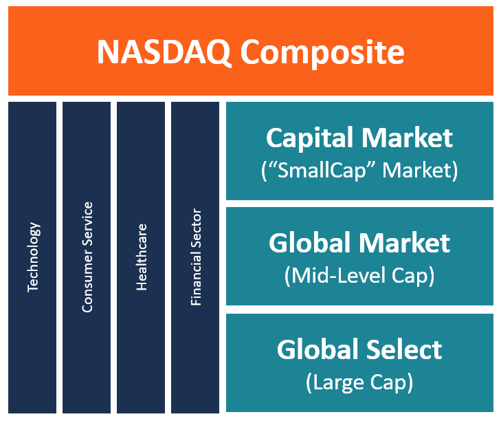

## Table of Contents

## What is the Nasdaq Capital Market?

The Nasdaq Capital Market is a stock exchange in the United States where smaller companies can list their shares. It's part of the bigger Nasdaq group, which is known for technology and internet companies. The Capital Market is good for smaller or newer companies because it has less strict rules than other big exchanges like the New York Stock Exchange.

Companies on the Nasdaq Capital Market can grow and maybe move to a bigger market later. This market helps them get money from investors to grow their business. It's important because it gives smaller companies a chance to be on a public market, even if they are not big enough for the main Nasdaq or other big exchanges.

## What are the basic listing requirements for the Nasdaq Capital Market?

To list on the Nasdaq Capital Market, a company needs to meet some basic rules. First, they need to have at least $5 million in shareholders' equity if they have been making money, or $4 million if they haven't. They also need to have at least 1.1 million publicly held shares, which means shares that are available for anyone to buy. Plus, the market value of these shares should be at least $15 million.

Another important rule is about the price of the shares. The company's stock needs to have a minimum bid price of $4 per share. This means that people should be willing to buy the stock at least at that price. Also, the company needs to have at least 300 shareholders, each holding at least 100 shares. These rules help make sure that the company is stable enough to be on the Nasdaq Capital Market and that there are enough people interested in buying and selling its stock.

## How do the financial requirements for the Nasdaq Capital Market differ from the Nasdaq Global Market?

The Nasdaq Capital Market and the Nasdaq Global Market have different financial rules that companies need to follow to list their shares. For the Nasdaq Capital Market, a company needs to have at least $5 million in shareholders' equity if they are making money, or $4 million if they are not. They also need to have at least 1.1 million shares that anyone can buy, and these shares need to be worth at least $15 million in total. The stock price should be at least $4 per share, and there should be at least 300 shareholders, each with at least 100 shares.

On the other hand, the Nasdaq Global Market has stricter rules. A company needs to have at least $10 million in shareholders' equity, which is more than what's needed for the Capital Market. They also need at least 1.1 million shares that anyone can buy, but these shares need to be worth at least $8 million more than the Capital Market's requirement, coming to a total of at least $23 million. The stock price still needs to be at least $4 per share, and there should be at least 400 shareholders, which is 100 more than the Capital Market's requirement. These higher standards make the Global Market a bit tougher to get into but can be a sign that the company is doing well financially.

## What are the corporate governance standards required for companies listed on the Nasdaq Capital Market?

Companies listed on the Nasdaq Capital Market have to follow some rules about how they run their business. They need to have a board of directors, and most of these directors should be independent, which means they are not too close to the company's management. This helps make sure the board can make fair decisions. Also, the company needs to have committees for things like deciding how much executives get paid and checking the company's financial reports. These committees should also be made up mostly of independent directors.

Another important rule is that the company has to be open about how it is run. This means they need to tell the public about their corporate governance rules and how they follow them. They need to do this in their yearly report and on their website. This openness helps investors trust the company more because they can see how decisions are made and who is making them.

## Can you explain the shareholder equity requirements for listing on the Nasdaq Capital Market?

To list on the Nasdaq Capital Market, a company needs to have enough money in what's called shareholders' equity. This is the money that belongs to the people who own the company's stock. If the company is making money, it needs to have at least $5 million in shareholders' equity. But if the company is not making money, it still needs to have at least $4 million in shareholders' equity. This rule helps make sure the company is financially stable enough to be on the market.

These requirements are important because they show that the company has a solid financial base. It's a way to check if the company is strong enough to handle being on a public market where people can buy and sell its stock. By having these rules, Nasdaq makes sure that only companies with enough financial backing can list their shares, which helps protect investors.

## What are the minimum market value of publicly held shares needed for the Nasdaq Capital Market?

To list on the Nasdaq Capital Market, a company needs to have a certain amount of money from the shares that anyone can buy. This is called the market value of publicly held shares, and it needs to be at least $15 million. This means that if you add up the value of all the shares that are available for people to buy, it should come to $15 million or more.

This rule is important because it shows that there are enough people interested in buying the company's stock. It helps make sure the company is big enough and stable enough to be on the Nasdaq Capital Market. By having this requirement, Nasdaq can check that the company has a good chance of doing well on the market and that investors have a chance to buy and sell the shares easily.

## How does a company maintain its listing on the Nasdaq Capital Market?

To keep its spot on the Nasdaq Capital Market, a company needs to follow certain rules. One big rule is about the price of its stock. The company's stock price needs to stay at least $1 per share. If it drops below that for too long, the company might get a warning. They will have some time to make the price go back up. If they can't, they might be removed from the market. The company also needs to keep up with the number of shareholders and the value of the shares that anyone can buy. They need to have at least 300 shareholders and the value of these shares should stay at least $1 million.

Another important thing is that the company has to keep following the corporate governance rules. This means they need to keep having a board of directors with mostly independent people, and they need to keep their committees like the ones for deciding executive pay and checking financial reports. The company also needs to keep telling the public about how it is run. They have to keep their yearly report and website up to date with this information. If a company can do all these things, they can stay listed on the Nasdaq Capital Market.

## What are the ongoing listing fees for the Nasdaq Capital Market?

To stay listed on the Nasdaq Capital Market, a company has to pay some fees every year. The main fee is called the annual listing fee. This fee depends on how many shares the company has. If the company has up to 10 million shares, they pay $46,000 a year. If they have more than 10 million shares, the fee goes up to $55,000 a year. This helps Nasdaq keep the market running and helps companies stay listed.

There are also other smaller fees that companies might have to pay. For example, if a company wants to do something special like a stock split or a reverse stock split, they might have to pay extra for that. These fees can change, so it's good for companies to check with Nasdaq to know exactly what they need to pay to keep their spot on the market.

## How does the Nasdaq Capital Market handle delisting procedures?

When a company on the Nasdaq Capital Market does not follow the rules anymore, Nasdaq might start a process to take the company off the market. This is called delisting. First, Nasdaq will send a letter to the company saying there is a problem. This letter gives the company a chance to fix the issue. The company has to respond quickly and explain what they will do to follow the rules again. If they can fix the problem in time, they can stay on the market. But if they can't, Nasdaq will move to the next step.

If the company can't fix the problem, Nasdaq will tell the public that they are thinking about delisting the company. They will also tell the company to ask for a hearing if they want to. At the hearing, the company can explain why they should stay on the market. A group of people from Nasdaq will listen and decide what to do. If the group says the company should be delisted, the company's shares will stop trading on the Nasdaq Capital Market. The company can still try to appeal the decision, but if they lose the appeal, they will be removed from the market for good.

## What are the bid price requirements for maintaining a listing on the Nasdaq Capital Market?

To stay listed on the Nasdaq Capital Market, a company's stock needs to have a minimum bid price of at least $1 per share. If the stock price drops below $1 for 30 straight business days, Nasdaq will send the company a warning. This warning gives the company 180 days to get the stock price back up to $1 or more for at least 10 straight business days.

If the company can't get the stock price back up in time, they might be removed from the market. But, they can ask for more time if they meet other rules, like having enough money in shareholders' equity. If they get more time and still can't fix the price, Nasdaq will start the process to delist the company.

## Can you detail the exceptions and extensions available for companies failing to meet Nasdaq Capital Market standards?

If a company on the Nasdaq Capital Market does not meet the rules, they might get a chance to fix it. For example, if the stock price drops below $1 for 30 days, Nasdaq gives the company 180 days to get it back up. During this time, the company needs to make the stock price go above $1 for at least 10 days in a row. If they do this, they can stay on the market. If they can't, they can ask for more time. They might get another 180 days if they meet other rules, like having enough money in shareholders' equity.

There are also other exceptions. If a company does not meet the rules for shareholders' equity, market value of shares, or the number of shareholders, they can also get time to fix it. Nasdaq usually gives them 180 days to meet these rules again. If they can show a plan to fix the problem and are making progress, they might get more time. But if they can't fix it after all the extra time, Nasdaq will start the process to take them off the market.

## How do the listing requirements of the Nasdaq Capital Market impact a company's strategic planning and investor relations?

The listing requirements of the Nasdaq Capital Market have a big effect on how a company plans its future and talks to its investors. When a company wants to list on the Nasdaq Capital Market, they need to make sure they have enough money, enough people owning their stock, and that their stock price stays high enough. This means they have to plan carefully to make sure they can keep up with these rules. They might need to find ways to make more money or get more people to buy their stock. If they don't plan well, they could lose their spot on the market, which would be bad for their business.

Keeping investors happy and informed is also important for companies on the Nasdaq Capital Market. They have to tell investors about their plans and how they are doing with the listing rules. If the stock price drops too low, the company needs to explain what they are doing to fix it. They might need to talk to investors more often or share more information to keep them trusting the company. Good planning and clear communication can help a company stay on the market and keep investors happy, which is good for everyone involved.

## What are the stock exchange requirements for Nasdaq-CM?

### Overview of Financial Requirements

To list on the Nasdaq Capital Market (Nasdaq-CM), companies must adhere to distinct financial criteria, ensuring they meet certain thresholds in terms of income, equity, and market capitalization. These requirements are designed to ensure that only companies with a stable financial foundation gain access to the market.

#### Minimum Standards

1. **Income**: Companies generally need to demonstrate earnings, although exact income requirements can vary. Specifically, the earnings stream must show a consistent pattern that satisfies the market's criteria.

2. **Equity**: A minimum stockholders’ equity is required. This threshold assures that companies maintain a level of net assets adequate for public trading. Equity, calculated as $\text{Total Assets} - \text{Total Liabilities}$, provides a snapshot of the company’s financial sustainability.

3. **Market Capitalization**: Companies must also achieve a certain level of market capitalization, ensuring they have enough investor confidence and overall valuation to justify listing. Market capitalization is calculated as:
$$
   \text{Market Capitalization} = \text{Share Price} \times \text{Number of Outstanding Shares}

$$

### Corporate Governance Standards

In addition to financial benchmarks, Nasdaq-CM mandates strict adherence to corporate governance standards. These are procedures and policies that companies must implement to ensure accountability and fairness in their operations. Some typical governance requirements include:

- **Board Independence**: A majority of the board of directors must be independent, without any substantial relationship with the company.
- **Audit Committees**: Companies must have an audit committee comprised solely of independent directors, tasked with oversight of financial reporting and disclosure.
- **Code of Conduct**: Issuers are required to maintain a publicly available code of conduct that promotes ethical dealings and compliance with legal standards.

### Application Process

The process to apply for listing on the Nasdaq-CM involves several steps. Initially, companies must file a complete application with Nasdaq, including financial statements, corporate governance documents, and other essential information. This application is then reviewed by Nasdaq's regulatory team, assessing the eligibility against the listing standards.

Subsequent steps may involve:

1. **Preliminary Review**: A preliminary review of the application is undertaken to identify any potential hurdles or deficiencies.
2. **Panel Review**: If any issues arise, a panel review might be convened to assess how these can be addressed.
3. **Approval**: Upon satisfying all criteria, the company receives a listing approval and is scheduled for its initial public offering (IPO) or direct listing.

### Benefits of Listing

Companies successfully listing on the Nasdaq-CM enjoy several advantages:

- **Increased Visibility**: Listing can enhance a company’s visibility and prestige, attracting more investors and improving stock liquidity.
- **Access to Capital**: Publicly traded companies can easily access capital markets, providing opportunities for growth and expansion.
- **Credibility**: Meeting the listing requirements and maintaining a presence on a reputable exchange builds credibility with customers, suppliers, and potential business partners.

These requirements and processes underscore the importance of financial stability, corporate governance, and the strategic advantages offered by Nasdaq-CM, facilitating a conducive environment for business growth in a competitive marketplace.

## References & Further Reading

[1]: ["Nasdaq, Inc. Official Website"](https://www.nasdaq.com/) - Provides regulatory and listing requirements for the Nasdaq Capital Market.

[2]: Bergstra, J., Bardenet, R., Bengio, Y., & Kégl, B. (2011). ["Algorithms for Hyper-Parameter Optimization."](https://dl.acm.org/doi/10.5555/2986459.2986743) Advances in Neural Information Processing Systems 24.

[3]: ["Advances in Financial Machine Learning"](https://www.amazon.com/Advances-Financial-Machine-Learning-Marcos/dp/1119482089) by Marcos Lopez de Prado

[4]: Aldridge, I. (2013). ["High-Frequency Trading: A Practical Guide to Algorithmic Strategies and Trading Systems."](https://www.ahmetbeyefendi.com/wp-content/uploads/2020/07/High-Frequency-Trading-Irene-Aldridge.pdf) Wiley.

[5]: Hendershott, T., & Riordan, R. (2013). ["Algorithmic Trading and the Market for Liquidity."](https://www.jstor.org/stable/43303831) Journal of Financial and Quantitative Analysis.

[6]: ["Quantitative Trading: How to Build Your Own Algorithmic Trading Business"](https://github.com/LucindaYa/quant-resources/blob/master/Quantitative%20Trading%20How%20to%20Build%20Your%20Own%20Algorithmic%20Trading%20Business.pdf) by Ernest P. Chan

[7]: Securities and Exchange Commission (SEC). ["Regulation National Market System (Reg NMS)"](https://www.sec.gov/rules-regulations/2005/06/regulation-nms) - Guidelines and frameworks for trading on U.S. markets, covering aspects of algorithmic and high-frequency trading.