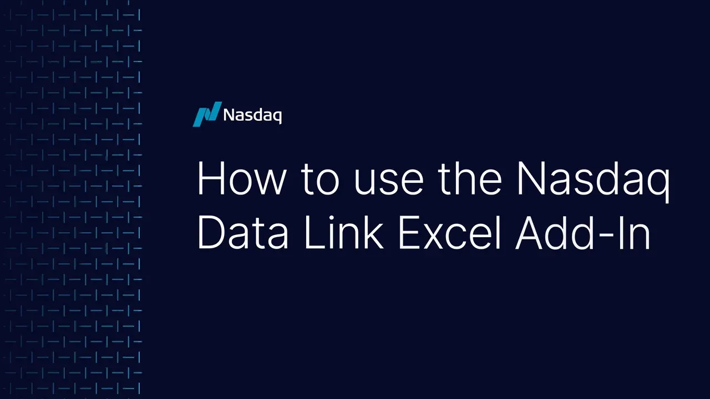

## Table of Contents

## What is NASDAQ Data Link and what is its purpose?

NASDAQ Data Link is a platform that helps people get data they need for their work or projects. It's like a big library where you can find all sorts of information, from financial data to weather data. People who need data for their jobs, like researchers or business analysts, can use NASDAQ Data Link to find and use the data they need easily.

The main purpose of NASDAQ Data Link is to make it easier for people to find and use data. Instead of searching many different places for data, you can go to one place and find what you need. This saves time and helps people make better decisions because they have good data to work with. Whether you're looking at stock prices or trying to understand climate patterns, NASDAQ Data Link makes it simpler to get the data you need.

## How can someone get started with NASDAQ Data Link?

To get started with NASDAQ Data Link, first visit their website. You'll see a sign-up button where you can create an account. It's easy and quick to do. Once you have an account, you can log in and start exploring the data they offer. They have a lot of different kinds of data, so take your time to look around and see what interests you.

After you've looked at the data, you can start using it. NASDAQ Data Link lets you download data or use it directly in your work. If you need help, they have guides and tutorials that can show you how to do things. You can also reach out to their support team if you have questions. It's all about making data easy to use, so don't be afraid to try things out and learn as you go.

## What types of data are available on NASDAQ Data Link?

NASDAQ Data Link has a lot of different kinds of data that you can use. They have financial data, like stock prices and company earnings. This can be really helpful if you're looking at investments or trying to understand how businesses are doing. They also have economic data, which tells you about things like unemployment rates and how much people are spending. This can help you see the bigger picture of what's happening in the economy.

Besides financial and economic data, NASDAQ Data Link also has data about other things. For example, they have weather data, which can tell you about temperatures and rainfall in different places. This can be useful for farmers or anyone who needs to plan around the weather. They also have data about energy, like how much electricity is being used and where it's coming from. This can help people who work in energy or want to understand more about it.

Overall, NASDAQ Data Link is a great place to find all sorts of data. Whether you're interested in finance, economics, weather, or energy, you can find the information you need. It's all about making it easy for you to get the data and use it in your work or projects.

## How does NASDAQ Data Link ensure the quality and accuracy of its data?

NASDAQ Data Link works hard to make sure the data they give you is good and correct. They get their data from trusted places, like government reports and big companies. They check the data carefully before they share it with you. If they find any mistakes, they fix them quickly. This way, you can trust that the data you're using is right and helpful for your work.

They also keep updating their data all the time. This means you're always getting the newest information. If something changes, like a new stock price or a new weather report, they make sure to update their data right away. By doing this, NASDAQ Data Link helps you make good decisions because you have the latest and most accurate information.

## What are the different subscription plans offered by NASDAQ Data Link?

NASDAQ Data Link offers different subscription plans so you can choose the one that fits your needs. They have a free plan where you can start using their data without paying anything. This is good if you just want to try things out or use a little bit of data. They also have a basic plan that costs a little money each month. This plan gives you more data and some extra features, like being able to download more data at once.

If you need a lot of data and more advanced features, they have a pro plan. This plan costs more, but it gives you access to all their data and special tools that can help you work faster and better. They also have a custom plan where you can talk to them about what you need, and they'll make a plan just for you. This is good if you have special needs or if you're working with a big team.

## How can users access and download data from NASDAQ Data Link?

To access and download data from NASDAQ Data Link, first, you need to log into your account on their website. Once you're logged in, you can browse through the different types of data they offer. You can search for specific data sets or explore categories that interest you. When you find the data you want, you can usually see a preview of it to make sure it's what you need.

After you've found the right data, downloading it is easy. Just click on the download button, and you'll be able to choose the format you want, like CSV or Excel. The data will start downloading to your computer, and you can use it in your work or projects. If you need help, NASDAQ Data Link has guides and support to make the process smooth and simple.

## What are some common use cases for NASDAQ Data Link data?

People use NASDAQ Data Link data in many different ways. One common use is for financial analysis. Investors and financial analysts use the stock prices, company earnings, and economic data to make smart decisions about where to put their money. They can look at trends and patterns to see which stocks might do well in the future. Businesses also use this data to understand the market better and plan their strategies.

Another use is for research. Scientists and researchers use the data to study things like climate change, energy use, and economic trends. For example, weather data can help them understand how temperatures are changing over time. Economic data can help them see how different events affect the economy. This kind of research can lead to new discoveries and help people make better decisions about important issues.

Lastly, NASDAQ Data Link data is also used in education. Teachers and students use the data to learn about real-world examples in subjects like economics, finance, and environmental science. By working with actual data, students can see how theories apply in practice. This hands-on approach helps them understand complex topics better and prepares them for future careers where they might need to use data regularly.

## How can NASDAQ Data Link be integrated with other tools and platforms?

NASDAQ Data Link can be easily connected with other tools and platforms to make your work easier. You can use their special tools called APIs to get data directly into your own programs or software. This means you can pull data from NASDAQ Data Link into your spreadsheets, like Excel, or into other programs you use for analysis. This way, you don't have to download data and then move it around; it comes right to where you need it.

Another way to use NASDAQ Data Link with other tools is by using their data in popular platforms like Python or R. These are programming languages that many people use for data analysis. With NASDAQ Data Link, you can write code to get the data you need and then use it in your analysis. This makes it easier to do big projects or to automate your work, so you spend less time moving data around and more time using it to make decisions.

## What are the API options available for advanced users of NASDAQ Data Link?

For advanced users, NASDAQ Data Link offers several API options to make working with data easier. The main API they provide is called the REST API. This lets you pull data directly into your own programs or software. You can use it to get the latest data quickly and easily, without having to download files and move them around. This is really helpful if you're working on big projects or if you need to automate your work.

Another option is the Streaming API, which is great if you need real-time data. With this API, you can get data as it's updated, which is important for things like stock prices or weather updates. It's like having a live feed of information that you can use right away. Both of these APIs come with good documentation and support, so even if you're new to using APIs, you can get started and learn as you go.

## How can users automate data retrieval and analysis using NASDAQ Data Link?

Users can automate data retrieval and analysis using NASDAQ Data Link by using their APIs. The REST API lets you pull data directly into your programs or software. This means you can set up your computer to get the latest data without you having to do anything. You can write a little bit of code to tell your computer what data you want and how often you want it. This is really helpful if you need to keep up with things like stock prices or weather updates every day.

Once you have the data, you can also automate the analysis part. You can use programming languages like Python or R to write scripts that look at the data and do things like find patterns or make predictions. For example, you could write a script that checks stock prices every day and sends you an alert if something important happens. By automating both the retrieval and analysis, you save a lot of time and can focus on making decisions based on the data.

## What are some advanced data analysis techniques that can be applied to NASDAQ Data Link data?

One advanced technique you can use with NASDAQ Data Link data is called time series analysis. This is when you look at data over time to find patterns and trends. For example, if you're looking at stock prices, you can use time series analysis to see how the prices change day by day or month by month. This can help you predict what might happen in the future. You can use special tools in programs like Python or R to do this kind of analysis and make charts that show the patterns clearly.

Another technique is [machine learning](/wiki/machine-learning). This is when you use computers to learn from the data and make predictions or decisions. For example, you can use machine learning to look at a lot of different data points, like stock prices, company earnings, and economic indicators, to predict which stocks might go up or down. Machine learning can find patterns that are hard for people to see, and it can get better over time as it learns from more data. You can use libraries in Python, like scikit-learn, to do machine learning with NASDAQ Data Link data.

A third technique is called data visualization. This is when you make charts and graphs to show the data in a way that's easy to understand. With NASDAQ Data Link data, you can use tools like Tableau or Python's matplotlib to create visualizations that help you see trends and patterns at a glance. For example, you can make a heat map to show how stock prices change over time or a scatter plot to see how different economic indicators relate to each other. Good visualizations can help you explain your findings to others and make better decisions based on the data.

## How does NASDAQ Data Link compare to other financial data providers in terms of features and pricing?

NASDAQ Data Link offers a wide range of data that you can use for free or by paying for a subscription. They have a free plan that lets you try out their data without spending any money. If you need more data and features, you can choose from their basic, pro, or custom plans. Their prices are pretty good compared to other financial data providers, and they have a lot of different kinds of data, like stock prices, economic data, and weather data. This makes them a good choice if you need data for many different things.

Other financial data providers, like Bloomberg Terminal or Refinitiv Eikon, also offer a lot of data, but they can be more expensive. Bloomberg Terminal, for example, is known for its detailed financial data and tools, but it costs a lot of money each month. Refinitiv Eikon is similar, with a lot of data and features, but it's also pricey. NASDAQ Data Link is easier to use and more affordable, which makes it a good option if you're just starting out or if you don't need all the fancy tools that the more expensive providers offer.

## References & Further Reading

[1]: ["Advances in Financial Machine Learning"](https://www.amazon.com/Advances-Financial-Machine-Learning-Marcos/dp/1119482089) by Marcos Lopez de Prado

[2]: ["Evidence-Based Technical Analysis: Applying the Scientific Method and Statistical Inference to Trading Signals"](https://www.amazon.com/Evidence-Based-Technical-Analysis-Scientific-Statistical/dp/0470008741) by David Aronson

[3]: ["Machine Learning for Algorithmic Trading"](https://github.com/stefan-jansen/machine-learning-for-trading) by Stefan Jansen

[4]: ["Quantitative Trading: How to Build Your Own Algorithmic Trading Business"](https://books.google.com/books/about/Quantitative_Trading.html?id=j70yEAAAQBAJ) by Ernest P. Chan