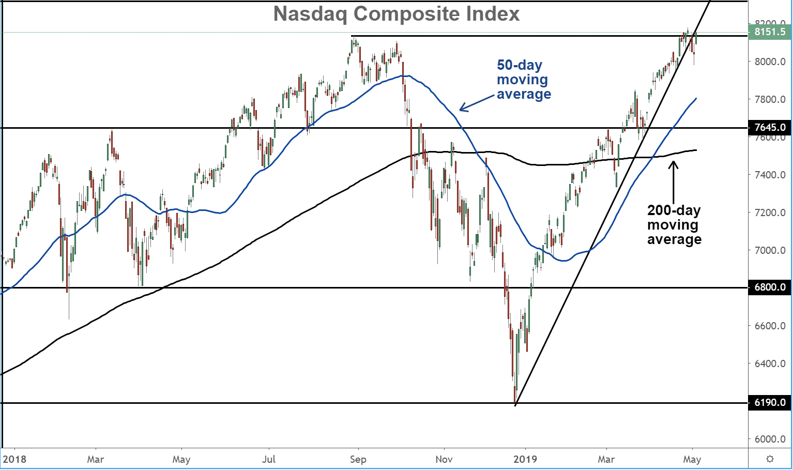

The global financial markets are in a state of perpetual transformation, driven by technological advances, regulatory changes, and shifting investor preferences. At the center of this dynamic ecosystem is NASDAQ, recognized as one of the largest and most influential stock exchanges globally. Founded in 1971, NASDAQ has grown exponentially, providing a crucial platform for investors and companies aiming to engage with contemporary market trends and innovations.

A key aspect of NASDAQ's structure is its Global Market Composite, which is an international stock market index encompassing 600 stocks from various sectors and geographies. This composite is integral to NASDAQ's offering, representing a relatively inclusive market compared to other NASDAQ indices like the Global Select Market Composite, known for its stringent listing requirements. Companies listed within the Global Market Composite must nonetheless meet rigorous standards related to corporate governance, financial stability, and liquidity, reflecting the index's commitment to high-quality securities.

NASDAQ features a tiered market structure, which includes the Global Select Market, the Global Market, and the Capital Market. Each tier sets specific criteria for inclusion, influencing investment strategies and portfolio management. The discerning requirements of the Global Select Market often attract established, high-performing companies, while the Global Market tier offers opportunities for a broader range of organizations, balancing accessibility with quality. Understanding these distinctions is crucial for investors aiming to align their portfolios with particular strategic objectives.

In recent years, the proliferation of algorithmic trading has marked a significant transformation in how trades are executed on NASDAQ. Leveraging algorithms, investors can achieve unprecedented levels of speed and precision, enhancing their capacity to capitalize on rapid market shifts. This technological shift underscores the importance of data analytics and computing power in identifying viable trading opportunities, offering a competitive edge to those proficient in this domain.

As NASDAQ continues to adapt and expand its influence, its tiered structure and embrace of algorithmic trading are shaping both domestic and international market dynamics. These developments provide a myriad of investment opportunities, carrying implications for global equity trends and economic stability. Understanding NASDAQ's evolving landscape is vital for investors seeking to navigate the complexities of today's fast-paced financial world.

## Table of Contents

## Understanding the NASDAQ Global Market Composite

The NASDAQ Global Market Composite is a significant international stock market index, composed of approximately 600 diverse stocks. This index serves as a vital component of the NASDAQ Stock Market, which is one of the largest and most dynamic stock exchanges globally. Stocks included in the NASDAQ Global Market Composite are required to comply with rigorous corporate governance standards. These standards ensure transparency, accountability, and protection for investors.

To qualify for inclusion in this index, companies must meet specific financial criteria. This includes adhering to [liquidity](/wiki/liquidity-risk-premium) requirements, which assess a stock's ability to be bought or sold in the market without causing significant price fluctuations. The liquidity of a stock is crucial because it affects how easily investors can enter or [exit](/wiki/exit-strategy) positions. High liquidity generally suggests a robust market interest in the stock, making it a more attractive option for investors seeking lower risk and more stable returns.

The NASDAQ Global Market Composite provides an alternative to the more exclusive NASDAQ Global Select Market Composite. While both indexes offer international exposure, the NASDAQ Global Market Composite is considered less stringent regarding entry requirements, making it accessible to a broader group of companies. This inclusivity allows a diverse range of industries and firms to participate in the global financial landscape, fostering economic growth and development.

Although it is less exclusive, the NASDAQ Global Market Composite still plays a crucial role in providing visibility and market presence for emerging and established companies. It acts as a developmental ground for companies aspiring to eventually qualify for the NASDAQ Global Select Market Composite by meeting higher financial and governance standards. Thus, the index not only supports corporate growth but also enriches the broader ecosystem of global financial markets by maintaining a balanced approach to investor accessibility and company representation.

## Market Tiers: A Breakdown of NASDAQ Structures

The NASDAQ, as a prominent stock exchange, organizes its listings into three distinct tiers: the Global Select Market, the Global Market, and the Capital Market. Each of these tiers has specific inclusion criteria that companies must meet to be listed, with the aim of catering to different types of companies and investor strategies.

**Global Select Market:** This is the most exclusive tier within NASDAQ's market structure. To be listed on the Global Select Market, companies must meet rigorous financial and liquidity criteria, as well as stringent corporate governance standards. These requirements are designed to ensure that only the most stable and high-performing companies are able to secure a spot. For example, companies often need to demonstrate a minimum threshold of earnings, maintain a certain market capitalization, and adhere to specific corporate governance practices. This selectivity instills a level of investor confidence and attracts those looking to include top-tier global corporations in their investment portfolios.

**Global Market:** Acting as a middle ground, the Global Market presents an integral yet less exclusive tier compared to the Global Select Market. It includes companies that may not have the financial heft or governance practices of Global Select Market companies but still maintain significant operational standards. Companies are required to meet a comprehensive set of criteria related to financial health, size, and liquidity, making this tier attractive for investors seeking stable growth companies that might not yet qualify for the Global Select Market. This tier provides a space for companies with solid fundamentals and growth potential, allowing investors a balanced approach in building their equity portfolios.

**Capital Market:** The Capital Market tier is the most inclusive, accommodating smaller and often emerging growth companies. The criteria for listing on this tier are less rigorous, primarily focusing on basic financial standards and disclosure requirements. This tier serves as a platform for companies seeking to access capital markets in order to support their growth and development. It attracts investors who are interested in investing in early-stage opportunities, understanding the associated higher risk and potential for greater returns.

Understanding the distinctions between these NASDAQ market tiers is crucial for investors to align their portfolio strategies effectively. Investors can leverage these tiers to diversify their investments, balancing between well-established corporations and promising growth companies, thereby aligning with their unique strategic goals.

## Algorithmic Trading on NASDAQ: A Game Changer

Algorithmic trading has transformed the execution of trades on NASDAQ, providing unparalleled speed and precision. This transformation is largely driven by the integration of advanced technologies and the utilization of data-driven insights that identify trading opportunities with exceptional accuracy.

At the core of [algorithmic trading](/wiki/algorithmic-trading) is the use of complex mathematical models and sophisticated software developed to make high-speed trading decisions. These algorithms can automatically execute trades when certain market conditions are met, significantly reducing the time between decision-making and execution. This high-frequency trading capability allows for the processing of vast amounts of market data within fractions of a second, providing a competitive edge in a marketplace where timing is crucial.

The benefits of algorithmic trading on NASDAQ are manifold. Firstly, it enhances trade execution quality by minimizing the impact of human error and emotional biases. Traders can establish precise entry and exit points, manage risk through stop-loss orders, and optimize portfolios according to specific investment criteria. Additionally, algorithmic trading provides liquidity to the market, improving the overall market efficiency and price discovery process.

However, the adoption of algorithmic strategies on NASDAQ is not without challenges. The reliance on technology means there is a risk of system failures or glitches, which can lead to significant financial losses. Moreover, the increased market [volatility](/wiki/volatility-trading-strategies) associated with high-frequency trading can pose risks to market stability. Algorithmic trading also raises concerns about fairness and equity, as it may disadvantage smaller traders who lack the resources to develop and implement similar technologies.

Furthermore, regulatory challenges arise from the use of algorithmic trading. Regulatory bodies worldwide are continually adjusting their frameworks to ensure fairness and transparency while protecting market integrity. These regulatory environments necessitate constant adaptation and compliance from firms employing algorithmic trading strategies.

In conclusion, algorithmic trading has redefined the NASDAQ trading landscape by offering enhanced speed and precision. While it presents numerous benefits, such as improved execution quality and increased market liquidity, it also introduces various challenges related to system reliability, market volatility, and regulatory compliance. As technology continues to evolve, so too will the strategies and frameworks surrounding algorithmic trading on NASDAQ.

## Implications for Global Markets

NASDAQ's tiered structure has significant implications for global markets, influencing investor decisions and shaping market dynamics worldwide. The three-tier system—comprising the Global Select Market, Global Market, and Capital Market—provides a framework that facilitates a diverse range of investment opportunities. This tiering is pivotal in both domestic and international trading strategies as it categorizes stocks based on criteria such as financial health, liquidity, and governance practices.

The segmentation of NASDAQ into distinct tiers allows for tailored investment approaches. For instance, the Global Select Market, being the most exclusive tier, attracts institutional investors seeking stability and high-quality stocks. In contrast, the Capital Market tier, with its less stringent requirements, serves as a platform for smaller or emerging companies looking for growth capital. This diversity is crucial in mitigating risk and maximizing returns across different market conditions.

Changes within these markets can have cascading effects on global equity trends. For example, the inclusion or exclusion of a stock from the NASDAQ Global Select Market can affect investor perception and consequently the stock's valuation, with ripple effects seen in other markets. Such movements can alter capital flows, influencing economic stability across regions. This is particularly evident during periods of economic uncertainty, where investors may shift their focus from volatile markets to more stable NASDAQ-listed equities.

Moreover, NASDAQ's tiered structure plays a role in defining global competitiveness. Companies listed on the NASDAQ are often perceived as leaders in innovation and technology, attracting investors looking to capitalize on cutting-edge advancements. This perception facilitates cross-border investments, further integrating NASDAQ into the global financial ecosystem.

In summary, NASDAQ's structured approach to market segmentation significantly influences global market dynamics. By providing a comprehensive framework for investment, it not only affects domestic trading strategies but also extends its reach to international markets, with implications for global economic stability and equity trends. Investors and analysts who understand these implications are better equipped to navigate the complexities of an interconnected global marketplace.

## Conclusion

As financial markets continue to globalize, understanding the intricacies of NASDAQ's market tiers and the role of algorithmic trading becomes increasingly significant for investment success. The NASDAQ's tiered structure, comprising the Global Select Market, Global Market, and Capital Market, offers investors varied opportunities tailored to different risk appetites and investment strategies. Recognizing the differences among these tiers allows for strategic alignment with specific portfolio objectives, thus optimizing potential returns.

In parallel, the rise of algorithmic trading stands as a transformative advancement in market engagement, bringing unprecedented speed and precision to trade execution. By employing sophisticated algorithms and data analytics, investors can swiftly capitalize on market fluctuations, thereby enhancing their ability to achieve desired investment outcomes. However, this also necessitates an understanding of both the technical and operational risks involved, such as technical failures or the misinterpretation of market data.

For investors and financial analysts, staying informed about these evolving aspects is crucial. The dynamic nature of global markets requires continuous monitoring of NASDAQ developments and an agile approach to integrating algorithmic strategies. This informed perspective not only facilitates exploiting emerging market opportunities but also equips stakeholders to navigate the uncertainties of today's fast-paced trading environment effectively.

Remaining adaptive and knowledgeable is essential. By doing so, investors can leverage both NASDAQ's structured market access and the efficiencies of algorithmic trading to bolster their portfolios in an ever-changing financial landscape.

## References & Further Reading

[1]: ["NASDAQ Global Market Composite Index"] (https://indexes.nasdaqomx.com/docs/Nasdaq_Index_Methodology_Guide.pdf). NASDAQ Index Methodology

[2]: Bashir, I., & Sharma, I. (2019). [Advanced Algorithmic Trading: Learn how to build automated algorithmic trading systems in different markets](https://github.com/PacktPublishing/Learn-Algorithmic-Trading). Packt Publishing.

[3]: ["NASDAQ Market Tiers: Understanding the Differences"](https://www.marketbeat.com/financial-terms/what-is-nasdaq-stock-market/). NASDAQ Trader.

[4]: Aldridge, I. (2013). [High-Frequency Trading: A Practical Guide to Algorithmic Strategies and Trading Systems](https://www.amazon.com/High-Frequency-Trading-Practical-Algorithmic-Strategies/dp/1118343506). Wiley Trading.

[5]: Johnson, B. (2010). [Algorithmic Trading & DMA: An Introduction to Direct Access Trading Strategies](https://www.amazon.com/Algorithmic-Trading-DMA-introduction-strategies/dp/0956399207). 4Myeloma Press.

[6]: Ruggiero, M. Jr. (2014). [Cybernetic Trading Strategies: Developing a Profitable Trading System with State-of-the-Art Technologies](https://archive.org/details/cybernetictradin0000rugg). Wiley Finance.

[7]: ["The Impact of Algorithmic Trading on the Market"](https://wjaets.com/sites/default/files/WJAETS-2024-0136.pdf). The Review of Financial Studies.