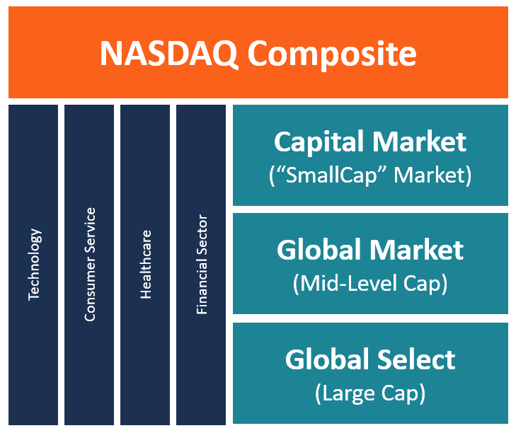

## Table of Contents

## What is the NASDAQ Global Select Market Composite?

The NASDAQ Global Select Market Composite is an index that tracks the performance of companies listed on the NASDAQ Global Select Market. This market is a part of the NASDAQ stock exchange and includes companies that meet high financial and liquidity standards. The index helps investors see how well these top companies are doing overall.

The companies in the NASDAQ Global Select Market are chosen based on rules that look at things like how much money they make, how many shares are traded, and how long they have been public. This makes sure that only strong and stable companies are included. By following the NASDAQ Global Select Market Composite, investors can get a good idea of how the best companies on the NASDAQ are performing.

## How does the NASDAQ Global Select Market Composite differ from other NASDAQ indexes?

The NASDAQ Global Select Market Composite is different from other NASDAQ indexes because it only includes companies that meet very high standards. These standards look at things like how much money the company makes, how many shares are traded, and how long the company has been public. This makes the NASDAQ Global Select Market Composite a good way to see how the best and most stable companies on the NASDAQ are doing. Other NASDAQ indexes, like the NASDAQ Composite, include a much wider range of companies, not just the top ones.

For example, the NASDAQ Composite includes all the companies listed on the NASDAQ, from small startups to big, established companies. This makes the NASDAQ Composite a broader measure of the overall market. On the other hand, the NASDAQ Global Select Market Composite is more focused and only shows the performance of the top-tier companies. So, if you want to know how the best companies are doing, you would look at the NASDAQ Global Select Market Composite, but if you want a general idea of the whole market, you would look at the NASDAQ Composite.

## What are the eligibility criteria for companies to be listed on the NASDAQ Global Select Market?

To be listed on the NASDAQ Global Select Market, a company must meet high standards. These standards look at things like how much money the company makes, how many shares are traded, and how long the company has been public. For example, the company needs to have made a certain amount of money in the last three years. It also needs to have a certain number of shares traded every day. This makes sure that only strong and stable companies are included.

Another important rule is that the company must have been public for at least three years. This shows that the company has been around for a while and is not a new startup. The company also needs to follow certain rules about how it is run and how it reports its financial information. This helps make sure that the company is honest and open with investors. By meeting all these rules, a company can be listed on the NASDAQ Global Select Market and be part of the NASDAQ Global Select Market Composite.

## How is the NASDAQ Global Select Market Composite calculated?

The NASDAQ Global Select Market Composite is calculated by looking at the total value of all the companies in the index. This total value is found by adding up the value of all the shares of each company. The value of each share is its price times the number of shares. This way, the index shows how much all these companies are worth together.

To keep the index up to date, the total value is divided by a special number called the divisor. The divisor changes over time to make sure the index stays accurate even when companies are added or removed, or when they do things like stock splits. By using this method, the NASDAQ Global Select Market Composite gives a good picture of how well the top companies on the NASDAQ are doing.

## What sectors are most represented in the NASDAQ Global Select Market Composite?

The NASDAQ Global Select Market Composite includes companies from many different sectors, but some sectors are more common than others. The technology sector is one of the biggest parts of the index. This is because many tech companies are listed on the NASDAQ and meet the high standards needed to be in the Global Select Market. Companies like Apple, Microsoft, and Amazon are part of this group. These companies make things like computers, software, and online services.

Another important sector in the NASDAQ Global Select Market Composite is healthcare. Many healthcare companies, like those that make medicines or medical equipment, are also part of the index. For example, companies like Amgen and Gilead Sciences are included. The healthcare sector is big because these companies often have strong financial results and meet the strict rules for being in the Global Select Market. Together, technology and healthcare make up a large part of the index, showing how important these sectors are to the top companies on the NASDAQ.

## How has the performance of the NASDAQ Global Select Market Composite compared to the S&P 500 over the last decade?

Over the last ten years, the NASDAQ Global Select Market Composite has often done better than the S&P 500. This is because the NASDAQ Global Select Market Composite has a lot of big technology companies, like Apple and Microsoft, which have grown a lot in the last decade. These tech companies have helped the NASDAQ Global Select Market Composite go up faster than the S&P 500, which includes companies from many different sectors, not just technology.

However, the performance can change from year to year. Some years, the S&P 500 might do better if other sectors, like energy or finance, do well. But over the long term, the NASDAQ Global Select Market Composite has generally had higher returns because of the strong growth in the technology sector. This shows how important it is to look at different time periods when comparing the performance of these indexes.

## What are the major companies included in the NASDAQ Global Select Market Composite?

The NASDAQ Global Select Market Composite includes many big and well-known companies. Some of the biggest names are from the technology sector, like Apple, Microsoft, Amazon, and Google's parent company, Alphabet. These companies make things like computers, software, and online services that many people use every day. They are very important to the index because they are big and have grown a lot over the years.

Another important group of companies in the NASDAQ Global Select Market Composite is from the healthcare sector. Companies like Amgen and Gilead Sciences are part of this group. They make medicines and medical equipment that help people stay healthy. These healthcare companies are also very important to the index because they often have strong financial results and meet the strict rules needed to be in the Global Select Market. Together, these technology and healthcare companies make up a big part of the index and show how well the top companies on the NASDAQ are doing.

## How does the NASDAQ Global Select Market Composite reflect global economic trends?

The NASDAQ Global Select Market Composite can show us what is happening in the world's economy because it includes big companies that do business all over the world. These companies, like Apple and Microsoft, sell their products and services in many different countries. When these companies do well, it often means that people around the world are buying more things and the economy is strong. On the other hand, if these companies start to struggle, it might mean that people are not spending as much money and the global economy is slowing down.

Another way the NASDAQ Global Select Market Composite reflects global economic trends is through the performance of different sectors. For example, if technology companies in the index are doing well, it might mean that there is a lot of innovation and growth happening around the world. If healthcare companies are doing well, it could mean that there is a lot of demand for medicines and medical services, which can also be a sign of how the global economy is doing. By looking at how these big companies and different sectors perform, we can get a good idea of what is happening in the global economy.

## What are the historical highs and lows of the NASDAQ Global Select Market Composite?

The NASDAQ Global Select Market Composite has had some big ups and downs over the years. One of its highest points was in November 2021 when it reached over 16,000 points. This was a time when many tech companies were doing really well and people were buying a lot of their stocks. On the other hand, one of its lowest points was during the financial crisis in March 2009, when it dropped to around 1,000 points. This was a scary time for the economy, and many companies, especially in the tech sector, saw their stock prices fall a lot.

Looking at these highs and lows helps us understand how the market can change. The big jump from the low in 2009 to the high in 2021 shows how much the tech sector can grow over time. But it also shows that the market can be risky because it can go down a lot too. By keeping an eye on these highs and lows, investors can get a better idea of when to buy or sell stocks and how the economy is doing overall.

## How do changes in interest rates affect the NASDAQ Global Select Market Composite?

Changes in interest rates can have a big impact on the NASDAQ Global Select Market Composite. When interest rates go up, it often means that borrowing money becomes more expensive. This can slow down the economy because companies might not want to take out loans to grow their business. For the NASDAQ Global Select Market Composite, this can be bad news, especially for tech companies that often need a lot of money to keep growing. When these companies struggle, their stock prices can go down, which pulls the whole index down with them.

On the other hand, when interest rates go down, borrowing money becomes cheaper. This can help the economy grow because companies are more likely to take out loans to expand. For the NASDAQ Global Select Market Composite, lower interest rates can be good news. Tech companies can borrow money more easily to invest in new projects and grow their business, which can make their stock prices go up. This can push the whole index higher. So, keeping an eye on interest rates can help investors understand what might happen to the NASDAQ Global Select Market Composite.

## What are the trading volumes like for the NASDAQ Global Select Market Composite?

The trading volume for the NASDAQ Global Select Market Composite is usually very high because it includes some of the biggest and most popular companies in the world. Companies like Apple, Microsoft, and Amazon are part of this index, and many people want to buy and sell their stocks every day. This high demand means that there are a lot of shares being traded, which keeps the trading volume strong.

The trading volume can change from day to day, but it is often higher than other indexes because of the big companies in the NASDAQ Global Select Market Composite. When there is a lot of news about these companies or the economy, even more people might want to trade their stocks, which can make the trading volume go up even more. This high trading volume is good for the market because it means that people can easily buy and sell shares without big changes in price.

## How can investors use the NASDAQ Global Select Market Composite to diversify their portfolios?

Investors can use the NASDAQ Global Select Market Composite to diversify their portfolios by investing in a mix of the top companies listed on the NASDAQ. This index includes big names from different sectors like technology and healthcare, which means that by investing in the index, investors can spread their money across these different areas. This can help reduce risk because if one sector does not do well, the other sectors might still be doing okay.

For example, if an investor only has stocks in technology companies and the tech sector has a bad year, their whole portfolio could suffer. But if they also have investments in healthcare companies through the NASDAQ Global Select Market Composite, they might be protected if the healthcare sector does well. This way, the investor can balance out their investments and not put all their eggs in one basket. By using the NASDAQ Global Select Market Composite, investors can have a more stable and diversified portfolio.

## What is the Understanding of the NASDAQ Global Select Market Composite?

The NASDAQ Global Select Market Composite is a significant market capitalization-weighted index composed of over 1,400 U.S. and international stocks. This index plays a critical role in providing a snapshot of the global and U.S. economic health through its varied company listings. Companies included in this exclusive tier must meet rigorous financial and liquidity criteria, ensuring that only those with substantial market presence and performance stability are represented.

The composition of the NASDAQ Global Select Market Composite is reflective of a market capitalization-weighted approach, meaning that companies included in the index are given importance based on the total market value of their outstanding shares. This methodology allows the index to adjust dynamically, providing a more precise representation of the overall market movements. In the formula for a market capitalization-weighted index, each constituent's weight is calculated as follows:

$$
\text{Weight}_i = \frac{\text{Market Capitalization}_i}{\sum_{j=1}^{n} \text{Market Capitalization}_j}
$$

where $\text{Weight}_i$ is the weight of company $i$ within the index, and the denominator represents the sum of market capitalizations of all $n$ companies in the index.

To qualify for inclusion in the NASDAQ Global Select Market Composite, companies must meet high standards of financial integrity and corporate governance. This includes adherence to requirements such as minimum market capitalization, earnings thresholds, and [liquidity](/wiki/liquidity-risk-premium) levels. The stringent criteria ensure that the entities included not only demonstrate financial robustness but also follow strong ethical and governance practices. These criteria aim to promote investor confidence and enhance market stability.

The diversity of companies in the NASDAQ Global Select Market Composite allows it to serve as a barometer for economic trends and corporate health, encompassing sectors ranging from technology to healthcare. As such, it provides insight into both domestic and international market conditions. Investors value this index for its comprehensive scope and reliability in tracking market performance across a wide range of industries.

The NASDAQ Global Select Market Composite, in its structure and rigor, underscores the importance of prioritizing both financial metrics and corporate governance practices, ensuring that it remains a trusted measure of economic vitality on a global scale.

## References & Further Reading

[1]: ["The NASDAQ Stock Market."](https://www.nasdaq.com/) NASDAQ.

[2]: Aldridge, I. (2013). ["High-Frequency Trading: A Practical Guide to Algorithmic Strategies and Trading Systems."](https://books.google.com/books/about/High_Frequency_Trading.html?id=6l0DDQAAQBAJ) Wiley.

[3]: MacKenzie, D. (2020). ["Trading at the Speed of Light: How Ultrafast Algorithms Are Transforming Financial Markets."](https://www.jstor.org/stable/j.ctv191kx1k) Princeton University Press.

[4]: Pardo, R. (2011). ["The Evaluation and Optimization of Trading Strategies."](https://onlinelibrary.wiley.com/doi/book/10.1002/9781119196969) Wiley.

[5]: Hasbrouck, J. (2007). ["Empirical Market Microstructure: The Institutions, Economics, and Econometrics of Securities Trading."](https://academic.oup.com/book/52241) Oxford University Press.

[6]: Hendershott, T., & Riordan, R. (2013). ["Algorithmic Trading and the Market for Liquidity."](https://www.jstor.org/stable/43303831) Review of Financial Studies, 27(3), 717–742.