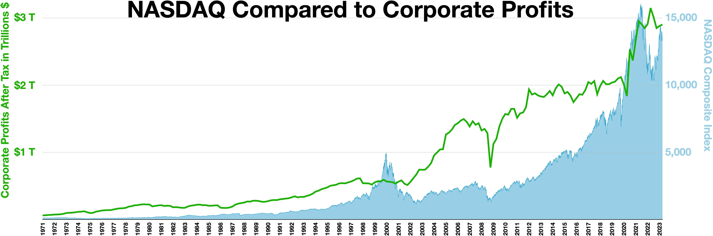

## Table of Contents

## What is Nasdaq Inc. and what does it do?

Nasdaq Inc. is a big company that runs a stock market. It started in 1971 and is one of the biggest stock markets in the world. People and companies can buy and sell stocks on the Nasdaq. This means if you want to own a little piece of a company, you can buy its stock on the Nasdaq.

Besides running the stock market, Nasdaq Inc. also helps companies with other things. They offer services like trading technology, data about the market, and help with financial things. So, not only do they let people trade stocks, but they also give tools and information to help everyone make smart choices about buying and selling.

## How did Nasdaq Inc. start and what is its history?

Nasdaq Inc. started in 1971. It was the world's first electronic stock market. Before Nasdaq, people had to call each other or meet in person to trade stocks. Nasdaq made it easier by using computers. It was started by the National Association of Securities Dealers (NASD), which is why it was called NASDAQ, which stands for National Association of Securities Dealers Automated Quotations.

Over the years, Nasdaq grew a lot. In the 1980s, it started to list more big companies. By the 1990s, it became very popular because of the tech boom. Many tech companies like Microsoft and Apple started trading on Nasdaq. In 2000, Nasdaq became a separate company from NASD and started to offer more services. Today, Nasdaq is not just a place to trade stocks but also provides technology and data services to help people and companies around the world.

Nasdaq has kept growing and changing. In 2007, it bought the OMX Group, which made it a big player in Europe too. Now, it's called Nasdaq Inc. and it runs stock markets in many countries. It also helps with things like clearing trades and giving out market information. Nasdaq keeps working to make trading easier and more efficient for everyone.

## What are the main products and services offered by Nasdaq Inc.?

Nasdaq Inc. offers many products and services. One main thing they do is run stock markets. They have markets in the U.S., Europe, and other places where people can buy and sell stocks. They also help with trading other things like bonds and options. Nasdaq makes it easy for people to trade by using technology, so everything is done on computers.

Another big part of what Nasdaq does is provide technology and services to help with trading. They offer tools that help people see what's happening in the market and make smart decisions. This includes things like data about stock prices and trading volumes. They also have systems that help clear trades, which means making sure everything is done right after a trade happens. Nasdaq also helps companies list their stocks on the market and gives them advice on how to do it.

Lastly, Nasdaq offers services that go beyond just trading. They help with things like managing risks and keeping markets safe. They also work on new technology to make trading even better and faster. This includes things like cloud technology and ways to stop fraud. All these products and services help make Nasdaq a big and important company in the world of finance.

## How does Nasdaq Inc. generate revenue?

Nasdaq Inc. makes money in a few main ways. One big way is by charging fees for trading on their markets. When people buy and sell stocks, bonds, or other things on Nasdaq, they have to pay a small fee. This adds up to a lot of money because so many trades happen every day. Nasdaq also makes money when new companies want to list their stocks on the market. They charge these companies a fee to help them get set up and start trading.

Another way Nasdaq earns money is by selling technology and data services. They have special tools that help people see what's happening in the market and make smart choices about trading. People and companies pay to use these tools. Nasdaq also sells data about the market, like stock prices and trading volumes, which is useful for making decisions. They make money from these services because they help make trading easier and more efficient.

Lastly, Nasdaq makes money from other services they offer. They help with things like managing risks and keeping markets safe. They also work on new technology to make trading even better and faster. All these services bring in money because they are important for keeping the market running smoothly and helping people trade safely and efficiently.

## What is the significance of Nasdaq in the global financial market?

Nasdaq is very important in the global financial market because it is one of the biggest stock markets in the world. It started as the first electronic stock market, making trading easier and faster by using computers. Today, many big companies, especially tech companies like Apple and Microsoft, trade their stocks on Nasdaq. This makes it a popular place for people who want to buy and sell stocks. Because so many trades happen on Nasdaq every day, it helps set prices for stocks and other things that are traded around the world.

Besides running the stock market, Nasdaq also helps the global financial market in other ways. It provides technology and data services that help people and companies make smart decisions about trading. These services are used not just in the U.S. but in many countries around the world. Nasdaq also works to keep markets safe and efficient by offering tools to manage risks and prevent fraud. This helps make the whole financial system work better and be more trustworthy.

## How does Nasdaq Inc. compare to other stock exchanges like the NYSE?

Nasdaq Inc. and the New York Stock Exchange (NYSE) are both big stock markets in the U.S., but they have some differences. Nasdaq was the first electronic stock market, which means it uses computers for trading. This makes it easier and faster to buy and sell stocks. Nasdaq is known for having a lot of tech companies, like Apple and Microsoft, listed on it. It also offers many services like trading technology and market data, which help people make smart choices about buying and selling.

The NYSE, on the other hand, is older and was originally a place where people met in person to trade stocks. It's known for having more traditional companies listed on it, like big banks and industrial companies. The NYSE also uses technology now, but it still has a physical trading floor where some trades happen. Both Nasdaq and the NYSE are important, but they attract different kinds of companies and investors. Nasdaq is often seen as more modern and focused on technology, while the NYSE has a long history and a more traditional feel.

## What technological innovations has Nasdaq Inc. introduced to the market?

Nasdaq has brought many new technologies to the market to make trading easier and faster. One big innovation is being the first electronic stock market. Before Nasdaq, people had to meet in person or call each other to trade stocks. Nasdaq changed that by using computers, which made trading much quicker and easier. They also created the Nasdaq MarketSite, which is like a TV studio where they show market data and news. This helps people understand what's happening in the market better.

Another important technology Nasdaq introduced is the Nasdaq OMX technology. This is a set of tools that help with trading, clearing trades, and giving out market information. It's used not just in the U.S. but in many other countries too. Nasdaq also works on new technologies like cloud computing and ways to stop fraud. These technologies help make the whole trading process safer and more efficient for everyone.

## What are the regulatory challenges faced by Nasdaq Inc. and how does it address them?

Nasdaq Inc. faces many rules and regulations because it runs a big stock market. These rules come from the government and other groups that want to make sure the market is fair and safe. One big challenge is keeping the market safe from fraud and other bad things. Another challenge is making sure all the information they give out is correct and helpful. They also have to follow rules about how they list new companies on their market.

To deal with these challenges, Nasdaq has a team that works to follow all the rules. They use special technology to watch the market and stop any bad things from happening. They also check all the information they give out to make sure it's right. Nasdaq works closely with the government and other groups to make sure they are doing everything right. They also help make new rules to keep the market safe and fair for everyone.

## How does Nasdaq Inc. support and integrate with fintech companies?

Nasdaq Inc. helps fintech companies a lot by giving them the tools they need to succeed. Fintech companies use technology to make financial services better, and Nasdaq offers them technology and data services. For example, Nasdaq's trading platforms and data tools help fintech companies understand the market and make smart decisions. They also provide cloud technology that fintech companies can use to make their services faster and more efficient. This support helps fintech companies grow and offer new and better services to their customers.

Nasdaq also works directly with fintech companies to help them list their stocks on the market. This means fintech companies can raise money by selling their stocks to the public, and Nasdaq helps them through the whole process. They give advice and support to make sure everything goes smoothly. By working with fintech companies, Nasdaq helps them become bigger and more successful, which is good for the whole financial market.

## What are the recent strategic acquisitions made by Nasdaq Inc. and their impact?

Nasdaq Inc. has made several important acquisitions in recent years. One big one was buying Adenza in 2023. Adenza makes software that helps with managing risks and keeping markets safe. By buying Adenza, Nasdaq can offer even more tools to help people and companies make smart choices and keep their money safe. Another acquisition was Verafin in 2020. Verafin helps banks and other financial companies stop fraud and follow the rules. This helps Nasdaq make the whole financial system safer and more trustworthy.

These acquisitions have had a big impact on Nasdaq. Buying Adenza and Verafin has helped Nasdaq grow its business and offer more services. It's not just about running a stock market anymore; Nasdaq can now help with many different parts of the financial world. This makes Nasdaq a more important company and helps it stay ahead of other companies that run stock markets. By offering more tools and services, Nasdaq can help more people and companies around the world.

## How does Nasdaq Inc. approach sustainability and corporate social responsibility?

Nasdaq Inc. cares a lot about being good to the planet and helping people. They work on sustainability by trying to use less energy and make less waste. Nasdaq also helps companies that want to be more sustainable by giving them tools and information. They have a special group that checks how well companies are doing with sustainability and gives them advice on how to do better. Nasdaq also shares information about sustainability with everyone so that more people can learn and help make the world a better place.

Nasdaq also focuses on corporate social responsibility. This means they try to do good things for people and communities. They support programs that help people learn about money and how to use it wisely. Nasdaq also works to make sure everyone has a fair chance to work and grow in their careers, no matter who they are. They have rules to make sure their workplace is fair and welcoming. By doing these things, Nasdaq shows that they want to help make the world a better place, not just make money.

## What are the future growth strategies and potential challenges for Nasdaq Inc.?

Nasdaq Inc. wants to keep growing by doing more than just running a stock market. They plan to offer more technology and services to help people and companies around the world. One way they will do this is by working more with fintech companies and helping them grow. They also want to keep making new technology to make trading easier and safer. By buying other companies like Adenza and Verafin, Nasdaq can offer even more tools to help with things like managing risks and stopping fraud. This will help Nasdaq become a bigger and more important company in the financial world.

But, Nasdaq will face some challenges as they try to grow. One big challenge is keeping up with all the rules and regulations. They have to make sure they are doing everything right and keeping the market safe and fair. Another challenge is competition from other stock markets and companies that offer similar services. Nasdaq needs to keep making new and better technology to stay ahead. They also have to watch out for changes in the economy and technology that could affect their business. By working hard and being smart, Nasdaq can overcome these challenges and keep growing.

## What are the popular algorithmic trading strategies on Nasdaq?

Trend-following strategies capitalize on the [momentum](/wiki/momentum) observed in stock prices, making them particularly effective in the high-volume environment of the Nasdaq. These strategies typically exploit the persistence of stock price movement by identifying a trend in a particular direction, whether upward or downward, and following it with automated trades. This approach reduces the impact of minor fluctuations, aiming instead to capture gains from sustained movement in stock prices.

Arbitrage opportunities are abundant with Nasdaq's extensive listings, including dual-listed stocks traded on multiple global exchanges. Algorithmic trading identifies price discrepancies between these listings, allowing traders to buy low on one exchange and sell high on another, thereby profiting from the price difference. This requires rapid execution and high-frequency trading capabilities to effectively capture the fleeting profit margins before prices converge.

Index fund rebalancing strategies are another vital algorithmic trading framework on Nasdaq. These strategies revolve around exploiting trades predicted during the periodic rebalancing of index funds, whereby certain stocks' weights in the index are adjusted based on predetermined criteria. Algorithms predict these adjustments, positioning trades in anticipation of subsequent market movements, either by acquiring undervalued stocks poised for increased index weight or selling stocks likely to be downgraded.

Volume-weighted average price (VWAP) and time-weighted average price (TWAP) are strategies designed to execute large orders efficiently within Nasdaq's liquid market. VWAP calculates a stock's average price, weighted by volume, over a specific period. Traders using VWAP seek to buy below and sell above this average, ensuring minimal market impact and better execution quality. The VWAP formula is:

$$
\text{VWAP} = \frac{\sum (\text{Price} \times \text{Volume})}{\sum \text{Volume}}
$$

TWAP, on the other hand, divides large trades into smaller chunks executed over a set duration. This technique averages the execution price over time, reducing the potential for market disruption. It is especially advantageous in ensuring that an order is filled evenly throughout a trading session without impacting the stock's price significantly.

These algorithmic trading strategies exemplify the innovation and adaptability intrinsic to trading on the Nasdaq, showcasing the exchange's capability to support a broad spectrum of sophisticated trading methods. Through leveraging Nasdaq's advanced technology and liquidity, traders and investors can optimize their trading strategies to achieve superior execution and returns.

## References & Further Reading

[1]: Bergstra, J., Bardenet, R., Bengio, Y., & Kégl, B. (2011). ["Algorithms for Hyper-Parameter Optimization."](https://dl.acm.org/doi/10.5555/2986459.2986743) Advances in Neural Information Processing Systems 24.

[2]: ["Advances in Financial Machine Learning"](https://www.amazon.com/Advances-Financial-Machine-Learning-Marcos/dp/1119482089) by Marcos Lopez de Prado

[3]: ["Evidence-Based Technical Analysis: Applying the Scientific Method and Statistical Inference to Trading Signals"](https://onlinelibrary.wiley.com/doi/book/10.1002/9781118268315) by David Aronson

[4]: ["Machine Learning for Algorithmic Trading"](https://github.com/stefan-jansen/machine-learning-for-trading) by Stefan Jansen

[5]: ["Quantitative Trading: How to Build Your Own Algorithmic Trading Business"](https://www.amazon.com/Quantitative-Trading-Build-Algorithmic-Business/dp/1119800064) by Ernest P. Chan