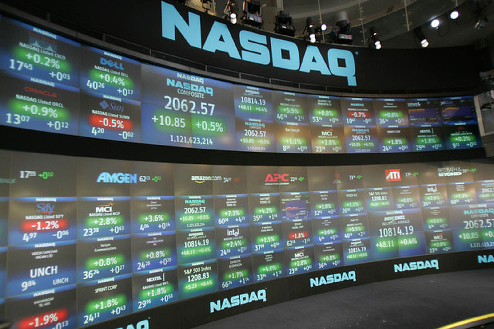

The Nasdaq Stock Exchange stands as a beacon in the global financial markets, renowned for its cutting-edge technology and myriad of offerings across several asset classes. Founded in 1971, Nasdaq was a pioneer as the first electronic stock market, setting a new standard for trading operations worldwide. Known for its robust technological infrastructure, Nasdaq has continually pushed the boundaries of innovation, facilitating swift and secure transactions. This emphasis on technology positions Nasdaq as a prime platform for algorithmic trading, a method revolutionizing how transactions are executed.

Algorithmic trading, characterized by speed and efficiency, uses computer algorithms to automate and optimize trading decisions. It significantly enhances trade execution by minimizing costs and improving market liquidity while operating at speeds unattainable by human traders. This transformation is critical for exchanges like Nasdaq, where millions of transactions occur daily. The precision and systematic approach of algorithmic trading eliminate human emotional biases, ensuring a more efficient market operation.



In this article, we explore how Nasdaq integrates cutting-edge technology to bolster its position as a leader in algorithmic trading. We will analyze the dynamics of algorithmic trading, from its operational mechanisms to its diverse strategies, and consider the future prospects shaped by emerging technologies like artificial intelligence and machine learning. By unraveling the relationship between Nasdaq and algorithmic trading, we offer traders and investors a thorough understanding of the opportunities within the modern financial landscape. As Nasdaq continues to embrace advancements in fintech, it remains a premier destination for those seeking to leverage the efficiencies of algorithmic trading.

## Table of Contents

## Nasdaq: A Historical Perspective

Founded in 1971, Nasdaq emerged as the world's first electronic stock market, fundamentally transforming the landscape of financial trading. Before its inception, stock markets were characterized by physical trading floors, where traders executed buy and sell orders through face-to-face interactions, governed by the traditional open outcry method. Nasdaq's introduction of a computer-based electronic trading system marked the beginning of digital trading, a shift that facilitated greater speed, accessibility, and transparency within financial markets.

Nasdaq originated as a simple electronic quotation system aimed at improving the transparency of over-the-counter (OTC) markets by providing investors with real-time bid and ask prices. This innovation was groundbreaking, laying the groundwork for Nasdaq's evolution into a dominant global exchange. A key milestone in its development was the launch of the "Closing Cross" system, which enabled a more efficient determination of closing stock prices by aggregating orders and executing them at a single closing price. This system enhanced market liquidity and accuracy, solidifying Nasdaq's role as a cutting-edge market facilitator.

Another pivotal moment in Nasdaq's history was its merger with OMX in 2008, a move that expanded its technological and geographical reach. This acquisition allowed Nasdaq to extend its influence in the global financial markets by leveraging OMX's extensive Nordic and Baltic market infrastructure. This strategic alignment demonstrated Nasdaq's ongoing commitment to innovation and market leadership through continuous advancements in technology and service offerings.

As of today, Nasdaq hosts over 3,900 companies, with a combined market value of approximately $12 trillion, highlighting its significant market presence. The exchange stands as a testament to the successful integration of technological advancements and financial services, providing a diverse array of products ranging from equities to derivatives and beyond. Nasdaq's robust infrastructure supports the trading of multiple asset classes, making it a versatile and indispensable player in the global financial ecosystem.

Understanding this rich history is essential to appreciating Nasdaq's pivotal role in the deployment of [algorithmic trading](/wiki/algorithmic-trading) solutions. Its early adoption of electronic systems set the stage for the modern algorithmic trading operations we see today. By consistently pushing the boundaries of technological innovation and embracing transformative changes, Nasdaq has established itself as a benchmark for exchanges worldwide, particularly in the arena of sophisticated trading strategies and solutions.

## Understanding Algorithmic Trading

Algorithmic trading leverages sophisticated computer programs to execute trades at speeds far surpassing human capabilities. This form of trading relies on algorithms—essentially a set of rules or instructions—to make trading decisions based on predetermined criteria such as timing, price, and [volume](/wiki/volume-trading-strategy). These algorithms are designed to optimize trade execution, minimize costs, and enhance overall market [liquidity](/wiki/liquidity-risk-premium), making them indispensable tools in modern financial markets.

One of the core advantages of algorithmic trading is its ability to remove human emotional bias from trading. By following a systematic process, algorithms ensure that trading decisions are consistent and grounded in data, rather than being influenced by emotions like fear or greed. This systematic approach not only improves the efficiency of trading strategies but also allows for the automation of repetitive tasks and complex calculations.

The capabilities of algorithmic trading platforms are further enhanced by their rapid computation power, enabling high-frequency trading ([HFT](/wiki/high-frequency-trading-strategies)). HFT involves the execution of thousands or even millions of orders within fractions of a second, allowing traders to capitalize on small price differences. This requires cutting-edge technology to process vast amounts of data and execute trades with minimal latency.

Constructing an algorithm involves several key components. Firstly, traders define their trading strategy by specifying the rules that will guide trade execution. These rules can be based on statistical models, technical indicators, or other financial metrics. Once the strategy is defined, the algorithm is coded using programming languages such as Python or C++. Python is particularly favored for its extensive libraries and ease of use in developing trading algorithms. Below is a basic example of how an algorithm might be structured in Python:

```python
import pandas as pd

# Assume 'data' is a DataFrame containing stock price information
# A simple moving average crossing strategy
short_window = 40
long_window = 100

signals = pd.DataFrame(index=data.index)
signals['short_mavg'] = data['price'].rolling(window=short_window, min_periods=1, center=False).mean()
signals['long_mavg'] = data['price'].rolling(window=long_window, min_periods=1, center=False).mean()

# Generate signals
signals['signal'] = 0.0
signals['signal'][short_window:] = np.where(signals['short_mavg'][short_window:] > signals['long_mavg'][short_window:], 1.0, 0.0)
signals['positions'] = signals['signal'].diff()
```

This code snippet exemplifies a simple moving average crossover strategy, in which a buy signal is generated when the short-term moving average exceeds the long-term moving average. The algorithm would then execute trades according to these signals, ensuring timely responses to market conditions.

Understanding the mechanics of algorithmic trading also involves comprehending how algorithms interact with financial markets. Algorithms monitor the markets for triggering conditions and send orders to exchanges like Nasdaq when those conditions are met. The efficiency of this process is paramount, as even minimal delays can impact profitability.

In summary, algorithmic trading is a powerful tool that allows traders to execute large volumes of trades efficiently and consistently. Its strategic application, coupled with advanced technological infrastructure, has transformed how trades are conducted, offering significant advantages in terms of speed, accuracy, and cost-efficiency in various market conditions.

## The Role of Nasdaq in Algo Trading

Nasdaq plays a crucial role in the landscape of algorithmic trading by offering an advanced technological infrastructure designed to meet the needs of modern financial markets. With its comprehensive suite of products and services, Nasdaq enables traders to leverage sophisticated trading strategies efficiently. These include real-time market data services that provide traders with the latest price movements and execution services that ensure optimal trade fulfillment. This infrastructure forms the backbone of algorithmic trading, where rapid execution and reliable data are paramount.

Nasdaq's global reach is a significant advantage for algorithmic traders seeking to implement strategies across various markets and asset classes. Its extensive network allows for the deployment of algorithms that can analyze and execute trades simultaneously on different exchanges worldwide. This capability is particularly valuable in exploiting [arbitrage](/wiki/arbitrage) opportunities and adapting to shifting market conditions in real-time.

Security and efficiency are core components of Nasdaq's trading environment, which is essential for managing the complexities of algorithmic transactions. The exchange employs cutting-edge cybersecurity measures to protect data integrity and trading algorithms, ensuring that trades are executed securely. Additionally, the system's efficiency reduces latency—a critical [factor](/wiki/factor-investing) in algorithmic trading where transaction times can significantly impact profitability.

Furthermore, Nasdaq's increasing focus on digital assets paves the way for future expansion in algorithmic trading, particularly in cryptocurrencies. By embracing blockchain technology and digital currencies, Nasdaq positions itself as a forward-thinking exchange ready to incorporate these volatile yet promising markets into its algorithmic trading offerings. This strategic positioning reflects Nasdaq's commitment to fostering innovation and maintaining its status as a leader in the financial technology sector.

## Popular Algorithmic Trading Strategies on Nasdaq

Trend-following strategies capitalize on the [momentum](/wiki/momentum) observed in stock prices, making them particularly effective in the high-volume environment of the Nasdaq. These strategies typically exploit the persistence of stock price movement by identifying a trend in a particular direction, whether upward or downward, and following it with automated trades. This approach reduces the impact of minor fluctuations, aiming instead to capture gains from sustained movement in stock prices.

Arbitrage opportunities are abundant with Nasdaq's extensive listings, including dual-listed stocks traded on multiple global exchanges. Algorithmic trading identifies price discrepancies between these listings, allowing traders to buy low on one exchange and sell high on another, thereby profiting from the price difference. This requires rapid execution and high-frequency trading capabilities to effectively capture the fleeting profit margins before prices converge.

Index fund rebalancing strategies are another vital algorithmic trading framework on Nasdaq. These strategies revolve around exploiting trades predicted during the periodic rebalancing of index funds, whereby certain stocks' weights in the index are adjusted based on predetermined criteria. Algorithms predict these adjustments, positioning trades in anticipation of subsequent market movements, either by acquiring undervalued stocks poised for increased index weight or selling stocks likely to be downgraded.

Volume-weighted average price (VWAP) and time-weighted average price (TWAP) are strategies designed to execute large orders efficiently within Nasdaq's liquid market. VWAP calculates a stock's average price, weighted by volume, over a specific period. Traders using VWAP seek to buy below and sell above this average, ensuring minimal market impact and better execution quality. The VWAP formula is:

$$
\text{VWAP} = \frac{\sum (\text{Price} \times \text{Volume})}{\sum \text{Volume}}
$$

TWAP, on the other hand, divides large trades into smaller chunks executed over a set duration. This technique averages the execution price over time, reducing the potential for market disruption. It is especially advantageous in ensuring that an order is filled evenly throughout a trading session without impacting the stock's price significantly.

These algorithmic trading strategies exemplify the innovation and adaptability intrinsic to trading on the Nasdaq, showcasing the exchange's capability to support a broad spectrum of sophisticated trading methods. Through leveraging Nasdaq's advanced technology and liquidity, traders and investors can optimize their trading strategies to achieve superior execution and returns.

## Advantages and Challenges of Algo Trading

Algorithmic trading, widely adopted in modern financial markets, offers a multitude of advantages that enhance trading efficiency and precision. One of its primary benefits is precision execution, where trades are executed based on pre-set criteria without human intervention, minimizing errors and emotions. This automation translates into cost efficiency by reducing transaction costs associated with manual trading and exploiting narrow bid-ask spreads through rapid execution.

Furthermore, algorithmic trading can process vast data sets quickly, enabling traders to analyze market conditions and execute trades almost instantaneously. Such capabilities are particularly useful in high-frequency trading (HFT) environments, where the ability to act on information milliseconds faster than competitors can be critical.

Nasdaq's infrastructure plays a pivotal role in reducing latency, a crucial factor in successful algorithmic trading. The exchange's state-of-the-art technology ensures that data transmission and order execution occur with minimal delays, giving traders a competitive edge in speed-sensitive strategies. This reduction in latency enhances overall execution speed and reliability, crucial in high-frequency scenarios where even microseconds can significantly impact profitability.

Despite its advantages, algorithmic trading presents several challenges that traders must navigate. Technical challenges, such as system failures or glitches, can lead to substantial financial losses, emphasizing the need for robust systems and contingency plans. Data latency—a delay in data transmission—can result in outdated information influencing trading decisions, potentially leading to suboptimal trades.

Regulatory landscapes introduce another layer of complexity. As markets and technologies evolve, so do regulations governing trading practices. Traders must stay informed about changes in regulatory requirements to align their strategies and systems accordingly, ensuring compliance and minimizing legal risks.

Successfully practicing algorithmic trading requires a balanced approach, acknowledging both technological advancements and potential pitfalls. Traders should continuously test and refine their algorithms to adapt to changing market dynamics and technological developments.

Nasdaq is leading efforts to address these challenges, focusing on continuous enhancements and regulatory collaborations. By working closely with regulators and investing in advanced technologies, Nasdaq aims to create a secure and efficient environment for algorithmic traders. This commitment ensures that the exchange remains at the forefront of innovation, providing robust solutions that meet the ever-evolving needs of the trading community.

## Future Prospects and Innovations

Nasdaq's strategic investment in [artificial intelligence](/wiki/ai-artificial-intelligence) (AI) and [machine learning](/wiki/machine-learning) signifies its commitment to enhancing algorithmic trading capabilities with sophisticated predictive analytics. These technologies enable the development of advanced models capable of analyzing vast datasets to identify trading patterns and predict market movements with greater accuracy. AI-powered algorithms can adapt to changing market conditions more swiftly, providing a competitive edge to traders leveraging Nasdaq's infrastructure.

Nasdaq continuously expands its technological footprint through partnerships and acquisitions, fostering an environment of continuous innovation. Collaborations with leading tech firms and financial institutions bring cutting-edge solutions to the exchange, allowing it to maintain its leadership in adopting and integrating emerging technologies in trading operations.

The rise of digital assets such as cryptocurrencies presents new opportunities for algorithmic trading strategies on Nasdaq. As the demand for crypto trading platforms grows, Nasdaq is strategically positioned to refine and expand its algorithms to accommodate these assets. This expansion not only enhances the exchange's offerings but also aligns with the global trend towards digital asset adoption.

Initiatives like Nasdaq Ventures underscore the exchange's dedication to incorporating fintech advancements into its operational framework. By investing in startups and emerging technologies, Nasdaq accelerates the development and deployment of innovative trading solutions. These initiatives ensure that Nasdaq remains at the forefront of technological progress, continuously improving its capability to support algorithmic trading.

Looking ahead, the future of algorithmic trading on Nasdaq appears bright, characterized by growth and the adoption of groundbreaking innovations. As Nasdaq integrates AI, machine learning, and digital asset trading into its ecosystem, it is set to enhance its global influence, offering traders and investors an increasingly sophisticated and versatile trading platform. This commitment to innovation and expansion solidifies Nasdaq’s role as a premier player in the fast-evolving world of algorithmic trading.

## Conclusion

Algorithmic trading at the Nasdaq Stock Exchange exemplifies the confluence of technology and financial markets, advancing both efficiency and strategic potential. The integration of algorithmic strategies has redefined trading efficiencies, empowering participants to execute trades with unprecedented speed and precision. This transformation aligns with market dynamics, ensuring greater liquidity and reduced transaction costs.

Nasdaq has emerged as a leader in fostering algorithmic innovation, setting a benchmark that resonates across global exchanges. By providing a robust and adaptable infrastructure, Nasdaq supports a wide array of trading strategies that capitalize on both historical data and real-time market fluctuations. The exchange's commitment to incorporating advanced technologies, such as machine learning and artificial intelligence, reinforces its leadership position and suggests a promising trajectory for future growth.

For traders and investors, understanding and leveraging algorithmic trading on Nasdaq presents a lucrative opportunity. The use of sophisticated algorithms allows market participants to exploit inefficiencies, optimize order execution, and maintain a competitive edge. By embracing these advanced methodologies, traders can maximize returns and manage risks within modern financial environments.

Nasdaq's ongoing commitment to technology, encapsulated through continuous system upgrades and strategic partnerships, ensures its status as a premier destination for algorithmic trading excellence. As algorithms continue to evolve and adapt to new market conditions, Nasdaq remains at the forefront of delivering impactful and profitable trading solutions for a global audience.

## References & Further Reading

[1]: Bergstra, J., Bardenet, R., Bengio, Y., & Kégl, B. (2011). ["Algorithms for Hyper-Parameter Optimization."](https://dl.acm.org/doi/10.5555/2986459.2986743) Advances in Neural Information Processing Systems 24.

[2]: ["Advances in Financial Machine Learning"](https://www.amazon.com/Advances-Financial-Machine-Learning-Marcos/dp/1119482089) by Marcos Lopez de Prado

[3]: ["Evidence-Based Technical Analysis: Applying the Scientific Method and Statistical Inference to Trading Signals"](https://onlinelibrary.wiley.com/doi/book/10.1002/9781118268315) by David Aronson

[4]: ["Machine Learning for Algorithmic Trading"](https://github.com/stefan-jansen/machine-learning-for-trading) by Stefan Jansen

[5]: ["Quantitative Trading: How to Build Your Own Algorithmic Trading Business"](https://www.amazon.com/Quantitative-Trading-Build-Algorithmic-Business/dp/1119800064) by Ernest P. Chan