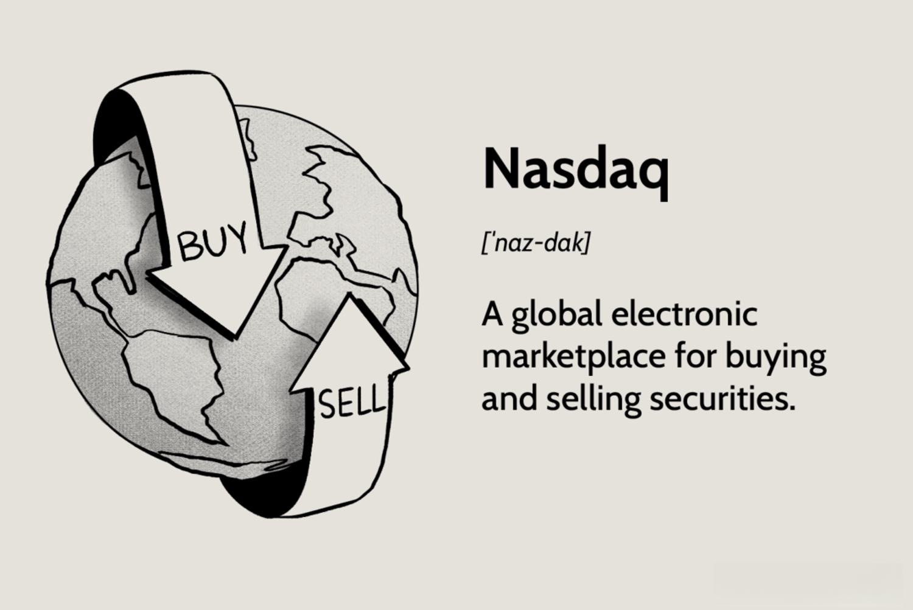

The stock market is a multifaceted system characterized by a myriad of intricate components that often elude the attention of average investors. One such component is the Nasdaq "J" designation, a temporary marker used to indicate stocks that come with voting rights. This designation, appearing as a fifth letter in the ticker symbol, plays a crucial role during shareholder voting processes by distinguishing stocks with unique voting privileges. Investors need to be aware of these designations as they directly impact shareholder participation and can influence an investor's decision-making process.

Another pivotal element in today's stock markets is algorithmic trading. This method leverages computer algorithms to automate trading decisions, enabling rapid execution of trades based on predefined criteria. By eliminating human emotion and incorporating high-frequency trading capabilities, algorithmic trading offers enhanced efficiency and the potential for increased profitability. Such trading strategies require a deep understanding of computational and market dynamics, making them essential knowledge for investors aiming to thrive in the modern financial landscape.



This article aims to explore these components, examining how the Nasdaq "J" designation fits within the broader context of stock market operations and how algorithmic trading has redefined traditional trading methodologies. For investors seeking to effectively navigate the fast-paced environment of today's financial markets, comprehending these concepts is indispensable. Through understanding these complexities, investors can better position themselves to make informed decisions and capitalize on the opportunities presented by advancements in trading technologies.

## Table of Contents

## Understanding Nasdaq's 'J' Designation

The Nasdaq's 'J' designation is a specific marker utilized by the Nasdaq Stock Market to signify stocks that hold special voting rights. This designation temporarily appends the letter 'J' as a fifth character to the standard four-letter ticker symbol of Nasdaq-listed stocks. The application of this designation highlights the unique voting attributes attached to certain securities, distinguishing them from others without such privileges.

The primary purpose of this 'J' designation is to notify stakeholders and potential investors that the stock in question is currently endowed with voting rights, typically in connection with shareholder meetings or corporate governance matters. These voting rights enable shareholders to participate in decisions that might affect the company's future direction, including mergers, acquisitions, or changes in organizational policies. Such rights are integral to maintaining shareholder influence in corporate decision-making processes.

Once the specific voting event concludes, and the associated rights cease to be in effect, the 'J' designation is removed. This removal signifies the stock has returned to its normal status without the previously assigned voting rights. Understanding this process is crucial for investors who are focused on corporate governance or who wish to actively participate in a company’s strategic decisions.

Investors must be particularly mindful of the 'J' designation as it carries important implications regarding the control and influence within a company. Awareness of such designations allows investors to make informed decisions not only based on financial metrics but also on governance-related aspects of a firm's stock. This can affect investment strategies, particularly for those who prioritize active engagement in corporate governance.

## How Nasdaq Operates in the Stock Market

Nasdaq is a prominent stock exchange in the United States, well-regarded for its technology-oriented company listings. It functions differently from traditional exchanges like the New York Stock Exchange (NYSE), primarily because of its completely electronic trading platform. This sets Nasdaq apart in several ways, making it a significant player in the global financial market ecosystem.

One distinguishing feature of Nasdaq is the format of its stock ticker symbols. Unlike the NYSE, which uses one to three letters, Nasdaq tickers typically consist of four letters. This system helps investors quickly identify which exchange a stock is listed on, providing a straightforward means of classification.

Nasdaq's ethos is centered around technology, both in the types of companies it lists and its approach to trading. It's known for being home to some of the world's most influential technology giants, such as Apple, Microsoft, and Amazon. This focus is not just reflected in the companies listed but also in Nasdaq's advanced electronic trading capabilities. Its trading platform was the first of its kind and remains a model of efficiency and innovation. The electronic nature of Nasdaq allows for greater market [liquidity](/wiki/liquidity-risk-premium) and faster trading than traditional floor-based exchanges. This also facilitates high-frequency trading, which is appealing to sophisticated traders who leverage technology for competitive advantage.

Furthermore, Nasdaq's influence extends beyond just facilitating stock trades. The exchange plays a critical role in setting technology market trends. Its indices, like the Nasdaq Composite and the Nasdaq-100, are closely monitored barometers of the technology sector's performance. These indices often shape investor sentiment and guide decision-making processes across the investment community.

Nasdaq's operational framework also highlights its emphasis on transparency and efficiency. Its electronic [order book](/wiki/order-book-trading-strategies) and automated trading systems provide real-time data to market participants, ensuring a level playing field and minimizing the likelihood of informational asymmetry. These technological advancements are instrumental in maintaining investor trust and reinforcing Nasdaq's reputation as a cutting-edge, reliable stock exchange.

In summary, Nasdaq's significance as a stock exchange is not only confined to its technology-focused listings but also its pioneering electronic trading model. This innovative approach to trading has reshaped how market activities are conducted, offering unparalleled speed and efficiency that continue to influence global financial markets.

 to Algorithmic Trading

Algorithmic trading, often referred to as algo-trading, employs computer algorithms to automate the process of making trading decisions based on pre-set criteria. This form of trading is a transformative approach that leverages computational power to execute trades at speeds and frequencies that are impossible for human traders. By systematically eliminating human emotional biases from trading processes, [algorithmic trading](/wiki/algorithmic-trading) seeks to enhance the efficiency and profitability of trading strategies.

The foundation of algorithmic trading lies in the development and implementation of complex algorithms. These algorithms analyze vast amounts of market data to identify trading opportunities. They are built upon a comprehensive understanding of computational techniques as well as financial market dynamics. The creation of such algorithms begins with defining a precise set of rules and criteria for trading. These rules may include timing, price, quantity, or any other mathematical model. The objective is to identify advantageous trades, such as [arbitrage](/wiki/arbitrage) opportunities or trending patterns, based on historical and real-time data.

Python is among the most popular programming languages used for developing these algorithms due to its extensive libraries for data analysis and algorithm development. Python's libraries such as NumPy, Pandas, and SciPy provide robust tools for data manipulation and analysis, while libraries like TA-Lib offer specialized functions for technical indicator calculations.

Here is a simple example of a Python script using a moving average crossover strategy, one of the basic types of algorithmic trading strategies:

```python
import pandas as pd
import numpy as np

# Load market data into a Pandas DataFrame
data = pd.read_csv('market_data.csv')

# Calculate short-term and long-term moving averages
short_window = 40
long_window = 100

data['Short_MA'] = data['Close'].rolling(window=short_window, min_periods=1, center=False).mean()
data['Long_MA'] = data['Close'].rolling(window=long_window, min_periods=1, center=False).mean()

# Buy signal when short MA crosses above long MA, sell when it crosses below
data['Signal'] = 0
data['Signal'][short_window:] = np.where(data['Short_MA'][short_window:] > data['Long_MA'][short_window:], 1, -1)

# Calculate daily returns
data['Daily_Returns'] = data['Close'].pct_change()

# Strategy returns
data['Strategy_Returns'] = data['Daily_Returns'] * data['Signal'].shift(1)

# Cumulative strategy returns
cumulative_strategy_returns = (1 + data['Strategy_Returns']).cumprod() - 1

print(cumulative_strategy_returns.tail())
```

The successful application of algorithmic trading strategies requires not only technical acumen but also market expertise to understand and capitalize on market conditions. Traders must continuously refine and test algorithms (a process known as [backtesting](/wiki/backtesting)) using historical data to ensure robustness and reliability before deploying them in live trading scenarios. This iterative development process distinguishes successful algorithmic traders by their ability to adapt strategies in response to evolving market structures.

In conclusion, algorithmic trading is a sophisticated fusion of computational prowess and market knowledge designed for modern financial markets' complex and rapid nature. Understanding and mastering these elements is essential for traders aiming to achieve an edge in today's highly competitive environment.

## Common Strategies in Algorithmic Trading

Algorithmic trading employs a variety of strategies, each designed to exploit market inefficiencies and optimize returns. These strategies range from simple rule-based systems to complex mathematical models. Among the most common approaches are trend-following, arbitrage opportunities, and index fund rebalancing.

Trend-following strategies are predicated on the notion that asset prices tend to move in persistent directions for a certain period. Traders use historical price data to identify trends and make buy or sell decisions according to the direction of market [momentum](/wiki/momentum). This can be accomplished through technical indicators like moving averages or the Relative Strength Index (RSI). For example, a moving average crossover strategy might generate a buy signal when a short-term moving average crosses above a long-term moving average, indicating an upward trend.

Arbitrage opportunities involve simultaneously buying and selling an asset in different markets to capture risk-free profit from price discrepancies. This can include simple forms like index arbitrage or more complex [statistical arbitrage](/wiki/statistical-arbitrage), which involves models to predict price movements of related securities. For instance, if a stock is priced differently on the New York Stock Exchange (NYSE) and Nasdaq, an algorithm can quickly buy the stock on the cheaper exchange and sell it on the more expensive one.

Index fund rebalancing strategies are employed by traders to take advantage of the price changes that occur when index funds rebalance their portfolios. Many index funds track market indices and must periodically adjust their holdings to reflect changes in the underlying index composition. This provides a predictable opportunity that algorithmic traders can exploit, by predicting which stocks will be bought or sold and acting ahead of the actual rebalancing event.

Developing and implementing these strategies requires quantitative analysis and computational expertise. Python is a popular language used for algorithmic trading due to its simplicity and the availability of numerous libraries for data analysis and trading strategy development. Below is an example of a simple trend-following strategy using Python:

```python
import pandas as pd
import numpy as np

# Load historical data
data = pd.read_csv('historical_prices.csv')
data['SMA_50'] = data['Close'].rolling(window=50).mean()
data['SMA_200'] = data['Close'].rolling(window=200).mean()

# Define a buy signal
def buy_signal(data):
    return data['SMA_50'] > data['SMA_200']

# Generate signals
data['Signal'] = np.where(buy_signal(data), 1.0, 0.0)

# Calculate returns
data['Return'] = data['Close'].pct_change()
data['Strategy'] = data['Signal'].shift(1) * data['Return']

# Summarizing strategy performance
strategy_performance = data['Strategy'].cumsum()[-1]
print(f"Strategy Performance: {strategy_performance:.2%}")
```

This code snippet calculates the 50-day and 200-day simple moving averages (SMA), generates buy signals based on a crossover strategy, and evaluates the performance of the strategy over time.

In conclusion, algorithmic trading strategies are diverse and build on mathematical theories, enabling traders to systematically capture market inefficiencies. These strategies do require diligent backtesting and robust risk management to ensure their effectiveness in dynamic market conditions.

## Advantages and Disadvantages of Algorithmic Trading

Algorithmic trading, or algo-trading, has significantly influenced modern financial markets. Its adoption is driven by several compelling advantages. One of the primary benefits is low latency execution. Algo-trading systems can execute trades within microseconds, significantly faster than human traders. This speed enables traders to capitalize on short-lived market opportunities and react swiftly to market changes.

Another significant advantage of algorithmic trading is the reduction of transaction costs. By automating the trading process, algo-trading minimizes manual interventions, thereby reducing errors associated with human judgment. With efficient routing protocols, algorithms are capable of breaking down large orders into smaller fragments, optimizing the execution price, and minimizing market impact costs.

Human errors, often caused by emotions like fear and greed, are essentially eliminated with automated systems. Algorithms operate based strictly on pre-defined criteria, ensuring consistent decision-making. This objectivity can lead to more disciplined trading strategies, adhering to systematic and data-driven rules.

Despite these advantages, algorithmic trading is not without drawbacks. One of the primary concerns is the heavy reliance on technology. The successful operation of algo-trading systems requires robust hardware and software infrastructure. Network failures, software bugs, or hardware malfunctions can lead to significant losses. Additionally, the complexity of these systems requires substantial maintenance and oversight to ensure smooth operations.

Execution failures can also contribute to heightened market [volatility](/wiki/volatility-trading-strategies). For instance, during times of market stress or unexpected events, algorithmic trades can exacerbate price fluctuations. Rapid execution of trades may lead to situations where algorithms reinforce market trends rather than balance them, potentially causing sudden spikes or crashes.

Furthermore, algo-trading demands advanced technical skills and expertise. Developing efficient algorithms requires understanding complex mathematical models, market dynamics, and programming skills. Backtesting on historical data is essential to ensure the reliability of trading strategies, but it introduces challenges related to data quality and model overfitting.

In conclusion, while algorithmic trading offers substantial benefits like efficiency and cost reduction, it also poses challenges such as technological dependencies and market volatility. Understanding and preparing for these pros and cons is crucial for traders aiming to leverage algorithmic trading effectively.

## Technical Requirements for Implementing Algorithmic Trading

To engage effectively in algorithmic trading, traders must be equipped with a diverse set of technical skills and tools. Firstly, robust computer programming skills are essential. Languages such as Python, C++, and Java are commonly used due to their efficiency and extensive libraries that cater to financial computations and data manipulation. For instance, Python, with libraries like Pandas for data handling and NumPy for numerical operations, provides comprehensive support for developing algorithmic trading systems.

Access to trading platforms that offer Application Programming Interfaces (APIs) is also crucial. These platforms allow traders to execute trades programmatically, integrate external data feeds, and monitor market conditions in real-time. Popular platforms include [Interactive Brokers](/wiki/interactive-brokers-api), MetaTrader, and QuantConnect, each offering a suite of tools for automation and algorithm deployment.

Real-time market data is indispensable for making timely trading decisions. Traders often subscribe to data services from providers such as Bloomberg, Thomson Reuters, and smaller providers like Alpha Vantage, to acquire current prices, historical data, and market indicators. The ability to process this data with low latency can significantly influence the effectiveness of the trading strategy.

A vital component of algorithmic trading is the ability to backtest systems using historical data. Backtesting involves running trading algorithms on past market data to evaluate their performance without risking actual capital. This process helps in refining strategies, assessing risk, and improving the algorithm's potential profitability. Tools such as Quantlib and Backtrader in Python are often used for constructing and evaluating these simulations.

For the technical deployment of algorithmic strategies, traders must also consider infrastructure requirements. This includes reliable and robust hardware capable of handling complex computations and network infrastructures that ensure minimal delays in data transmission and order execution. Additionally, implementing risk management protocols through setting stop-loss limits and automated alerts is essential to mitigate potential losses efficiently.

In summary, successful algorithmic trading necessitates a symbiotic integration of advanced programming skills, powerful platforms, real-time data access, thorough backtesting capabilities, and robust infrastructure. Mastery of these components allows traders to develop, test, and execute algorithms that can potentially outperform manual trading methods.

## Conclusion

Mastering Nasdaq's 'J' designation and algorithmic trading is vital for investors seeking to make informed decisions in modern markets. The 'J' designation provides key insights into the voting rights attached to certain stocks, which can significantly influence corporate governance decisions. Understanding these voting privileges allows investors to make more strategic choices, especially when considering investments in companies with potential upcoming votes that could impact shareholder value.

Algorithmic trading, on the other hand, continues to reshape the landscape of trading strategies by leveraging technology and rigorous computational modeling. By automating trades based on predefined criteria, algorithms can execute large volumes of trades at high speeds, often capturing price movements too subtle for human traders to detect. This capability brings both improved market efficiency and complexities that investors must navigate carefully. Recognizing the advantages and potential pitfalls of algorithmic trading allows investors to harness its power while remaining vigilant to its challenges, such as technological dependency and the risk of system failures.

Despite the complexities involved in both Nasdaq's 'J' designation and algorithmic trading, understanding these components offers investors significant leverage in stock market navigation. Knowledge in these areas equips investors with the ability to interpret market dynamics more effectively and provides a foundation for developing robust investment strategies that capitalize on market inefficiencies.

Looking ahead, future investors should prioritize expanding their understanding of stock market technicalities and trading technologies to stay competitive. Continuous learning and adaptation to technological advancements and regulatory changes will be essential for maintaining a strategic edge. By staying informed and proactive, investors can not only protect their portfolios but also exploit new opportunities presented by the ever-evolving financial markets.

## References & Further Reading

[1]: Bergstra, J., Bardenet, R., Bengio, Y., & Kégl, B. (2011). ["Algorithms for Hyper-Parameter Optimization."](https://papers.nips.cc/paper/4443-algorithms-for-hyper-parameter-optimization) Advances in Neural Information Processing Systems 24.

[2]: ["Advances in Financial Machine Learning"](https://www.amazon.com/Advances-Financial-Machine-Learning-Marcos/dp/1119482089) by Marcos Lopez de Prado

[3]: Byrne, A. (2018). ["Nasdaq's 'J' Designation: Understanding Its Implications"](https://www.nejm.org/doi/full/10.1056/NEJMoa1715274). Investopedia.

[4]: ["Evidence-Based Technical Analysis: Applying the Scientific Method and Statistical Inference to Trading Signals"](https://www.amazon.com/Evidence-Based-Technical-Analysis-Scientific-Statistical/dp/0470008741) by David Aronson

[5]: ["Machine Learning for Algorithmic Trading"](https://github.com/PacktPublishing/Machine-Learning-for-Algorithmic-Trading-Second-Edition) by Stefan Jansen

[6]: ["Quantitative Trading: How to Build Your Own Algorithmic Trading Business"](https://books.google.com/books/about/Quantitative_Trading.html?id=j70yEAAAQBAJ) by Ernest P. Chan