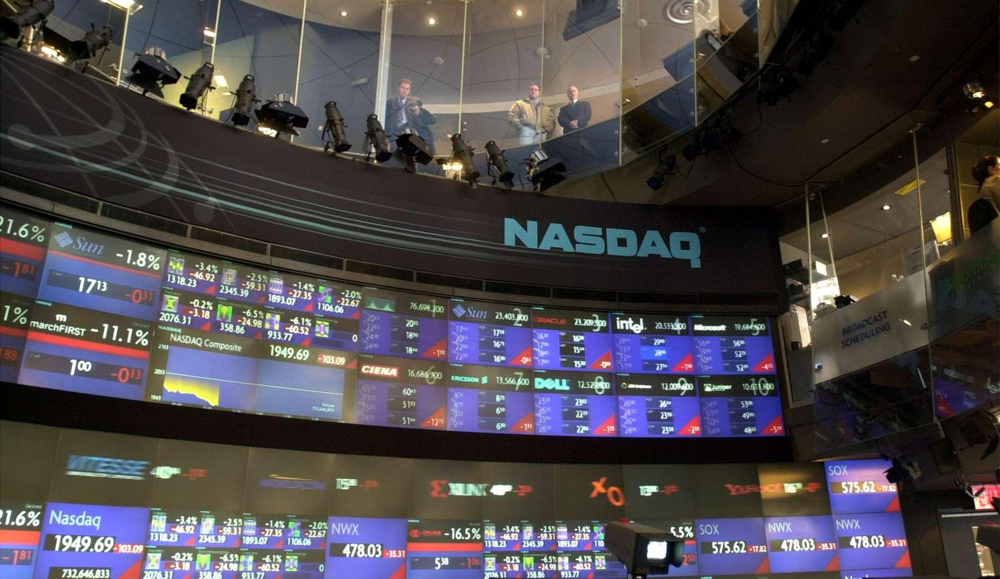

## Table of Contents

## What is the Nasdaq 'J' designation?

The Nasdaq 'J' designation is a special marker that shows a company is late in filing its financial reports. When a company misses the deadline for submitting its quarterly or annual financial statements, Nasdaq adds a 'J' to its stock symbol. This tells investors that the company might have problems and they should be careful.

The 'J' designation is important because it helps keep the stock market fair and open. It warns investors that the company's financial situation is not fully known, which can affect their decisions. If the company fixes the issue and files the missing reports, Nasdaq will remove the 'J' from the stock symbol.

## How does a company receive a 'J' designation on Nasdaq?

A company gets a 'J' designation on Nasdaq when it misses the deadline for filing its financial reports. These reports, like quarterly or annual statements, are important because they tell investors how the company is doing financially. If a company doesn't file these on time, Nasdaq adds a 'J' to its stock symbol to warn investors that there might be problems.

The 'J' designation is Nasdaq's way of keeping the market fair and transparent. It tells investors that the company's financial situation is not fully up-to-date, which can affect their decisions about buying or selling the stock. Once the company catches up and files the missing reports, Nasdaq removes the 'J' from the stock symbol, showing that the company is back on track.

## What are the common reasons for a company to be assigned a 'J' designation?

Companies get a 'J' designation on Nasdaq when they miss the deadline for filing their financial reports. This can happen for many reasons. Sometimes, a company might have big changes happening inside, like new leaders taking over or merging with another company. These changes can make it hard to get all the financial numbers ready on time.

Other times, a company might be having money problems and can't afford to pay for the help needed to finish the reports. Or, they might be dealing with legal issues that stop them from finishing their financial statements. No matter the reason, the 'J' designation tells investors to be careful because the company's financial situation is not fully known.

When a company fixes the problem and files the missing reports, Nasdaq takes away the 'J' from its stock symbol. This shows that the company is back on track and investors can feel more confident about the company's financial health. Until then, the 'J' serves as a warning to be cautious.

## How does the 'J' designation affect a company's stock price?

When a company gets a 'J' designation on Nasdaq, it often makes the stock price go down. Investors see the 'J' as a warning sign that the company might be having problems, like not being able to file its financial reports on time. This makes investors worried and less likely to buy the stock, which can lower the demand and push the price down.

However, the effect on the stock price can be different for each company. If investors think the delay is not a big deal and the company will fix it soon, the stock price might not drop as much. But if the delay is seen as a sign of bigger problems, like financial trouble or legal issues, the stock price could fall a lot. Once the company files the missing reports and Nasdaq removes the 'J', the stock price might start to recover if investors feel more confident again.

## What are the regulatory requirements for a company with a 'J' designation?

When a company gets a 'J' designation on Nasdaq, it means they missed the deadline for filing their financial reports. Nasdaq has rules that say companies must file these reports on time. If they don't, they get the 'J' added to their stock symbol. The company then has to work fast to file the missing reports. They need to explain why they were late and what they are doing to fix it. This is important because it helps keep the market fair and open for everyone.

Once a company with a 'J' designation files the missing reports, they have to meet Nasdaq's rules again. This means they need to keep filing their reports on time in the future. If they don't, they could get more warnings or even be removed from Nasdaq. The 'J' is a big deal because it tells investors to be careful. When the company fixes the problem, Nasdaq takes away the 'J', and things can go back to normal if the company follows the rules.

## Can a company remove the 'J' designation, and if so, how?

Yes, a company can remove the 'J' designation. To do this, they need to file the financial reports they missed. Once they send in these reports and Nasdaq checks them, the 'J' will be taken off their stock symbol. It's important for the company to explain why they were late and what they did to fix it.

After the 'J' is removed, the company must keep filing their reports on time. If they miss another deadline, they could get the 'J' back or face worse problems, like being removed from Nasdaq. So, it's really important for them to stay on track and follow the rules to keep the market fair and open for everyone.

## What are the financial implications for investors when a stock has a 'J' designation?

When a stock has a 'J' designation, it can be risky for investors. The 'J' means the company didn't file its financial reports on time, which can make investors worried. They might think the company is having problems, like money trouble or legal issues. Because of this, investors might sell their shares, which can make the stock price go down. If the stock price drops a lot, investors could lose money.

On the other hand, some investors might see the 'J' as a chance to buy the stock at a lower price. They might believe the company will fix the problem soon and the stock price will go back up. But this is risky because if the company doesn't fix the problem, the stock price could keep going down. So, investors need to be careful and think about the risks before deciding what to do with a stock that has a 'J' designation.

## How does the 'J' designation impact a company's ability to raise capital?

When a company has a 'J' designation, it can be harder for them to raise money. Investors see the 'J' as a warning sign that the company might be having problems, like not being able to file their financial reports on time. This makes investors less likely to buy new shares or invest in the company because they are worried about the company's financial health. If fewer people want to invest, the company might not be able to get the money it needs to grow or keep running smoothly.

However, if the company can explain why they were late and show that they are fixing the problem, some investors might still be willing to invest. They might see the 'J' as a temporary issue and believe the company will get back on track soon. But until the 'J' is removed, the company will have a harder time convincing investors to give them money. Once the 'J' is gone and the company is filing reports on time again, it will be easier for them to raise capital.

## What historical examples illustrate the impact of the 'J' designation on companies?

One example of the 'J' designation's impact is what happened to Enron in 2001. Enron was a big energy company, but it got into trouble because it was hiding its financial problems. When Enron missed the deadline for filing its financial reports, it got a 'J' designation. This made investors very worried, and the stock price dropped a lot. Soon after, Enron went bankrupt, showing how serious the 'J' can be when it points to bigger problems.

Another example is what happened to Rite Aid in 2018. Rite Aid, a big drugstore chain, got a 'J' designation because it missed the deadline for its financial reports. The stock price went down because investors were worried about the company's financial health. But Rite Aid was able to file the missing reports quickly and explain what happened. Once the 'J' was removed, the stock price started to recover, showing that the 'J' can be a temporary problem if the company fixes it fast.

## How do market analysts interpret the 'J' designation when evaluating stocks?

Market analysts see the 'J' designation as a big warning sign when they look at stocks. It tells them that the company missed the deadline for filing its financial reports, which can mean the company is having problems. Analysts know that this can make investors worried and might cause the stock price to go down. They look at why the company was late and how serious the problem is. If the delay seems like a one-time thing and the company is working to fix it, analysts might not be as worried. But if the 'J' points to bigger issues, like money troubles or legal problems, analysts will be more cautious and might advise investors to stay away from the stock.

When a company has a 'J' designation, analysts also think about what it means for the company's future. They wonder if the company will be able to fix the problem and get back to filing reports on time. If the company can do this, the 'J' might be removed, and the stock could start to recover. But if the company keeps having trouble, the 'J' could stay, and the stock might keep going down. Analysts use all this information to help investors decide whether to buy, sell, or hold the stock.

## What are the long-term effects on a company's reputation due to a 'J' designation?

When a company gets a 'J' designation, it can hurt its reputation for a long time. Investors and customers might start to think the company is not good at managing its money or following rules. This can make people less likely to trust the company. If the company keeps having problems with filing reports on time, the 'J' can make people think the company is always struggling. This can be hard to fix because trust is important for a company's success.

However, if a company quickly fixes the problem and gets the 'J' removed, it can start to rebuild its reputation. They need to show everyone that they are back on track and can be trusted again. If they do this well, people might forget about the 'J' over time. But if the 'J' happens again, it can make the damage to the company's reputation even worse. So, it's really important for a company to learn from the 'J' and make sure it doesn't happen again.

## How does the 'J' designation fit into the broader context of Nasdaq's listing rules and regulations?

The 'J' designation is part of Nasdaq's rules to make sure companies follow the rules and keep the market fair. Nasdaq has a list of rules that companies must follow, like filing financial reports on time. If a company doesn't file its reports on time, Nasdaq adds a 'J' to its stock symbol. This tells investors that the company might have problems and they should be careful. The 'J' is a way for Nasdaq to warn investors and keep the market honest.

When a company gets a 'J', it has to work fast to fix the problem and file the missing reports. Nasdaq wants companies to be open about their financial health, so they have to explain why they were late and what they are doing to fix it. If the company follows these rules and files the reports, Nasdaq will take away the 'J'. This shows that the company is back on track and investors can trust it again. The 'J' is important because it helps keep the market fair and open for everyone.

## References & Further Reading

[1]: Bergstra, J., Bardenet, R., Bengio, Y., & Kégl, B. (2011). ["Algorithms for Hyper-Parameter Optimization."](https://papers.nips.cc/paper/4443-algorithms-for-hyper-parameter-optimization) Advances in Neural Information Processing Systems 24.

[2]: ["Advances in Financial Machine Learning"](https://www.amazon.com/Advances-Financial-Machine-Learning-Marcos/dp/1119482089) by Marcos Lopez de Prado

[3]: Byrne, A. (2018). ["Nasdaq's 'J' Designation: Understanding Its Implications"](https://www.nejm.org/doi/full/10.1056/NEJMoa1715274). Investopedia.

[4]: ["Evidence-Based Technical Analysis: Applying the Scientific Method and Statistical Inference to Trading Signals"](https://www.amazon.com/Evidence-Based-Technical-Analysis-Scientific-Statistical/dp/0470008741) by David Aronson

[5]: ["Machine Learning for Algorithmic Trading"](https://github.com/PacktPublishing/Machine-Learning-for-Algorithmic-Trading-Second-Edition) by Stefan Jansen

[6]: ["Quantitative Trading: How to Build Your Own Algorithmic Trading Business"](https://books.google.com/books/about/Quantitative_Trading.html?id=j70yEAAAQBAJ) by Ernest P. Chan