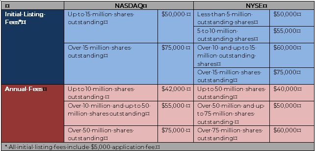

## Table of Contents

## What is the NASDAQ and why is listing on it important for companies?

The NASDAQ is a stock exchange where people can buy and sell shares of companies. It started in 1971 and is known for having a lot of technology and internet companies listed on it. When a company wants to grow, it can sell shares of itself to the public on the NASDAQ. This is called going public or an IPO (Initial Public Offering).

Listing on the NASDAQ is important for companies because it helps them raise money. When a company sells shares, it gets money from investors who buy those shares. This money can be used to grow the business, like building new factories or hiring more workers. Being on the NASDAQ also makes the company more well-known and can attract more customers and business partners. It's a big step for a company and shows that it is doing well and has a good future.

## What are the basic requirements for a company to list on the NASDAQ?

To list on the NASDAQ, a company needs to meet some basic rules. First, it has to have enough money and shares. For the NASDAQ Global Select Market, which is the top level, a company needs at least $10 million in earnings, $50 million in total assets, and 1.1 million shares that people can buy. For the NASDAQ Capital Market, which is easier to get into, a company needs at least $5 million in net worth, $4 million in shareholders' equity, and 1 million shares that people can buy.

Second, the company has to follow some rules about how it runs its business. It needs to have a certain number of shareholders, usually at least 300, and a minimum share price, often $4 per share. The company also has to follow rules about how it tells the public about its business, like sharing financial reports regularly. This helps make sure that people who might want to buy the company's shares have good information to make their decisions.

These rules help make sure that only companies that are doing well and are honest can list on the NASDAQ. This is important because it helps keep the stock market fair and safe for everyone who wants to invest their money.

## How does a company's market value affect its eligibility to list on the NASDAQ?

A company's market value is really important when it wants to list on the NASDAQ. Market value is how much the whole company is worth, and it's figured out by multiplying the number of shares by the price of each share. For the NASDAQ Global Select Market, which is the top level, a company needs to have a market value of at least $850 million. For the NASDAQ Global Market, it needs to be at least $75 million, and for the NASDAQ Capital Market, which is easier to get into, it needs to be at least $1 million. So, the bigger the company's market value, the easier it is to list on a higher level of the NASDAQ.

Having a high market value shows that a lot of people believe in the company and want to invest in it. This makes the company look more stable and trustworthy, which is good for the NASDAQ because it wants to have strong companies listed. If a company's market value is too low, it might not be allowed to list on the NASDAQ, or it might have to list on a lower level. This is because the NASDAQ wants to make sure that the companies on its exchange are doing well and can keep their share prices up.

## What are the different tiers of NASDAQ listings and their specific requirements?

The NASDAQ has three different levels where companies can list their shares: the NASDAQ Global Select Market, the NASDAQ Global Market, and the NASDAQ Capital Market. The NASDAQ Global Select Market is the top level and has the toughest rules. To list here, a company needs to have at least $10 million in earnings, $50 million in total assets, and 1.1 million shares that people can buy. It also needs a market value of at least $850 million. This level is for big, successful companies that are doing really well.

The NASDAQ Global Market is the next level down. It's a bit easier to get into than the Global Select Market. A company needs at least $10 million in earnings, $50 million in total assets, and 1.1 million shares that people can buy, just like the Global Select Market. But, the market value only needs to be at least $75 million. This level is for companies that are doing well but might not be as big or successful as those on the Global Select Market.

The NASDAQ Capital Market is the easiest level to get into. It's for smaller companies or companies that are just starting out. To list here, a company needs at least $5 million in net worth, $4 million in shareholders' equity, and 1 million shares that people can buy. The market value only needs to be at least $1 million. This level helps smaller companies grow by letting them sell shares to the public.

## What financial standards must a company meet to be listed on the NASDAQ Global Select Market?

To be listed on the NASDAQ Global Select Market, a company needs to meet some tough financial rules. It must have at least $10 million in earnings over the last three years, with at least $2.5 million in the most recent year. The company also needs to have total assets of at least $50 million and shareholders' equity of at least $10 million. On top of that, it must have at least 1.1 million shares that people can buy, and these shares need to be owned by at least 400 shareholders, with each shareholder owning at least 100 shares.

Another important rule is that the company's market value, which is the total value of all its shares, needs to be at least $850 million. The company also needs to have a share price of at least $4. These rules make sure that only strong and successful companies can list on the NASDAQ Global Select Market. This helps keep the market fair and safe for everyone who wants to invest their money.

## How do corporate governance requirements impact a company's ability to list on the NASDAQ?

Corporate governance rules are important for companies that want to list on the NASDAQ. These rules are about how a company is run and managed. They make sure that the company is honest and fair to its shareholders. For example, the company needs to have a board of directors that looks after the interests of the shareholders. It also has to follow rules about how it shares information with the public, like financial reports. If a company doesn't follow these rules, it might not be allowed to list on the NASDAQ or could be removed if it's already listed.

Having good corporate governance can help a company get listed on the NASDAQ because it shows that the company is trustworthy. Investors want to know that their money is safe and that the company is being run well. When a company follows these rules, it makes investors more confident about buying its shares. This can make it easier for the company to raise money and grow its business. So, good corporate governance is not just about following rules; it's also about building trust with investors.

## What are the ongoing listing requirements that a company must maintain after being listed on the NASDAQ?

After a company gets listed on the NASDAQ, it has to keep following certain rules to stay listed. One big rule is about the price of its shares. The company needs to keep its share price at least $1 for the NASDAQ Capital Market and at least $4 for the NASDAQ Global Market and Global Select Market. If the share price stays below these levels for too long, the company might get a warning and could be removed from the NASDAQ if it doesn't fix the problem.

Another important rule is about the company's financial health. The company needs to keep sharing regular financial reports with the public. This helps investors know how the company is doing. The company also needs to keep a certain number of shareholders and a certain amount of shares that people can buy. If the company doesn't follow these rules, it might get a warning and could be removed from the NASDAQ if it doesn't fix the problem.

These rules help make sure that companies on the NASDAQ are honest and doing well. This is important because it keeps the stock market fair and safe for everyone who wants to invest their money. If a company can't follow these rules, it might have to move to a different stock exchange or stop being a public company.

## How does the NASDAQ handle non-compliance with listing standards?

When a company listed on the NASDAQ doesn't follow the rules, the NASDAQ gives it a warning. This warning tells the company what it did wrong and gives it some time to fix the problem. For example, if the company's share price is too low, it might get 180 days to make the price go up. If the company can fix the problem within the time given, it can stay listed on the NASDAQ.

If the company can't fix the problem in time, the NASDAQ might remove it from the exchange. This is called delisting. Before delisting, the NASDAQ usually gives the company a chance to explain why it should stay listed. If the company can't convince the NASDAQ, it will be delisted. Being delisted can make it harder for the company to raise money and can hurt its reputation.

## What are the fees associated with listing on the NASDAQ and how do they vary by tier?

When a company wants to list on the NASDAQ, it has to pay some fees. The fees are different depending on which level of the NASDAQ the company wants to list on. For the NASDAQ Global Select Market and the NASDAQ Global Market, the entry fee is $150,000. For the NASDAQ Capital Market, which is easier to get into, the entry fee is $50,000. After the company is listed, it also has to pay yearly fees. These yearly fees depend on how many shares the company has. For the Global Select and Global Markets, the yearly fee starts at $45,000 and can go up to $155,000. For the Capital Market, the yearly fee starts at $33,000 and can go up to $70,000.

Besides the entry and yearly fees, there are also other fees that companies might have to pay. For example, if the company wants to do something special, like a reverse stock split, it might have to pay an extra fee. These extra fees can be different depending on what the company wants to do. All these fees help the NASDAQ keep running and make sure that companies follow the rules. So, it's important for companies to think about these costs when they decide if they want to list on the NASDAQ.

## How can a company transition between different NASDAQ listing tiers, and what are the criteria for doing so?

A company can move from one NASDAQ listing tier to another if it meets the rules for the new tier. For example, if a company is on the NASDAQ Capital Market and wants to move up to the NASDAQ Global Market, it needs to have at least $10 million in earnings over the last three years, $50 million in total assets, and a market value of at least $75 million. If the company can show that it meets these rules, it can apply to move up. Moving to a higher tier can make the company look more successful and attract more investors.

On the other hand, if a company on a higher tier like the NASDAQ Global Select Market doesn't meet the rules anymore, it might have to move down to a lower tier. For example, if the company's market value drops below $850 million, it might have to move to the NASDAQ Global Market. The company will get a warning and some time to fix the problem. If it can't fix it, it will have to move down. Moving down can make it harder for the company to raise money and might hurt its reputation.

## What are the implications of delisting from the NASDAQ and how can a company avoid it?

Being delisted from the NASDAQ can be a big problem for a company. It means the company's shares can't be traded on the NASDAQ anymore. This can make it harder for the company to raise money because fewer people will want to buy its shares. It can also hurt the company's reputation because investors might think the company is not doing well. If a company gets delisted, it might have to move to a smaller stock exchange or stop being a public company altogether, which can make it even harder to grow.

To avoid being delisted, a company needs to follow the NASDAQ's rules. This means keeping the share price above a certain level, like $1 for the NASDAQ Capital Market and $4 for the NASDAQ Global Market and Global Select Market. The company also needs to share regular financial reports with the public and keep a certain number of shareholders. If the company gets a warning for not following the rules, it should try to fix the problem quickly. For example, if the share price is too low, the company might do a reverse stock split to make the price go up. By following the rules and fixing problems fast, a company can stay listed on the NASDAQ and keep growing.

## How do international companies navigate the NASDAQ listing requirements, and what additional considerations do they face?

International companies that want to list on the NASDAQ have to follow the same rules as U.S. companies. They need to have enough money, shares, and shareholders, and they need to keep their share price high enough. But, there are some extra things international companies need to think about. They might need to follow rules from their own country too, which can make things more complicated. They also need to make sure they can share their financial reports in a way that people in the U.S. can understand. This might mean translating their reports into English or changing how they report their finances to match U.S. standards.

Another thing international companies need to consider is the cost. Listing on the NASDAQ can be expensive, with entry fees and yearly fees that can add up. International companies might also need to pay for lawyers and accountants who know about U.S. rules to help them get listed. It's important for these companies to plan carefully and make sure they have enough money to cover these costs. By understanding and following all the rules, and getting the right help, international companies can successfully list on the NASDAQ and grow their business in the U.S. market.

## References & Further Reading

[1]: Bergstra, J., Bardenet, R., Bengio, Y., & Kégl, B. (2011). ["Algorithms for Hyper-Parameter Optimization."](https://papers.nips.cc/paper/4443-algorithms-for-hyper-parameter-optimization) Advances in Neural Information Processing Systems 24.

[2]: NASDAQ. ["Initial Listing Guide."](https://listingcenter.nasdaq.com/assets/initialguide.pdf)

[3]: ["Advances in Financial Machine Learning"](https://www.amazon.com/Advances-Financial-Machine-Learning-Marcos/dp/1119482089) by Marcos Lopez de Prado

[4]: SEC. ["Automated Trading in Our Markets."](https://www.sec.gov/files/Algo_Trading_Report_2020.pdf)

[5]: NASDAQ. ["The Role of Technology in NASDAQ's Growth."](https://www.nasdaq.com/articles/the-role-of-technology-in-mastercards-growth)

[6]: ["Evidence-Based Technical Analysis: Applying the Scientific Method and Statistical Inference to Trading Signals"](https://www.amazon.com/Evidence-Based-Technical-Analysis-Scientific-Statistical/dp/0470008741) by David Aronson

[7]: ["Machine Learning for Algorithmic Trading"](https://github.com/stefan-jansen/machine-learning-for-trading) by Stefan Jansen

[8]: Securities and Exchange Commission (SEC). ["Regulation of Exchanges and Alternative Trading Systems."](https://www.sec.gov/rules-regulations/1998/12/regulation-exchanges-alternative-trading-systems)

[9]: ["Quantitative Trading: How to Build Your Own Algorithmic Trading Business"](https://github.com/LucindaYa/quant-resources/blob/master/Quantitative%20Trading%20How%20to%20Build%20Your%20Own%20Algorithmic%20Trading%20Business.pdf) by Ernest P. Chan

[10]: Gomber, P., Arndt, B., Lutat, M., & Uhle, T. (2011). ["High-Frequency Trading."](https://papers.ssrn.com/sol3/papers.cfm?abstract_id=1858626) Business & Information Systems Engineering.