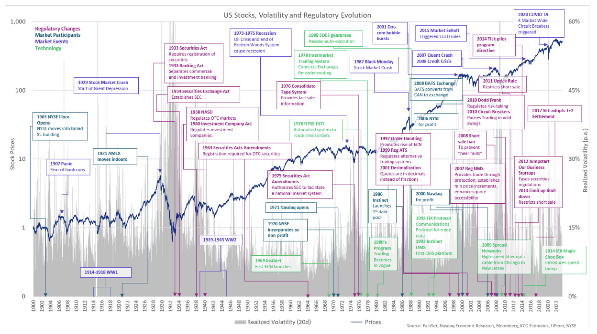

## Table of Contents

## What is the Nasdaq National Market?

The Nasdaq National Market is a part of the Nasdaq stock exchange. It is where bigger and more well-known companies trade their stocks. These companies have to follow strict rules to be listed here. This makes investors feel more secure because they know the companies are closely watched.

The Nasdaq National Market helps companies raise money by selling stocks to the public. It also makes it easier for people to buy and sell these stocks. This market is known for technology and internet companies, but it has many different types of businesses. By being part of the Nasdaq National Market, companies can become more visible and attract more investors.

## How does the Nasdaq National Market differ from other stock exchanges?

The Nasdaq National Market is different from other stock exchanges because it focuses on technology and internet companies. While other stock exchanges like the New York Stock Exchange (NYSE) have a mix of industries, Nasdaq is known for tech firms. Another big difference is that Nasdaq is an electronic exchange. This means all trading happens on computers, not on a physical trading floor like the NYSE. This electronic system makes trading faster and can handle more trades at once.

Nasdaq also has different listing requirements for companies. To be on the Nasdaq National Market, companies need to meet strict rules about how much money they make, how many shares they have, and how much their stock is worth. These rules can be tougher than those of other exchanges. This makes investors feel safer because they know the companies are closely watched. Also, Nasdaq is known for its transparency and providing a lot of information to investors, which helps them make better decisions.

## What types of companies are typically listed on the Nasdaq National Market?

The Nasdaq National Market is home to many technology and internet companies. This includes big names like Apple, Microsoft, and Amazon. These companies often start small and grow quickly, using new ideas and technology to make money. Because of this, the Nasdaq National Market is a popular place for people who like to invest in new and growing businesses.

But it's not just tech companies on the Nasdaq National Market. You can also find companies from other industries like healthcare, finance, and consumer goods. These companies have to follow strict rules to be listed here, which makes investors feel safe. The mix of different types of businesses makes the Nasdaq National Market a good place for investors who want to spread their money across different industries.

## What are the listing requirements for companies on the Nasdaq National Market?

To be listed on the Nasdaq National Market, companies need to meet some strict rules. They have to make at least $1 million in earnings before interest and taxes in the last year, or have $1.1 million in the last three years with at least $2.2 million total. They also need to have at least 1.25 million publicly traded shares, and these shares need to be worth at least $70 million. Plus, the stock price needs to be at least $4 per share.

Another important rule is that the company must have at least 400 shareholders, each owning at least 100 shares. They also need to follow rules about how they run their business and report their financial information. These rules help make sure the companies are honest and well-managed, which makes investors feel safer about putting their money into them.

## How can an investor trade on the Nasdaq National Market?

To trade on the Nasdaq National Market, an investor needs to use a brokerage account. This is like a special bank account but for buying and selling stocks. You can open a brokerage account online with many different companies. Once you have an account, you can put money into it and start trading. You can do this from your computer or even your phone. The brokerage company will connect to the Nasdaq National Market's electronic system, and you can buy or sell stocks whenever the market is open.

Trading on the Nasdaq National Market is easy because it's all done electronically. There's no physical trading floor like some other stock exchanges. This means you can trade quickly and easily. You just need to choose which company's stock you want to buy or sell, decide how many shares, and place your order through your brokerage account. The electronic system will match your order with someone else's, and the trade happens right away. This makes it simple for anyone to start investing in the companies listed on the Nasdaq National Market.

## What are the trading hours for the Nasdaq National Market?

The Nasdaq National Market is open for trading from 9:30 AM to 4:00 PM Eastern Time, Monday through Friday. These are the regular trading hours when most people buy and sell stocks. During this time, you can trade stocks easily and see the prices change as people make their trades.

There are also times before and after the regular trading hours when you can trade, called pre-market and after-hours trading. Pre-market trading starts at 4:00 AM and goes until the regular market opens at 9:30 AM. After-hours trading happens from 4:00 PM until 8:00 PM. These times can be good for people who want to trade when the market is less busy, but the prices can be different and there might be fewer people trading.

## What is the significance of the Nasdaq Composite Index in relation to the Nasdaq National Market?

The Nasdaq Composite Index is like a big scoreboard for the Nasdaq National Market. It shows how all the companies listed on the Nasdaq are doing. If the index goes up, it means that, on average, the stocks on the Nasdaq are doing well. If it goes down, it means the stocks are not doing as well. This index is important because it gives investors a quick way to see if the tech and other companies on the Nasdaq are growing or shrinking.

The Nasdaq Composite Index is made up of all the stocks on the Nasdaq National Market, including big tech companies like Apple and Microsoft. Because the Nasdaq is known for technology and internet companies, the index is often used to see how the tech industry is doing. Investors and people who watch the market pay close attention to the Nasdaq Composite Index to help them decide when to buy or sell stocks. It's a helpful tool for understanding the overall health of the Nasdaq National Market.

## How does the market capitalization of companies on the Nasdaq National Market compare to those on other exchanges?

The market capitalization of companies on the Nasdaq National Market can vary a lot, but it often includes many big companies with high market values. Market capitalization is just how much a company is worth based on its stock price and the number of shares it has. On the Nasdaq, you'll find giants like Apple, Microsoft, and Amazon, which have some of the highest market caps in the world. These big tech companies make the Nasdaq's total market cap very large. But the Nasdaq also has smaller companies, which can have lower market caps.

Compared to other exchanges like the New York Stock Exchange (NYSE), the Nasdaq National Market tends to have a higher concentration of tech companies with big market caps. The NYSE has a mix of industries, including big companies in finance, energy, and other sectors. This mix can affect the overall market cap of the NYSE. While the Nasdaq might have fewer companies overall than the NYSE, the high market caps of its tech giants can make its total market cap very competitive. So, while both exchanges have large companies, the Nasdaq's focus on tech can lead to different market cap dynamics.

## What are the major sectors represented on the Nasdaq National Market?

The Nasdaq National Market is known mostly for technology companies. This includes big names like Apple, Microsoft, and Amazon. These companies make things like computers, software, and online services. Because of this, the tech sector is a big part of the Nasdaq. But it's not just about tech. You can also find companies in other areas like healthcare, which make medicines and medical equipment. These companies help people stay healthy and treat diseases.

Another important sector on the Nasdaq is finance. This includes banks and companies that help people invest their money. They help the economy grow by lending money and managing investments. The consumer goods sector is also well represented. These companies make things people use every day, like food, clothes, and household items. Even though the Nasdaq is famous for tech, it has a mix of different sectors. This variety makes it a good place for investors to spread their money across different kinds of businesses.

## How has the performance of the Nasdaq National Market compared to other major indices over the past decade?

Over the past decade, the Nasdaq National Market has often done better than other major indices like the S&P 500 and the Dow Jones Industrial Average. This is because the Nasdaq has a lot of technology companies, and tech has been a fast-growing industry. For example, big tech companies like Apple, Microsoft, and Amazon have grown a lot, which has helped the Nasdaq's overall performance. During this time, the Nasdaq Composite Index, which shows how all the companies on the Nasdaq are doing, has had some big jumps, especially in years when technology was doing well.

But the Nasdaq National Market can also be more up and down than other indices. This is because tech stocks can change a lot in value quickly. When people are excited about new technology, the Nasdaq can go up fast. But if there's bad news or people are worried about tech companies, the Nasdaq can drop more than other indices. Over the last 10 years, the Nasdaq has had some big ups and downs, but overall, it has done very well, especially when compared to indices that have more traditional companies like the Dow Jones.

## What are the regulatory bodies overseeing the Nasdaq National Market and their roles?

The main regulatory body for the Nasdaq National Market is the Securities and Exchange Commission (SEC). The SEC is like a big watchdog that makes sure everyone follows the rules when they buy and sell stocks. They check that companies tell the truth about their business and money. This helps keep the market fair and safe for everyone. The SEC also makes rules that companies have to follow to be on the Nasdaq. If a company breaks these rules, the SEC can punish them to protect investors.

Another important group is the Financial Industry Regulatory Authority (FINRA). FINRA works a bit like a referee for the stock market. They make sure that the people and companies who help you buy and sell stocks, like brokers, are doing their job right. FINRA checks that these brokers are honest and follow the rules. They also watch over the Nasdaq to make sure everything is running smoothly and fairly. Together, the SEC and FINRA help make the Nasdaq National Market a trustworthy place to invest your money.

## What technological innovations has the Nasdaq National Market implemented to enhance trading efficiency?

The Nasdaq National Market has used a lot of new technology to make trading easier and faster. One big change is that they use computers for all trading. This means there is no physical place where people shout and trade like in some other markets. Instead, everything happens online. This makes trading quick and can handle many trades at the same time. They also use something called the Nasdaq Market Center, which is like a super-fast computer system that matches buyers and sellers. This system helps make sure trades happen smoothly and quickly.

Another important innovation is the use of advanced data and analytics tools. These tools help investors see and understand a lot of information about the market and companies. This can help them make better choices about when to buy or sell stocks. Nasdaq also uses technology to keep the market safe and fair. They have systems that watch for anything unusual or wrong, like people trying to cheat. This helps keep the market honest and protects everyone who is trading.

## How does algorithmic trading work?

Algorithmic trading automates the trading process by employing sophisticated algorithms designed to monitor financial markets, analyze data, and execute trades with minimal human intervention. At the core, this involves leveraging computational power to sift through vast amounts of market data, identify patterns, and react to fleeting opportunities at speeds unattainable by human traders.

A crucial component of [algorithmic trading](/wiki/algorithmic-trading) is the development of a predefined strategy. This strategy serves as the blueprint for the algorithm, directing its behavior based on specific market conditions and financial goals. These strategies may include parameters such as technical indicators, statistical models, or [machine learning](/wiki/machine-learning) techniques, all aimed at spotting lucrative trading opportunities. Once the strategy is crafted, it is translated into a program that continuously scans market data, analyzing metrics such as price, [volume](/wiki/volume-trading-strategy), and historical trends. 

The efficiency of this process hinges on the algorithm’s ability to act on market anomalies in real time. Given the dynamic nature of financial markets like the Nasdaq, speed is of utmost importance. Algorithms capable of reacting within fractions of a second can capitalize on even minor price movements, which is particularly advantageous in markets where [liquidity](/wiki/liquidity-risk-premium) ensures constant price variation. The formula for a basic moving average crossover strategy, often used in algorithmic trading, is:

$$
\text{Signal} = \text{SMA}_{\text{short}} - \text{SMA}_{\text{long}}
$$

Where $\text{SMA}_{\text{short}}$ and $\text{SMA}_{\text{long}}$ are the short-term and long-term simple moving averages respectively. A positive signal may trigger a buy order, while a negative one might signal a sell.

The sheer volume of data analyzed in a high-speed environment requires algorithms to not only detect opportunities but also to execute trades accurately and efficiently. This capability reduces the need for manual oversight and allows for 24/7 market engagement. Adopting algorithmic trading in fast-paced environments like Nasdaq can enhance trade precision, thereby optimizing returns. Here is a simple example of a moving average crossover strategy in Python:

```python
def moving_average(prices, window):
    return sum(prices[-window:]) / window

def trading_signal(data, short_window, long_window):
    short_ma = moving_average(data, short_window)
    long_ma = moving_average(data, long_window)

    if short_ma > long_ma:
        return "Buy"
    elif short_ma < long_ma:
        return "Sell"
    else:
        return "Hold"

# Example usage
price_data = [101, 102, 103, 104, 105, 106]
signal = trading_signal(price_data, short_window=3, long_window=5)
print(signal)
```

In this example, the moving average function calculates the average of prices over a specified window, which is then used to derive trading signals based on the moving average crossover strategy. While simplistic, this forms the basis of more complex algorithmic strategies applied in real-world trading scenarios.

## References & Further Reading

[1]: Aldridge, I. (2010). ["High-Frequency Trading: A Practical Guide to Algorithmic Strategies and Trading Systems."](https://www.tradebit.com/usr/ledsin/pub/9003/_excerpt_High-frequencyTrading.pdf) Wiley: Hoboken, NJ.

[2]: Chaboud, A. P., Chiquoine, B., Hjalmarsson, E., & Vega, C. (2009). ["Rise of the Machines: Algorithmic Trading in the Foreign Exchange Market."](https://onlinelibrary.wiley.com/doi/abs/10.1111/jofi.12186) International Finance Discussion Papers.

[3]: Kissell, R. (2013). ["The Science of Algorithmic Trading and Portfolio Management."](https://www.sciencedirect.com/book/9780124016897/the-science-of-algorithmic-trading-and-portfolio-management) Academic Press: New York.

[4]: Menkveld, A. J. (2013). ["High Frequency Trading and the New-Market Makers."](https://www.sciencedirect.com/science/article/pii/S1386418113000281) The Review of Economic Studies, 80(4), 1545-1583.

[5]: Hasbrouck, J., & Saar, G. (2013). ["Low-Latency Trading."](https://www.sciencedirect.com/science/article/abs/pii/S1386418113000165) The Review of Financial Studies, 26(9), 2673-2737.