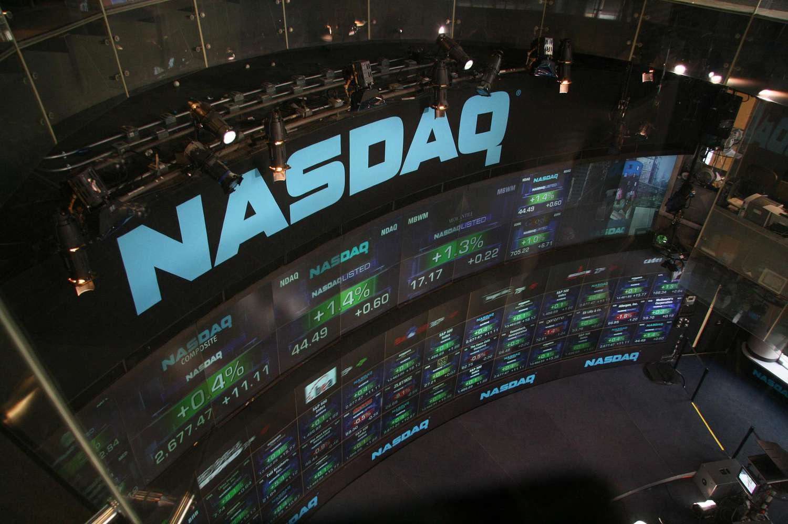

Financial markets have undergone substantial transformation, driven by technological advancements that have ushered in algorithmic trading. This form of trading leverages sophisticated computer algorithms to execute trades based on pre-defined strategies, timing, and conditions, often surpassing human-led trading in terms of speed and efficiency. The rise of algorithmic trading has been particularly notable on platforms like the Nasdaq National Market, which plays a pivotal role in the dynamics of electronic trading globally. 

Algorithmic trading, often referred to as algo trading, involves the use of algorithms to analyze data, monitor markets, and execute trades with minimal human intervention. These algorithms are crafted to work optimally under specified market conditions, enabling traders to respond swiftly to price fluctuations—functions well-suited to the fast-paced Nasdaq environment. As such, algorithmic trading provides traders with the potential to exploit opportunities that would be challenging to capture through traditional trading methods.



In this article, we will explore the intersection of financial markets, the Nasdaq National Market, and the sphere of algorithmic trading. This examination seeks to highlight how these aspects shape the landscape of modern trading, presenting both prospects and challenges for those engaged in these markets. The integration of advanced algorithms within trading platforms like Nasdaq not only enhances trading efficiency but also necessitates a deeper understanding of market dynamics, strategy formulation, and risk management.

## Table of Contents

## Understanding the Nasdaq National Market

Originally one of the market tiers of the Nasdaq Stock Market, the Nasdaq National Market played a pivotal role in defining the trading landscape before its restructuring in 2006. This market tier, characterized by its rigorous financial and corporate governance standards, was composed of approximately 3,000 mid- and large-cap companies. In an effort to adapt to the growing complexities of global financial markets, the Nasdaq National Market was split into two distinct categories: the Nasdaq Global Market and the Nasdaq Global Select Market.

The Nasdaq Global Market continued to serve as a platform for companies meeting stringent requirements in terms of financial metrics, including assets, equity, and income. This tier focuses on fostering transparent and well-governed companies, ensuring investor protection and market integrity. Meanwhile, the Nasdaq Global Select Market was introduced to accommodate listings from companies adhering to even stricter criteria, attracting high-caliber businesses with robust financial health and superior corporate governance practices. This restructuring aimed to better categorize companies based on their financial performance and compliance with regulatory standards, enhancing the market's overall appeal to international investors.

Trading on the Nasdaq platform signifies a company's participation in the world's largest electronic stock exchange. With its advanced trading technology and infrastructure, Nasdaq provides an efficient and dynamic trading environment, characterized by high liquidity and rapid trade execution. Nasdaq's electronic system facilitates continuous trading across different time zones, offering companies global exposure and access to a diverse pool of investors. This vibrant trading ecosystem is often accompanied by volatility, presenting opportunities as well as challenges to market participants.

The Nasdaq reorganization into the Global Market and Global Select Market tiers reflects the broader evolution of financial markets, ensuring that the exchange remains competitive and relevant in an era marked by rapid technological change and increasing globalization of capital markets.

## How Algorithmic Trading Works

Algorithmic trading automates the trading process by employing sophisticated algorithms designed to monitor financial markets, analyze data, and execute trades with minimal human intervention. At the core, this involves leveraging computational power to sift through vast amounts of market data, identify patterns, and react to fleeting opportunities at speeds unattainable by human traders.

A crucial component of [algorithmic trading](/wiki/algorithmic-trading) is the development of a predefined strategy. This strategy serves as the blueprint for the algorithm, directing its behavior based on specific market conditions and financial goals. These strategies may include parameters such as technical indicators, statistical models, or [machine learning](/wiki/machine-learning) techniques, all aimed at spotting lucrative trading opportunities. Once the strategy is crafted, it is translated into a program that continuously scans market data, analyzing metrics such as price, [volume](/wiki/volume-trading-strategy), and historical trends. 

The efficiency of this process hinges on the algorithm’s ability to act on market anomalies in real time. Given the dynamic nature of financial markets like the Nasdaq, speed is of utmost importance. Algorithms capable of reacting within fractions of a second can capitalize on even minor price movements, which is particularly advantageous in markets where [liquidity](/wiki/liquidity-risk-premium) ensures constant price variation. The formula for a basic moving average crossover strategy, often used in algorithmic trading, is:

$$
\text{Signal} = \text{SMA}_{\text{short}} - \text{SMA}_{\text{long}}
$$

Where $\text{SMA}_{\text{short}}$ and $\text{SMA}_{\text{long}}$ are the short-term and long-term simple moving averages respectively. A positive signal may trigger a buy order, while a negative one might signal a sell.

The sheer volume of data analyzed in a high-speed environment requires algorithms to not only detect opportunities but also to execute trades accurately and efficiently. This capability reduces the need for manual oversight and allows for 24/7 market engagement. Adopting algorithmic trading in fast-paced environments like Nasdaq can enhance trade precision, thereby optimizing returns. Here is a simple example of a moving average crossover strategy in Python:

```python
def moving_average(prices, window):
    return sum(prices[-window:]) / window

def trading_signal(data, short_window, long_window):
    short_ma = moving_average(data, short_window)
    long_ma = moving_average(data, long_window)

    if short_ma > long_ma:
        return "Buy"
    elif short_ma < long_ma:
        return "Sell"
    else:
        return "Hold"

# Example usage
price_data = [101, 102, 103, 104, 105, 106]
signal = trading_signal(price_data, short_window=3, long_window=5)
print(signal)
```

In this example, the moving average function calculates the average of prices over a specified window, which is then used to derive trading signals based on the moving average crossover strategy. While simplistic, this forms the basis of more complex algorithmic strategies applied in real-world trading scenarios.

## Benefits of Algorithmic Trading

Algorithmic trading, often known as algo trading, provides traders with significant advantages by capitalizing on technological advancements. One of the primary benefits is the exceptional speed and efficiency it offers. Algorithms are capable of executing trades at a frequency and speed far beyond human capability, enabling traders to capitalize on minute price movements that can occur in fractions of a second. This is especially significant in fast-paced markets such as the Nasdaq, where rapid decision-making can lead to profitable opportunities.

Another key advantage of algorithmic trading is the reduction of emotional biases. Traditional trading involves human judgment, which can be influenced by emotions such as fear or greed. This can lead to irrational decision-making and potentially suboptimal trades. In contrast, algorithmic trading relies on predefined rules and data-driven strategies, ensuring that trades are based purely on objective criteria. By minimizing emotional interference, algo trading enhances the consistency and reliability of trading outcomes.

The constant monitoring of markets, facilitated by algorithms, represents another substantial benefit. Algorithms can operate uninterrupted, providing traders the ability to observe market conditions 24/7. This ensures that no trading opportunity is missed due to human oversight or fatigue. Additionally, the capacity for [backtesting](/wiki/backtesting) is immensely advantageous. Before deploying strategies in a live trading environment, traders can use historical data to simulate and refine their approaches. Backtesting enables the evaluation of a strategy's performance against past market conditions, allowing for adjustments that increase accuracy and effectiveness.

Python is a popular programming language used in algorithmic trading for its simplicity and extensive library support. Below is an example of a basic trading strategy involving a simple moving average crossover, one of the commonly used techniques:

```python
import pandas as pd

# Load historical data for backtesting
data = pd.read_csv('historical_stock_data.csv')
data['SMA_50'] = data['Close'].rolling(window=50).mean()
data['SMA_200'] = data['Close'].rolling(window=200).mean()

# Generate trading signals
data['Signal'] = 0
data['Signal'][50:] = np.where(data['SMA_50'][50:] > data['SMA_200'][50:], 1, -1)

# Calculate returns based on signals
data['Returns'] = data['Signal'].shift(1) * data['Close'].pct_change()

# Plot cumulative returns
data['Cumulative_Returns'] = (1 + data['Returns']).cumprod()
data['Cumulative_Returns'].plot()
```

In this example, the strategy generates buy signals when the 50-day simple moving average (SMA) surpasses the 200-day SMA, indicating a potential uptrend, and sell signals when the reverse occurs. This basic framework can be further developed with additional parameters and conditions to improve performance.

In summary, algorithmic trading offers numerous benefits, including speed, efficiency, and the reduction of emotional biases, while continuously monitoring market conditions and allowing for the backtesting of strategies. These features collectively enhance trading precision and can significantly improve the profitability of traders in dynamic market environments.

## Algo Trading Strategies in the Nasdaq Market

Algorithmic trading strategies in the Nasdaq market employ complex algorithms to execute trades based on defined criteria. These strategies can be categorized into several types, each leveraging unique techniques to capitalize on market movements effectively.

**Trend Following**

Trend following algorithms are designed to capitalize on market trends by identifying patterns in the upward or downward movement of asset prices. This strategy is rooted in the idea that asset prices typically move in trends, and by following these trends, algorithms can make profitable trades. The [trend following](/wiki/trend-following) strategy involves determining the [momentum](/wiki/momentum) of stock prices and executing buy or sell orders accordingly. A simple moving average (SMA) or an exponential moving average (EMA) is often used to ascertain trends. For instance, a basic implementation in Python could involve using historical price data to calculate these averages and then executing trades when certain thresholds are crossed:

```python
import pandas as pd

def calculate_ema(prices, window):
    return prices.ewm(span=window, adjust=False).mean()

# Example usage:
prices = pd.Series([your_price_data_here])
ema_short = calculate_ema(prices, window=12)
ema_long = calculate_ema(prices, window=26)

# Signal to buy when short-term EMA crosses above long-term EMA
signals = (ema_short > ema_long).astype(int)
```

**Arbitrage**

Arbitrage strategies exploit price differences of the same asset in different markets or forms. This approach involves buying and selling an asset simultaneously in different markets to profit from a difference in the listing price. Arbitrage is essential in maintaining market efficiency and price uniformity. The [arbitrage](/wiki/arbitrage) opportunity can arise due to market inefficiencies and is typically short-lived, requiring rapid execution and low latency for success. Consider an asset priced differently on two exchanges, say Exchange A and Exchange B. An algorithm could be designed to automatically buy low on Exchange A and sell high on Exchange B to secure a risk-free profit.

**Market Making**

Market-making algorithms provide liquidity to the market by continuously offering to buy and sell securities at quoted prices. This involves placing limit orders on both sides of the [order book](/wiki/order-book-trading-strategies) to profit from the bid-ask spread, the difference between the buying and selling prices. A successful market-making strategy requires precision in pricing orders, frequent updating of bid and ask prices, and effective management of inventory risk to avoid accumulation of large, unsold positions. For example, a Python implementation could involve using limit order data to determine optimal pricing based on current order book conditions and available market data.

```python
def calculate_spread(bid_price, ask_price):
    return ask_price - bid_price

# Example market making strategy
bid_price = 100.00
ask_price = 101.00

spread = calculate_spread(bid_price, ask_price)
# Implement logic to adjust bid and ask prices dynamically
```

These algorithmic trading strategies are integral to high-frequency trading environments like Nasdaq, providing traders with the means to exploit specific market conditions efficiently. However, the effectiveness of each strategy depends heavily on precise execution, robust data analysis, and the constant evolution of trading algorithms to adapt to changing market conditions.

## Challenges and Risks of Algorithmic Trading

Algorithmic trading, while advantageous, brings forth a set of challenges and risks that demand careful consideration. One primary concern is the necessity for precise programming and constant monitoring to mitigate potential pitfalls. Algorithms must be meticulously coded, as even minor errors can lead to substantial financial repercussions. An algorithm may accurately execute thousands of trades within milliseconds; however, any programming flaw can cause significant misinformation and subsequent losses.

Market [volatility](/wiki/volatility-trading-strategies) adds another layer of complexity to algorithmic trading. During periods of high volatility, algorithms are prone to making erroneous decisions if they are based on incorrect assumptions or faulty data inputs. For example, an algorithm driven by outdated or inaccurate market data might execute trades that result in severe financial losses. The inherent speed and automation that empower algorithmic trading also magnify the impact of these errors.

Furthermore, regulatory compliance presents an ongoing challenge. Financial markets are governed by a complex and continually evolving array of laws and regulations. Traders utilizing algorithms must remain vigilant about compliance to avoid transgressions that could lead to penalties or reputational damage. For instance, the implementation of the Markets in Financial Instruments Directive (MiFID II) in Europe has imposed stringent requirements on algorithmic trading, mandating that systems are adequately tested to ensure they function correctly under various conditions.

These challenges underscore the importance of rigorous testing, robust risk management practices, and adaptive strategies that can respond effectively to changing market dynamics and regulatory landscapes. As traders navigate these complexities, a thorough understanding of both the technological and regulatory environments is imperative for successful algorithmic trading.

## Conclusion

The combination of the Nasdaq National Market and algorithmic trading offers a robust framework for today's traders, emphasizing enhanced access and advancements in trading strategies. Algorithmic trading simplifies the execution of complex strategies and boosts performance by allowing traders to respond to market changes with rapidity and precision that outpaces human capabilities. However, harnessing these advantages is not without its prerequisites; it necessitates a deep comprehension of programming languages and algorithm design to ensure effective strategy creation and deployment.

Moreover, a thorough understanding of financial market conditions and regulatory landscapes is crucial to mitigate associated risks. Traders must stay informed about the continuously shifting dynamics of financial markets and adapt their strategies accordingly. As technologies advance, the tools and methods for executing trades will also continue to develop, empowering traders to refine their tactics and capitalise on even the most subtle market opportunities.

Algorithmic traders are encouraged to remain vigilant and proactive, continually testing and optimizing their algorithms to sustain competitive edges within the fast-paced Nasdaq environment. Embracing innovation and maintaining regulatory compliance will play pivotal roles in maximizing the benefits of this powerful trading synergy.

## References & Further Reading

[1]: Aldridge, I. (2010). ["High-Frequency Trading: A Practical Guide to Algorithmic Strategies and Trading Systems."](https://www.tradebit.com/usr/ledsin/pub/9003/_excerpt_High-frequencyTrading.pdf) Wiley: Hoboken, NJ.

[2]: Chaboud, A. P., Chiquoine, B., Hjalmarsson, E., & Vega, C. (2009). ["Rise of the Machines: Algorithmic Trading in the Foreign Exchange Market."](https://onlinelibrary.wiley.com/doi/abs/10.1111/jofi.12186) International Finance Discussion Papers.

[3]: Kissell, R. (2013). ["The Science of Algorithmic Trading and Portfolio Management."](https://www.sciencedirect.com/book/9780124016897/the-science-of-algorithmic-trading-and-portfolio-management) Academic Press: New York.

[4]: Menkveld, A. J. (2013). ["High Frequency Trading and the New-Market Makers."](https://www.sciencedirect.com/science/article/pii/S1386418113000281) The Review of Economic Studies, 80(4), 1545-1583.

[5]: Hasbrouck, J., & Saar, G. (2013). ["Low-Latency Trading."](https://www.sciencedirect.com/science/article/abs/pii/S1386418113000165) The Review of Financial Studies, 26(9), 2673-2737.