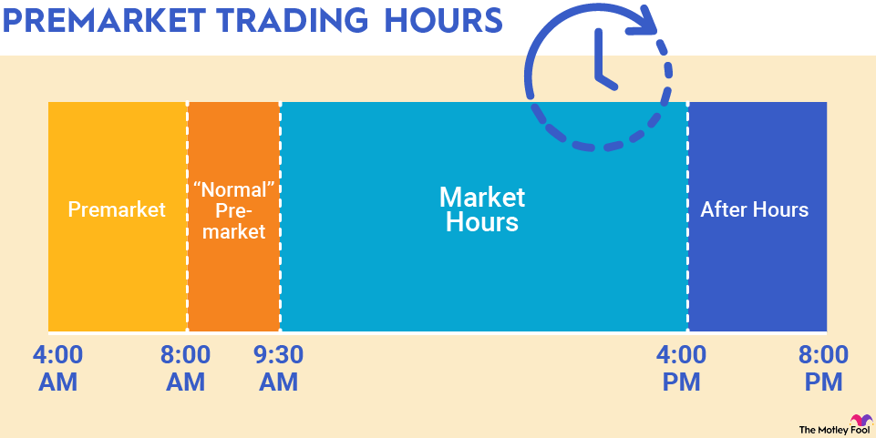

## Table of Contents

## What is the Nasdaq stock exchange?

The Nasdaq stock exchange is a place where people buy and sell stocks, which are small pieces of ownership in companies. It started in 1971 and is the second largest stock exchange in the world, right after the New York Stock Exchange. Nasdaq is special because it was the first stock market to do all its trading on computers, without a physical trading floor.

Many big technology companies, like Apple, Microsoft, and Amazon, have their stocks traded on the Nasdaq. This makes it a popular choice for investors who want to invest in technology and other fast-growing industries. The Nasdaq is known for its electronic trading system, which makes buying and selling stocks quick and easy.

## What are pre-market operations?

Pre-market operations are the activities that happen before the regular trading hours of a stock market. For the Nasdaq, this means trading that takes place before 9:30 AM Eastern Time. During pre-market, investors can buy and sell stocks, but the trading volume is usually lower than during regular hours. This time is important for people who want to react quickly to news or events that happen overnight or early in the morning.

The prices of stocks during pre-market can be different from their prices during regular trading hours. This is because fewer people are trading, so the prices can be more affected by big trades. Pre-market trading can give investors an idea of how the market might open, but it's not always a perfect prediction. It's a useful tool for those who want to get a head start on the day's trading, but it also comes with more risk because of the lower trading [volume](/wiki/volume-trading-strategy) and potential for bigger price swings.

## Why are pre-market operations important for investors?

Pre-market operations are important for investors because they allow them to trade stocks before the regular market opens. This is helpful if something important happens overnight or early in the morning, like a company announcing good or bad news. Investors can buy or sell stocks right away instead of waiting for the market to open. This can be a big advantage because they can react quickly to new information and maybe make better choices about their investments.

Another reason pre-market trading is important is that it can give investors a sneak peek at how the market might start the day. If a lot of people are buying or selling a stock before the market opens, it might mean the stock will go up or down when trading starts. This isn't always true, but it can help investors plan their moves for the day. However, pre-market trading can also be riskier because fewer people are trading, so prices can change a lot more than during regular hours.

## What types of orders can be placed during Nasdaq pre-market trading?

During Nasdaq pre-market trading, investors can place different types of orders to buy or sell stocks. The most common type is a market order, which means you want to buy or sell a stock at the best available price right away. Another type is a limit order, where you set a specific price at which you want to buy or sell. If the stock reaches that price during pre-market, the order will be filled. There's also a stop order, which turns into a market order once the stock reaches a certain price, helping to limit losses or protect gains.

These orders work a bit differently during pre-market because there are fewer people trading. This means that the prices can change more quickly and it might be harder to get the price you want, especially with market orders. It's important for investors to understand how these orders work and to be careful when trading during pre-market hours because the lower trading volume can make things more unpredictable.

## What are the operating hours for Nasdaq pre-market trading?

The Nasdaq pre-market trading hours start at 4:00 AM Eastern Time and end at 9:30 AM Eastern Time. This means that investors can buy and sell stocks before the regular market opens.

During these hours, there are fewer people trading, so the prices can change a lot more than during regular trading hours. It's a good time for investors to react to news or events that happen overnight or early in the morning, but it can also be riskier because of the lower trading volume.

## How does pre-market trading affect stock prices?

Pre-market trading can affect stock prices because it happens before the regular market opens. During pre-market, fewer people are trading, so if someone buys or sells a lot of a stock, it can make the price go up or down more than it would during regular hours. For example, if a company announces good news overnight, people might start buying the stock early in the morning, which can push the price up before the market even opens.

The prices during pre-market can give investors a hint about how the stock might start the day. If a lot of people are buying or selling a stock before the market opens, it might mean the stock will go up or down when trading starts. But, these pre-market prices are not always a perfect prediction because the regular market has a lot more people trading, which can change the price again. So, while pre-market trading can show what might happen, it's not always a sure thing.

## What are the risks associated with trading during the pre-market session?

Trading during the pre-market session can be risky because there are fewer people buying and selling stocks. This means that if someone wants to buy or sell a lot of a stock, it can make the price change a lot more than it would during regular trading hours. This is called lower [liquidity](/wiki/liquidity-risk-premium), and it can make it harder to get the price you want when you place an order. If you use a market order, you might end up buying or selling at a price that's very different from what you expected.

Another risk is that the prices during pre-market might not be a good prediction of what will happen when the regular market opens. News or events that happen overnight can make people trade a lot in the pre-market, but when more people start trading during regular hours, the price can change again. This means that even if you see a stock going up or down in the pre-market, it might not keep going that way once the market opens. So, it's important to be careful and understand that pre-market trading can be more unpredictable.

## How can an investor access Nasdaq pre-market data?

An investor can access Nasdaq pre-market data through various financial websites and trading platforms. Many popular platforms like Yahoo Finance, Bloomberg, and the official Nasdaq website provide real-time pre-market data. These platforms show the current prices of stocks, how much they have changed since the last close, and the volume of trades happening before the market opens. Investors can use this information to see how stocks might start the day and make decisions about their trades.

To get this data, an investor usually needs to sign up for an account on these platforms. Some platforms might require a subscription or a fee for real-time data, while others might offer it for free but with a slight delay. Once logged in, investors can search for the stocks they are interested in and check the pre-market data. This can help them stay updated on any overnight news or events that might affect stock prices before the regular market opens.

## What role do electronic communication networks (ECNs) play in Nasdaq pre-market trading?

Electronic Communication Networks, or ECNs, are important for Nasdaq pre-market trading because they let people buy and sell stocks before the regular market opens. ECNs are like big computer systems that connect buyers and sellers directly, without needing a middleman like a stockbroker. This makes trading faster and easier, especially during times when fewer people are trading, like in the pre-market hours. When someone wants to trade a stock, they can put their order into the ECN, and if someone else wants to trade at the same price, the trade can happen right away.

ECNs help make sure that there is some trading happening even when the regular market is closed. This is good for investors who want to react quickly to news or events that happen overnight or early in the morning. By using ECNs, investors can see what prices stocks are trading at before the market opens and decide if they want to buy or sell. This can give them a head start on the day's trading, but they need to be careful because the prices can change a lot more during pre-market because there are fewer people trading.

## How does liquidity in the pre-market session compare to regular trading hours?

Liquidity during the pre-market session is much lower than during regular trading hours. Liquidity means how easy it is to buy or sell a stock without changing its price too much. In the pre-market, fewer people are trading, so there are fewer buyers and sellers. This means that if someone wants to buy or sell a lot of a stock, it can make the price go up or down a lot more than it would during the regular market hours.

During regular trading hours, there are a lot more people trading, so it's easier to find someone to buy from or sell to at a price close to what you want. This makes the market more liquid, and prices don't change as much when people trade. So, trading in the pre-market can be riskier because the lower liquidity can lead to bigger price swings.

## What are some strategies for trading effectively during the Nasdaq pre-market?

One strategy for trading effectively during the Nasdaq pre-market is to keep an eye on the news. Big news can come out overnight or early in the morning, and it can change how people feel about a stock. If you know about this news before the market opens, you can decide if you want to buy or sell a stock early. This can give you a head start on other investors. But remember, because fewer people are trading in the pre-market, the prices can move a lot more than usual. So, it's important to be careful and not trade too much money at once.

Another good strategy is to use limit orders instead of market orders. A limit order lets you set a specific price at which you want to buy or sell a stock. This can help you control the price you pay or get, which is really helpful in the pre-market when prices can change a lot. If the stock reaches your limit price, your order will be filled. If it doesn't, your order won't go through, and you can wait for the regular market to open. This way, you can avoid big surprises with the price you end up paying or getting.

## How do regulatory requirements impact Nasdaq pre-market operations?

Regulatory requirements set by the Securities and Exchange Commission (SEC) and other financial watchdogs help make sure that trading during the Nasdaq pre-market is fair and safe for everyone. These rules say that companies need to tell investors about important news or events that could change the price of their stock, even if it's outside of regular trading hours. This helps investors make smart choices with their money. The rules also make sure that the systems used for trading, like Electronic Communication Networks (ECNs), work well and don't cause problems.

Because of these rules, trading during the pre-market can be a bit different from regular hours. For example, some types of orders might not be allowed during the pre-market, or there might be limits on how much you can trade. These rules are there to protect investors and keep the market running smoothly, but they can also make pre-market trading a bit trickier. It's important for investors to know about these rules so they can trade safely and make the most of the pre-market session.

## References & Further Reading

[1]: Lo, A. W. (2010). ["Adaptive Markets: Financial Evolution at the Speed of Thought."](https://www.amazon.com/Adaptive-Markets-Financial-Evolution-Thought/dp/0691135142) Princeton University Press.

[2]: Narang, R. K. (2013). ["Inside the Black Box: A Simple Guide to Quantitative and High-Frequency Trading."](https://onlinelibrary.wiley.com/doi/book/10.1002/9781118662717) Wiley.

[3]: Patterson, S. (2013). ["Dark Pools: The Rise of the Machine Traders and the Rigging of the U.S. Stock Market."](https://www.amazon.com/Dark-Pools-Machine-Traders-Rigging/dp/0307887189) Crown Business.

[4]: Aldridge, I. (2013). ["High-Frequency Trading: A Practical Guide to Algorithmic Strategies and Trading Systems."](https://www.amazon.com/High-Frequency-Trading-Practical-Algorithmic-Strategies/dp/1118343506) Wiley.

[5]: Sadka, R. (2010). ["Liquidity risk and the cross-section of hedge-fund returns."](https://papers.ssrn.com/sol3/papers.cfm?abstract_id=1982112) Journal of Financial Economics, 98(1), 54-71.

[6]: Chan, E. P. (2009). ["Quantitative Trading: How to Build Your Own Algorithmic Trading Business."](https://github.com/ftvision/quant_trading_echan_book) Wiley.