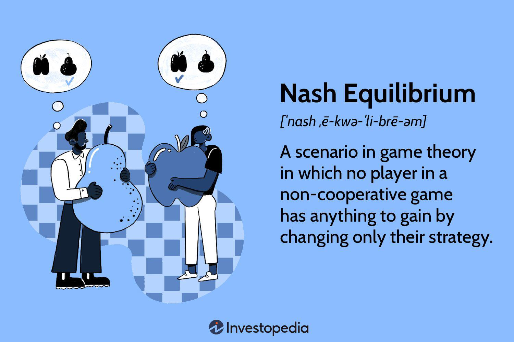

The Prisoner's Dilemma stands as a paradigmatic illustration in game theory, illustrating how rational individuals might choose not to cooperate, even when collaboration seemingly serves their best collective interest. This perplexity arises from the strategic decision-making processes involved, which are deeply influenced by the Nash Equilibrium. The Nash Equilibrium describes a situation wherein each player, armed with knowledge of other players' strategies, finds no advantage in altering their own. Even when mutual cooperation yields a better outcome, the lack of trust and communication often leads parties to pursue non-cooperative strategies, resulting in less favorable outcomes for all involved.

Understanding these foundational principles of game theory has far-reaching implications beyond theoretical exercises. Algorithmic trading, which involves utilizing algorithms to execute trade decisions based on predefined criteria, often draws from game theory to optimize strategies in highly competitive markets. The same strategic interactions and considerations found in the Prisoner's Dilemma apply to financial markets, where traders must decide whether to align with or counteract prevailing market trends. By leveraging concepts such as the Nash Equilibrium, traders can better anticipate the moves of competitors and improve their algorithmic strategies.



This article seeks to elucidate the connections between the Prisoner's Dilemma, Nash Equilibrium, and algorithmic trading, demonstrating how these game theory concepts can enhance strategic decision-making in financial markets.

## Table of Contents

## Understanding Game Theory and Nash Equilibrium

Game theory is a foundational mathematical framework utilized to conceptualize scenarios in which players make decisions that are interdependent. This theory helps in understanding the potential outcomes of events where the success of an individual’s strategy depends on the actions of others. The framework has broad applications across multiple disciplines, such as economics, political science, and evolutionary biology, providing insights into competitive and strategic interactions.

A central concept within game theory is the Nash Equilibrium, named after mathematician John Nash. A Nash Equilibrium occurs in a strategic game when each player's strategy is optimal, given the strategies chosen by other players. This implies that, at equilibrium, no player has an incentive to unilaterally change their strategy. Mathematically, a Nash Equilibrium can be defined for a game involving two players, $P_1$ and $P_2$, with strategies $S_1$ and $S_2$ respectively. The payoff functions are $U_1(S_1, S_2)$ and $U_2(S_1, S_2)$. A Nash Equilibrium exists if:

$$

U_1(S_1^*, S_2^*) \geq U_1(S_1, S_2^*) \quad \forall S_1 
$$

$$

U_2(S_1^*, S_2^*) \geq U_2(S_1^*, S_2) \quad \forall S_2 
$$

where $S_1^*$ and $S_2^*$ are the strategies that players $P_1$ and $P_2$ will stick to, as deviating from these would not yield a better outcome.

Nash Equilibrium is a point of strategic stability within the game where players' strategies are in balance, given the current strategic framework. The implications of Nash Equilibria extend beyond theoretical constructs and have practical applications. In economics, it helps to predict outcomes in competitive markets, while in evolutionary biology, it explains the strategic behaviors that contribute to the survival and reproductive success of species.

The study of Nash Equilibrium in varying contexts reveals its versatility and significant role in deciphering the complexities of strategic decision-making. Each scenario requires careful analysis of available information and potential incentives, which often vary across different fields and problem sets. Understanding these nuances is crucial for leveraging Nash Equilibrium to predict and guide behavior in strategic interactions, facilitating a robust comprehension of both individual and collective decision-making processes.

## The Prisoner's Dilemma Explained

The Prisoner's Dilemma is a quintessential illustration within game theory, showcasing the complexities of strategic decision-making between two rational actors who face the choice of cooperation or betrayal. At its core, the dilemma involves two prisoners who are isolated from one another and unable to communicate. Each prisoner is presented with two options: betray the other by testifying that the other committed the crime, or remain silent.

The dilemma is structured such that:

1. If both prisoners betray each other, each serves a prescribed sentence (say, 5 years).
2. If one betrays while the other remains silent, the betrayer is set free while the silent one serves a very harsh sentence (say, 10 years).
3. If both remain silent, they each serve a relatively minor sentence (say, 1 year).

The payoff matrix for the Prisoner’s Dilemma can be represented as follows:

$$
\begin{array}{c|c|c}
 & \text{Prisoner B: Remain Silent} & \text{Prisoner B: Betray} \\
\hline
\text{Prisoner A: Remain Silent} & (-1, -1) & (-10, 0) \\
\hline
\text{Prisoner A: Betray} & (0, -10) & (-5, -5) \\
\end{array}
$$

From the matrix, it's evident that mutual silence results in the lowest total jail time for both prisoners. Despite this, the dominant strategy — the one that minimizes potential loss without knowing the other's decision — for both prisoners is to betray. This strategy arises because betrayal strictly dominates silence; each prisoner receives a better personal outcome by betraying, regardless of the other's choice. The paradox is that rational, self-interested decision-making leads to a worse collective result, with both prisoners serving 5 years when they could have each served only 1 year by cooperating.

The Prisoner's Dilemma is emblematic of the broader challenges in cooperative strategy, illustrating how individuals acting in their own self-interest can result in suboptimal outcomes for the collective. Such dynamics are relevant in various real-world situations where communication and trust are absent.

## Nash Equilibrium in the Prisoner's Dilemma

Nash Equilibrium in the Prisoner's Dilemma is a crucial concept for understanding strategic interactions between rational players. In the classic scenario, two prisoners are faced with a choice: betray the other or remain silent. If both choose to betray, each serves a moderate sentence—a suboptimal collective outcome but a stable solution where neither prisoner benefits by unilaterally changing their strategy. This stability against unilateral deviations constitutes a Nash Equilibrium.

Although mutual cooperation yields a better collective result, uncertainty about the other's decision often leads each prisoner to betray. This decision-making process highlights how Nash Equilibrium operates: each player's strategy is optimal given their prediction of the other's strategy, assuming that the opponent is also choosing rationally. Mathematically, if the payoffs for players A and B, when choosing strategies s_A and s_B, are represented as U_A(s_A, s_B) and U_B(s_B, s_A) respectively, then the Nash Equilibrium is where:

$U_A(s_A', s_B) \leq U_A(s_A, s_B)$
and
$U_B(s_B', s_A) \leq U_B(s_B, s_A)$

for all possible strategies $s_A'$ and $s_B'$. In the Prisoner's Dilemma, betraying offers a greater reward given the risk of the co-player’s betrayal, making it a rational choice under uncertainty. This scenario encapsulates the tension between individual rationality and collective optimality, showcasing how Nash Equilibrium serves as a tool for understanding strategic decision-making in situations characterized by interdependence and uncertainty.

## Applying Nash Equilibrium and Prisoner's Dilemma to Algo Trading

Algorithmic trading relies on algorithms to execute trades based on pre-set criteria, which often involves complex strategic considerations akin to those found in game theory. Concepts like the Nash Equilibrium play a pivotal role in shaping these algorithms, enabling traders to predict and adapt to market movements effectively.

Nash Equilibrium provides a framework where traders can anticipate the actions of other market participants, assuming that each is making the best possible decision given the strategies of the others. This equilibrium condition implies that once traders have reached this state, none has an incentive to deviate unilaterally from their strategy, as it would not benefit them. For instance, [algorithmic trading](/wiki/algorithmic-trading) systems might use Nash Equilibrium to optimize trading strategies by identifying points where the market has reached a temporary competitive balance.

The Prisoner's Dilemma is another game theory concept relevant to algorithmic trading. In this scenario, traders face the decision of whether to align their algorithms with prevailing market trends or to develop independent strategies. Much like prisoners who choose to betray or cooperate, traders must weigh the benefits of cooperation against the risks associated with independent strategies.

Implementing these concepts in algorithmic trading requires understanding competitor strategies and how they affect market dynamics. For example, if two competing algorithmic traders both choose strategies that follow the same market signals, the resultant behavior could lead to an equilibrium similar to that in the Prisoner's Dilemma, where neither gains a competitive advantage, and the market remains stable until an external [factor](/wiki/factor-investing) causes a shift.

In Python, a simple representation of game theoretic strategies can be modeled using strategic decision matrices or algorithms that calculate optimal moves given a historical dataset of market actions. Here's a basic example:

```python
import numpy as np

def compute_nash_equilibrium(payoff_matrix):
    rows, cols = payoff_matrix.shape
    for row in range(rows):
        for col in range(cols):
            if payoff_matrix[row, col] >= max(payoff_matrix[:, col]) and \
               payoff_matrix[row, col] >= max(payoff_matrix[row, :]):
                return (row, col)
    return None

# Example payoff matrix for two traders' strategies
payoff_matrix = np.array([[3, 2], [5, 1]])
equilibrium = compute_nash_equilibrium(payoff_matrix)

if equilibrium:
    print(f"Nash Equilibrium found at strategy pair: {equilibrium}")
else:
    print("No Nash Equilibrium found.")
```

This simple approach offers insights into developing and evolving trading algorithms that anticipate and react to competitor strategies, thereby enhancing overall market efficiency and stability. Understanding these dynamics enables traders to make informed decisions about when to follow market trends or pursue independent strategies that might offer higher returns but come with increased risks.

## Case Studies and Real-world Applications

In the financial markets, historical examples demonstrate the impact of game theory principles, particularly the Nash Equilibrium, on trading behaviors and outcomes. One notable instance is the coordination of price-fixing in oligopolistic markets. Firms, when acting individually, possess an incentive to undercut competitors' prices to gain market share. However, this leads to a Nash Equilibrium where all firms price at a competitive level, resulting in reduced profits for each entity, akin to the scenario portrayed in the Prisoner's Dilemma.

Algorithmic trading leverages this understanding to predict competitor moves and craft responses that maximize returns. By analyzing historical trade data, algorithms identify patterns where market behavior aligns with or deviates from expected game-theoretic predictions, such as those based on Nash Equilibrium. The algorithms then determine optimal actions to exploit these patterns, often employing [reinforcement learning](/wiki/reinforcement-learning) techniques to adaptively refine strategies.

For example, consider a simplified market with two major traders using algorithmic strategies based on game-theoretic models. Both traders must decide independently whether to aggressively buy or sell a stock. The payoff matrix is as follows:

$$
\begin{array}{c|c|c}
 & \text{Trader B Buy} & \text{Trader B Sell} \\
\hline
\text{Trader A Buy} & (-5,-5) & (10,-10) \\
\hline
\text{Trader A Sell} & (-10,10) & (0,0) \\
\end{array}
$$

In this matrix, each trader's decision leads to outcomes influenced by the other's strategy, similar to the Prisoner's Dilemma. The Nash Equilibrium occurs when both choose to sell, yielding a stable outcome despite suboptimal individual profits. Algorithmic trading systems can simulate these conditions, using historical data to adjust strategies towards equilibrium points that ensure consistent returns under changing market conditions.

Overall, game theory, and Nash Equilibrium, in particular, offer crucial insights into market stability and the emergence of trading patterns. By understanding these strategic interactions, traders can design algorithms that not only respond effectively to competitor behavior but also anticipate market trends, improving efficiency and profitability in algorithmic trading environments.

## Challenges and Limitations

In algorithmic trading, implementing Nash Equilibrium as a decision-making concept presents several challenges and limitations. One primary limitation is the necessity for complete knowledge of competitors' strategies and conditions. In practical trading environments, having such comprehensive information is rare due to the unpredictable nature of market participants and the private nature of trading strategies. Consequently, this lack of complete information can lead to suboptimal algorithm performance when relying solely on Nash Equilibrium calculations.

The complexity of real-world financial markets further complicates the application of simple game theory models. Markets are influenced by a multitude of factors such as economic indicators, political events, and market sentiment. These factors often interact in complex ways that simple game theory models, including the typical formulations of Nash Equilibrium, may not adequately capture. For instance, standard models assume consistent payoff structures, which may not hold true as market conditions fluctuate.

Advancements in adaptive technologies and learning algorithms present potential solutions to some of these limitations. Machine learning models, particularly those involving reinforcement learning, provide a framework where trading algorithms can adapt over time based on historical data and evolving market conditions. These models can potentially identify patterns and optimize strategies without requiring explicit knowledge of competitors' strategies. For example, a reinforcement learning algorithm could iteratively improve its trading policy by simulating interactions within the market environment, thus approximating a more dynamic form of Nash Equilibrium.

Python code implementing a simple reinforcement learning approach might look like this:

```python
import numpy as np

# Define environment and parameters
n_actions = 10
q_table = np.zeros(n_actions)
learning_rate = 0.1
discount_factor = 0.9
exploration_rate = 0.2

# Simulation of trading actions and rewards
def get_reward(action):
    # Simulate market condition and response
    return np.random.normal(loc=action)  # Simplified reward function

# Reinforcement Learning process
for episode in range(1000):
    action = np.random.choice(n_actions) if np.random.rand() < exploration_rate else np.argmax(q_table)
    reward = get_reward(action)

    # Update Q-Table using the Bellman equation
    q_table[action] = q_table[action] + learning_rate * (reward + discount_factor * np.max(q_table) - q_table[action])

optimal_strategy = np.argmax(q_table)
print("Optimal Strategy:", optimal_strategy)
```

Such approaches signify a shift toward algorithms that can handle the dynamic nature of financial markets beyond static theoretical models. As technology continues to evolve, so too does the ability to refine and enhance algorithmic trading strategies through the integration of game theory principles, like Nash Equilibrium, alongside sophisticated [machine learning](/wiki/machine-learning) techniques.

## Conclusion

Understanding the Prisoner's Dilemma and Nash Equilibrium provides crucial insights into decision-making processes and interactions in both human and algorithmic contexts. The Prisoner's Dilemma illustrates the challenges of achieving mutual cooperation in competitive scenarios where short-term incentives can lead to suboptimal collective outcomes. Nash Equilibrium offers a framework where participants, aware of others' strategies, reach a state where deviation offers no advantage, leading to stable outcomes. 

These concepts are instrumental in enhancing algorithmic trading strategies. By applying game-theoretic principles, traders can better anticipate market shifts and respond optimally, even under uncertainty. The ability to predict competitor behavior and market dynamics through an understanding of game theory can lead to superior trade decisions, minimizing risks and maximizing returns.

Despite these advantages, several theoretical challenges persist. The dynamic and multifaceted nature of financial markets means that simple models often cannot encapsulate every influencing factor. Traders must account for incomplete information and the evolving strategies of participants, which can render static Nash Equilibria less applicable. Adaptive technologies and machine learning algorithms are increasingly utilized to tackle these shortcomings, continuously refining models based on real-time data and emerging patterns.

Ongoing research is crucial in further integrating game theory with algorithmic trading. Advancements in computational power and data analytics offer promising avenues for innovating these strategies, potentially leading to enhanced trading efficiency and profitability. By continually refining these models, traders can develop more resilient algorithms that thrive in dynamic market environments.

## References & Further Reading

[1]: Nash, J. (1951). ["Non-Cooperative Games."](https://www.jstor.org/stable/1969529) Annals of Mathematics, 54(2), 286-295.

[2]: Osborne, M.J., & Rubinstein, A. (1994). ["A Course in Game Theory."](https://sites.math.rutgers.edu/~zeilberg/EM20/OsborneRubinsteinMasterpiece.pdf) MIT Press.

[3]: McAfee, R.P., & McMillan, J. (1996). ["Competition and Game Theory."](https://journals.sagepub.com/doi/abs/10.1177/002224379603300301)01002-8) Journal of Industrial Economics, 44(4), 345-347.

[4]: Dixit, A.K., & Nalebuff, B.J. (1991). ["Thinking Strategically: The Competitive Edge in Business, Politics, and Everyday Life."](https://archive.org/details/thinkingstrategi00avin) W.W. Norton & Company.

[5]: Varian, H. R. (1992). ["Microeconomic Analysis."](https://archive.org/details/microeconomicana0000vari_g1b1) W.W. Norton & Company.

[6]: Camerer, C.F. (2003). ["Behavioral Game Theory: Experiments in Strategic Interaction."](https://psycnet.apa.org/record/2003-06054-000) Princeton University Press.

[7]: Von Neumann, J., & Morgenstern, O. (1944). ["Theory of Games and Economic Behavior."](https://psycnet.apa.org/record/1945-00500-000) Princeton University Press.