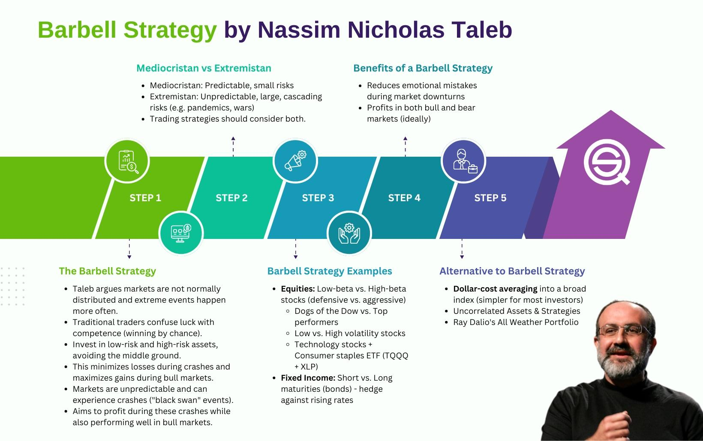

Nassim Nicholas Taleb is a distinguished figure known for his profound insights into randomness, unpredictability, and the influence of rare events. As a statistician, philosopher, and trader, Taleb has critically examined the limitations of probabilistic models and conventional wisdom in comprehending complex systems. His seminal works, 'The Black Swan' and 'Fooled by Randomness', have brought significant attention to the underestimation of high-impact, low-probability events in financial markets and risk management practices.

Taleb's emphasis on understanding the limitations of prediction has led to the development of innovative approaches to risk. One such approach is the barbell strategy, a distinctive investment method that seeks to balance risks and rewards more effectively than traditional strategies. The barbell strategy suggests that investors avoid middle-risk investments and instead place their assets in two extreme categories: high-risk, high-reward opportunities and low-risk, low-return holdings. This dual allocation is intended to minimize potential losses while allowing for significant gains if advantageous, unpredictable events occur.



This article will focus on implementing Taleb's barbell strategy within algorithmic trading, also known as Algo Trading, which uses computational algorithms to execute trading decisions. By integrating this strategy into algorithmic models, traders can potentially enhance their risk management frameworks and increase resilience against market volatility. The article will examine the core principles of the barbell strategy, explore its practical applications in trading, and provide guidance for traders looking to incorporate it into their financial decision-making.

Furthermore, the barbell strategy aligns with Taleb's broader philosophical concept of antifragility, which advocates for systems that thrive amid volatility and chaos. By embracing this mindset, traders and investors can position themselves to benefit from uncertainty rather than being harmed by it, challenging traditional investment paradigms and reshaping the approach to risk and opportunity.

## Table of Contents

## Understanding Nassim Taleb's Philosophy

Nassim Nicholas Taleb's philosophical framework is deeply rooted in addressing uncertainty and unpredictability through strategic positioning. His central concept is antifragility, which he defines as the property of systems that thrive and grow when exposed to volatility, randomness, and chaos, as opposed to merely resisting these forces like robust systems or breaking down like fragile ones. This perspective challenges the conventional understanding of risk, which often focuses on eliminating variability rather than harnessing it for potential gains.

Taleb critiques traditional risk assessment models, particularly those relying on normal distribution assumptions, such as Value at Risk (VaR), arguing they fail to properly account for rare, high-impact events—phenomena he terms "Black Swans." These rare events, while unpredictable in specifics, have profound and often underestimated impacts. Taleb suggests that reliance on historical data and oversimplified statistical models can lead to disastrous underestimations of risk.

In the context of trading, Taleb promotes preparedness for the unexpected rather than attempting precise predictions of market behaviors. He advocates for strategies that accommodate unknowns, leveraging the asymmetric payoff structure found in options trading and other financial instruments that benefit from large, unpredictable market shifts.

His literary contributions, primarily through the "Incerto" series, including "The Black Swan," "Fooled by Randomness," and "Antifragile," delve into themes of risk, randomness, and the cognitive biases that influence decision-making. Taleb emphasizes that understanding and managing uncertainty requires not only a technical adaptation of strategies but also a philosophical and behavioral shift to embrace the potential upside of disorderly environments.

## What is the Barbell Strategy?

The barbell strategy is an investment approach that strategically distributes assets into two distinct categories: high-risk and low-risk. Unlike conventional balanced portfolios that maintain a moderate-risk profile, this strategy opts to entirely sidestep middle-ground investments. The essence of the barbell strategy is to exploit the potential for significant returns from positive, extreme market events on the high-risk side while ensuring stability and mitigating losses with low-risk assets.

Visualizing this method, the investment portfolio resembles a physical barbell, with significant "weights" or investment allocations placed at each end—one side representing high-risk investments and the other, low-risk. This dual approach aligns with Nassim Taleb's philosophy of preparing for unpredictable market changes rather than attempting to forecast them accurately.

The high-risk component is designed to maximize gains during rare and extreme market scenarios, which, although improbable, can yield substantial profits. These investments may include assets like speculative stocks, venture capital, or derivatives such as options and futures, which have the potential to perform exceptionally well if the market conditions are favorable.

Conversely, the low-risk segment of the barbell strategy is oriented towards providing a buffer against market [volatility](/wiki/volatility-trading-strategies), preserving capital by focusing on safer asset classes such as government bonds, treasury bills, or other stable income-generating securities. This conservative side reduces the portfolio's exposure to large-scale losses during uncertain periods.

Taleb asserts that this strategic bipolarity can effectively diminish the risk of substantial financial downturns when markets exhibit unforeseen shifts. By making calculated allocations to potentially volatile investments, while simultaneously anchoring the portfolio with secure assets, the barbell strategy aims to safeguard the investor against market turbulence and capture upside opportunities when they arise. This balance not only addresses risk management but also aligns with Taleb's broader advocacy for antifragility—gaining from disorder rather than being victimized by it.

## Application in Algo Trading

Algorithmic trading (Algo Trading) employs automated platforms to execute predefined trading strategies, streamlining the process of engaging with financial markets. Integrating Nassim Taleb’s barbell strategy into algo trading involves coding the strategy into these platforms to achieve a diversified risk profile aligned with Taleb's philosophy of managing uncertainty.

A core aspect of this integration is the ability of algo systems to simultaneously manage both low-risk and high-risk assets. By strategically allocating resources into these two extreme categories, algorithmic programs can optimize responses to both predictable and unpredictable market scenarios. This dual-focus setup mirrors the barbell strategy's intent, typically visualized as having weights on both ends - one focused on stability and the other on potential high returns from extreme market events.

For practitioners, the implementation of the barbell strategy within an [algorithmic trading](/wiki/algorithmic-trading) framework can lead to increased resilience against market volatility. By being prepared to capitalize on rare and extreme events, algorithms based on this strategy can potentially enhance profitability during such occurrences. The low-risk portion acts as a stabilizing [factor](/wiki/factor-investing), mitigating potential losses when markets behave erratically.

To effectively implement this strategy, traders can customize their trading algorithms. This customization involves integrating historical data [backtesting](/wiki/backtesting) and conducting stress tests, which are essential for evaluating the potential outcomes of the barbell strategy. Backtesting allows for the simulation of the strategy under varied historical conditions, assessing its robustness and potential profitability. Stress tests further ensure that the strategy can withstand extreme market conditions, providing a safeguard against unforeseen market shocks.

Incorporating the barbell strategy into algo trading requires a comprehensive understanding of both market dynamics and algorithmic processes. By strategically aligning investments with the principles of antifragility and market unpredictability, traders can leverage advanced computational tools to refine their approach, potentially capitalizing on opportunities traditional strategies might overlook.

## Examples of Barbell Strategy Implementations

An equity barbell strategy can be illustrated by placing investments in government bonds, representing the low-risk component, and technology stocks, which typically constitute the high-risk segment. This configuration aims to secure a stable foothold through government bonds while seizing potentially substantial gains from tech stocks that can experience significant price movements.

In the fixed income sector, the barbell strategy can be applied by allocating funds to short-term bonds for stability and concurrently investing in speculative, high-yield bonds for high-risk, high-reward opportunities. This dual approach allows investors to maintain a balance between security and the possibility of high returns, managing risk through diversification.

Options trading presents another avenue for implementing the barbell strategy. Traders may take cash positions, acting as the low-risk component, while purchasing out-of-the-money options to exploit extreme market fluctuations. The combination of stable cash reserves and potentially lucrative options can maximize profit potential during unprecedented market events.

For traders interested in automating this strategy, Python can be utilized to develop algorithms that manage these operations. Here's a simplified example:

```python
import numpy as np

# Define a function for the barbell strategy
def barbell_strategy(allocation, low_risk_asset, high_risk_asset, market_data):
    # Allocate investment capital to low and high-risk assets
    low_risk_investment = allocation * low_risk_asset
    high_risk_investment = (1 - allocation) * high_risk_asset

    # Simplified model: calculate expected returns
    low_risk_return = np.mean(market_data[low_risk_asset])
    high_risk_return = np.mean(market_data[high_risk_asset])

    # Combine the returns
    total_return = low_risk_return * allocation + high_risk_return * (1 - allocation)
    return total_return

# Example usage
market_data_example = {'gov_bonds': np.random.normal(0.02, 0.01, 1000),
                       'tech_stocks': np.random.normal(0.1, 0.2, 1000)}
allocation_example = 0.5
strategy_return = barbell_strategy(allocation_example, 'gov_bonds', 'tech_stocks', market_data_example)

print(f"Expected Strategy Return: {strategy_return:.2f}")
```

This code outlines a basic model for estimating expected returns from a barbell strategy, allowing traders to adjust allocations between different asset classes based on historical data. Through such tools, investors can dynamically tailor their strategies to changing market conditions, maximizing the barbell approach's effectiveness in managing risk and exploiting potential gains.

## Benefits and Challenges

Benefits and challenges associated with implementing Nassim Taleb's barbell strategy in algorithmic trading are critical considerations for traders and investors looking to optimize their investment approaches.

One of the primary benefits of the barbell strategy is its inclination towards risk-neutral investments, which can lead to higher potential returns during volatile market conditions. This approach is particularly advantageous since markets are often unpredictably volatile, making the ability to capitalize on extreme events highly valuable. By allocating a significant portion of capital to low-risk assets and a smaller portion to high-risk, high-reward opportunities, investors can protect themselves from adverse market conditions while also benefiting from unexpected gains. This method aligns with the concept of antifragility, as it not only withstands shocks but potentially benefits from them. In essence, the barbell strategy is designed to handle uncertainty effectively, which is critical in volatile financial environments.

Despite its advantages, the barbell strategy presents several challenges. Managing a portfolio with distinctly different investment types—low-risk and high-risk—requires sophisticated financial knowledge and insights. Investors must have a deep understanding of risk assessment and market dynamics to successfully execute this strategy. The need for constant monitoring and rebalancing of the portfolio cannot be overstated, as market conditions are constantly evolving and investments may drift from their intended risk allocations.

Moreover, incorporating the barbell strategy into algorithmic trading can be complex and potentially costly. This integration involves coding the strategy into trading algorithms, which necessitates advanced programming skills and technical infrastructure. The costs associated with technology, including infrastructure setup, ongoing maintenance, and system upgrades, can be substantial. Traders must also conduct rigorous backtesting using historical data to ensure the effectiveness of their algorithms under various market conditions. This process requires significant computing resources and may necessitate investments in high-quality market data, which can increase operational costs.

Ultimately, the barbell strategy's potential to optimize risk management and harness market volatility must be weighed against the resources and expertise required for its implementation. While the strategy promises substantial rewards, particularly during turmoil and market upheavals, it also demands precise execution and a comprehensive understanding of both financial markets and cutting-edge technology.

## Conclusion

Nassim Taleb’s barbell strategy, when applied to algorithmic trading, offers traders a compelling way to enhance risk management and capitalize on market volatility. Integrating this strategy into algorithmic models embodies Taleb's broader antifragile philosophy, which thrives on disorder and uncertainty. By adopting a dual-focused investment approach—allocating assets into high-risk and low-risk categories—traders can potentially benefit from extreme market events while safeguarding against losses in stable periods.

The implementation of this strategy demands meticulous planning and execution. Algorithmic trading systems must be adept at managing diverse investment types, seamlessly switching between low-risk and high-risk assets to optimize performance. This complexity requires significant insight into financial data and sophisticated technological infrastructure. However, the potential advantages of such an approach, particularly during volatile markets, are substantial. Traders can achieve enhanced resilience and potentially higher returns as the algorithmic systems dynamically respond to market conditions, capturing opportunities from rare events that traditional strategies might overlook.

Taleb’s approach challenges conventional investment practices by focusing on the edges rather than a balanced middle. This prompts investors to reassess how they perceive and handle risk and opportunities. By rethinking investment strategies through the lens of Taleb's ideas, traders are encouraged to move beyond traditional risk models and embrace a mindset that values adaptability and transformation in the face of market uncertainties.


## References & Further Reading

[1]: Taleb, N. N. (2007). ["The Black Swan: The Impact of the Highly Improbable."](https://www.stat.berkeley.edu/~aldous/157/Books/Black_Swan-sub.pdf) Random House.

[2]: Taleb, N. N. (2001). ["Fooled by Randomness: The Hidden Role of Chance in Life and in the Markets."](https://en.wikipedia.org/wiki/Fooled_by_Randomness) Random House.

[3]: Taleb, N. N. (2012). ["Antifragile: Things That Gain from Disorder."](https://en.wikipedia.org/wiki/Antifragile_(book)) Random House.

[4]: Avellaneda, M., & Stoikov, S. (2008). ["High-frequency trading in a limit order book."](https://people.orie.cornell.edu/sfs33/LimitOrderBook.pdf) Quantitative Finance, 8(3), 217–224.

[5]: Lopez de Prado, M. (2018). ["Advances in Financial Machine Learning."](https://www.amazon.com/Advances-Financial-Machine-Learning-Marcos/dp/1119482089) Wiley.

[6]: Chincarini, L. B., & Kim, D. (2006). ["Quantitative Equity Portfolio Management: An Active Approach to Portfolio Construction and Management."](https://www.amazon.com/Quantitative-Equity-Portfolio-Management-Construction/dp/0071459391) McGraw-Hill Education.