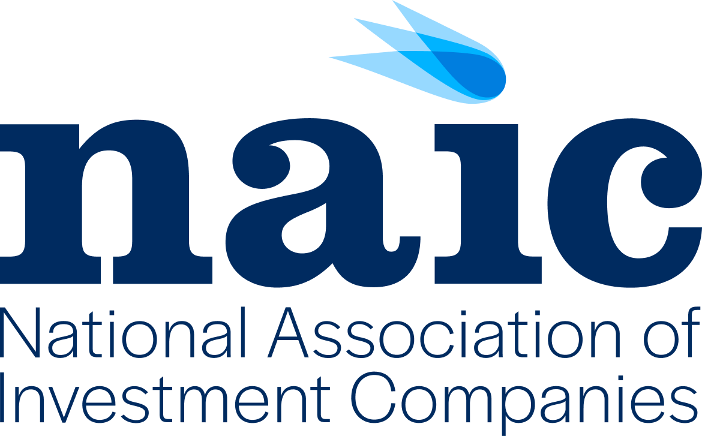

## Table of Contents

## What is the National Association of Investors Corp (NAIC)?

The National Association of Investors Corp (NAIC) is a non-profit organization in the United States that helps people learn about investing. It was started in 1951 and is known for teaching people how to invest in stocks through a method called "BetterInvesting." The NAIC helps people form investment clubs where members can learn together and make investment decisions as a group.

The main goal of the NAIC is to teach people how to invest wisely and build wealth over time. They provide tools, resources, and educational materials to help individuals understand the stock market and make informed decisions. The NAIC believes that anyone can learn to invest successfully with the right knowledge and support, and they work to make investing accessible to everyone.

## When was the NAIC founded and by whom?

The NAIC was founded in 1951. It was started by four men: George Nicholson, Walter Loewen, Arthur Johnson, and Michael Dickinson. They wanted to help people learn how to invest in the stock market.

These men believed that if people worked together in investment clubs, they could learn more and make better investment choices. So, they created the NAIC to provide education and support to help people build wealth over time.

## What are the primary goals and objectives of the NAIC?

The main goal of the NAIC is to help people learn how to invest in the stock market. They want to teach people how to build wealth over time by making smart investment choices. The NAIC believes that anyone can learn to invest successfully if they have the right knowledge and support. That's why they focus on providing education and resources to help people understand the stock market and make informed decisions.

Another important objective of the NAIC is to promote the idea of investment clubs. They encourage people to form groups where they can learn together and make investment decisions as a team. The NAIC thinks that working with others can make learning easier and more fun. By supporting these clubs, the NAIC helps create a community of investors who can share ideas and grow their wealth together.

## How does the NAIC support individual investors?

The NAIC helps individual investors by giving them tools and resources to learn about investing. They have classes, online tools, and materials that teach people how to pick good stocks and build a strong investment plan. The NAIC believes that with the right knowledge, anyone can become a smart investor. They also have a magazine called "BetterInvesting" that shares tips and stories from other investors, which can help people learn from real-life examples.

Another way the NAIC supports individual investors is by helping them start and run investment clubs. These clubs are groups of people who meet regularly to learn about investing and make decisions together. The NAIC provides guidance on how to set up a club, choose investments, and keep everyone engaged. Being part of a club can make learning more fun and help people feel more confident in their investment choices. By working together, club members can share ideas and support each other as they grow their wealth.

## What educational resources does the NAIC provide?

The NAIC offers a lot of educational resources to help people learn about investing. They have classes that teach people how to pick good stocks and build a strong investment plan. These classes can be taken in person or online, so anyone can join from anywhere. The NAIC also has online tools that help people analyze stocks and make smart investment choices. These tools are easy to use and can help people feel more confident when they're deciding where to put their money.

Another important resource from the NAIC is their magazine called "BetterInvesting." This magazine shares tips and stories from other investors, which can help people learn from real-life examples. Reading about others' experiences can give people new ideas and help them avoid common mistakes. The NAIC also helps people start and run investment clubs. They provide guides and support to help clubs choose investments and keep everyone engaged. Being part of a club can make learning more fun and help people feel more supported as they grow their wealth.

## Can you describe the NAIC's investment clubs and how they function?

The NAIC's investment clubs are groups of people who come together to learn about investing and make investment decisions as a team. These clubs usually meet once a month to discuss stocks, share ideas, and decide where to put their money. Each member of the club pays a small amount each month, and the club uses this money to buy stocks. The NAIC helps these clubs by providing guides and support on how to choose good investments and keep everyone involved.

Being part of an investment club can be really helpful. It makes learning about investing more fun because you're doing it with friends or other people who want to learn too. When you're in a club, you can share ideas and learn from each other's experiences. The NAIC believes that working together in a club can help people feel more confident and make better investment choices. Plus, it's nice to have a group of people to support you as you work on building your wealth over time.

## What is the BetterInvesting magazine and what kind of content does it feature?

BetterInvesting magazine is a publication from the NAIC that helps people learn about investing. It comes out every month and is full of useful information for both new and experienced investors. The magazine is easy to read and understand, so anyone can learn from it.

The magazine features articles about how to pick good stocks, stories from other investors, and tips on building a strong investment plan. It also has sections where people can ask questions and get advice from experts. Reading BetterInvesting can help people feel more confident about their investment choices and learn from real-life examples.

## How does the NAIC's stock selection and investment methodology work?

The NAIC's stock selection and investment methodology is called "BetterInvesting." It's a simple way to pick good stocks and build a strong investment plan. The main idea is to look for companies that are growing and making more money over time. The NAIC teaches people to study a company's past performance and future plans to see if it's a good investment. They use a tool called the Stock Selection Guide, which helps people analyze a company's financial numbers and decide if it's worth buying.

When [picking](/wiki/asset-class-picking) stocks, the NAIC suggests looking at things like sales growth, earnings growth, and how much profit the company makes. They also want people to think about the company's future plans and if those plans will help the company keep growing. The NAIC believes in buying stocks for the long term, so they tell people to hold onto their investments for many years. By following this method, people can build a portfolio of strong, growing companies that can help them build wealth over time.

## What are some success stories or case studies of investors who have used NAIC's strategies?

One success story is about a group of friends who started an investment club using the NAIC's strategies. They met every month to learn about stocks and decided together which ones to buy. Over the years, their club grew their money a lot by picking good companies that kept getting bigger. They used the Stock Selection Guide to make smart choices and held onto their stocks for the long term. Now, they're all doing well financially and say that being part of the club helped them learn and feel more confident about investing.

Another case study is about a woman who joined an NAIC club after reading about it in the BetterInvesting magazine. She was new to investing but learned a lot from the other club members and the NAIC's resources. She followed the BetterInvesting method, looking for companies with strong growth and holding onto them for many years. Her investments grew steadily, and she was able to save enough money to buy a house. She says that the NAIC's approach made investing easy to understand and helped her build wealth over time.

## How does the NAIC collaborate with other financial institutions or organizations?

The NAIC works with other financial institutions and organizations to help more people learn about investing. They team up with banks, credit unions, and other groups to offer classes and workshops. By working together, they can reach more people and provide better resources. The NAIC also partners with schools and universities to teach students about investing early on. This helps young people learn how to make smart financial decisions and start building wealth from a young age.

Another way the NAIC collaborates is by working with investment clubs and other investor groups. They provide these groups with tools and support to help them make better investment choices. The NAIC also shares their research and data with these partners, which can help everyone make smarter decisions. By working with others, the NAIC can spread their message of BetterInvesting and help more people become successful investors.

## What are the latest initiatives or programs launched by the NAIC?

The NAIC has launched a new program called "Investing for Beginners." This program helps people who are new to investing learn the basics. It has online classes, videos, and easy-to-read guides that explain how to pick good stocks and start building wealth. The NAIC wants to make sure that everyone can learn about investing, no matter where they live or how much they know.

Another recent initiative is the "Youth Investing Program." This program is for young people and students. It teaches them about money and investing at a young age. The NAIC works with schools and youth groups to offer classes and workshops. They believe that if young people learn about investing early, they can start making smart financial choices and build a strong future.

## How can someone become a member of the NAIC and what are the benefits of membership?

To become a member of the NAIC, someone can visit their website and sign up online. It's easy to do and doesn't cost much. Once you're a member, you get access to all of the NAIC's tools and resources. You can join classes, use online tools to pick stocks, and read the BetterInvesting magazine. The NAIC also helps you start or join an investment club, where you can learn with other people.

Being a member of the NAIC has a lot of benefits. You get to learn about investing from experts and use tools that make it easier to pick good stocks. The NAIC's method, called BetterInvesting, helps you build a strong investment plan and grow your money over time. Plus, being part of an investment club can make learning more fun and help you feel more confident about your investment choices. Members often say that the support and community they find through the NAIC are really helpful.

## What is BetterInvesting and how can it be understood more effectively?

BetterInvesting is a prominent public-facing brand of the National Association of Investors Corp. (NAIC), which has been committed to the cause of investor education since its founding in 1951. Essentially, BetterInvesting's core mission is to empower individuals with the knowledge and skills necessary to become successful long-term investors. By fostering a community of informed investors, BetterInvesting aims to democratize investing knowledge and promote financial literacy.

Central to BetterInvesting's approach is its support for a diverse network of investment clubs. These clubs are integral to the organization's educational framework, providing members with access to a wealth of resources including educational webinars, detailed publications, and sophisticated stock selection tools. This support structure enables investors to engage with real-world investment scenarios in a collaborative and educational setting.

BetterInvesting emphasizes several foundational investment principles. Among these is the practice of regular investing, which encourages investors to contribute consistently to their portfolios over time, regardless of market conditions. This approach aligns with the Dollar Cost Averaging strategy, which mitigates the risk of investing large sums during market highs by spreading out investments. Another principle BetterInvesting promotes is reinvesting earnings, which leverages the power of compound interest to accelerate wealth accumulation. 

The organization also advocates for investing in growth companies. These are firms that are expected to grow earnings reliably over time, offering potential for substantial returns on investment. Diversification is another key principle, reducing the risk of losses by spreading investments across various asset classes and sectors. The formula for calculating the expected return of a diversified portfolio is:

$$
E(R_p) = \sum_{i=1}^{n} w_i \cdot E(R_i)
$$

where $E(R_p)$ is the expected return of the portfolio, $w_i$ is the weight of each asset in the portfolio, and $E(R_i)$ is the expected return of each asset. This mathematical approach underscores the importance of diversification.

Through these principles and its educational resources, BetterInvesting equips individual investors with the tools they need to navigate the financial markets confidently, striving to make successful long-term investing accessible to all.

## References & Further Reading

[1]: ["Investment Clubs: Special IRS and SEC Concerns"](https://www.sec.gov/answers/clubs.htm) by U.S. Securities and Exchange Commission

[2]: ["BetterInvesting Official Website"](https://www.betterinvesting.org/)

[3]: ["Advances in Financial Machine Learning"](https://www.amazon.com/Advances-Financial-Machine-Learning-Marcos/dp/1119482089) by Marcos Lopez de Prado

[4]: Michie, D., Spiegelhalter, D. J., & Taylor, C. C. (Eds.). (1994). ["Machine Learning, Neural and Statistical Classification"](https://www.researchgate.net/publication/2335004_Machine_Learning_Neural_and_Statistical_Classification)

[5]: ["Algorithmic Trading & DMA: An Introduction to Direct Access Trading Strategies"](https://archive.org/details/algorithmictradi0000john) by Barry Johnson