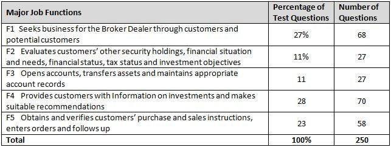

The world of securities and trading has historically been subject to rigorous regulatory standards aimed at safeguarding investors and ensuring equitable market practices. A key player in establishing such standards was the National Association of Securities Dealers (NASD). Before merging with the New York Stock Exchange's regulatory unit to create the Financial Industry Regulatory Authority (FINRA) in 2007, the NASD played a crucial role in overseeing the securities industry in the United States. Part of its mandate involved administering the Series 7 Examination, a pivotal certification for finance professionals. This examination is integral for individuals engaged in trading as it ensures a thorough understanding of the regulatory requirements and operational dynamics of the financial markets.

In parallel, the advent of algorithmic trading, or Algo Trading, has transformed the functioning of financial markets. Leveraging complex algorithms, this form of trading executes transactions at unprecedented speeds and volumes, enhancing market liquidity and operational efficiency. However, this progress brings forward new challenges, particularly in terms of maintaining market stability and adhering to regulatory compliances. Thus, the intersection of the NASD Series 7 Examination and Algo Trading represents a critical focus area in contemporary finance. This article addresses how the Series 7 Examination remains a vital credential, equipping professionals with necessary regulatory insights as they navigate the complexities introduced by Algo Trading.



## Table of Contents

## What Was the National Association of Securities Dealers (NASD)?

The National Association of Securities Dealers (NASD) was established in 1939 as a self-regulatory organization (SRO) responsible for overseeing the securities industry in the United States. Its foundational objective was to create a regulatory framework that would supervise broker-dealers, ultimately ensuring fair and ethical practices within the industry. NASD played a pivotal role in fostering investor protection and market integrity.

One of NASD's key responsibilities included regulating and overseeing the NASDAQ stock market and other over-the-counter (OTC) markets. As an SRO, it facilitated the operation and governance of these markets, setting standards and rules to maintain orderly trading environments and enhancing market transparency and competitiveness.

Another critical function of NASD was the administration of qualification exams for investment professionals, including the Series 7 Examination. This examination was essential for licensing individuals who wished to trade in various securities, ensuring these professionals possessed the requisite knowledge and competence to serve investors and comply with industry regulations.

In 2007, NASD underwent a significant transformation by merging with the regulatory division of the New York Stock Exchange (NYSE), resulting in the creation of the Financial Industry Regulatory Authority (FINRA). This merger aimed to unify the regulatory oversight of securities firms, creating a more streamlined and efficient regulatory body to address the evolving complexities of the financial markets. The establishment of FINRA marked the culmination of NASD's independent operations while continuing its legacy of industry regulation and investor protection.

## Understanding the Series 7 Examination

The Series 7 Examination, formally known as the General Securities Representative Qualification Exam, is a critical certification for individuals wishing to engage in the trading of a broad spectrum of securities. This exam is administered by the Financial Industry Regulatory Authority (FINRA) and is designed to assess the competence and knowledge of candidates to ensure they can operate effectively within the financial markets while adhering to regulatory standards.

Applicants for the Series 7 Examination must demonstrate a comprehensive understanding of various financial and investment concepts. The exam covers a wide array of topics essential for securities professionals. Key areas include investment risk, which involves understanding the potential for investment losses and the various strategies to mitigate such risks. Candidates also need to be versed in taxation, which encompasses knowledge about the tax implications of different securities transactions and investment income.

Equity and debt instruments are another central focus of the exam. Participants must understand the characteristics and differences between these types of financial instruments. This includes knowledge of stocks and their valuation, as well as bonds, their rating, and [interest rate](/wiki/interest-rate-trading-strategies) risks. The exam also evaluates proficiency in portfolio management, which involves strategies for asset allocation, portfolio diversification, and performance analysis to meet specific investment objectives.

Overall, the Series 7 Examination ensures that professionals not only possess theoretical knowledge but also the practical skills necessary to navigate the complex regulatory environment of the financial markets. It establishes a foundational competence that supports ethical trading practices and informed decision-making, crucial aspects for maintaining the integrity and efficiency of the securities industry.

## The Rise of Algorithmic Trading

Algorithmic trading, often referred to as Algo Trading, has transformed modern financial markets by leveraging technological advances. This trading strategy employs sophisticated algorithms to automate and execute trades at incredibly high speeds and volumes. The essence of Algo Trading lies in its ability to process vast amounts of market data and execute orders more efficiently than human traders could. By using pre-defined criteria and complex mathematical models, these algorithms can capitalize on trading opportunities within milliseconds, contributing to enhanced market [liquidity](/wiki/liquidity-risk-premium) and operational efficiency.

However, the rapid evolution and deployment of algorithmic strategies have introduced issues concerning market stability and regulatory oversight. The sheer speed at which trades are executed can exacerbate market [volatility](/wiki/volatility-trading-strategies), potentially leading to events such as flash crashes. These incidents, where prices plummet and recover within a very short time, are often driven by the cascading effects of automated trading programs reacting to market conditions without human intervention.

Professionals engaged in Algo Trading need to be proficient in both market mechanics and the technological frameworks that underpin trading algorithms. A comprehensive understanding of financial instruments, market structures, and trading systems is essential to develop strategies that are not only profitable but also compliant with market regulations. In addition, there is a necessity for technical acumen, including programming skills in languages like Python, to design, test, and implement trading algorithms effectively.

For instance, consider a simplified trading algorithm that identifies profitable trades based on moving averages. The following Python code snippet illustrates a basic approach:

```python
def moving_average_strategy(prices, short_window, long_window):
    signals = []
    for i in range(len(prices)):
        if i >= long_window:
            short_avg = sum(prices[i-short_window:i]) / short_window
            long_avg = sum(prices[i-long_window:i]) / long_window
            if short_avg > long_avg:
                signals.append("Buy")
            else:
                signals.append("Sell")
        else:
            signals.append("Hold")
    return signals

# Example usage
prices = [100, 102, 101, 104, 107, 110, 113, 116, 119, 122]
signals = moving_average_strategy(prices, short_window=3, long_window=5)
print(signals)
```

This script calculates short and long-term moving averages to generate buy or sell signals, demonstrating the straightforward implementation of a basic [algorithmic trading](/wiki/algorithmic-trading) strategy.

As algorithmic trading continues to dominate global markets, it is imperative that traders and regulators alike stay abreast of technological advancements and their implications on market dynamics. Balancing the benefits of enhanced liquidity and efficiency against the risks of increased volatility and market manipulation is crucial to safeguarding the integrity of financial markets.

## NASD Series 7 Examination in the Context of Algo Trading

The Series 7 exam holds its relevance in the modern trading landscape, particularly in the context of algorithmic trading. This examination equips professionals with essential regulatory knowledge, ensuring compliance in the rapidly evolving arena of Algo Trading. As algorithmic trading involves the execution of trades using predefined sets of rules and algorithms, it inherently brings along challenges concerning legality and market manipulation. Understanding these regulatory frameworks, as imparted by the Series 7 certification, is crucial for algorithmic traders to prevent illicit trading practices and ensure adherence to market standards.

In the context of Algo Trading, traders must navigate a landscape characterized by high-speed transactions and complex algorithms, where the risk of executing illegal trades is heightened. With sophisticated trading programs, there is an increased potential for market manipulation if regulatory principles are not strictly followed. Professionals who have passed the Series 7 exam gain a comprehensive understanding of these market regulations, which is essential in managing and mitigating risks associated with algorithmic trading strategies.

Moreover, the Series 7 exam serves as a foundational stepping stone for further education and expertise in algorithmic trading technologies. While the exam itself provides a thorough grounding in regulatory knowledge, traders must also acquire specialized technological skills to fully engage with algorithmic systems. By combining the regulatory insights from the Series 7 with advanced training in technology and algorithms, professionals become adept at navigating the complexities of modern trading environments. This blend of regulatory and technological expertise is vital to staying competitive and compliant in the dynamic field of Algo Trading.

## Challenges and Opportunities

The integration of algorithmic trading into traditional trading roles introduces a dynamic shift, presenting both challenges and opportunities for securities professionals. One significant challenge is the rapid pace of technological advancements, which requires professionals to continuously update their skills to stay competent. This includes understanding new trading algorithms, software developments, and data analytics tools. Failure to keep up with these changes can lead to obsolescence in a highly competitive market.

Alongside technological adaptability, maintaining a robust regulatory knowledge base is crucial. Professionals must navigate an increasingly complex regulatory environment designed to ensure fair trading practices and protect investors. This involves staying informed about current regulations and understanding how they apply to algorithmic trading strategies. Compliance is non-negotiable, as regulatory breaches can result in severe penalties and damage to reputational credibility.

Despite these challenges, algorithmic trading also offers substantial opportunities. The primary advantage is the ability to develop more efficient trading strategies. Algorithms can analyze vast amounts of market data in real-time, identifying trends and executing trades at speeds beyond human capacity. This efficiency can lead to improved market liquidity and reduced transaction costs.

Moreover, algorithmic trading encourages the innovation of trading systems. As firms seek to gain a competitive edge, there is a continuous push for the development of sophisticated algorithms capable of handling diverse market conditions. This innovation is supported by advances in [machine learning](/wiki/machine-learning) and [artificial intelligence](/wiki/ai-artificial-intelligence), which drive the creation of adaptive and predictive trading models.

In summary, while the integration of algorithmic trading poses challenges related to technological and regulatory adherence, it simultaneously provides avenues for pioneering more advanced trading strategies. By embracing these opportunities, securities professionals can contribute to shaping the future landscape of financial markets.

## Conclusion

The National Association of Securities Dealers (NASD) established a foundation for securities regulation that is still essential in today's financial markets. With its merger into the Financial Industry Regulatory Authority (FINRA), the legacy of NASD ensures that both market integrity and investor protection remain focal points. The Series 7 Examination, initially administered by NASD, continues to serve as an indispensable certification for securities professionals amid the dynamic changes in trading practices.

As algorithmic trading gains [momentum](/wiki/momentum), reshaping the contours of market operations by introducing rapid execution and high-frequency trading, it becomes increasingly crucial to balance technological advancements with regulatory adherence. The incorporation of algorithmic strategies necessitates not only technical expertise but also a robust understanding of regulatory frameworks to mitigate risks associated with illegal trades or market manipulation.

For professionals aiming to succeed in this evolving landscape, staying well-informed and duly certified is a strategic imperative. The Series 7 Examination plays a pivotal role in ensuring that individuals possess the requisite knowledge to uphold regulatory standards while adapting to innovations in trading technology. Embracing continuous education and certification such as the Series 7 can effectively equip professionals to navigate the complexities of future securities trading.

## References & Further Reading

[1]: ["Algorithmic Trading: Winning Strategies and Their Rationale"](https://www.wiley.com/en-us/Algorithmic+Trading%3A+Winning+Strategies+and+Their+Rationale-p-9781118460146) by Ernest P. Chan

[2]: ["Flash Boys: A Wall Street Revolt"](https://en.wikipedia.org/wiki/Flash_Boys) by Michael Lewis

[3]: ["The World of Algorithmic Trading"](https://www.investopedia.com/terms/a/algorithmictrading.asp) by Andrew Pole

[4]: ["Regulating the Unseen Algorithms that Run our Lives: Framing, Coding, and Promulgating Formulas for Right Conduct"](https://www.vox.com/technology/2018/10/1/17882340/how-algorithms-control-your-life-hannah-fry) by Frank Pasquale

[5]: ["Algorithmic and High-Frequency Trading"](https://assets.cambridge.org/97811070/91146/frontmatter/9781107091146_frontmatter.pdf) by Álvaro Cartea, Sebastian Jaimungal, and José Penalva

[6]: ["Investing with Volume Analysis: Identify, Follow, and Profit from Trends"](https://books.google.com/books/about/Investing_with_Volume_Analysis.html?id=HZse5NFcDPMC) by Buff Dormeier