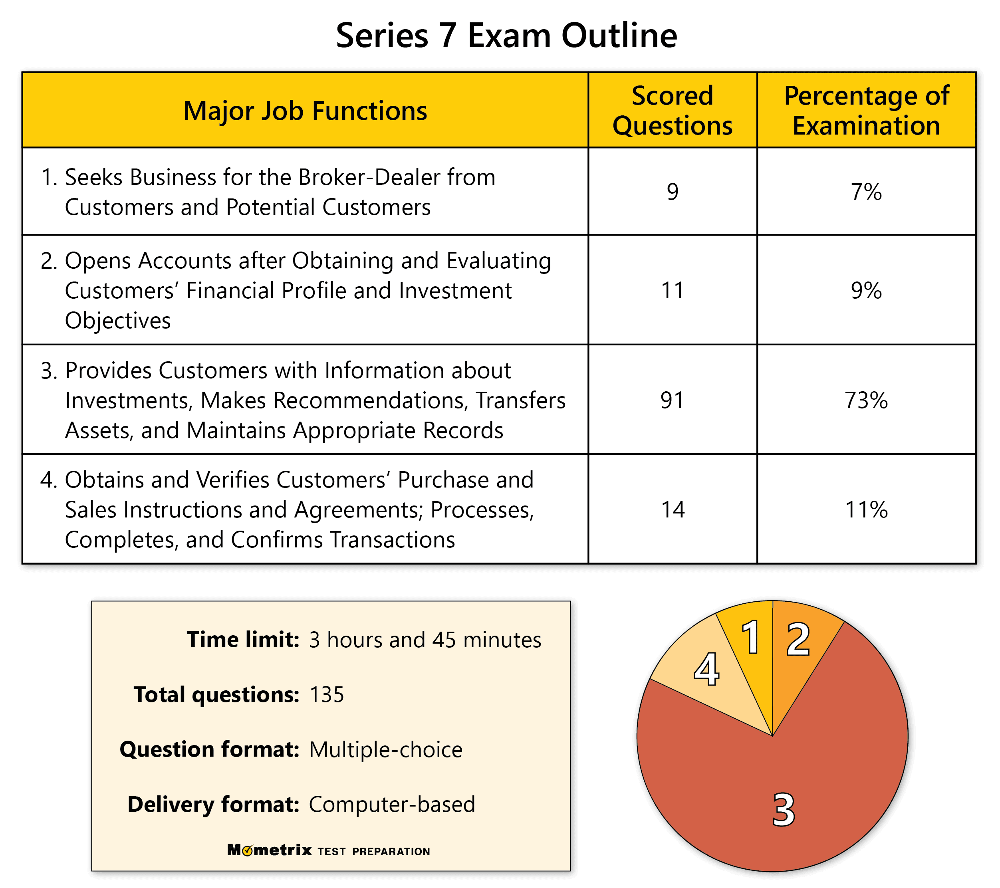

## Table of Contents

## What is the NASD Series 7 examination?

The NASD Series 7 examination is a test that people need to pass if they want to become stockbrokers or sell securities in the United States. It is also known as the General Securities Representative Exam. The exam is created by the Financial Industry Regulatory Authority (FINRA) to make sure that people who want to work in the securities industry know enough about the rules and products they will be dealing with.

The Series 7 exam covers a lot of topics, like how to buy and sell stocks, bonds, and other investment products. It also includes information about the rules and regulations that brokers need to follow. The exam is hard and takes about six hours to finish. People who want to take the exam usually study for a long time to make sure they understand everything they need to know.

## Who needs to take the Series 7 exam?

People who want to work as stockbrokers or sell securities in the United States need to take the Series 7 exam. This includes people who want to work at a brokerage firm or any financial institution that deals with buying and selling investment products like stocks and bonds.

The exam is required by the Financial Industry Regulatory Authority (FINRA), which is the organization that makes sure people in the securities industry follow the rules. Passing the Series 7 exam shows that someone knows enough about the products they will be selling and the rules they need to follow. This helps protect investors and keeps the financial markets fair and honest.

## What are the eligibility requirements for the Series 7 exam?

To take the Series 7 exam, you need to be sponsored by a FINRA member firm. This means a company that is registered with FINRA and deals with securities needs to support your application. The firm will usually hire you as an employee or an associated person before you can take the exam. This is because FINRA wants to make sure that only people who are working in the securities industry take the exam.

Besides being sponsored, there are no other big requirements to take the Series 7 exam. You don't need a certain level of education or work experience. But, it's a good idea to study a lot before taking the exam because it's hard and covers a lot of topics. Many people take special classes or use study guides to get ready for the Series 7 exam.

## How can someone prepare for the Series 7 exam?

Preparing for the Series 7 exam takes a lot of time and effort because it covers many topics about securities and the rules that brokers need to follow. One good way to get ready is by using study guides and practice exams. These can help you learn the material and get used to the kinds of questions you will see on the actual exam. There are many [books](/wiki/algo-trading-books) and online resources that can help you study, so it's a good idea to choose ones that fit how you like to learn.

Another helpful way to prepare is by taking a class or [course](/wiki/best-algorithmic-trading-courses) specifically for the Series 7 exam. Many companies offer these classes, which can be in-person or online. These classes are taught by people who know a lot about the exam and can help explain the hard parts. They also often include practice tests and quizzes, which can show you where you need to study more. Joining a study group with other people who are also preparing for the exam can also be useful because you can help each other learn and understand the material better.

Remember, the key to passing the Series 7 exam is to start studying early and keep a steady pace. It's not just about memorizing facts, but also understanding how things work in the securities industry. Taking breaks and not trying to learn everything at once can help you remember more and feel less stressed. With the right preparation and dedication, you can do well on the Series 7 exam and start your career in the securities industry.

## What topics are covered in the Series 7 exam?

The Series 7 exam covers a wide range of topics that are important for people who want to work in the securities industry. It includes information about different types of investment products like stocks, bonds, and mutual funds. The exam also teaches about how to buy and sell these products, which is called trading. It covers the rules and regulations that brokers need to follow, which helps keep the market fair and protect investors. There are also sections about how to analyze the economy and how different economic factors can affect investments.

Another part of the Series 7 exam is about how to manage customer accounts and provide good service to clients. This includes understanding what clients need and making sure their investments match their goals. The exam also talks about different kinds of retirement plans and how to help clients plan for their future. There are questions about taxes and how they can affect investments, too. Overall, the Series 7 exam is designed to make sure that people who pass it know enough to work responsibly and effectively in the securities industry.

## What is the format and structure of the Series 7 exam?

The Series 7 exam is a long test that takes about six hours to finish. It is split into two parts, with a break in the middle. The first part is 125 questions and you have two hours and 30 minutes to answer them. After a short break, you start the second part, which is also 125 questions and takes another two hours and 30 minutes. All the questions are multiple choice, which means you pick the right answer from a list of choices.

The exam is given on a computer at special testing centers. You need to sign up for a time to take the test, and you can't bring anything with you into the testing room except for a simple calculator that the testing center gives you. The questions on the exam are about different topics like stocks, bonds, and rules for brokers. You need to answer at least 72% of the questions correctly to pass, which means you need to get at least 180 out of 250 questions right.

## How long does it take to complete the Series 7 exam?

The Series 7 exam takes about six hours to complete. It is split into two parts, each with 125 questions. You get two hours and 30 minutes for each part. There is a short break between the two parts, so you can rest a little before starting the second half of the exam.

All the questions on the Series 7 exam are multiple choice. This means you pick the right answer from a list of choices. You need to answer at least 72% of the questions correctly to pass, which means getting at least 180 out of 250 questions right. The exam is given on a computer at special testing centers, and you can't bring anything with you except for a simple calculator that the testing center provides.

## What is the passing score for the Series 7 exam?

To pass the Series 7 exam, you need to get at least 72% of the questions right. This means you need to answer at least 180 out of the 250 questions correctly. The exam is hard, so it's important to study a lot and understand the topics well.

The Series 7 exam is split into two parts, with 125 questions in each part. You get two hours and 30 minutes for each part, and there's a short break in between. All the questions are multiple choice, so you pick the right answer from a list of choices.

## How often can the Series 7 exam be retaken if not passed?

If you don't pass the Series 7 exam, you can take it again. You have to wait at least 30 days before you can try again. This waiting time gives you a chance to study more and get better prepared.

There's no limit to how many times you can retake the Series 7 exam. But, you need to keep paying the exam fee each time you take it. It's a good idea to use the time between attempts to study hard and learn from your mistakes so you can pass the next time.

## What are the costs associated with taking the Series 7 exam?

The cost to take the Series 7 exam is $245. This fee is set by FINRA, the organization that makes the exam. You have to pay this fee every time you take the exam, even if you don't pass and need to try again.

Besides the exam fee, there might be other costs to think about. If you take a class or use study materials to get ready for the exam, those can cost money too. Classes and study guides can range from a few hundred to over a thousand dollars, depending on what you choose. It's a good idea to plan for these extra costs when you're getting ready to take the Series 7 exam.

## How does passing the Series 7 exam benefit a financial professional's career?

Passing the Series 7 exam can really help a financial professional's career. It shows that you know a lot about stocks, bonds, and other investments, and that you understand the rules that brokers need to follow. This makes you more valuable to the companies you work for because they know you can do your job well and help their clients make good investment choices. It also opens up more job opportunities because many firms require their employees to have a Series 7 license.

Having a Series 7 license can also help you earn more money. When you show that you are good at your job and have the right qualifications, you can often get paid more. Plus, it can lead to better job titles and more responsibility at work. This means you can move up in your career and take on bigger roles, which can be very rewarding. Overall, passing the Series 7 exam is a big step forward in building a successful career in the financial industry.

## What advanced strategies can be used to excel in the Series 7 exam?

To excel in the Series 7 exam, one effective strategy is to create a detailed study plan that breaks down the material into manageable chunks. Start by identifying the key topics covered in the exam, such as stocks, bonds, mutual funds, and regulations. Allocate specific times each day to focus on different subjects, ensuring you cover all areas thoroughly. Using a variety of study resources, like textbooks, online courses, and practice exams, can help reinforce your understanding. It's also helpful to join a study group where you can discuss difficult concepts and quiz each other, which can make learning more interactive and less boring.

Another advanced strategy is to practice active recall and spaced repetition. Instead of just reading through the material, test yourself regularly on what you've learned. Flashcards can be a great tool for this, as they help you remember important facts and definitions. Spaced repetition involves reviewing the material at increasing intervals, which helps move information from short-term to long-term memory. This method can be particularly useful for remembering the many rules and regulations covered in the exam. By combining these strategies, you can build a strong foundation of knowledge and increase your chances of passing the Series 7 exam with a high score.

## References & Further Reading

[1]: ["Algorithmic Trading: Winning Strategies and Their Rationale"](https://www.wiley.com/en-us/Algorithmic+Trading%3A+Winning+Strategies+and+Their+Rationale-p-9781118460146) by Ernest P. Chan

[2]: ["Flash Boys: A Wall Street Revolt"](https://en.wikipedia.org/wiki/Flash_Boys) by Michael Lewis

[3]: ["The World of Algorithmic Trading"](https://www.investopedia.com/terms/a/algorithmictrading.asp) by Andrew Pole

[4]: ["Regulating the Unseen Algorithms that Run our Lives: Framing, Coding, and Promulgating Formulas for Right Conduct"](https://www.vox.com/technology/2018/10/1/17882340/how-algorithms-control-your-life-hannah-fry) by Frank Pasquale

[5]: ["Algorithmic and High-Frequency Trading"](https://assets.cambridge.org/97811070/91146/frontmatter/9781107091146_frontmatter.pdf) by Álvaro Cartea, Sebastian Jaimungal, and José Penalva

[6]: ["Investing with Volume Analysis: Identify, Follow, and Profit from Trends"](https://books.google.com/books/about/Investing_with_Volume_Analysis.html?id=HZse5NFcDPMC) by Buff Dormeier