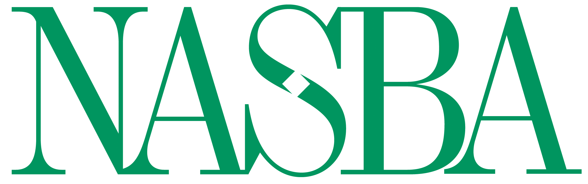

## Table of Contents

## What is the National Association of State Boards of Accountancy (NASBA)?

The National Association of State Boards of Accountancy (NASBA) is an organization that helps state boards of accountancy in the United States. It was created to make sure that accountants follow the rules and to help them do their jobs well. NASBA works with these state boards to set standards and make sure that accountants are qualified and ethical.

NASBA also helps with the Uniform CPA Examination, which is a test that people need to pass to become certified public accountants (CPAs). They make sure the test is fair and up-to-date. Besides this, NASBA provides education and resources to help accountants keep learning and improving their skills. This helps to keep the accounting profession strong and trustworthy.

## When was NASBA founded?

NASBA was founded in 1908. It started because people wanted to make sure that accountants were doing their jobs correctly and honestly.

Since then, NASBA has been helping state boards of accountancy across the United States. They work together to set rules and make sure that accountants are well-trained and follow ethical standards.

## What is the primary purpose of NASBA?

The main goal of NASBA is to help state boards of accountancy make sure that accountants are doing their jobs the right way. They want to make sure that accountants follow the rules and are honest in their work. NASBA works with these state boards to set standards and check that accountants are qualified and ethical.

NASBA also helps with the Uniform CPA Examination, which is a test that people need to pass to become certified public accountants (CPAs). They make sure the test is fair and up-to-date. Besides this, NASBA provides education and resources to help accountants keep learning and improving their skills. This helps to keep the accounting profession strong and trustworthy.

## How does NASBA support state boards of accountancy?

NASBA helps state boards of accountancy by working with them to make sure accountants follow the rules and do their jobs well. They help set standards and make sure that accountants are qualified and ethical. NASBA also gives state boards tools and information they need to do their work better.

NASBA is also in charge of the Uniform CPA Examination. This is a test that people need to pass to become certified public accountants (CPAs). NASBA makes sure the test is fair and up-to-date. They help state boards use this test to check if people are ready to be CPAs.

Besides the exam, NASBA provides education and resources to help accountants keep learning and improving their skills. This helps make sure the accounting profession stays strong and trustworthy. By supporting state boards in these ways, NASBA helps keep the accounting world running smoothly and honestly.

## What are the key services provided by NASBA to the accounting profession?

NASBA helps the accounting profession by working with state boards to make sure accountants follow the rules and do their jobs well. They help set standards and check that accountants are qualified and ethical. NASBA also gives state boards the tools and information they need to do their work better. This helps make sure that accountants are doing their jobs the right way and that the public can trust them.

NASBA is also in charge of the Uniform CPA Examination. This is a test that people need to pass to become certified public accountants (CPAs). NASBA makes sure the test is fair and up-to-date. They help state boards use this test to check if people are ready to be CPAs. By doing this, NASBA helps make sure that only qualified people become CPAs.

Besides the exam, NASBA provides education and resources to help accountants keep learning and improving their skills. This helps make sure the accounting profession stays strong and trustworthy. By supporting state boards and providing these services, NASBA helps keep the accounting world running smoothly and honestly.

## How does NASBA facilitate the Uniform CPA Examination?

NASBA helps with the Uniform CPA Examination by making sure it is fair and up-to-date. They work with state boards to manage the test. This means they make sure everyone who wants to become a certified public accountant (CPA) has a chance to take the exam and that it tests the right skills.

NASBA also helps state boards use the exam to check if people are ready to be CPAs. They give state boards the tools and information they need to make sure the exam is run smoothly. By doing this, NASBA helps make sure that only qualified people become CPAs, which keeps the accounting profession strong and trustworthy.

## What role does NASBA play in continuing professional education for accountants?

NASBA helps accountants keep learning and getting better at their jobs through continuing professional education. They offer courses and resources that help accountants stay up-to-date with the latest rules and skills they need. This is important because it makes sure that accountants are always ready to do their work well and follow the latest standards.

By providing these educational opportunities, NASBA helps make sure that the accounting profession stays strong and trustworthy. Accountants can take these courses to earn credits they need to keep their licenses. This way, NASBA helps accountants keep their skills sharp and continue to serve the public honestly and effectively.

## How does NASBA contribute to international accounting standards and mobility?

NASBA helps with international accounting standards by working with groups from other countries. They want to make sure that accountants everywhere follow similar rules. This makes it easier for accountants to work in different countries because they all understand the same standards. NASBA talks with these groups to share ideas and make the rules better for everyone.

NASBA also helps with something called international mobility. This means they work to make it easier for accountants to move and work in different countries. They do this by helping set up agreements between countries. These agreements make it simpler for accountants to get the right to work in a new place without having to start all over again with their qualifications. By doing this, NASBA helps accountants have more job opportunities around the world.

## What are the governance structures of NASBA?

NASBA is run by a group of people called the Board of Directors. This group is made up of people from different state boards of accountancy. They meet to make decisions about what NASBA should do and how it should help the accounting profession. The Board of Directors makes sure NASBA is doing its job well and following its rules.

NASBA also has committees and task forces. These are smaller groups of people who work on special projects or issues. They help the Board of Directors by giving them advice and ideas. Committees and task forces focus on things like the CPA exam, education, and international standards. They help NASBA do its work better and keep the accounting profession strong and trustworthy.

## How does NASBA engage with regulatory bodies and influence accounting policy?

NASBA works closely with regulatory bodies to help shape accounting policies. They talk to groups like the American Institute of Certified Public Accountants (AICPA) and the Public Company Accounting Oversight Board (PCAOB). By working with these groups, NASBA helps make rules that keep the accounting profession honest and strong. They share ideas and information to make sure the rules are fair and up-to-date.

NASBA also gives advice to lawmakers and government agencies. They tell them about what is happening in the accounting world and suggest new rules or changes to old ones. By doing this, NASBA helps make sure that the laws help accountants do their jobs well and protect the public. This way, NASBA plays a big role in making sure accounting policies are good for everyone.

## What are some of the major initiatives or programs launched by NASBA in recent years?

In recent years, NASBA has launched several important initiatives to help the accounting profession. One of them is the CPA Evolution project. This project aims to update the Uniform CPA Examination to make sure it matches the skills accountants need today. They are working to make the exam more relevant and useful for new accountants. By doing this, NASBA wants to make sure that CPAs are well-prepared to handle the challenges of modern accounting.

Another major initiative is the Center for the Public Trust (CPT). This program focuses on teaching young people about ethics and integrity in business. NASBA believes that starting early can help build a future where business leaders are honest and responsible. The CPT offers resources and programs to schools and colleges to help students learn about these important values. This way, NASBA is helping to create a new generation of ethical professionals in the accounting world.

## How can an individual or organization become a member of NASBA?

To become a member of NASBA, an individual needs to be part of a state board of accountancy. This means you have to be a member of one of the state boards that NASBA works with. These boards are made up of people who help make sure accountants in their state are following the rules and doing their jobs well. If you are on a state board, you can join NASBA and work with them to help improve the accounting profession.

Organizations can't become members of NASBA in the same way individuals do. Instead, NASBA works with different groups and organizations to help with their goals. For example, they work with schools, other professional groups, and government agencies. These organizations can partner with NASBA on projects or programs that help accountants and the accounting profession. By working together, they can make a bigger impact and help more people.

## References & Further Reading

[1]: ["Clashing with Regulators: Algorithmic Trading amid Market Unrest"](https://eflowglobal.com/regulatory-responses-to-algorithmic-trading/) - Journal of Finance Research, 2020.

[2]: Lopez de Prado, M. (2018). ["Advances in Financial Machine Learning."](https://www.amazon.com/Advances-Financial-Machine-Learning-Marcos/dp/1119482089) John Wiley & Sons.

[3]: Aronson, D. (2007). ["Evidence-Based Technical Analysis: Applying the Scientific Method and Statistical Inference to Trading Signals."](https://www.amazon.com/Evidence-Based-Technical-Analysis-Scientific-Statistical/dp/0470008741) Wiley.

[4]: Jansen, S. (2020). ["Machine Learning for Algorithmic Trading: Predictive Models to Extract Signals from Market and Alternative Data for Systematic Trading Strategies."](https://www.amazon.com/Machine-Learning-Algorithmic-Trading-alternative/dp/1839217715) Packt Publishing.

[5]: Chan, E. P. (2008). ["Quantitative Trading: How to Build Your Own Algorithmic Trading Business."](https://github.com/ftvision/quant_trading_echan_book) Wiley Trading.

[6]: Easley, D., & O'Hara, M. (2010). ["Microstructure and Practice: Improving Trading Algorithms."](https://papers.ssrn.com/sol3/papers.cfm?abstract_id=1695041) The Review of Financial Studies. 

[7]: NASBA. (n.d.). ["What is NASBA?"](https://en.wikipedia.org/wiki/National_Association_of_State_Boards_of_Accountancy) National Association of State Boards of Accountancy.