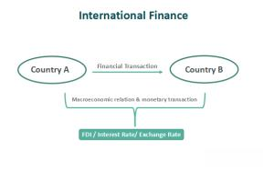

The financial landscape is undergoing significant transformation driven by technological advancements, with algorithmic trading playing a pivotal role in this evolution. Algorithmic trading involves deploying complex algorithms to make informed trading decisions in financial markets, thereby optimizing trade execution in ways that surpass human capabilities. These algorithms are capable of processing vast amounts of data at speeds unattainable by human traders, which translates into substantial gains in both efficiency and accuracy.

A vital institution influencing the development and application of algorithmic trading models is the National Bureau of Economic Research (NBER). Established in 1920, NBER has been at the forefront of economic research and has contributed extensively to the understanding of economic phenomena. The insights and analytical frameworks provided by NBER's research are invaluable in informing both public and private sector decision-making, including the design of advanced trading strategies.



The relationship between economic research conducted by NBER and strategies employed in algorithmic trading is dynamic. The institution's research lays the conceptual groundwork necessary for designing robust trading algorithms by offering insights into market efficiency, pricing dynamics, and financial regulations. As a result, the collaboration between economists and technology specialists becomes essential, enabling the practical application of economic research insights to create efficient and effective algorithmic trading models.

## Table of Contents

## Understanding Algorithmic Trading

Algorithmic trading employs advanced computer algorithms to scrutinize market data and execute trades based on pre-determined parameters. This trading approach leverages computational power to process immense quantities of data rapidly, achieving efficiencies and precision beyond the reach of human traders. By automating trade execution, algorithmic trading reduces the latency between market movement and trade response, a critical advantage in fast-paced environments.

The power of algorithmic trading lies in its ability to operate at speeds significantly faster than human capabilities. For instance, algorithms can be programmed to respond to microsecond-level price changes, analyzing information across numerous markets simultaneously and executing trades accordingly. This not only minimizes opportunities for human error but also allows for the exploitation of fleeting market inefficiencies that a human trader might miss.

A significant development in the field is the integration of artificial intelligence (AI) and machine learning technologies, which further enhance the functionality and flexibility of trading systems. These technologies enable systems to adapt dynamically to changing market conditions by learning from historical data and improving future predictions and strategies. Machine learning models, such as neural networks or decision trees, can be trained to recognize complex patterns and correlations within market data, providing deeper insights and more refined trading signals.

Consider a simple moving average crossover strategy, a foundational [algorithmic trading](/wiki/algorithmic-trading) strategy, wherein a buy signal might be generated when a short-term moving average exceeds a long-term moving average:

```python
def moving_average(data, window):
    return data.rolling(window=window).mean()

short_window = 40
long_window = 100

signals = pd.DataFrame(index=data.index)
signals['short_mavg'] = moving_average(data['price'], short_window)
signals['long_mavg'] = moving_average(data['price'], long_window)

signals['signal'] = np.where(signals['short_mavg'] > signals['long_mavg'], 1.0, 0.0)
signals['positions'] = signals['signal'].diff()
```

This Python snippet illustrates the basic structure of a crossover strategy using moving averages to generate trading signals. Such algorithmic strategies can be expanded and refined using AI and [machine learning](/wiki/machine-learning) to incorporate vast datasets, including historical price data, news sentiment analysis, and macroeconomic indicators, to develop more robust and adaptive trading algorithms.

In conclusion, algorithmic trading represents a transformative shift in the financial markets, driven by technological advancements in data processing and machine learning. Its ability to efficiently process and act on large data volumes enables it to outperform traditional trading methods, providing a powerful tool for traders in modern financial markets.

## The Role of NBER in Economic Research

The National Bureau of Economic Research (NBER) has established itself as a leading authority in economic research since its founding in 1920. With a mission to conduct and disseminate rigorous economic research among policymakers, business professionals, and the academic community, NBER plays a vital role in shaping public and private sector decision-making processes. Its research spans numerous areas including macroeconomic fluctuations, monetary policy, and labor market dynamics, all of which have profound implications for financial markets and trading strategies.

NBER's high-quality research outputs are utilized to inform decisions that impact economic policy and business strategy. Through a series of working papers, conferences, and publications, NBER researchers provide insights into complex economic phenomena, offering data-driven analysis that enhances the understanding of market behaviors. The data produced by NBER serves to guide economists and other stakeholders in interpreting economic conditions and potential trends.

In terms of supporting trading strategy development, NBER's research evaluates how macroeconomic dynamics influence market behaviors, offering valuable insights for algorithmic trading systems. By analyzing macroeconomic indicators such as GDP growth, unemployment rates, and inflation trends, NBER's work assists in identifying the economic context within which trades occur. This information aids in the design of trading algorithms that can withstand various economic scenarios, enhance market predictions, and optimize trade execution.

The NBER’s role is also pivotal in understanding the historical context of market regulations and policy shifts, which are crucial for algorithmic trading. For instance, NBER research on the impacts of fiscal and monetary policy changes helps trading systems anticipate market responses to regulatory adjustments, ensuring that trading strategies are aligned with current and future economic environments.

In summary, NBER stands at the forefront of economic research, providing pivotal insights that inform and shape trading strategies. By analyzing large-scale economic dynamics and understanding intricate market behaviors, NBER contributes significantly to the development of sophisticated trading algorithms capable of navigating the complexities of modern financial markets.

## Connecting NBER Research with Algo Trading

NBER's research significantly contributes to the development of algorithmic trading strategies by offering critical insights into market efficiency, pricing dynamics, and financial regulations. These insights form a vital framework for traders and firms designing robust algorithms capable of navigating complex financial markets.

Market efficiency, as a concept explored in various NBER studies, informs trading algorithms concerning how quickly and accurately information is reflected in asset prices. Efficient Market Hypothesis (EMH) posits that prices reflect all available information, suggesting that algorithmic trading must exploit short-lived informational inefficiencies to generate profits. Trading strategies based on these principles often involve high-frequency trading, where algorithms are designed to capitalize on transient market inefficiencies before they are arbitraged away.

Pricing dynamics and the study of asset price movements under different economic conditions are another area where NBER’s research provides valuable input. By analyzing historical data and identifying patterns, these studies help traders develop predictive models that anticipate future price movements. For example, mean-reversion strategies often rely on the premise established by NBER research that asset prices tend to revert to a historical mean over time.

Economic research also sheds light on financial regulations, a critical [factor](/wiki/factor-investing) for algorithmic trading systems. Regulations can impact trading strategies by imposing restrictions on trading behaviors or requiring transparency in trade execution. Insights from NBER studies help traders understand these regulatory impacts and adjust their algorithms accordingly to maintain compliance while optimizing performance.

Collaborations between economists and tech specialists further enable the integration of these insights into practical applications. By utilizing advanced computational techniques, such as machine learning and [artificial intelligence](/wiki/ai-artificial-intelligence), these interdisciplinary teams can transform complex economic theories into operational algorithmic trading systems. For instance, machine learning algorithms can be trained on economic indicators sourced from NBER publications, enabling them to adaptively refine trading strategies in response to changing market conditions.

The synergy between economic research and technological development is exemplified in the practical application of economic principles to real-time trading scenarios. By leveraging NBER's contributions, algorithmic trading not only benefits from enhanced predictive accuracy and operational efficiency but also aligns with regulatory expectations, thus ensuring both profitable and sustainable trading operations.

## Case Study: AI-Powered Trading and Economic Research

A study conducted by Winston Wei Dou, Itay Goldstein, and Yan Ji investigates into the dynamics of AI-driven algorithmic collusion and its implications on market power. The research provides a practical application of the National Bureau of Economic Research's (NBER) findings to address modern challenges in trading systems. By leveraging AI technology, the study illustrates how algorithms may autonomously develop collusive strategies without explicit communication, thereby influencing market competition and power dynamics.

The investigation explores the conceptual framework within which AI algorithms operate, showing that machine learning models, particularly [reinforcement learning](/wiki/reinforcement-learning), can inadvertently learn to cooperate with other algorithms, leading to forms of implicit collusion. This phenomenon raises concerns similar to traditional economic models of collusion, where firms might implicitly coordinate to sustain higher prices.

One of the key insights from the study is how AI-powered algorithms adjust their strategies based on observed market behavior. The authors provide empirical evidence that these algorithms, when placed in competitive environments, might opt for sub-optimal competitive strategies if such strategies yield collective benefits over time. The complexity of these decision-making processes is encapsulated by the study’s use of advanced modeling and simulation techniques, which mimic realistic market conditions and interactions.

A mathematical foundation often employed in these studies includes game theory and specifically the Nash Equilibrium framework, which describes a situation where no participant can gain by a unilateral change of strategy if the strategies of others remain unchanged. However, in the context of AI-driven algorithms, the equilibrium can shift dynamically as algorithms learn and adapt through machine learning techniques.

Furthermore, the implications of these findings challenge existing regulatory frameworks by highlighting potential loopholes where AI technology might outpace traditional monitoring and compliance methods. Therefore, the research underscores the importance of integrating NBER's economic insights with technological innovation to develop robust regulatory measures that can effectively oversee AI-driven markets.

Ultimately, this study showcases the critical role of economic research in informing and guiding technological advancements in trading. It emphasizes the necessity for continuous collaboration between economists and technologists to ensure that AI algorithms contribute positively to market efficiency and fairness, aligning with the broader objectives outlined by institutions like the NBER.

## Implications for Future Trading Strategies

Future trading strategies will increasingly rely on advanced AI technologies to enhance market predictions and improve risk assessments. One of the key drivers of this trend is the ability of AI to analyze vast datasets in real time, identifying patterns and correlations that might elude human analysts. Machine learning algorithms, for example, can be trained on historical market data to predict future price movements or detect anomalies that indicate potential risks. These models, leveraging techniques such as supervised learning, unsupervised learning, and reinforcement learning, provide traders with a sophisticated toolkit for decision-making under uncertainty.

Regulatory and ethical considerations will become crucial as AI technologies continue to shape trading practices. The rapid evolution of AI systems can introduce new risks, such as unintended algorithmic biases or market manipulation facilitated by AI-driven strategies. Therefore, regulatory bodies need to establish frameworks that ensure transparency, accountability, and fairness in automated trading environments. Ethical considerations also require attention, particularly concerning the potential for AI systems to disproportionately impact certain market participants or exacerbate financial inequalities.

The National Bureau of Economic Research (NBER) and similar institutions will play a vital role in this evolving landscape by continuing to conduct essential research. Their studies can inform both technological innovation and policy development, ensuring that advancements in AI and algorithmic trading do not compromise market stability and integrity. For instance, by analyzing macroeconomic indicators and financial regulations, NBER can help design algorithms that are not only efficient but also aligned with broader economic objectives.

In summary, the future of trading strategies will be shaped by integrating advanced AI technologies, guided by robust regulatory frameworks and ethical considerations. Ongoing research from organizations like NBER is essential to strike a balance between innovation and market integrity, ultimately supporting stable and fair financial systems.

## Conclusion

The synergy between economic research and technological advancements in algorithmic trading represents a significant evolution in enhancing financial market efficiency. This dynamic collaboration ensures that trading algorithms are not only sophisticated but also grounded in sound economic principles. 

The National Bureau of Economic Research (NBER) plays a pivotal role in this process, offering substantial contributions that form the basis for developing effective trading algorithms. By providing insights into macroeconomic dynamics, market behaviors, and financial regulations, the NBER's research creates robust frameworks for algorithmic strategies. These frameworks ensure that trading systems adapt to changing economic conditions and maintain a high level of precision and reliability.

Looking forward, the trajectory of algorithmic trading will closely intertwine with continuous technological innovations and steadfast economic research. Advanced AI technologies will likely drive future algorithms, enhancing their predictive capabilities and risk assessment functions. However, as these systems become increasingly sophisticated, ensuring market stability and fairness will be paramount. Regulatory frameworks and ethical considerations will be crucial in navigating the challenges posed by artificial intelligence advancements in financial markets.

In sum, the continued collaboration between economic research institutions like the NBER and technological advancements provides a path for balanced and sustainable growth in algorithmic trading. This synergy ensures that while technologies evolve, they remain equipped to uphold market integrity and contribute positively to the financial ecosystem.

## References & Further Reading

1. **Hasbrouck, J. (2007). "Empirical Market Microstructure: The Institutions, Economics, and Econometrics of Securities Trading."** This book provides a comprehensive overview of the microstructure of financial markets, detailing the theoretical underpinnings and practical applications of algorithmic trading. It includes discussions on market efficiency and strategies derived from quantitative modeling.

2. **Almgren, R., & Chriss, N. (2000). "Optimal Execution of Portfolio Transactions." Journal of Risk, 3(2), 5-39.** This paper introduces a mathematical framework for optimal execution strategies, presenting valuable methodologies applicable to algorithmic trading systems to minimize transaction costs and market impact.

3. **Lo, A. W. (2004). "The Adaptive Markets Hypothesis: Market Efficiency from an Evolutionary Perspective." Journal of Portfolio Management, 30(5), 15-29.** Andrew Lo's hypothesis challenges traditional views of market efficiency and introduces an evolutionary perspective that informs the development of adaptive trading algorithms.

4. **Chan, E. (2017). "Machine Learning for Algorithmic Trading."** This book explores the integration of machine learning techniques into algorithmic trading, providing a practical guide for using predictive models to enhance trading strategies.

5. **NBER Working Papers Series.** A collection of working papers published by the National Bureau of Economic Research covering diverse topics in economics, many of which provide insights into market dynamics and the influences of macroeconomic factors on financial markets. These papers serve as a foundation for developing algorithmic trading models based on economic research [NBER](https://www.nber.org).

6. **Bouchaud, J.-P., Farmer, J. D., & Lillo, F. (2009). "How Markets Slowly Digest Changes in Supply and Demand." In Handbook of Financial Markets: Dynamics and Evolution.** This study analyzes the dynamics of supply and demand, offering insights into price impact models important for understanding market behavior and algorithmic trading.

7. **Narang, R. K. (2009). "Inside the Black Box: The Simple Truth About Quantitative Trading."** This book demystifies quantitative and algorithmic trading, explaining the various strategies and their underlying mechanics, making it a valuable resource for anyone interested in financial machine learning.

8. **Goodfellow, I., Bengio, Y., & Courville, A. (2016). "Deep Learning." MIT Press.** This comprehensive textbook provides foundational knowledge on deep learning, a critical technology that informs modern algo-trading strategies by enabling sophisticated pattern recognition and real-time decision-making in markets.