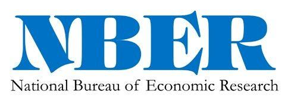

## Table of Contents

## What is the National Bureau of Economic Research (NBER)?

The National Bureau of Economic Research (NBER) is a private, non-profit organization in the United States. It was founded in 1920 to study and understand the American economy. The NBER conducts research on various economic topics, like how the economy grows, how people behave in markets, and how government policies affect the economy. It does not make policy but provides data and analysis that can help policymakers, businesses, and the public make informed decisions.

One of the most well-known things the NBER does is to decide when the U.S. economy is in a recession or not. A group of economists at the NBER looks at a lot of data, like how much people are working, how many goods are being made, and how much people are spending. When they see that the economy has been shrinking for a while, they say that a recession has started. This can be important because it helps everyone understand the health of the economy.

## When was the NBER founded and by whom?

The National Bureau of Economic Research, or NBER, was founded in 1920. It was started by a group of people who wanted to learn more about the economy of the United States. One of the main people who helped start the NBER was a man named Malcolm C. Rorty. He worked with others to set up the organization.

The NBER was created to be a place where people could do research on the economy without being influenced by the government or businesses. They wanted to find out how the economy works and share that information with everyone. Since it was founded, the NBER has been a key place for economic research in the United States.

## What are the primary functions of the NBER?

The National Bureau of Economic Research, or NBER, does important work to help us understand the economy. They study many things about the economy, like how it grows, how people spend money, and how businesses work. They also look at how the government's rules can change the economy. The NBER does not make rules or laws. Instead, they do research and share what they find with everyone. This helps people who make decisions, like government leaders and business owners, to make better choices.

One big thing the NBER does is to say when the U.S. economy is in a recession. A recession is when the economy is not doing well for a while. The NBER has a group of smart people who look at a lot of information, like how many people are working and how much stuff is being made. If they see the economy is getting smaller, they tell everyone that a recession has started. This is important because it helps everyone know how the economy is doing and what might happen next.

## How does the NBER determine the dates of recessions and expansions in the U.S. economy?

The National Bureau of Economic Research, or NBER, has a special group called the Business Cycle Dating Committee. This group looks at a lot of information to decide when the U.S. economy is in a recession or when it is growing. They don't just look at one thing. Instead, they check many things like how many people are working, how much stuff is being made, how much people are spending, and how well businesses are doing. They want to see if the economy is getting smaller for a while, usually a few months, before they say a recession has started.

When the NBER's committee sees that the economy has been shrinking, they say a recession has begun. They look back at the data and pick the exact month when the downturn started. Once they see the economy start to grow again, they say the recession is over and pick the month when the recovery began. This way, they can tell everyone the start and end dates of a recession. It helps people understand the economy better and know when things are getting better or worse.

## What role does the NBER play in economic research?

The National Bureau of Economic Research, or NBER, is a big help in understanding the economy. They do a lot of research on different parts of the economy, like how it grows, how people spend money, and how businesses work. They also look at how the government's rules can change the economy. The NBER does not make rules or laws. Instead, they do research and share what they find with everyone. This helps people who make decisions, like government leaders and business owners, to make better choices.

One important thing the NBER does is to say when the U.S. economy is in a recession. A recession is when the economy is not doing well for a while. The NBER has a group of smart people who look at a lot of information, like how many people are working and how much stuff is being made. If they see the economy is getting smaller, they tell everyone that a recession has started. This is important because it helps everyone know how the economy is doing and what might happen next.

## How is the NBER funded and what is its organizational structure?

The National Bureau of Economic Research, or NBER, gets its money from different places. It is a non-profit group, so it does not make money to keep itself going. Instead, it gets money from grants, which are like gifts from the government or other groups that want to help with research. It also gets money from people and businesses that want to support its work. This way, the NBER can keep doing its research without being told what to do by any one group.

The NBER is set up in a way that helps it do its research well. It has a board of directors, which is a group of people who make big decisions for the organization. They help decide what the NBER should study and how it should spend its money. The NBER also has many research groups, each focusing on different parts of the economy. These groups are led by experts who know a lot about their topics. This structure helps the NBER do good research and share it with everyone.

## What are some key research programs conducted by the NBER?

The National Bureau of Economic Research, or NBER, runs many important research programs. One of these is the Program on Children, which looks at how kids grow up and what helps them do well in life. They study things like how much money families have, how good schools are, and how health care affects children. Another program is the Program on Health Economics, which focuses on how the health care system works and how it can be made better. They look at how much health care costs, how people use it, and how new rules can change things.

The NBER also has a Program on Economic Fluctuations and Growth, which tries to understand why the economy grows or shrinks. They study things like how much people are working, how much stuff is being made, and what the government does to help the economy. Another important program is the Program on Public Economics, which looks at how taxes and government spending affect the economy. They want to find out how these things can be used to make life better for everyone.

Lastly, the NBER runs the Program on Labor Studies, which focuses on jobs and how people work. They study things like how much people get paid, how easy it is to find a job, and how laws about work affect people. All these programs help the NBER learn more about the economy and share that knowledge with everyone.

## How does the NBER disseminate its research findings?

The National Bureau of Economic Research, or NBER, shares its research findings in many ways. They publish their research in something called "Working Papers." These are like early versions of their studies that they share with everyone. People can read these papers on the NBER's website for free. This helps other researchers, policymakers, and anyone interested in the economy to learn about the latest findings.

The NBER also uses conferences and workshops to talk about their research. They invite experts to come and discuss their work. This helps spread the word about their findings and get feedback from other smart people. Sometimes, their research gets published in big magazines and journals, which are like [books](/wiki/algo-trading-books) that come out regularly. This way, even more people can read about what the NBER has learned and use that information to make better decisions.

## What is the significance of the NBER in shaping economic policy?

The National Bureau of Economic Research, or NBER, plays a big role in helping people who make economic policy. They do a lot of research and share what they find with everyone. This helps people in the government and businesses understand the economy better. When policymakers know more about how the economy works, they can make better rules and laws. For example, if the NBER finds out that a certain tax is hurting the economy, policymakers might change that tax to make things better.

The NBER also helps by saying when the U.S. economy is in a recession. A recession is when the economy is not doing well for a while. When the NBER tells everyone that a recession has started, it helps policymakers know that they need to do something to help the economy. They might spend more money or change rules to make the economy grow again. By sharing their research and telling everyone about recessions, the NBER helps shape economic policy in a big way.

## How does the NBER collaborate with other economic institutions globally?

The National Bureau of Economic Research, or NBER, works with other economic groups around the world to learn more about the economy. They do this by sharing their research and working on projects together. For example, the NBER might team up with a group in Europe to study how trade between countries affects jobs and money. By working together, they can use information from different places to get a better understanding of big economic questions.

The NBER also invites experts from other countries to their meetings and conferences. This way, they can talk about their research and get ideas from each other. Sometimes, the NBER helps other groups by giving them advice or working on special projects. This teamwork helps everyone learn more and find new ways to help the economy grow and stay healthy.

## What are some notable contributions of the NBER to economic theory and practice?

The National Bureau of Economic Research, or NBER, has made many important contributions to how we understand the economy. One big thing they did was to create a way to measure when the U.S. economy is in a recession. They look at a lot of information, like how many people are working and how much stuff is being made, to decide when a recession starts and ends. This helps everyone know when the economy is not doing well and when it starts to get better. It also helps people who make rules and laws to know when they need to do something to help the economy.

Another important thing the NBER has done is to study how different parts of the economy work. They have research programs that look at things like how kids grow up, how the health care system works, and how taxes affect the economy. By doing this research, the NBER helps us understand how to make life better for everyone. For example, their studies on health care can help make rules that make it easier for people to get good health care. Their work on taxes can help make sure that people and businesses pay in a way that helps the economy grow.

## How has the role and influence of the NBER evolved over time?

Since it started in 1920, the National Bureau of Economic Research, or NBER, has grown a lot in what it does and how it affects the economy. At first, the NBER was all about collecting data and doing research on the U.S. economy. They wanted to understand how the economy worked and share that information with everyone. Over time, they started doing more and more research on different parts of the economy, like how kids grow up, how health care works, and how taxes affect things. This made them more important to people who make rules and laws because they could use the NBER's research to make better decisions.

The NBER also became well-known for saying when the U.S. economy is in a recession. They look at a lot of information to decide when the economy is not doing well and when it starts to get better. This became really important because it helps everyone know the health of the economy. Over the years, the NBER has worked more with other groups around the world, sharing research and working on projects together. This has made their work even more important and helped them have a bigger impact on how people understand and manage the economy.

## References & Further Reading

1. **Hasbrouck, J. (2007). "Empirical Market Microstructure: The Institutions, Economics, and Econometrics of Securities Trading."** This book provides a comprehensive overview of the microstructure of financial markets, detailing the theoretical underpinnings and practical applications of algorithmic trading. It includes discussions on market efficiency and strategies derived from quantitative modeling.

2. **Almgren, R., & Chriss, N. (2000). "Optimal Execution of Portfolio Transactions." Journal of Risk, 3(2), 5-39.** This paper introduces a mathematical framework for optimal execution strategies, presenting valuable methodologies applicable to algorithmic trading systems to minimize transaction costs and market impact.

3. **Lo, A. W. (2004). "The Adaptive Markets Hypothesis: Market Efficiency from an Evolutionary Perspective." Journal of Portfolio Management, 30(5), 15-29.** Andrew Lo's hypothesis challenges traditional views of market efficiency and introduces an evolutionary perspective that informs the development of adaptive trading algorithms.

4. **Chan, E. (2017). "Machine Learning for Algorithmic Trading."** This book explores the integration of machine learning techniques into algorithmic trading, providing a practical guide for using predictive models to enhance trading strategies.

5. **NBER Working Papers Series.** A collection of working papers published by the National Bureau of Economic Research covering diverse topics in economics, many of which provide insights into market dynamics and the influences of macroeconomic factors on financial markets. These papers serve as a foundation for developing algorithmic trading models based on economic research [NBER](https://www.nber.org).

6. **Bouchaud, J.-P., Farmer, J. D., & Lillo, F. (2009). "How Markets Slowly Digest Changes in Supply and Demand." In Handbook of Financial Markets: Dynamics and Evolution.** This study analyzes the dynamics of supply and demand, offering insights into price impact models important for understanding market behavior and algorithmic trading.

7. **Narang, R. K. (2009). "Inside the Black Box: The Simple Truth About Quantitative Trading."** This book demystifies quantitative and algorithmic trading, explaining the various strategies and their underlying mechanics, making it a valuable resource for anyone interested in financial machine learning.

8. **Goodfellow, I., Bengio, Y., & Courville, A. (2016). "Deep Learning." MIT Press.** This comprehensive textbook provides foundational knowledge on deep learning, a critical technology that informs modern algo-trading strategies by enabling sophisticated pattern recognition and real-time decision-making in markets.

