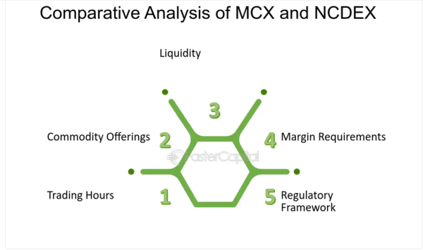

Derivatives trading has experienced a significant surge in popularity over recent years, establishing the National Commodity and Derivatives Exchange (NCDEX) as a critical nexus for traders engaging in the commodity markets. This burgeoning interest stems from the potential of derivatives to offer strategies for risk management, price discovery, and speculation based on underlying commodity assets. NCDEX, renowned for its regulated and transparent trading environment, specializes in agricultural commodities, providing a structured platform for futures and options trading.

The integration of algorithmic trading within the derivatives market has further refined the trading process on NCDEX. Algorithmic trading involves the use of computer programs that follow a set of pre-defined instructions for placing trades, making the execution swift, accurate, and less susceptible to emotional biases typical of manual trading. This efficiency is crucial in the dynamic commodity markets, where rapid price changes can significantly impact trading decisions.

Understanding the mechanics of derivatives trading on NCDEX, coupled with the role of algorithmic strategies, is essential for traders aiming to maximize their potential in the commodity markets. As this article addresses, the innovative confluence of technology and finance is revolutionizing the landscape of commodity exchanges, opening up new avenues for both institutional and retail investors.

Through this exploration, the article intends to provide key insights into the evolving trends that combine derivative instruments with cutting-edge trading methodologies. The focus is on the benefits and future potentials these strategies hold for optimizing trading performance and capitalizing on market opportunities available at NCDEX. As we navigate through the developments in this sector, the attention will be on how these advancements promise a more efficient, reliable, and strategically sound trading environment.

## Table of Contents

## Understanding Derivatives Trading on NCDEX

Derivatives are financial instruments whose value is derived from the price of an underlying asset. Such instruments include futures and options, which have become integral to financial markets worldwide. The National Commodity and Derivatives Exchange (NCDEX) is a prominent platform in India that facilitates trading in these instruments, specifically focusing on agricultural commodities.

NCDEX provides a structured environment for trading a wide range of commodities such as wheat, barley, and spices. Its establishment has enabled traders to manage risks associated with price fluctuations effectively. By providing futures and options contracts, the exchange offers tools for hedging, allowing traders and producers to lock in prices for future dates and mitigate the risk of adverse price movements.

A key advantage of trading on NCDEX is the transparency of transactions. The exchange operates under the regulatory oversight of the Securities and Exchange Board of India (SEBI), ensuring a secure and fair trading environment. This regulatory framework promotes investor confidence and contributes to the integrity of the market.

Additionally, NCDEX employs a standardized trading process, which simplifies the complexity often associated with derivatives trading. Standardization involves uniform contract specifications, such as expiry dates and lot sizes, making it easier for participants to engage in the market. This standardization also enhances [liquidity](/wiki/liquidity-risk-premium), ensuring that traders can enter and [exit](/wiki/exit-strategy) positions without significant price disruptions.

In the Indian agricultural sector, NCDEX is crucial for price discovery and risk management. The exchange allows the aggregation of supply and demand information from various market participants, leading to efficient price discovery mechanisms. This function is vital for farmers, traders, and other stakeholders who rely on accurate price signals to make informed production and investment decisions.

Through its robust trading platform and regulatory framework, NCDEX has bolstered the development of the Indian commodity market, offering a pathway for both local and international participants to engage in risk-managed trading.

## The Rise of Algorithmic Trading

Algorithmic trading, often referred to as algo trading, employs computational algorithms to automatically execute trades with high speed and precision. This method leverages sophisticated software and mathematical models to perform trading activities without the need for constant human intervention. 

One of the main advantages of [algorithmic trading](/wiki/algorithmic-trading) is its ability to significantly reduce emotional biases that can affect manual trading decisions. By relying on data-driven decisions, algo trading enhances the overall efficiency of executing trades. The algorithms are capable of analyzing vast datasets in real-time, offering advantages such as executing orders at optimal market prices and capitalizing on fleeting market opportunities.

The adoption of algorithmic trading across various financial markets, including the National Commodity and Derivatives Exchange (NCDEX), has grown substantially. This trend is largely due to the ability of these systems to handle large volumes of data swiftly, allowing traders to execute multiple trades simultaneously across different markets or assets.

Key to successful algorithmic trading is the development of robust trading algorithms. This process involves precise programming and rigorous [backtesting](/wiki/backtesting) against historical market data to ensure the strategy's viability. Continuous optimization is also crucial, as market conditions and asset price dynamics are constantly evolving.

Another important aspect facilitating the rise of algorithmic trading is technological advancements, which have democratized access to these tools. Where complex trading algorithms were once the domain of institutional investors and large hedge funds, retail traders can now also leverage these technologies. The availability of affordable computing power and sophisticated trading platforms enables actors with varying levels of expertise to implement algorithmic strategies efficiently. 

Overall, algorithmic trading provides a spectrum of opportunities for traders at NCDEX and beyond, pushing the boundaries of what's achievable in modern trading environments.

## Benefits of Algo Trading in NCDEX Derivatives

Algorithmic trading, commonly known as algo trading, leverages sophisticated programs and quantitative models to execute trades systematically based on pre-defined strategies. In the context of NCDEX derivatives, algo trading provides several benefits.

Firstly, algo trading enables traders to implement complex strategies that may be impractical to execute manually. Such strategies might involve rapid decision-making and precise timing, which are feasibly handled by algorithms rather than human traders. For example, a [momentum](/wiki/momentum) trading strategy that requires capturing price movements in milliseconds can be seamlessly executed using an algorithm that continuously analyzes price data and identifies entry and exit points.

One significant advantage of algo trading is its ability to enhance market liquidity. By facilitating increased trading activity, algorithms contribute to a more fluid market environment where trades are conducted swiftly and efficiently. This improved liquidity allows traders to enter and exit positions with minimal delays, reducing the time and cost of executing transactions.

Moreover, algo trading minimizes market impact and slippage. Because trades can be executed instantly based on predetermined criteria, the likelihood of price movements adversely affecting the trade execution is reduced. This precision is particularly beneficial in high-frequency trading, where even minor slippage can affect profitability. 

Effective risk management is another crucial benefit of algo trading. Algorithms are designed to adhere to strict risk parameters and can adjust quickly to changing market conditions. By maintaining constant vigilance over trading exposures and dynamically adjusting positions, algo trading ensures traders can consistently manage risk according to their predetermined risk appetite.

Additionally, algo trading offers significant flexibility. Traders can adjust their strategies based on prevailing market conditions without the need for continuous manual oversight. This adaptability is achieved through the use of advanced programming and [artificial intelligence](/wiki/ai-artificial-intelligence), enabling algorithms to learn from past data and optimize performance over time. Algorithms can be backtested against historical data to fine-tune strategies, ensuring they are well-equipped to handle future scenarios.

Incorporating algo trading in NCDEX derivatives thus provides a robust framework for traders to enhance their strategy execution, reduce associated trading risks, and optimize their performance consistently. By harnessing the power of technology, traders can achieve greater precision and scalability in their trading activities on the NCDEX platform.

## Challenges and Considerations

Algorithmic trading offers remarkable benefits, yet it presents challenges warranting careful consideration. A primary challenge is the demand for substantial technological infrastructure and expertise. Algorithmic trading relies heavily on sophisticated computer systems capable of executing trades at optimal speed and efficiency. Implementing such systems requires significant financial investment and technical proficiency.

Algorithmic strategies can falter during periods of heightened market [volatility](/wiki/volatility-trading-strategies) if they are not appropriately tested and monitored. Volatility can lead to erratic price movements, making it difficult for algorithms to predict market behavior accurately. Rigorous backtesting and continuous monitoring of algorithms are necessary to minimize the risk of failure in unstable markets.

Traders must navigate a complex regulatory environment, which can vary across different regions. Compliance with these regulations is essential to ensure lawful trading practices. Regulations may address issues such as market manipulation, transparency, and the fair use of information, making it imperative for traders to stay informed and adhere to legal requirements.

Technical failures and latency issues pose additional challenges. The risk of system failures or connectivity problems can lead to unintended trading outcomes, resulting in financial losses. Understanding the infrastructure's limitations and having contingency plans to address potential disruptions are critical for minimizing these risks.

Moreover, ethical considerations are crucial in algorithmic trading. Traders must ensure that their activities are transparent and do not engage in practices that could unfairly impact the market. Ethical trading not only aligns with regulatory standards but also fosters trust in financial markets.

In summary, while algorithmic trading on platforms like NCDEX provides efficiency and precision, it necessitates a comprehensive understanding of technical, regulatory, and ethical considerations to mitigate potential challenges effectively.

## Future Trends in Derivatives and Algo Trading on NCDEX

The future of derivatives and algorithmic trading on the National Commodity and Derivatives Exchange (NCDEX) is poised for transformation, driven by several technological and market trends. The integration of [machine learning](/wiki/machine-learning) and artificial intelligence (AI) into trading algorithms is predicted to significantly boost both the efficiency and the predictive capabilities of these systems. AI and machine learning can process vast amounts of data to identify patterns and insights that might not be evident through traditional analytical methods. This results in algorithms that can predict market movements with greater accuracy, giving traders a competitive edge.

Personalized trading systems are also on the rise, catering to the unique needs and risk profiles of individual traders. Such systems allow for the customization of trading strategies based on user preferences, enhancing trader engagement and satisfaction. This personalization is made possible through advancements in user interface design and adaptive algorithms that learn from user interactions.

Regulatory and infrastructural support from the Indian government and NCDEX is crucial in fostering the growth of derivatives trading. By developing robust infrastructure and clear regulatory frameworks, the authorities aim to create a conducive environment for market participants and stimulate greater participation. This governmental support is expected to lower entry barriers and increase the attractiveness of the derivatives market on NCDEX.

Beyond agricultural commodities, emerging markets in other sectors such as energy, metals, and international commodities offer new trading opportunities. These markets could provide diverse avenues for NCDEX traders to explore, potentially leading to expanded trading volumes and enhanced market liquidity.

Technological advancements and global market dynamics are anticipated to continuously reshape trading strategies on NCDEX. Innovations such as blockchain technology, big data analytics, and cloud computing are likely to further influence how trades are executed and managed. Additionally, global economic trends and geopolitical factors will contribute to market volatility, highlighting the need for resilient, adaptive trading strategies.

In conclusion, the confluence of AI, personalized trading, supportive governance, and expanding commodity markets underscores a promising future for derivatives and algo trading on NCDEX. Traders equipped with advanced algorithms and a keen understanding of evolving trends will be well-positioned to capitalize on these emerging opportunities.

## Conclusion

Derivatives trading on the National Commodity and Derivatives Exchange (NCDEX) has reached new heights with the integration of algorithmic trading strategies. This synergy offers traders a robust path to optimize market opportunities. Algorithmic trading enhances the efficiency of trade executions, reduces associated risks, and offers a precision that is beneficial to both beginners and seasoned traders.

The precision provided by algorithmic trading allows traders to execute strategies with rapidity and accuracy, minimizing human errors and the emotional biases that may affect decision-making processes. Through algorithmic systems, trades can be executed at optimal times with preferred pricing, which reduces market slippage and impacts. This accurate risk management and execution efficiency contribute significantly to consistently achieving trading objectives.

Keeping pace with technological changes is crucial. As technologies evolve, traders must stay informed and adaptable to leverage these advancements fully. Doing so ensures they remain competitive within this dynamic landscape. Continuous learning about algorithmic tools and advances in machine learning and artificial intelligence will be vital for traders aiming to optimize their strategies.

Anticipated technological and regulatory advancements will likely strengthen NCDEX's capacity, establishing it firmly as a leader in the commodity derivatives sphere. The Indian government's supportive measures towards infrastructure development and regulatory clarity are expected to foster an environment conducive to growth and innovation in NCDEX derivatives trading.

The combination of derivatives and algorithms in trading signals a promising horizon for global commodities market participants. As infrastructure and technologies evolve, opportunities for strategic diversification and market penetration will expand, making it an exciting era for derivative traders on NCDEX.

## References & Further Reading

[1]: Narang, R. (2013). ["Inside the Black Box: A Simple Guide to Quantitative and High Frequency Trading."](https://onlinelibrary.wiley.com/doi/book/10.1002/9781118662717) Wiley.

[2]: Ji, S., Zheng, Y., & Wang, H. (2019). ["Risk Management in Algorithmic Trading Using Machine Learning."](https://www.nature.com/articles/s41563-019-0471-8) arXiv.

[3]: Chakole, C., Pandey, J., Maheshwari, P., & Singh, R. (2015). ["Algorithmic Trading Strategies in India."](https://www.researchgate.net/profile/Chandrashekhar-Chakole/publication/358383693_Application_of_Vitamin_E_TPGS_in_ocular_therapeutics_-_Attributes_beyond_excipient/links/623f3ec75e2f8c7a033dd983/Application-of-Vitamin-E-TPGS-in-ocular-therapeutics-Attributes-beyond-excipient.pdf) International Journal of Innovative Research in Technology.

[4]: SEBI. (2020). ["Securities and Exchange Board of India Regulations on Algorithmic Trading."](https://www.sebi.gov.in/legal/regulations/jul-2020/securities-and-exchange-board-of-india-prohibition-of-insider-trading-amendment-regulations-2020_47104.html?_hsenc=p2ANqtz-8MRD8GxAv-005wwsj-KcfOEI5pTMGINBKk9Ve8IlgTha1PzIk4etHl6QQYLQUN2hX4YlL9)

[5]: Hull, J. C. (2017). ["Options, Futures, and Other Derivatives."](https://www.semanticscholar.org/paper/Options%2C-Futures%2C-and-Other-Derivatives-Hull/89bdee500c8623864fc9eb7a471546aa713acc44) Pearson.

[6]: Dunjko, V., & Briegel, H. J. (2018). ["Machine Learning & Artificial Intelligence in the Quantum Domain."](https://arxiv.org/abs/1709.02779) Physics Reports.

[7]: Aldridge, I. (2013). ["High-Frequency Trading: A Practical Guide to Algorithmic Strategies and Trading Systems."](https://www.ahmetbeyefendi.com/wp-content/uploads/2020/07/High-Frequency-Trading-Irene-Aldridge.pdf) Wiley.