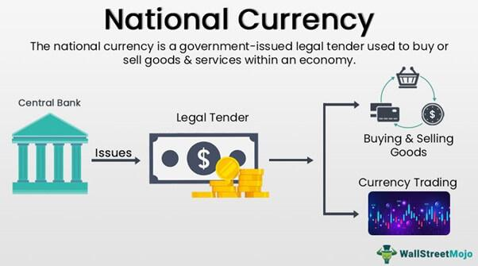

## Table of Contents

## What is a national currency?

A national currency is the money that a country uses. It is the official money that people in that country use to buy things, pay for services, and save. Each country usually has its own national currency, like the US dollar in the United States or the euro in many European countries. The government and the central bank of a country control and manage its national currency.

The value of a national currency can change compared to other currencies. This is called the exchange rate. If a country's currency is strong, it means you can buy more foreign currency with it. If it is weak, you can buy less. The strength of a currency can affect the country's economy, like how much it costs to import goods or how attractive the country is for tourists. Governments and central banks often try to keep their currency stable to help their economy.

## Why is a national currency important for a country?

A national currency is important for a country because it helps people buy things and pay for services easily. When everyone uses the same money, it makes trading and doing business simpler. For example, if you want to buy food or pay your bills, you use your country's money. This makes life easier for everyone because they don't have to worry about using different kinds of money for different things.

The national currency also helps the country's economy. It can affect how much things cost and how much money people earn. If the currency is strong, it can make the country's products cheaper for other countries to buy, which can help businesses sell more. On the other hand, if the currency is weak, it might make imports more expensive, which can affect the cost of living. The government and the central bank work to keep the currency stable so that the economy stays healthy.

## How does a national currency function in everyday transactions?

A national currency helps people buy things every day. When you go to the store to buy food, you use your country's money to pay for it. The same goes for paying bills like electricity or water. Everyone in the country uses the same money, so it's easy to know how much things cost and how much you need to pay. This makes shopping and paying for services simple and straightforward.

The national currency also helps businesses. When a store sells something, they get paid in the country's money. This money can then be used to buy more things to sell or to pay workers. Because everyone uses the same money, businesses can easily figure out their costs and prices. This helps keep the economy running smoothly, as money moves around from people to businesses and back again.

## What are the key functions of a national currency?

A national currency has a few main jobs. One of its big jobs is to be a way for people to buy things. When you go to the store and buy food, or when you pay your bills, you use your country's money. This makes it easy for everyone because they all use the same money. It helps keep things simple and makes trading easier.

Another important job of a national currency is to help the country's economy. The value of the currency can affect how much things cost and how much money people earn. If the currency is strong, it can make the country's products cheaper for other countries to buy, which can help businesses. If the currency is weak, it might make things from other countries more expensive. The government and the central bank try to keep the currency stable to help the economy stay healthy.

## How is the value of a national currency determined?

The value of a national currency is determined by how much people want it compared to other currencies. This is called the exchange rate. If a lot of people want to buy a country's currency, its value goes up. This can happen if the country's economy is doing well, or if it has a lot of valuable things to sell, like oil or technology. On the other hand, if fewer people want to buy the currency, its value can go down. This might happen if the country's economy is not doing well, or if people think the currency might lose value in the future.

The government and the central bank also play a big role in determining the value of a national currency. They can use different tools to try to keep the currency stable. For example, they might change interest rates, which is how much it costs to borrow money. If interest rates go up, it can make the currency more attractive because people can earn more by saving in that currency. The government might also buy or sell its own currency in the market to try to control its value. All these actions help shape how valuable the national currency is compared to others.

## What role does a national currency play in a country's economy?

A national currency is really important for a country's economy. It helps everyone buy things and pay for services easily. When everyone uses the same money, it makes trading and doing business simpler. For example, if you want to buy food or pay your bills, you use your country's money. This makes life easier for everyone because they don't have to worry about using different kinds of money for different things.

The national currency also affects how the economy works. Its value can change how much things cost and how much money people earn. If the currency is strong, it can make the country's products cheaper for other countries to buy, which can help businesses sell more. On the other hand, if the currency is weak, it might make imports more expensive, which can affect the cost of living. The government and the central bank try to keep the currency stable to help the economy stay healthy.

## How do exchange rates affect a national currency?

Exchange rates show how much one country's money is worth compared to another country's money. If the exchange rate goes up, it means your country's money can buy more of another country's money. This makes your currency stronger. For example, if the exchange rate between the US dollar and the Euro goes up, it means you can get more Euros with your dollars. A strong currency can make things from other countries cheaper for people in your country to buy. But it can also make your country's products more expensive for people in other countries to buy, which might hurt businesses that sell things abroad.

On the other hand, if the exchange rate goes down, it means your country's money can buy less of another country's money. This makes your currency weaker. For example, if the exchange rate between the US dollar and the Euro goes down, you can get fewer Euros with your dollars. A weak currency can make things from other countries more expensive for people in your country to buy. But it can also make your country's products cheaper for people in other countries to buy, which might help businesses that sell things abroad. Governments and central banks often try to manage exchange rates to help their country's economy.

## What are the advantages of having a strong national currency?

A strong national currency has many benefits for a country. When a country's money is strong, it means that people in that country can buy more things from other countries with their money. This makes imports cheaper, which can lower the cost of living. For example, if you want to buy a car from another country, a strong currency means you'll pay less for it. Also, when people from other countries visit, they'll find that things in your country cost more in their money, which can make your country a more attractive place for tourists.

Another advantage of a strong currency is that it can show that the country's economy is doing well. People and businesses from other countries might want to invest more in a country with a strong currency because they think it's a safe place to put their money. This can help the country grow and create more jobs. However, a strong currency can also make it harder for the country's businesses to sell things to other countries because their products become more expensive for foreigners to buy. So, while there are many benefits, it's important for the government to balance these effects to keep the economy healthy.

## What are the challenges faced by countries with weak national currencies?

A weak national currency can make life harder for people in a country. When the money is weak, things that come from other countries, like food or cars, become more expensive. This means people have to spend more money to buy the same things they used to buy for less. It can also make it harder for people to travel to other countries because their money doesn't go as far. For example, if someone wants to go on vacation, a weak currency means they can afford less in the country they're visiting.

A weak currency can also make it tough for businesses. If a company wants to sell its products to other countries, a weak currency means their products are cheaper for foreigners to buy. This might sound good, but it can also mean that the company earns less money when it changes the foreign money back into its own weak currency. Plus, if the country needs to borrow money from other countries, a weak currency can make those loans more expensive to pay back. Governments and central banks have to work hard to manage these challenges and try to make the currency stronger over time.

## How does monetary policy influence a national currency?

Monetary policy is how a country's central bank controls the amount of money in the economy. This can affect the value of the national currency. If the central bank wants to make the currency stronger, it might raise interest rates. When interest rates go up, it costs more to borrow money, and people might want to save more. This can make the currency more attractive because people from other countries might want to invest in it to earn more interest. On the other hand, if the central bank wants to make the currency weaker, it might lower interest rates. Lower interest rates make borrowing cheaper, which can encourage people to spend more and save less, making the currency less attractive to foreigners.

The central bank can also use other tools to influence the national currency. For example, it can buy or sell its own currency in the foreign exchange market. If the central bank buys its own currency, it can make the currency stronger because there's more demand for it. If it sells its own currency, it can make the currency weaker because there's more supply. These actions help the central bank manage the value of the national currency and keep the economy stable. By carefully using these tools, the central bank can help the country's economy grow and keep inflation under control.

## What are the implications of currency devaluation for a national economy?

Currency devaluation means a country's money becomes worth less compared to other countries' money. This can make things from other countries more expensive for people in the country. For example, if you want to buy a car or food that comes from another country, you'll have to pay more money for it. This can make life harder for people because their money doesn't go as far. It can also make it more expensive for the country to pay back loans it has from other countries, which can be a big problem.

On the other hand, currency devaluation can help the country's businesses that sell things to other countries. When the currency is weaker, the country's products become cheaper for people in other countries to buy. This can help businesses sell more and make more money. But, if the country relies a lot on things from other countries, like oil or technology, devaluation can hurt the economy because those things become more expensive. Governments and central banks have to be careful and try to balance these effects to keep the economy healthy.

## How do international trade and global markets impact a national currency's stability?

International trade and global markets can really affect how stable a country's money is. When a country sells a lot of things to other countries, it can make its money stronger. This is because other countries need to buy the country's money to pay for the things they're buying. If a country's products are popular and in demand, its money can become more valuable. But, if the country buys more things from other countries than it sells, its money can become weaker. This is because the country needs to use its money to buy other countries' money, which can lower the value of its own money.

Global markets also play a big role in a country's money stability. If investors from other countries think a country's economy is doing well, they might want to invest in it. This can make the country's money stronger because more people want to buy it. On the other hand, if investors think the country's economy might have problems, they might sell the country's money, which can make it weaker. Governments and central banks have to watch these global market trends and try to keep their money stable so that the economy stays healthy.

## What is the understanding of Economic Systems and National Currencies?

An economic system is the organizational structure a nation adopts to manage its resources, directing the production, distribution, and consumption of goods and services. These systems fall into various types, such as traditional, command, market, and mixed economies, each with distinct characteristics dictating how economic activities are executed. Central to an economic system's functionality is its national currency, an indispensable tool in facilitating trade and economic interactions both domestically and internationally.

National currencies serve several critical functions that underpin economic systems. Primarily, they act as a medium of exchange, simplifying transactions by substituting the barter system with a universally accepted medium. Additionally, currencies provide a standardized measure of value, allowing for the comparison of goods and services. This standardization is essential for rational pricing strategies across markets. Furthermore, currencies function as a store of wealth, offering individuals and institutions a way to preserve economic value over time.

Monetary authorities, such as central banks, exert significant influence over national currencies. Through monetary policy, which involves manipulating interest rates and controlling the money supply, these authorities aim to regulate the currency's value. For example, by adjusting the interest rates, central banks can influence inflation and economic growth—two crucial components of economic stability. When a central bank increases the interest rates, it often results in currency appreciation, as higher rates offer investors better returns on their investments, attracting foreign capital and boosting demand for the currency.

Conversely, policies aimed at reducing interest rates typically decrease a currency's value. The formula for the [interest rate](/wiki/interest-rate-trading-strategies) parity relation is often employed to understand these dynamics, expressed as:

$$
(1 + i_d) = \left( \frac{F}{S} \right) \times (1 + i_f)
$$

where $i_d$ is the domestic interest rate, $i_f$ the foreign interest rate, $F$ the forward exchange rate, and $S$ the spot exchange rate. This relationship underlines the interconnected nature of national currencies and international finance, where currency valuations are influenced by interest differentials.

In summary, national currencies are fundamental components of economic systems, facilitating transactions, establishing value standards, and storing wealth. The interplay between monetary policy and currency valuation is crucial, affecting economic stability and growth.

## References & Further Reading

[1]: Bergstra, J., Bardenet, R., Bengio, Y., & Kégl, B. (2011). ["Algorithms for Hyper-Parameter Optimization."](https://papers.nips.cc/paper/4443-algorithms-for-hyper-parameter-optimization) Advances in Neural Information Processing Systems 24.

[2]: ["Advances in Financial Machine Learning"](https://www.amazon.com/Advances-Financial-Machine-Learning-Marcos/dp/1119482089) by Marcos Lopez de Prado

[3]: ["Evidence-Based Technical Analysis: Applying the Scientific Method and Statistical Inference to Trading Signals"](https://www.amazon.com/Evidence-Based-Technical-Analysis-Scientific-Statistical/dp/0470008741) by David Aronson

[4]: ["Machine Learning for Algorithmic Trading"](https://github.com/stefan-jansen/machine-learning-for-trading) by Stefan Jansen

[5]: ["Quantitative Trading: How to Build Your Own Algorithmic Trading Business"](https://www.amazon.com/Quantitative-Trading-Build-Algorithmic-Business/dp/1119800064) by Ernest P. Chan