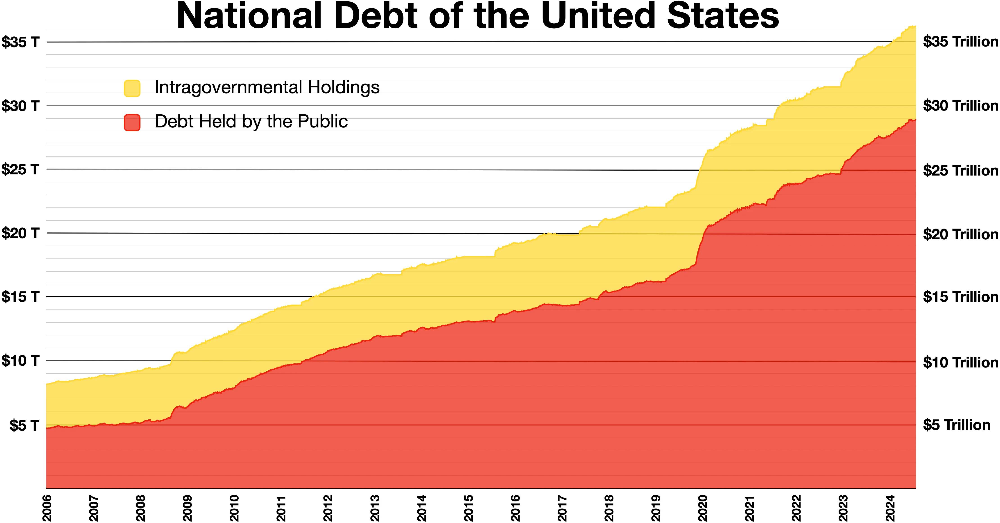

## Table of Contents

## What is national debt?

National debt is the total amount of money that a country's government owes. This debt comes from borrowing money to cover expenses when the government spends more than it earns through taxes and other revenues. Governments borrow by issuing bonds, which are bought by investors, other countries, and sometimes even their own citizens. The national debt can grow over time if a government keeps borrowing more money than it pays back.

Having a national debt is not always bad. Many countries have debts and still manage their economies well. However, if the debt gets too high, it can cause problems. It might mean the government has to pay a lot of interest, which can take money away from important services like healthcare and education. Also, a very high debt can make investors worried, which can affect the country's economy. So, governments need to manage their debts carefully to keep their economies stable.

## How does a government accumulate national debt?

A government accumulates national debt when it spends more money than it collects in taxes and other revenues. When this happens, the government needs to borrow money to cover the difference. It does this by issuing bonds, which are like IOUs that promise to pay back the money with interest over time. People, banks, and other countries can buy these bonds. The money borrowed through these bonds adds to the national debt.

Over time, if a government keeps spending more than it earns, the national debt grows. For example, if a government needs to pay for big projects like building roads or helping people during tough times like a recession, it might borrow more money. Also, if the economy is not doing well, the government might collect less in taxes, which can make the debt grow even more. So, the national debt can increase because of both spending more and [earning](/wiki/earning-announcement) less.

## What are government bonds?

Government bonds are like loans that people or organizations give to the government. When the government needs money, it can sell these bonds. People who buy the bonds are lending money to the government. In return, the government promises to pay back the money they borrowed, plus some extra money called interest, after a certain amount of time.

These bonds help the government pay for things like building roads, schools, or helping people when the economy is not doing well. They are seen as safe investments because the government is usually good at paying back what it owes. People can buy and sell these bonds in a special market, and the price can go up or down depending on how well people think the government is doing.

## How do government bonds relate to national debt?

Government bonds are a big part of how a country's national debt grows. When the government spends more money than it gets from taxes, it needs to borrow money. It does this by selling bonds. People, banks, or other countries buy these bonds, giving the government the money it needs. This borrowed money adds to the national debt because the government now owes that money to the bondholders.

Over time, if the government keeps borrowing more money by selling more bonds, the national debt gets bigger. The government has to pay back the money it borrowed, plus interest. This interest is like a fee for borrowing the money. So, the more bonds the government sells, the more it has to pay back, and the bigger the national debt becomes.

## Who buys government bonds?

Government bonds are bought by all sorts of people and groups. Regular people like you and me can buy them if we want a safe place to put our money. Big banks and other financial companies also buy a lot of government bonds because they need safe investments for their customers' money. Sometimes, other countries buy them too. They might do this to help the country that's selling the bonds or because they think it's a good investment.

The reasons for buying government bonds can be different. Some people buy them to save money for the future, knowing that the government will pay them back with a little extra interest. Others might buy them because they think the economy is going to change in a way that will make the bonds more valuable. No matter who buys them, the money they pay for the bonds helps the government do things like build roads, schools, and help people when times are tough.

## What is the purpose of issuing government bonds?

The main reason governments issue bonds is to borrow money. When a government needs more money than it gets from taxes, it sells bonds. People, banks, and even other countries buy these bonds. By doing this, the government gets the money it needs to pay for things like building roads, schools, or helping people during tough times.

Another purpose of issuing bonds is to manage the economy. Sometimes, if the economy is not doing well, the government might spend more money to help it grow. By selling bonds, the government can get the money it needs without raising taxes right away. This can help keep the economy stable and give people confidence that the government is taking care of things.

## How does national debt affect the economy?

National debt can affect the economy in different ways. When a government borrows a lot of money, it has to pay interest on that debt. This means less money for important things like schools, hospitals, and roads. If the debt gets too big, the government might need to raise taxes or cut spending on these services, which can make life harder for people. Also, if people think the government might not be able to pay back its debt, they might not want to lend more money or might ask for higher interest rates, which can slow down the economy.

On the other hand, some national debt can be good for the economy. When the government borrows money by selling bonds, it can use that money to help the economy grow. For example, it can build new roads or help people who are out of work. This can create jobs and make the economy stronger. But it's important for the government to keep the debt at a level that it can manage, so it doesn't cause problems in the future.

## What are the risks associated with high levels of national debt?

High levels of national debt can cause big problems for a country. When a country owes a lot of money, it has to pay a lot of interest on that debt. This means there's less money for important things like schools, hospitals, and roads. If the debt gets too big, the government might need to raise taxes or cut spending on these services. This can make life harder for people because they might have to pay more taxes or get fewer services. Also, if people think the government might not be able to pay back its debt, they might not want to lend more money or might ask for higher interest rates. This can slow down the economy and make it harder for businesses to grow.

On the other hand, a high national debt can also affect a country's relationship with other countries. If a country owes a lot of money to other countries, those countries might have more power over it. They might ask for things in return for lending money, like changes in the country's laws or policies. This can limit the country's freedom to make its own decisions. If the debt gets really big, there's also a risk that the country might not be able to pay it back at all. This could lead to a big crisis, where the country might need help from other countries or international organizations to fix its problems.

## How do interest rates impact government bonds and national debt?

Interest rates have a big effect on government bonds and national debt. When interest rates go up, the cost of borrowing money for the government goes up too. This means the government has to pay more interest on the money it borrows by selling bonds. If the government keeps borrowing more money, the national debt grows faster because of the higher interest payments. On the other hand, when interest rates are low, it's cheaper for the government to borrow money. This can help keep the national debt from growing too fast because the government doesn't have to pay as much interest.

Interest rates also affect how much people want to buy government bonds. When interest rates are high, people might want to buy more bonds because they can earn more interest on their money. This can help the government borrow money more easily. But if interest rates are low, people might not want to buy as many bonds because they can earn more money in other ways. This can make it harder for the government to borrow money and might lead to higher interest rates on new bonds, which can make the national debt grow even more.

## What strategies can governments use to manage national debt?

Governments can manage their national debt by being careful with how much they spend and how much they earn. One way they can do this is by making sure they don't spend more money than they get from taxes. If they need to spend more, they can try to find ways to earn more money, like raising taxes or selling things that the government owns. They can also look for ways to spend less money, like cutting back on some programs or making them more efficient. By doing these things, the government can keep the national debt from growing too fast.

Another strategy is to borrow money at the right time. When interest rates are low, it's cheaper for the government to borrow money by selling bonds. So, the government can borrow more money when rates are low and use it to pay off older debts that have higher interest rates. This can help lower the total amount of money the government has to pay in interest, which can slow down how fast the national debt grows. It's important for the government to keep an eye on interest rates and use them to their advantage when managing the national debt.

## How do different countries' approaches to national debt and government bonds vary?

Different countries have different ways of handling their national debt and government bonds. Some countries, like Germany, are very careful about keeping their debt low. They try to spend only what they earn from taxes and other money they get. If they need to borrow, they do it carefully and try to pay back the money quickly. Other countries, like the United States, are okay with having a bigger debt. They borrow a lot of money by selling bonds and use it to pay for big projects or help people when times are tough. They think that having some debt is okay as long as they can manage it well.

Countries also have different ways of selling their bonds. In Japan, a lot of the government bonds are bought by their own people and banks. This means they don't have to worry as much about other countries or big investors. In contrast, countries like Italy might sell their bonds to other countries and big investors from around the world. This can be good because it gives them more money, but it can also be risky if those investors decide they don't want to lend money anymore. So, each country has to find a way to manage its debt and bonds that works best for them.

## What are the long-term implications of relying on government bonds to finance national debt?

Relying on government bonds to finance national debt can have big effects over a long time. When a country borrows a lot of money by selling bonds, it has to pay back that money with interest. If it keeps borrowing more and more, the debt can grow really big. This means the country has to spend a lot of money just to pay the interest, and that money could be used for things like schools, hospitals, or helping people who need it. If the debt gets too big, the country might have to raise taxes or cut back on important services, which can make life harder for people.

Over time, having a lot of debt can also affect how people and other countries see the country. If people think the country might not be able to pay back its debt, they might not want to lend more money or might ask for higher interest rates. This can make it even harder for the country to borrow money and can slow down its economy. But if the country is careful and uses the money it borrows to help its economy grow, like building roads or helping people get jobs, the debt might not be such a big problem. It's all about finding a balance and making sure the country can manage its debt well over the long term.

## References & Further Reading

[1]: Mankiw, N. G. (2018). ["Principles of Economics"](https://books.google.com/books/about/Principles_of_Economics.html?id=KQfFDwAAQBAJ). Cengage Learning.

[2]: Hull, J. C. (2015). ["Options, Futures, and Other Derivatives"](https://www.semanticscholar.org/paper/Options%2C-Futures%2C-and-Other-Derivatives-Hull/89bdee500c8623864fc9eb7a471546aa713acc44). Pearson.

[3]: Reinhart, C. M., & Rogoff, K. S. (2011). ["This Time Is Different: Eight Centuries of Financial Folly"](https://www.nber.org/system/files/working_papers/w13882/w13882.pdf). Princeton University Press.

[4]: Seymour, R. J. (2017). ["The Euro: How a Common Currency Threatens the Future of Europe"](https://books.google.com/books/about/The_Euro_How_a_Common_Currency_Threatens.html?id=rBycCgAAQBAJ) by Joseph Stiglitz.

[5]: Poterba, J. M., & von Hagen, J. (Eds.). (1999). ["Fiscal Institutions and Fiscal Performance"](https://press.uchicago.edu/ucp/books/book/chicago/F/bo3622738.html). University of Chicago Press.