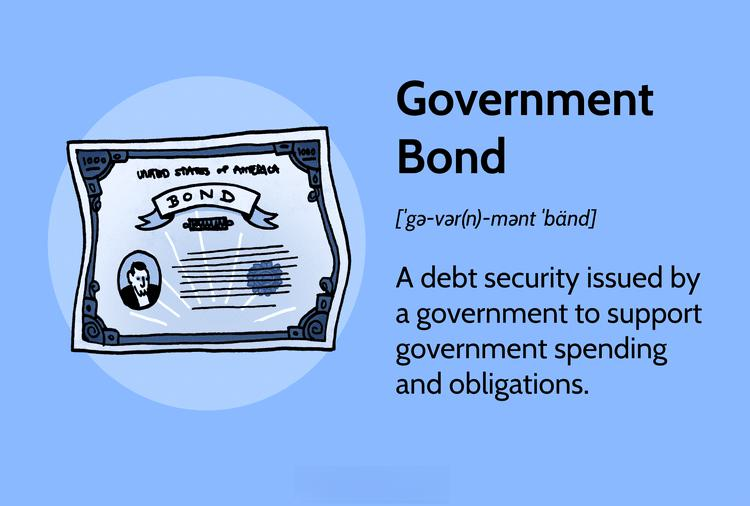

The financial landscape is characterized by a complex interplay of public finance, government bonds, national debt, and algorithmic trading. Each of these components significantly influences global economies and financial markets. Public finance focuses on how governments generate revenue, such as through taxes or the issuance of bonds, and how they allocate these resources to maintain economic stability and growth. Effective management in this domain directly affects national debt levels, shaping the fiscal policy landscape.

Government bonds, as debt securities, are essential tools for funding government expenditures and obligations. Considered safe investments, they play a pivotal role in managing national debt and facilitating fiscal operations. These bonds are appealing to both domestic and international investors, influencing global economic trends.

National debt, the sum total of government borrowings, carries profound implications for economic strategies and fiscal policy formulation. Examining historical and current trends provides insights into how such debt impacts not only a country's credit rating but also its global economic standing.

Algorithmic trading, the use of computational algorithms to automate trading processes, is rapidly gaining ground in financial markets, including government bond trading. This technological advancement increases market efficiency but also introduces complexities that impact traditional trading methods.

This overview aims to clarify the intricate relationships between these financial elements and their influence on fiscal health and technological innovation in finance. By grasping the evolving dynamics of public finance in today's digital age, readers will be better equipped to navigate the complexities of modern financial landscapes.

## Table of Contents

## Understanding Public Finance

Public finance encompasses the examination of government revenue and expenditure, as well as the management and adjustment of these elements to achieve economic goals and avoid adverse outcomes. It involves the strategic application of various tools at a government's disposal, such as taxation, borrowing, and the pricing of goods and services, to effectively generate revenue.

Taxation is a primary mechanism through which governments raise funds. Taxes can be classified into direct taxes, such as income tax, and indirect taxes, like value-added tax (VAT). The optimal design of tax systems is critical to ensure fairness, efficiency, and adequate revenue collection without stifling economic growth. For instance, the Laffer Curve illustrates the relationship between tax rates and tax revenue, suggesting there is an optimal tax rate that maximizes revenue without discouraging economic activity.

Borrowing is another vital tool for government finance. By issuing government bonds, governments can raise substantial amounts of capital to finance infrastructure projects and other public expenditures. The strategic use of borrowing enables a government to smooth expenditures over time, especially during economic downturns.

The pricing of goods and services, especially those offered by state-run enterprises, also contributes to revenue. Governments can adjust prices to control consumption patterns and generate necessary funds from public consumption.

Effective public finance management is paramount for the economic stability and growth of a nation. It involves a balanced approach to ensuring that revenue-generating mechanisms are efficient and expenditures are justified and within budget. Well-managed public finance leads to lower deficits and sustainable national debt levels.

Historically, governments have adopted various approaches to manage their finances amid economic fluctuations. During the Great Depression, for example, many governments increased public spending to stimulate demand in the economy—an approach proposed by the economist John Maynard Keynes. In contrast, during periods of prosperity, governments might reduce spending and increase savings to prepare for potential future downturns.

In contemporary times, fiscal policy management remains a crucial tool for governments facing fluctuating economic conditions. During the 2008 financial crisis, many countries implemented stimulative fiscal policies to counteract the recession, demonstrating the continued relevance of public finance strategies in contemporary economic policy-making. 

Overall, understanding public finance is essential for grasping how governmental decisions impact national economic health and stability.

## The Role of Government Bonds

Government bonds are debt securities issued by a government to finance various public expenditures, such as infrastructure projects, social programs, and ongoing governmental obligations. These bonds are considered among the safest investment vehicles available, primarily due to the government's backing, which reduces the risk of default. This perceived security makes them a fundamental component of financial markets and a vital tool in the management of national debt.

### Types of Government Bonds

Different countries issue various types of government bonds, each serving unique purposes within financial markets. Among the most common are Treasury bonds, Treasury bills, and Treasury notes.

- **Treasury Bonds**: These are long-term debt instruments with maturities exceeding ten years. They typically provide periodic interest payments, referred to as coupons, to bondholders. The long duration makes them sensitive to changes in interest rates.

- **Treasury Notes**: Similar to Treasury bonds but with shorter maturities, usually ranging from two to ten years. They also offer periodic coupon payments and are a popular choice among investors seeking balance between risk and return.

- **Treasury Bills**: These are short-term securities that mature in one year or less. They do not offer periodic interest payments but are sold at a discount to their face value. The difference between the purchase price and the face value represents the interest earned by the investor.

Each type of bond serves a specific function, offering different [liquidity](/wiki/liquidity-risk-premium) levels and interest rates, thereby allowing investors to tailor their portfolios according to risk tolerance, investment horizon, and financial objectives.

### Economic Influence and Attractiveness

Government bonds play a crucial role in national economies as tools for monetary policy and economic stability. By issuing or redeeming bonds, governments can influence money supply and interest rates. When a government issues bonds, it typically absorbs excess liquidity from the market, which can help control inflation. Conversely, redeeming bonds injects liquidity, potentially stimulating economic growth.

The attractiveness of government bonds to investors lies in their relative safety and the steady income they can provide through interest payments. They are particularly appealing during periods of economic uncertainty or market [volatility](/wiki/volatility-trading-strategies), offering a haven for capital preservation while still generating returns. Moreover, government bonds often serve as benchmarks for other interest rates in the economy, influencing the rates on mortgages, savings accounts, and corporate borrowing.

### Role in National Debt Management

As instruments for managing national debt, government bonds enable countries to access immediate funding without resorting to inflationary measures like printing additional currency. By issuing bonds, governments can distribute the financial burden of public expenditures over time, reducing the fiscal pressure on current budgets.

In summary, government bonds are pivotal to financial markets and national economies by providing a mechanism for managing public finances, influencing monetary conditions, and offering secure investment opportunities. Their stability and reliability make them indispensable to investors and policymakers alike, serving as critical indicators of economic health and fiscal strategy.

## National Debt and Its Implications

National debt represents the total sum of money that a government has borrowed, primarily through the issuance of bonds, to finance its operations and obligations. This financial mechanism allows governments to undertake projects and manage expenditures beyond what immediate revenue sources, such as taxes, can support. However, the continuous expansion of national debt poses complex challenges to governmental fiscal policies and economic strategies.

As national debt increases, governments often face difficulties in balancing fiscal policies. The requirement to service debt—paying interest and repaying maturing debts—can limit available funds for other critical public expenses, such as healthcare, education, and infrastructure. This often necessitates shifts in economic strategies, prioritizing debt management over other fiscal goals. Policymakers must navigate the trade-offs between stimulating economic growth through public spending and maintaining sustainable debt levels.

Historical data provides insights into the patterns and consequences of rising national debt. Throughout history, significant increases in public debt have been observed during times of war, economic downturns, and financial crises, which often triggered extensive borrowing. For instance, periods like the global financial crisis of 2008 led to substantial increases in national debts worldwide as governments provided fiscal stimulus packages to stabilize economies. Analyzing these trends helps policymakers develop more informed projections and contingency plans for managing future fiscal challenges.

Concepts such as the debt ceiling and budget deficits play a critical role in national debt discussions. A debt ceiling is a cap set by legislation on the amount of national debt that can be incurred by the government, aiming to control the borrowing and manage public finance prudently. However, political debates over raising the debt ceiling can lead to fiscal uncertainty and potential government shutdowns if not resolved.

Budget deficits, where government expenditures surpass revenues, exacerbate national debt, leading to an accumulation of liabilities over time. As deficits persist, reliance on borrowing heightens, thereby amplifying the total debt. This cycle poses threats to fiscal sustainability if not managed through strategic economic reforms or increased revenue generation.

The implications of burgeoning national debt extend beyond domestic borders, impacting a country's credit rating and global economic standing. Credit rating agencies evaluate the ability of governments to honor their debt commitments, and excessive debt can lead to downgrades. A lower credit rating signifies higher risk perceived by investors, which may result in increased borrowing costs for the government through elevated interest rates on bonds.

Furthermore, a high national debt can affect a country's economic influence on the global stage. Persistent debt issues may undermine investor confidence, leading to capital flight and reduced foreign direct investment. In extreme cases, excessive national debt can trigger a sovereign debt crisis, requiring intervention by international financial institutions like the International Monetary Fund (IMF) to restore fiscal order.

In conclusion, national debt is a double-edged sword: while it enables governments to fund essential services and stimulate economic growth, unchecked and rising debt levels pose substantial risks to fiscal health and economic stability. Effective management of national debt requires a balance between necessary borrowing and responsible economic planning, ensuring long-term financial sustainability and economic prosperity.

## Algorithmic Trading in Government Bonds

Algorithmic trading, referred to as algo trading, involves the use of complex algorithms to automate the execution of trading orders. In recent years, this method has become an integral part of the government bonds market, similar to its established role in equities and foreign exchanges. Algorithmic trading systems can execute trades at speeds and volumes that humans cannot match, offering several key advantages and introducing certain risks.

One primary advantage of algo trading in the bond market is increased efficiency. Algorithms can quickly process vast amounts of market data to make informed decisions, ensuring that trades are executed at optimal prices and minimizing transaction costs. The ability to continuously monitor market conditions and adjust to even minor fluctuations helps in maintaining liquidity and price stability. For instance, high-frequency trading algorithms analyze live market data to capture short-term opportunities, thereby contributing to tighter bid-ask spreads.

However, the introduction of algo trading also brings potential risks, notably increased volatility. Algorithms can react to market events in milliseconds, which means they can become susceptible to market noise or anomalies, potentially triggering rapid and widespread pricing errors or 'flash crashes'. Moreover, the opacity of algorithmic strategies can pose challenges. As algorithms can make complex decisions that are not always predictable, there is a risk of unintended interactions between different trading strategies, leading to significant market movements.

Technological advancements have played a crucial role in transforming traditional trading methods. The deployment of sophisticated algorithms requires robust computational power and data infrastructure, making markets more accessible yet complex. Traders now need to possess not only financial acumen but also technical expertise to develop and implement effective trading strategies. As a result, the barriers to entry have increased for traditional traders who must adapt to the digital shift or risk obsolescence.

Regulatory frameworks are evolving to keep pace with these technological advancements in financial markets. Regulators are increasingly scrutinizing the impacts of [algorithmic trading](/wiki/algorithmic-trading) on market integrity and stability. Measures such as enhanced transparency requirements, tighter controls on algorithmic strategies, and specific guidelines for risk assessment and management are being instituted. For example, in the European Union, the Markets in Financial Instruments Directive II (MiFID II) imposes specific requirements on firms deploying algorithmic trading to ensure orderly trading and to mitigate risks associated with rapid automated trading.

In summary, while algorithmic trading in government bonds offers substantial benefits in terms of efficiency and liquidity, it also necessitates careful risk management and regulatory oversight. The evolution of financial technology continues to reshape the market landscape, demanding a balanced approach to harnessing the potential of algorithms while safeguarding market stability.

## The Interplay Between Finance and Technology

Technology has significantly transformed the landscape of finance, particularly in how governments issue and manage debt. The integration of algorithmic trading into the bond market exemplifies this shift, as it automates the buying and selling of government securities, enhancing market liquidity and efficiency. This automation reduces transaction costs and accelerates trading processes, enabling quicker responses to market conditions, which is crucial for large and small investors alike.

One of the primary ways technology reshapes government debt strategies is through innovative platforms that streamline the issuance and management of bonds. Digital tools enhance transparency and accessibility, allowing a broader set of investors to participate in government securities markets. This democratization of bond markets can potentially lower borrowing costs for governments by increasing demand and competition among a wider pool of investors.

Financial innovations like blockchain also play a significant role. Blockchain technology promises to revolutionize bond issuance by providing a secure and transparent ledger for recording transactions. This can lead to more efficient processes, reducing the time and complexity involved in issuing bonds. Smart contracts, a feature of blockchain technology, can automate interest payments and principal repayment schedules, reducing the risk of default due to human error.

This interplay between finance and technology creates new investment opportunities. For example, the rise of robo-advisors, which use algorithms to provide financial advice and manage portfolios, allows retail investors to access bond markets with ease. These platforms often leverage [machine learning](/wiki/machine-learning) to analyze market trends and adjust holdings dynamically, aligning with investor risk appetites and financial goals.

However, the integration of technology in financial markets requires progressive regulatory frameworks to ensure stability and prevent systemic risks. The volatility that algorithmic trading can introduce into bond markets necessitates robust regulatory oversight to safeguard against flash crashes and manipulative trading practices. Regulators worldwide are increasingly focusing on developing policies that balance innovation with financial stability, ensuring that technological advancements do not outpace the ability to manage associated risks.

In essence, the synergy between finance and technology enhances market efficiency, expands access, and creates new opportunities while also posing challenges that require careful regulatory consideration. As global economies continue to evolve, this relationship will likely drive further changes in how financial markets operate, necessitating adaptive policies that prioritize both innovation and stability.

## Conclusion

Public finance stands as a cornerstone in ensuring both national and global economic health. It entails the strategic allocation and management of resources by governments, significantly influencing fiscal stability and growth. Effective public finance management underpins economic policies and decisions that can safeguard nations during economic fluctuations. A robust understanding of public finance is imperative for policymakers to navigate complexities and sustain economic prosperity.

Government bonds, fundamental tools in public finance, play a pivotal role in managing national debt and maintaining market stability. These instruments enable governments to finance expenditures without immediately raising taxes, providing liquidity and investment opportunities. Understanding the intricacies of government bonds, such as yield and maturity, is crucial for investors and policymakers alike. National debt, represented by the accumulation of these bonds, necessitates prudent fiscal strategies to prevent adverse economic impacts like inflation or a reduced credit rating.

The rise of algorithmic trading (algotrading) marks a significant evolution in financial markets, leveraging technology to enhance trading efficiency and liquidity. It harnesses advanced algorithms and high-frequency trading systems to execute trades with precision and speed. While algotrading introduces potential benefits, such as market efficiency and increased access, it also presents challenges. Market volatility and regulatory concerns necessitate rigorous oversight to ensure that financial stability isn't compromised.

Looking ahead, the intersection of public finance and technology portends transformative changes in economic frameworks. Future trends indicate a convergence where digital innovations streamline government debt management and create sophisticated financial instruments. Policymakers and investors must remain adaptive, promoting resilience in economic strategies to harness technological advancements while mitigating associated risks.

In summary, as financial landscapes continue to evolve, the interplay between public finance, government bonds, national debt, and technology will define the resilience and stability of global economies. Understanding these elements is crucial for crafting policies that support sustainable economic growth. Further exploration and discussion of these topics will enhance insights and strategies, contributing to more resilient economic structures in an increasingly digital world.

## References & Further Reading

[1]: Mankiw, N. G. (2018). ["Principles of Economics"](https://books.google.com/books/about/Principles_of_Economics.html?id=KQfFDwAAQBAJ). Cengage Learning.

[2]: Hull, J. C. (2015). ["Options, Futures, and Other Derivatives"](https://www.semanticscholar.org/paper/Options%2C-Futures%2C-and-Other-Derivatives-Hull/89bdee500c8623864fc9eb7a471546aa713acc44). Pearson.

[3]: Reinhart, C. M., & Rogoff, K. S. (2011). ["This Time Is Different: Eight Centuries of Financial Folly"](https://www.nber.org/system/files/working_papers/w13882/w13882.pdf). Princeton University Press.

[4]: Seymour, R. J. (2017). ["The Euro: How a Common Currency Threatens the Future of Europe"](https://books.google.com/books/about/The_Euro_How_a_Common_Currency_Threatens.html?id=rBycCgAAQBAJ) by Joseph Stiglitz.

[5]: Poterba, J. M., & von Hagen, J. (Eds.). (1999). ["Fiscal Institutions and Fiscal Performance"](https://press.uchicago.edu/ucp/books/book/chicago/F/bo3622738.html). University of Chicago Press.