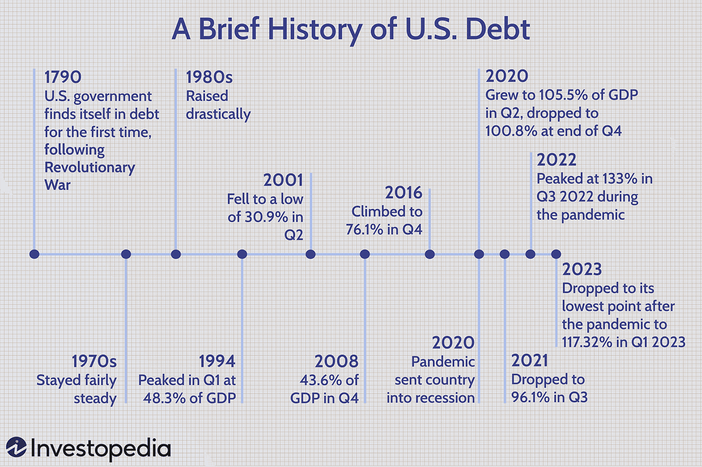

The intertwined dynamics of national debt, economic growth, and innovative trading strategies like algorithmic trading are significantly shaping contemporary economics. As national debt levels soar globally, these intricacies necessitate a deeper understanding of their impact on economic stability and growth, particularly when combined with rapidly advancing technology-focused arenas such as algorithmic trading.

National debt is a critical component of a country's financial portfolio, often accrued to fund expenditures that exceed national income. While it enables governments to invest in essential infrastructure and public services, excessive debt levels can pose significant risks, influencing interest rates, inflation, and economic growth trajectories. The relationship between national debt and economic growth is complex, with implications for fiscal sustainability and the economic well-being of future generations.



Algorithmic trading, which utilizes complex computations and vast datasets to optimize trading decisions, has introduced a new dimension to financial markets. By automating trading processes, these sophisticated strategies increase market efficiency, but they also introduce challenges related to market predictability and volatility. Understanding the potential of algorithmic trading to either support or destabilize economies with high national debt levels is crucial for formulating effective fiscal strategies.

This article explores the multifaceted drivers of national debt, its economic repercussions, and how algorithmic trading could influence fiscal sustainability. By examining these elements, policymakers and economists can develop forward-looking strategies that leverage technology and innovation to address debt-related challenges while ensuring economic resilience.

## Table of Contents

## Understanding National Debt

National debt represents the cumulative financial obligations of a government accrued through borrowing to cover expenditures that surpass its revenue. This financial mechanism is essential for governments to fund public services, infrastructure projects, and various initiatives critical for national development. However, comprehending the structure and implications of national debt is crucial for assessing the economic flexibility and fiscal sustainability of a nation.

The components of national debt can be categorized mainly into three segments:

1. **Public Debt**: This is the portion of the national debt borrowed from investors, banks, and the general public through financial instruments such as bonds and treasury bills. Public debt allows governments to raise funds directly from the market, providing liquidity for immediate capital needs.

2. **Intergovernmental Holdings**: These are funds owed by the government to other governmental entities, such as trust funds for social security and retirement benefits. This form of debt reflects intra-government borrowings and is pivotal in managing funds designated for specific obligations.

3. **Foreign Debt**: This represents borrowings from foreign creditors, which can include foreign governments, international financial institutions, or private foreign investors. Foreign debt can facilitate international economic collaboration but also introduces currency exchange risks and geopolitical considerations into the national fiscal framework.

One of the key indicators used to evaluate a country's fiscal health and economic sustainability is the debt-to-GDP ratio. This metric compares the national debt to the nation's Gross Domestic Product (GDP), offering insights into the country's ability to repay its debt. A higher ratio may indicate potential difficulties in managing debt levels, whereas a lower ratio suggests a more sustainable fiscal position.

The debt-to-GDP ratio can be calculated using the formula:
$$
\text{Debt-to-GDP Ratio} = \left( \frac{\text{Total Public Debt}}{\text{GDP}} \right) \times 100
$$

Government policies that affect this ratio can have significant implications for economic stability, interest rates, and the capacity for future borrowing. A thorough understanding of these components and their metrics are indispensable for policymakers and economists in charting the [course](/wiki/best-algorithmic-trading-courses) toward sustainable fiscal management.

## Key Drivers of National Debt

National debt is influenced by several key factors that collectively contribute to its growth. One significant driver is the government budget deficit, which occurs when expenditures exceed revenue. Persistent budget deficits compel governments to borrow funds to cover the shortfall, thereby increasing national debt. This scenario is often exacerbated by structural issues within a country's budgetary framework, such as inefficient tax systems or persistent overspending in certain sectors.

Demographic shifts also play a critical role in driving national debt. An aging population, characterized by a higher proportion of retirees relative to the working-age population, imposes additional fiscal pressures. As people age, they typically require more healthcare services and are eligible for retirement benefits, significantly inflating government expenditure. These increased costs, if not matched by revenue from a productive, tax-paying workforce, can lead to higher debt levels. 

Increased spending on social programs is another major contributor to rising national debt. Governments often expand social welfare programs, such as healthcare, education, and housing, to ensure a social safety net for their citizens. While beneficial, these programs can be costly and, without equivalent increases in government revenue, may necessitate borrowing.

Tax policies themselves can influence national debt levels. Tax cuts intended to stimulate economic growth can reduce immediate government revenue, potentially increasing the deficit if not offset by boosted economic activity. Moreover, economic shocks, such as recessions or pandemics, can dramatically impact national debt. During economic downturns, revenue from taxes typically declines as economic activity slows. Simultaneously, governments may ramp up spending to stimulate the economy and support affected individuals and businesses, further straining fiscal balances.

To illustrate these dynamics using Python, one might model the relationship between revenue, expenditure, and debt:

```python
def calculate_national_debt(initial_debt, annual_expenditure, annual_revenue, years):
    debt = initial_debt
    for year in range(years):
        deficit = annual_expenditure - annual_revenue
        debt += deficit
    return debt

initial_debt = 1000  # Example initial debt in billion dollars
annual_expenditure = 1500  # Annual expenditure in billion dollars
annual_revenue = 1400  # Annual revenue in billion dollars
years = 10  # Forecast period in years

future_debt = calculate_national_debt(initial_debt, annual_expenditure, annual_revenue, years)
print(f"Projected national debt after {years} years: ${future_debt} billion")
```

This simple model demonstrates how an imbalance between annual expenditures and revenues can lead to an increasing national debt, emphasizing why structural economic reforms may be essential for debt management.

## Economic Impact of High National Debt

High national debt affects economies in various ways, primarily influencing interest rates, government spending capabilities, and investor confidence. As national debt rises, governments often find themselves vying for financial resources in the capital markets. This heightened competition can drive up interest rates, as lenders demand a higher return to compensate for the increased risk associated with lending to heavily indebted nations. This phenomenon is known as the "crowding out" effect, where higher interest rates make borrowing more expensive for private entities. Consequently, private investment can decline, impacting economic dynamism and growth potential.

Beyond the immediate effects on interest rates, substantial national debt constrains future government spending on essential public services and infrastructure projects. As interest obligations consume a larger portion of government budgets, less funding is available for productive investments that could stimulate economic growth. This limitation poses a significant challenge, as maintaining public services and infrastructure is crucial for long-term economic stability and development.

Moreover, persistent concerns about a country's ability to manage its debt over the long term can influence its credit rating—a key metric used by international investors to assess the risk of investing in a country's debt instruments. A downgraded credit rating can lead to higher borrowing costs and diminished investor confidence, further exacerbating the fiscal challenges faced by indebted nations. In severe cases, losing market confidence might trigger capital flight, leading to currency depreciation and financial market instability. Addressing these issues requires strategic fiscal policy measures to ensure that debt remains sustainable and does not hinder economic progress.

## The Role of Algorithmic Trading

Algorithmic trading utilizes advanced computational techniques and data analytics to enhance trading decisions, thereby optimizing financial outcomes. These automated systems analyze vast arrays of data points—ranging from market conditions and economic indicators to historical price patterns and trading volumes—to generate trading signals and execute buy or sell orders at speeds and frequencies beyond human capability. The primary aim is to capitalize on market inefficiencies and execute trades with precision, reducing transaction costs and maximizing returns.

The efficiency introduced by [algorithmic trading](/wiki/algorithmic-trading) has transformed financial markets by increasing [liquidity](/wiki/liquidity-risk-premium) and narrowing bid-ask spreads. However, its rapid-fire nature and reliance on complex algorithms raise concerns about market predictability and [volatility](/wiki/volatility-trading-strategies). High-frequency trading ([HFT](/wiki/high-frequency-trading-strategies)), a subset of algorithmic trading, exemplifies this duality. By executing thousands of trades per second, HFT can amplify market movements, leading to phenomena such as "flash crashes" where market prices sharply nosedive momentarily and then rapidly recover.

The role of algorithmic trading in economic systems, particularly concerning national debt, implies potential repercussions on economic fluctuations. Algorithmic trading's ability to quickly absorb and react to fiscal information can lead to higher volatility around government announcements, such as changes in fiscal policy, which may affect national debt servicing costs. For example, an announcement indicating increased government borrowing might trigger algorithmic systems to sell government bonds, driving up yields and making debt servicing more expensive.

Conversely, algorithmic trading can also mitigate economic fluctuations by providing continuous pricing efficiency and liquidity. This can stabilize markets during periods of uncertainty, potentially dampening the adverse impact of high national debt on economic growth. By swiftly incorporating new information, algorithmic systems can smooth out price discrepancies and enable more accurate reflection of a country's economic fundamentals.

In light of algorithmic trading's impact, regulators and policymakers face the challenge of ensuring market stability while fostering innovation. The development of effective regulations and safeguards is paramount to prevent algorithm-driven market disruptions and harness the potential benefits of technology to promote fiscal sustainability. Understanding the interplay between algorithmic trading practices and national debt dynamics will be critical for designing informed strategies that support economic resilience.

## Mitigating National Debt through Strategic Policy

Policy interventions are crucial to managing national debt effectively. Key strategies include tax reforms, spending adjustments, and economic growth initiatives. These interventions aim to balance the immediate need for fiscal responsibility with long-term economic sustainability.

Tax reforms play a pivotal role in shaping national fiscal policy. By optimizing tax structures, governments can enhance revenue without imposing excessive burdens on citizens and businesses. Strategies such as broadening the tax base and closing loopholes can increase government revenue and reduce reliance on borrowing.

Spending adjustments are another critical component. Governments must evaluate public expenditure to prioritize essential services and cut inefficient programs. This requires a careful analysis of the cost-effectiveness and necessity of various government-funded programs. Implementing spending caps and performance-based budgeting can help ensure that funds are allocated to areas with the highest impact.

Economic growth initiatives focus on enhancing productivity and encouraging innovation. Investments in technology and infrastructure can stimulate economic activity and create jobs, leading to increased tax revenues and reduced debt burdens. Policies that support research and development, education, and digital infrastructure are particularly effective in promoting sustainable growth.

The relationship between fiscal policy and algorithmic trading is increasingly relevant. Algorithmic trading, which uses computer algorithms to automate trading processes, impacts market dynamics and can influence economic stability. Understanding how these automated systems respond to fiscal policies can guide governments in designing interventions that mitigate adverse market reactions and stabilize the economy.

Integrating algorithmic trading considerations into fiscal policy can safeguard against economic downturns. For instance, monitoring algorithmic trading patterns might allow for more accurate forecasting of financial markets, enabling timely policy adjustments. Moreover, promoting transparency and regulation in algorithmic trading can reduce systemic risk and enhance market resilience.

In summary, managing national debt through strategic policy involves a multi-faceted approach that includes tax reforms, spending adjustments, and targeted economic growth initiatives. By aligning these strategies with technological advancements like algorithmic trading, governments can enhance their ability to maintain fiscal stability and foster economic prosperity.

## Conclusion

National debt, when appropriately managed, remains a navigable aspect of contemporary economic systems. Effective policy interventions paired with technological advancements can transform the potential risks associated with high national debt into manageable and even beneficial economic components. The utilization of algorithmic trading encapsulates both the challenges and opportunities presented to modern economies, particularly concerning debt management and fostering economic sustainability.

Algorithmic trading, by leveraging sophisticated computational tools and vast datasets, enables more efficient market operations. This efficiency presents a dual-edge; while optimally allocating resources and enhancing liquidity, it also introduces complexities in market dynamics, potentially influencing volatility and predictability. Striking a balance between embracing these technological advancements and safeguarding against economic instability is crucial for long-term fiscal health.

Future economic strategies must prioritize the integration of technological innovations in their frameworks, ensuring that they are robust enough to incorporate emerging trends in algorithmic trading. This involves a proactive approach in policy formulation, where strategies are adaptable, data-driven, and cognizant of the evolving financial landscape. Such considerations will not only aid in mitigating national debt but also contribute to economic resilience and growth.

In conclusion, while national debt presents inherent challenges, its sustainable management through informed policies and technological integration lays a solid foundation for economic stability and prosperity. By harnessing the potential of algorithmic trading and aligning it with strategic policies, economies can effectively navigate the complexities of national debt and position themselves for sustainable growth.

## References & Further Reading

[1]: Reinhart, C. M., & Rogoff, K. S. (2010). ["Growth in a Time of Debt."](https://www.nber.org/papers/w15639) American Economic Review, 100(2), 573-578.

[2]: Rajan, R. G. (2010). ["Fault Lines: How Hidden Fractures Still Threaten the World Economy"](https://www.jstor.org/stable/j.ctt7t8d4) Princeton University Press.

[3]: Lopez de Prado, M. (2018). ["Advances in Financial Machine Learning"](https://www.amazon.com/Advances-Financial-Machine-Learning-Marcos/dp/1119482089) Wiley.

[4]: Duffie, D. (2010). ["The Failure Mechanics of Dealer Banks."](https://www.jstor.org/stable/pdf/25703482.pdf) Journal of Economic Perspectives, 24(1), 51-72.

[5]: Chan, E. P. (2008). ["Quantitative Trading: How to Build Your Own Algorithmic Trading Business"](https://github.com/ftvision/quant_trading_echan_book) Wiley.

[6]: Ahmed, S., Arezki, R., & Katsuya, T. (2016). ["Oil Prices and the Global Economy: Is It Different This Time Around?"](https://www.sciencedirect.com/science/article/pii/S0140988317301548) International Monetary Fund.

[7]: Aizenman, J., & Marion, N. P. (2011). ["Using Inflation to Erode the U.S. Public Debt."](https://www.nber.org/papers/w15562) National Bureau of Economic Research Working Paper No. 15562.

[8]: Wiggins, R. Z., Piontek, T., & Metrick, A. (2014). ["The Lehman Brothers Bankruptcy: An Overview."](https://elischolar.library.yale.edu/cgi/viewcontent.cgi?article=1000&context=journal-of-financial-crises) Yale School of Management Working Paper.