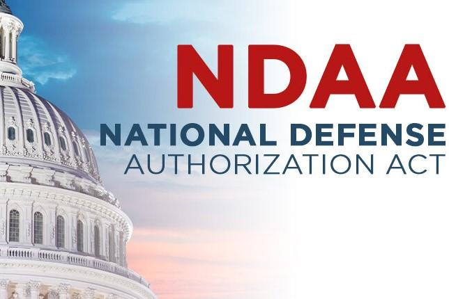

The National Defense Authorization Act (NDAA) for Fiscal Year 2023 is a vital legislative measure in shaping U.S. defense policy and military expenditure. With an authorized military budget of $858 billion, the NDAA underscores the United States' commitment to maintaining a formidable defense posture amid evolving global threats. This substantial budget allocation is integral to addressing the multifaceted challenges that the country faces in terms of national security and military readiness.

A key aspect of the NDAA FY 2023 is its focus on funding the Department of Defense (DoD), which is allocated $816.7 billion in authorizations. This allocation covers various strategic areas, including personnel pay raises, procurement of advanced military assets, and technological advancements in warfare capabilities. Additionally, there are provisions for $10.6 billion in extra-NDAA funding activities, aimed at enhancing U.S. defense capabilities through specific targeted investments. These financial allocations reflect the comprehensive scope of the NDAA in bolstering U.S. military strength.



Parallel to these discussions is the concept of algorithmic trading, a technique predominant in financial markets, which holds potential relevance to defense policy and budgeting. Algorithmic trading involves the use of automated, pre-programmed strategies to navigate complex financial transactions with efficiency and precision. Its application in defense budgeting could revolutionize how military funds are allocated and managed, offering objective and data-driven insights that could enhance the effectiveness of financial decision-making in this critical sector.

Understanding the interplay between such a massive defense budget and the potential advantages of integrating advanced financial technologies like algorithmic trading is crucial. In today's geopolitical climate, characterized by rapid technological change and shifting power dynamics, the ability to optimize defense budget allocations could provide a significant strategic advantage. The examination of these interconnections is essential for developing robust defense strategies that align with contemporary challenges and opportunities.

## Table of Contents

## Breakdown of the NDAA 2023 Military Budget

The National Defense Authorization Act (NDAA) for Fiscal Year 2023 represents a crucial legislative measure in defining and shaping U.S. defense policy through its substantial budgetary allocations. The NDAA 2023 authorized a total military budget of approximately $858 billion, which underscores the United States' commitment to maintaining and enhancing its defense capabilities.

A significant portion of this budget, approximately $816.7 billion, is specifically allocated to Department of Defense (DoD) authorizations. This allocation covers a broad spectrum of defense-related activities, including personnel expenses, operations, procurement, research and development, and maintenance. A notable area within this allocation is the provision for military pay raises, which reflects an ongoing commitment to supporting military personnel and ensuring competitive compensation. Additionally, the budget addresses the procurement of new aircraft and advanced weaponry, highlighting an emphasis on modernizing the U.S. military's operational capabilities and technological edge.

In addition to the primary DoD authorizations, the NDAA 2023 includes $10.6 billion earmarked for activities outside the standard NDAA funding framework. This extra-NDAA funding is typically used to address urgent or unforeseen defense requirements, provide disaster response support, and enhance national security initiatives that may not be fully covered under regular defense authorizations.

Among the significant investment areas, the emphasis on new aircraft procurement illustrates a strategic focus on enhancing aerial combat and surveillance capabilities. This includes acquiring advanced fighter jets and transport aircraft to replace aging fleets and improve the logistical and operational efficiency of the Air Force, Navy, and Marine Corps. Furthermore, investment in advanced weaponry, such as cyber defense systems, unmanned aerial vehicles (UAVs), and hypersonic technologies, showcases a prioritization of cutting-edge technologies designed to deter emerging threats and maintain strategic superiority.

In summary, the NDAA 2023 military budget reflects a carefully structured allocation aimed at strengthening the U.S. defense posture. Through targeted investments in personnel, modernization, and advanced technologies, the United States endeavors to bolster its national security and maintain readiness in addressing global challenges. This financial commitment underscores the broader objectives of ensuring military efficiency, readiness, and technological advancement amidst evolving geopolitical landscapes.

## Impact of NDAA on U.S. Defense Strategy

The National Defense Authorization Act (NDAA) for Fiscal Year 2023 significantly influences U.S. defense strategy by determining the allocation and prioritization of military resources. With a budget of $858 billion, increased funding plays a crucial role in enhancing national security and military readiness. This financial support helps shape defense strategies that address current threats while preparing for future challenges.

Increased funding impacts national security and military readiness by ensuring that the armed forces are well-equipped and prepared to respond to various scenarios. This includes investments in personnel, equipment, and technology that enhance the military's operational capabilities. By prioritizing these aspects, the NDAA supports a state of perpetual readiness, allowing quick and efficient responses to potential threats.

The NDAA also emphasizes strategic priorities, such as nuclear capabilities and defense infrastructure enhancements. The maintenance and modernization of nuclear arsenals remain a focal point, ensuring that the U.S. retains a credible nuclear deterrent. Investments in research and development related to nuclear weapons systems are crucial for maintaining a competitive edge.

Additionally, defense infrastructure enhancements are prioritized to ensure that military installations and facilities are up-to-date and capable of supporting advanced technologies and modern warfare requirements. This includes improvements in cybersecurity measures to protect critical information systems from potential attacks, thereby safeguarding military operations.

Overall, the NDAA serves as a roadmap for defense strategy, guiding the allocation of resources to meet strategic objectives and challenges. By focusing on increased funding, nuclear capabilities, and infrastructure enhancements, the Act helps the U.S. maintain its position as a formidable military power on the global stage.

## Algorithmic Trading in Defense Budgeting

Algorithmic trading refers to the use of computer algorithms to automate the execution of financial transactions in markets. These algorithms execute deals at speeds and volumes that humans cannot achieve, often optimizing the transaction's timing, price, and [volume](/wiki/volume-trading-strategy) to maximize returns and minimize costs. The relevance of [algorithmic trading](/wiki/algorithmic-trading) extends beyond conventional financial markets into areas such as defense budgeting, where the need for efficiency and strategic allocation of resources is paramount.

# to Algorithmic Trading

Algorithmic trading utilizes complex mathematical models and advanced software to make decisions at speeds much faster than any human trader can. The algorithms can identify profitable opportunities and execute trades accordingly based on pre-set criteria or real-time market data. Key components include:

- **Data Analysis**: Algorithms analyze large datasets to identify trends and patterns.
- **Automation**: Minimizes human intervention and error, improving efficiency and execution speed.
- **Predictive Analytics**: Utilizes statistical models and machine learning to forecast future trends.

### Potential Applications in Defense Budgets

Incorporating algorithmic trading techniques into defense budgeting could revolutionize how military resources are allocated. Potential applications involve:

1. **Resource Optimization**: Much like in financial markets, algorithms can be used to optimize defense spending. They can identify cost-saving opportunities by forecasting future needs versus historical spend patterns.

2. **Risk Management**: Algorithms could simulate various geopolitical scenarios and predict their financial implications, allowing for better preparation and risk mitigation.

3. **Efficiency Gains**: Automated systems could reduce the bureaucratic lag in budget allocations and financial decision-making, ensuring faster deployment of funds where they are most needed.

### Enhancing Decision-Making with Data-Driven Strategies

Data-driven strategies can significantly enhance financial decision-making within military contexts by offering insights that are not immediately apparent through traditional methods. Algorithms can process vast quantities of data to derive actionable insights, such as:

- **Scenario Analysis**: Algorithms can swiftly analyze multiple what-if scenarios, providing decision-makers with the outcomes and implications, which aids in robust strategic planning.

- **Cost-Benefit Analysis**: Algorithms can weigh the pros and cons of investing in specific areas, helping prioritize projects with the highest returns on investment.

- **Predictive Maintenance**: Monitoring equipment and predicting failures before they occur can save significant sums on repairs and downtime by allocating budgetary resources more effectively.

### Example: Simple Budget Optimization Model

Consider a basic budget optimization problem where the defense budget needs to be allocated optimally across several departments. Suppose there are $n$ departments, each requiring a specific budget allocation $x_i$, and the total available budget is $B$. The goal is to maximize the utility of the allocation while ensuring the sum does not exceed the available budget. A simple mathematical representation could be:

$$
\text{Maximize } U = \sum_{i=1}^{n} u_i(x_i)
$$
$$
\text{Subject to} \sum_{i=1}^{n} x_i \leq B
$$

In Python, this optimization can be performed using libraries like `scipy.optimize`:

```python
from scipy.optimize import linprog

# Example coefficients (utility values)
u = [-5, -4, -6]
# Example constraints
A = [[1, 1, 1]]
b = [100]

# perform the linear programming optimization
result = linprog(c=u, A_ub=A, b_ub=b, bounds=(0, None))

print('Optimal budget allocations:', result.x)
```

This type of algorithmic approach helps to determine the best allocation of the defense budget across competing needs, ensuring that resources are utilized efficiently to meet strategic military objectives. Integrating such methodologies into defense budgeting processes can empower military planners with robust, data-backed strategies for effective financial management.

## Challenges and Opportunities

The implementation of the National Defense Authorization Act (NDAA) budget allocations presents several challenges that require comprehensive analysis and strategic management. One primary challenge lies in ensuring that the massive $858 billion budget is effectively utilized to meet the U.S. military's diverse requirements without waste or misallocation. This involves rigorous oversight and auditing mechanisms to track expenditures and ensure alignment with strategic objectives.

The integration of algorithmic trading and financial technology into defense finance offers significant opportunities but also presents its own set of challenges. Algorithmic trading, well established in the financial markets, uses computer programs to execute trades based on predefined criteria. In the context of defense budgeting, these algorithms could potentially optimize the allocation process by analyzing vast quantities of data to identify cost-saving opportunities and improve efficiency.

One of the opportunities is the use of predictive analytics through algorithm-driven decision-making. By leveraging historical data and market trends, algorithms can forecast future financial conditions and budgetary needs, potentially enhancing the precision of long-term defense planning. The increase in efficiency can also lead to significant cost reductions, allowing for reallocations towards critical defense areas such as cybersecurity, advanced weaponry, and infrastructure improvements.

However, adopting these financial algorithms within the defense sector is fraught with risks and ethical considerations. A significant risk involves algorithmic bias, where the data used to train the algorithms may yield prejudiced outcomes, inadvertently influencing defense priorities unethically. This risk necessitates robust regulatory frameworks to ensure that algorithmic decisions are transparent, fair, and aligned with national interests.

Moreover, there is the challenge of cybersecurity. Algorithms, particularly those involving sensitive defense data, are susceptible to cyber threats. Ensuring the security of these systems is paramount to safeguard against data breaches and potential manipulation by adversaries.

Ethical considerations also encompass the balance between human oversight and automated decision-making. While algorithmic efficiency is a significant advantage, over-reliance on machines could downplay the nuanced insights and judgments that human leadership provides. Establishing a hybrid model where algorithms support, rather than replace, human decisions could offer a balanced solution.

In conclusion, while integrating algorithmic trading techniques into defense budgeting presents promising opportunities for efficiency and optimization, it requires careful navigation of challenges related to security, bias, and ethical governance. Comprehensive strategies will be essential to harness these technologies effectively while safeguarding the integrity of U.S. defense operations.

## Conclusion

The National Defense Authorization Act (NDAA) for Fiscal Year 2023 represents a pivotal element in shaping U.S. defense policy, underscoring a commitment to bolster military capability and readiness through a substantial allocation of $858 billion. This investment is crucial for maintaining national security, advancing technological capabilities, and ensuring the U.S. military remains a formidable force in an increasingly complex global landscape. The NDAA 2023 facilitates strategic advancements, including enhancements to nuclear capabilities, defense infrastructure, and personnel development, which are essential to addressing contemporary security challenges.

As defense budgeting navigates the complexities of modern warfare and technological evolution, incorporating algorithmic trading offers a transformative approach to financial decision-making. Algorithmic trading, traditionally utilized in financial markets for efficiency and optimization, provides a framework for data-driven budgeting processes. By leveraging algorithms, defense budgeting can achieve enhanced accuracy and predictability, optimizing resource allocation and enabling responsive financial strategy development. This integration can facilitate a dynamic adaptation to fiscal constraints and fluctuations in defense priorities.

Looking ahead, the confluence of defense policy, finance, and technology demands a forward-thinking approach that embraces innovation and efficiency. The adoption of advanced technologies, such as algorithmic trading, in military budgeting signifies a progressive shift towards refined financial management strategies. Ensuring ethical and strategic frameworks guide this evolution remains critical to minimizing risks and fully capitalizing on potential benefits. As the geopolitical landscape continues to evolve, the ability to integrate cutting-edge financial technologies will be pivotal in maintaining an adaptable, resilient, and strategically agile military force.

## FAQs

### What is the National Defense Authorization Act (NDAA)?

The National Defense Authorization Act (NDAA) is a critical legislative measure in the United States that outlines the budgetary and policy priorities for the Department of Defense (DoD) annually. Each fiscal year, the NDAA authorizes funding for military activities, including personnel salaries, equipment acquisition, research, and development. It serves as a primary tool for Congress to influence defense policy, shaping the structure and capabilities of the U.S. military. The NDAA not only determines fiscal allocations but also sets the legislative framework for defense operations, international military cooperation, and military procurement strategies.

### How does NDAA funding impact U.S. military operations?

The funding allocations within the NDAA directly influence U.S. military operations by determining the available resources for defense initiatives. These allocations affect a wide range of operational aspects, including the maintenance and advancement of military technology, the sustainment of troop deployments, and the strategic readiness of military forces. Moreover, increased funding for specific areas such as cybersecurity, space defense, or nuclear capabilities can lead to enhancements in those sectors, thereby shaping national defense strategies and fulfilling geopolitical objectives. Adequate and well-planned funding ensures military readiness and adaptability in response to evolving global threats.

### What is algorithmic trading and its significance to the military budget?

Algorithmic trading is the use of automated, pre-programmed trading instructions to execute orders in financial markets. These algorithms can analyze vast datasets much faster than humanly possible, optimizing decision-making processes. In the context of the military budget, algorithmic trading could be utilized to optimize the financial management of defense funds. Its relevance lies in its ability to increase efficiency in resource allocation, reduce waste, and potentially save costs, which can be redirected towards critical defense needs. Implementing algorithmic strategies in defense budgeting could facilitate more precise and adaptive financial planning, thereby enhancing overall military effectiveness.

### What are the main challenges in integrating financial technology in defense budgeting?

Integrating financial technology, like algorithmic trading, in defense budgeting presents several challenges. One major challenge is data security; ensuring sensitive defense data remains protected from cyber threats is paramount. Additionally, the complexity of defense budgets, which include varied and often classified expenses, demands a robust and adaptable technological solution. There are also ethical considerations regarding transparency and accountability in the automation of budgeting decisions. Resistance to change from traditional budgeting processes may further impede integration efforts. Finally, ensuring regulatory compliance and maintaining oversight over algorithm-driven financial decisions necessitate vigilant management to prevent unintended consequences.

## References & Further Reading

[1]: ["The National Defense Authorization Act: An Overview"](https://www.congress.gov/118/plaws/publ31/PLAW-118publ31.pdf) Congressional Research Service Report.

[2]: "Algorithmic Trading: Winning Strategies and Their Rationale" by Ernie Chan.

[3]: ["National Defense Authorization Act for Fiscal Year 2023: Summary of Major Provisions"](https://www.congress.gov/bill/117th-congress/house-bill/7900) U.S. Congress Bill Summary.

[4]: "Advances in Financial Machine Learning" by Marcos Lopez de Prado.

[5]: ["The Future of Financial Technology in Defense"](https://www.kearney.com/industry/aerospace-defense/article/the-future-of-defense-is-digital-unlocking-the-full-potential-of-technology-in-defense) RAND Corporation.