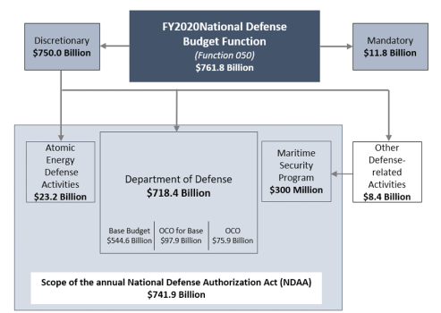

## Table of Contents

## What is the National Defense Authorization Act (NDAA)?

The National Defense Authorization Act (NDAA) is a United States federal law that is passed every year. It sets the budget and policies for the Department of Defense and the national security programs of the United States. This act is important because it decides how much money the military will get and what they can spend it on. It also includes rules and guidelines that the military must follow.

The NDAA covers a wide range of topics, including military pay, benefits, and retirement. It also deals with the purchase of new weapons and equipment, as well as research and development projects. Because it is such an important piece of legislation, the NDAA is often debated and discussed by members of Congress. They make changes and additions to the bill before it is finally passed and signed into law by the President.

## How often is the NDAA passed by Congress?

The National Defense Authorization Act, or NDAA, is passed by Congress every year. This means that every year, lawmakers in the United States come together to decide on the budget and rules for the military.

The process starts with different committees in Congress working on the bill. They talk about what the military needs and how much money it should get. After a lot of discussion and changes, the final version of the NDAA is voted on by the whole Congress. If it passes, it goes to the President to be signed into law.

## What are the main purposes of the NDAA?

The National Defense Authorization Act, or NDAA, has a few main purposes. One big purpose is to set the budget for the military. This means deciding how much money the Department of Defense will get each year. The NDAA also decides what the military can spend that money on, like new weapons, equipment, and research projects.

Another important purpose of the NDAA is to set rules and guidelines for the military. This includes things like how much soldiers get paid, what benefits they receive, and how they can retire. The NDAA makes sure that the military follows certain rules and does things in a certain way.

Overall, the NDAA is really important because it helps make sure the military has the money and rules it needs to keep the country safe. Every year, Congress works hard to pass the NDAA so that the military can plan and do its job well.

## Who typically drafts the NDAA?

The National Defense Authorization Act, or NDAA, is usually drafted by committees in the United States Congress. These committees are made up of lawmakers who focus on military and defense issues. The main committees that work on the NDAA are the House Armed Services Committee and the Senate Armed Services Committee. These committees start by looking at what the military needs and then they write the first version of the bill.

After the committees draft the NDAA, it goes through a lot of changes. Other members of Congress can suggest new ideas or changes to the bill. The House and Senate each work on their own version of the NDAA. Then, they come together to make one final version that both sides agree on. Once the final version is ready, it gets voted on by the whole Congress. If it passes, it goes to the President to be signed into law.

## How does the NDAA affect the Department of Defense's budget?

The National Defense Authorization Act, or NDAA, is really important because it decides how much money the Department of Defense can spend each year. This act sets the budget for the military, which means it tells them exactly how much money they have to work with. The NDAA looks at what the military needs, like new weapons, equipment, and research projects, and then decides how much money to give for each of these things.

When Congress passes the NDAA, it gives the Department of Defense a clear plan for how to spend their money. This helps the military know what they can afford and what they need to focus on. Without the NDAA, the Department of Defense wouldn't know how much money they would get or what they could spend it on, which would make it hard for them to plan and do their job well.

## What types of provisions are commonly included in the NDAA?

The National Defense Authorization Act, or NDAA, includes many different types of provisions. One common type is about money. The NDAA decides how much money the military will get and what they can spend it on. This can include things like new weapons, equipment, and research projects. It also covers how much soldiers get paid and what benefits they receive, like health care and retirement plans.

Another type of provision in the NDAA is about rules and policies. These rules tell the military how to do their job. For example, the NDAA might include rules about how the military should treat its soldiers or how they should work with other countries. These policies help make sure the military follows certain standards and does things the right way.

Sometimes, the NDAA also includes provisions that are not directly about the military. These can be about other things that Congress thinks are important, like protecting the environment or helping veterans. Even though these provisions might not seem related to the military, they are still part of the NDAA because Congress uses this big bill to get a lot of important things done at once.

## Can you explain the legislative process of the NDAA?

The National Defense Authorization Act, or NDAA, goes through a long process before it becomes a law. It starts with the House Armed Services Committee and the Senate Armed Services Committee. These groups of lawmakers work together to write the first version of the NDAA. They look at what the military needs and decide how much money the military should get. Once they finish writing the first draft, the bill moves to the full House of Representatives and the Senate. Each group votes on their own version of the NDAA, and they might make changes to it.

After both the House and Senate vote on their versions, leaders from both groups come together to make one final version of the NDAA. This is called a conference committee, and they work to agree on all the details. Once they have a final version that everyone agrees on, the NDAA goes back to the House and Senate for one more vote. If it passes in both places, the bill goes to the President. The President can either sign the NDAA into law or send it back to Congress with changes. If the President signs it, the NDAA becomes the law that sets the military's budget and rules for the year.

## What are some controversial aspects of the NDAA?

Sometimes, the National Defense Authorization Act, or NDAA, has parts that people argue about. One big issue is when the NDAA includes rules about things that are not just about the military. For example, some years the NDAA has had rules about the environment or how to treat prisoners. People who don't like these rules say that the NDAA should only be about the military, not other things. They think it's not fair to use the NDAA to pass laws that might not pass on their own.

Another controversial part of the NDAA is about money. The NDAA decides how much money the military gets, and sometimes people think it's too much or too little. Some people want to spend more money on the military to make it stronger, while others think the money could be better spent on things like schools or health care. This can lead to big arguments in Congress about how to spend the country's money.

Also, the NDAA sometimes has rules about how the military can treat people, like soldiers or prisoners. Some of these rules can be very controversial. For example, there have been debates about whether the military should be allowed to hold people without a trial. These kinds of rules can make people very upset and lead to a lot of discussion and disagreement.

## How does the NDAA impact military personnel and their families?

The National Defense Authorization Act, or NDAA, is really important for military personnel and their families because it decides how much money soldiers get paid and what benefits they can have. The NDAA sets the pay raises for soldiers every year. This means that if the NDAA says soldiers will get a raise, they will have more money to spend on things like food, rent, and other needs. The NDAA also decides what kinds of benefits soldiers and their families can get, like health care and help with housing. These benefits can make a big difference in the lives of military families, helping them feel more secure and taken care of.

Another way the NDAA impacts military personnel and their families is by setting rules about how the military should treat its soldiers. For example, the NDAA can include rules about how the military should handle sexual assault cases or how they should support soldiers who are dealing with mental health issues. These rules can make a big difference in the lives of soldiers and their families, helping to create a safer and more supportive environment. Overall, the NDAA is a very important law that helps make sure military personnel and their families have the support and resources they need.

## What role does the NDAA play in national security policy?

The National Defense Authorization Act, or NDAA, is a big part of the country's national security policy. It decides how much money the military gets every year and what they can spend it on. This helps keep the country safe because the military can buy new weapons, equipment, and do important research to stay strong and ready. The NDAA also sets rules and guidelines that the military has to follow. These rules can be about how the military works with other countries or how they should treat their soldiers. By setting these rules, the NDAA helps make sure the military does its job in a way that keeps the country safe.

Sometimes, the NDAA includes other things that are important for national security, even if they are not directly about the military. For example, the NDAA might have rules about protecting the environment or helping veterans. These things can help keep the country strong and safe in different ways. Even though the NDAA is mainly about the military, it can also be used to pass other laws that Congress thinks are important for national security. This makes the NDAA a very important tool for keeping the country safe and secure.

## How has the scope of the NDAA evolved over the years?

The National Defense Authorization Act, or NDAA, has changed a lot over the years. When it first started, the NDAA was mainly about setting the budget for the military. It decided how much money the military would get and what they could spend it on, like new weapons and equipment. But over time, the NDAA started to include more things. It began to set rules and guidelines for the military, like how much soldiers get paid and what benefits they can have. This made the NDAA more important and helped it cover a wider range of topics.

Now, the NDAA is not just about the military's budget anymore. It has grown to include rules and policies about many different things that affect national security. For example, the NDAA might have rules about how the military should treat its soldiers or how they should work with other countries. It can also include things that are not directly about the military, like protecting the environment or helping veterans. This shows how the NDAA has become a big tool for Congress to pass important laws and make decisions about national security.

## What are the implications of the NDAA for international military cooperation?

The National Defense Authorization Act, or NDAA, can affect how the United States works with other countries on military matters. The NDAA sets rules about how the military can cooperate with other nations. This might include rules about sharing information, doing joint military exercises, or working together on defense projects. These rules help make sure that the U.S. military works with other countries in a way that keeps everyone safe and follows international laws.

Sometimes, the NDAA can also change how much money the U.S. spends on international military cooperation. If the NDAA decides to give more money for working with other countries, it can help build stronger relationships and make the world safer. On the other hand, if the NDAA cuts back on this money, it might make it harder for the U.S. to work closely with other nations. This shows how important the NDAA is for deciding how the U.S. works with other countries to keep the world safe.

## References & Further Reading

[1]: ["National Defense Authorization Act: An Overview"](https://crsreports.congress.gov/product/pdf/IF/IF10891) by the Congressional Research Service

[2]: ["Algorithms for Hyper-Parameter Optimization"](https://dl.acm.org/doi/10.5555/2986459.2986743) by Bergstra, J., Bardenet, R., Bengio, Y., & Kégl, B., Advances in Neural Information Processing Systems 24.

[3]: Lopez de Prado, M. (2018). ["Advances in Financial Machine Learning"](https://www.amazon.com/Advances-Financial-Machine-Learning-Marcos/dp/1119482089). John Wiley & Sons.

[4]: Aronson, D. R. (2006). ["Evidence-Based Technical Analysis: Applying the Scientific Method and Statistical Inference to Trading Signals"](https://www.amazon.com/Evidence-Based-Technical-Analysis-Scientific-Statistical/dp/0470008741). John Wiley & Sons.

[5]: Jansen, S. (2020). ["Machine Learning for Algorithmic Trading"](https://github.com/stefan-jansen/machine-learning-for-trading). Packt Publishing.

[6]: Chan, E. P. (2009). ["Quantitative Trading: How to Build Your Own Algorithmic Trading Business"](https://github.com/ftvision/quant_trading_echan_book). John Wiley & Sons.