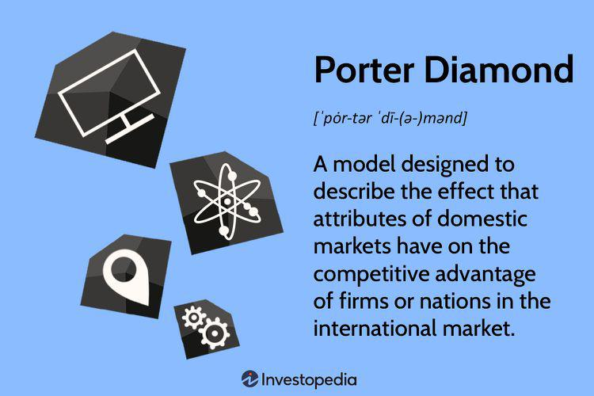

Economic theory has long served as the backbone of business strategies, guiding decision-making processes and shaping competitive landscapes. Understanding how these theories can be integrated into modern business practices is essential for any organization aiming to thrive in today's fast-paced global market. At this intersection, we find two pivotal concepts: Michael Porter's National Diamond Model and algorithmic trading.

Michael Porter's National Diamond Model offers a comprehensive framework for understanding national competitiveness. It outlines four main components: firm strategy, structure, and rivalry; related and supporting industries; demand conditions; and factor conditions. These components help in identifying the sources of competitive advantage that countries or regions possess, making it a crucial tool for businesses that are crafting strategies to compete on a global scale. Recognizing the importance of these dynamics enables businesses to leverage national strengths and enhance their global competitive standing.



On the technological frontier, algorithmic trading represents a significant shift in how financial markets operate. This method leverages complex algorithms and data analytics to automate trading processes, offering speed and precision that far exceed human capabilities. The significance of algorithmic trading lies in its ability to process vast amounts of data and execute trades at lightning speed, which provides a substantial competitive edge in today’s financial markets. It has transformed the trading landscape by introducing efficiencies that were unimaginable in traditional settings, allowing firms to capitalize on even the slightest market movements.

Together, these frameworks highlight an intriguing juxtaposition and potential synergies. While the National Diamond Model provides a strategic lens for understanding and harnessing national competitiveness, algorithmic trading embodies the cutting edge of technological advancement in market activities. Integrating these concepts can enable businesses to effectively navigate complex, multi-faceted environments, tailoring their strategies to meet both the demands of the national context and the rapid pace of technological advancement.

This article will explore further how these concepts are not only vital in their own right but also how their integration stands as a beacon for future innovation within global business strategy. Moving forward, it will be crucial to understand these intersections to fully grasp the evolving dynamics of international competition and market operations.

## Table of Contents

## Understanding Economic Theory and the National Diamond Model

The National Diamond Model, introduced by Michael Porter, is a framework designed to analyze the competitive advantage of nations. This model is articulated through four central components: firm strategy, structure, and rivalry; related and supporting industries; demand conditions; and factor conditions.

1. **Firm Strategy, Structure, and Rivalry**: This element underscores the importance of domestic competition and organization. How companies are created, organized, and managed within a nation can influence competitive advantage. Domestic rivalry compels firms to innovate and improve in response to local competitive pressures, which can lead to superior global performance.

2. **Related and Supporting Industries**: The presence and quality of supplier industries and related sectors in a country significantly affect competitive advantage. When local supportive industries are robust and globally competitive, firms benefit from cost-effective inputs and synergy in innovation, thereby enhancing overall competitiveness.

3. **Demand Conditions**: These describe the nature of home-market demand for an industry’s products or services. Sophisticated and demanding local customers push firms to innovate, creating competitive products and services that can succeed internationally. A strong local demand often provides a clearer insight into emerging customer needs worldwide.

4. **Factor Conditions**: Factor conditions refer to the nation's position regarding factors of production, such as skilled labor, infrastructure, and technological base. Contrary to classical theories that stressed basic factors like natural resources, Porter's model emphasizes advanced factors like a skilled workforce, technological prowess, and innovation infrastructure which can be shaped highly by human influence.

The model serves as a framework for understanding national competitiveness by illustrating how these interconnected elements combine within a geographic location to promote or inhibit a nation's economic performance. It posits that certain conditions in a country create an environment conducive to the continuous advancement of industries, fostering a self-reinforcing cycle of national competitive advantage.

Governments play a crucial role in shaping this competitive advantage through strategic policies and support mechanisms. Policymakers can enhance national competitiveness by investing in education, creating infrastructure, promoting fair competition, and developing policies that encourage innovation and entrepreneurship. Strategic government interventions can build advanced factors, support industries, and positively influence demand conditions, thus playing a vital role in a nation's economic strategy.

In sum, the National Diamond Model provides a comprehensive view of the elements necessary to develop a sustainable competitive advantage at a national level. It reveals how interconnected sectors and strategic government actions together shape a thriving economic landscape, creating a fertile ground for industries to excel in the global marketplace.

## Application of the National Diamond Model in Business Strategy

The National Diamond Model, developed by Michael Porter, serves as an analytical framework for businesses to understand the factors that contribute to national competitiveness and, subsequently, shape their global strategies. This model comprises four principal components: firm strategy, structure, and rivalry; related and supporting industries; demand conditions; and [factor](/wiki/factor-investing) conditions. Businesses globally leverage these components to tailor strategic decisions that strengthen their competitive position.

Firms exploit the model's quadrant of firm strategy, structure, and rivalry to assess their internal capabilities and external competition. For instance, strategy formulation driven by intense rivalry results in innovation and operational efficiency. Companies such as Toyota, renowned for their lean manufacturing and continuous improvement processes, exemplify the strategic benefits derived from a highly competitive domestic environment. This is also evident in Silicon Valley, where tech companies thrive on rigorous competition, boosting their global standing.

The quadrant of related and supporting industries underlines the importance of networking and collaboration. Businesses situated in vibrant industrial clusters capitalize on these ecosystems for symbiotic relationships that drive product development and innovation. Germany’s automotive industry illustrates this, as firms like BMW and Daimler benefit from world-class engineering suppliers and cutting-edge technology sectors, promoting excellence in quality and performance.

Demand conditions further influence business strategy by emphasizing the significance of discerning and sophisticated domestic markets. High consumer expectations compel firms to exceed performance standards, thus enhancing their global attractiveness. Japanese electronics companies such as Sony and Panasonic leverage their home market's demand for advanced technology, leading to the production of superior products that cater to international tastes.

Factor conditions highlight the accessibility of resources like skilled labor and capital which significantly impact competitive advantage. A country endowed with a robust educational sector and research facilities, like India with its large pool of IT professionals, attracts software and service companies globally, embedding itself within global IT solutions value chains.

Despite the robust framework provided by the National Diamond Model, businesses face challenges in its application across varied national contexts. Differences in regulatory environments and economic stability can impede strategic alignment. In certain emerging markets, inadequate infrastructure, limited technological adoption, or protectionist policies present barriers that firms must navigate. Moreover, cultural nuances and consumer preferences necessitate cultural agility and customization of products and services to resonate with local markets.

Overall, the National Diamond Model provides a comprehensive blueprint for firms to devise strategies that leverage their country’s specific attributes while remaining responsive to global pressures. Strategic adaptation and agility enable firms to transform these theoretical principles into practical competitive advantages on the international stage.

## Algorithmic Trading: Transforming Business Strategy

Algorithmic trading, a method of executing trades using automated pre-programmed strategies, has fundamentally reshaped modern financial markets. Leveraging technology and data analytics, [algorithmic trading](/wiki/algorithmic-trading) facilitates the swift processing and execution of complex trading strategies with minimal human intervention. Its impact is seen across various market dimensions, including [liquidity](/wiki/liquidity-risk-premium), market efficiency, and price discovery.

At the core of algorithmic trading is the utilization of advanced computational techniques and vast datasets. Algorithms analyze historical and real-time market data to identify patterns, adjust trading strategies, and execute orders at speeds far superior to human capability. Technologies like [machine learning](/wiki/machine-learning) and [artificial intelligence](/wiki/ai-artificial-intelligence) further enhance these algorithms, enabling them to adapt to ever-changing market conditions and refine their strategies accordingly.

The automation of trading processes is achieved through various technological methodologies. High-frequency trading ([HFT](/wiki/high-frequency-trading-strategies)), for example, involves executing a large number of orders at extremely fast speeds, often within microseconds. Statistical [arbitrage](/wiki/arbitrage) leverages complex mathematical models to identify and exploit price inefficiencies across different markets or securities. These approaches rely heavily on programming languages like Python and C++, which are used to develop and maintain sophisticated trading algorithms.

To illustrate a basic algorithmic trading strategy in Python, consider a simple moving average crossover:

```python
import pandas as pd

# Load historical stock price data
data = pd.read_csv('historical_prices.csv')

# Calculate moving averages
data['SMA_50'] = data['Close'].rolling(window=50).mean()
data['SMA_200'] = data['Close'].rolling(window=200).mean()

# Define buy and sell signals
data['Signal'] = 0
data['Signal'][50:] = np.where(data['SMA_50'][50:] > data['SMA_200'][50:], 1, 0)

# Generate trading signals
data['Position'] = data['Signal'].diff()
```

This script calculates the 50-day and 200-day simple moving averages of a stock's price and generates buy or sell signals when these averages cross, illustrating a foundational concept in technical trading.

Despite its advantages, algorithmic trading carries inherent risks. The high-speed nature of automated trading can lead to significant market disruptions, such as the "Flash Crash" of 2010. Poorly designed algorithms, meanwhile, can exacerbate [volatility](/wiki/volatility-trading-strategies) and result in substantial financial losses. Furthermore, the potential for system errors, data inaccuracies, and cybersecurity threats pose additional risks to algorithmic traders.

Nevertheless, the benefits of algorithmic trading are substantial. It enhances market liquidity by facilitating faster and more efficient trade executions. This increased efficiency can lead to tighter bid-ask spreads, benefiting all market participants. Moreover, algorithmic trading promotes greater price transparency and discovery, as the rapid processing of information results in more accurate reflections of a security's intrinsic value.

In sum, algorithmic trading has transformed business strategy by leveraging technological advancements to optimize trading operations. While it brings notable benefits, careful risk management and regulatory oversight are essential to mitigate the associated challenges and ensure market stability.

## Integration of National Diamond Model and Algorithmic Trading

The integration of the National Diamond Model with algorithmic trading represents an innovative approach to gaining competitive advantage in global markets. By combining a structured national strategy with the flexibility and precision of tech-driven trading models, companies can leverage the strengths of both approaches to optimize performance and enhance their competitive positioning.

The National Diamond Model, developed by Michael Porter, provides a framework that outlines the determinants of national competitiveness: firm strategy, structure, and rivalry; related and supporting industries; demand conditions; and factor conditions. When businesses utilize this model, they can better understand the unique competitive advantages offered by their home countries. This strategic insight allows companies to identify how national resources and policies contribute to their competitive edge in a global market.

On the other hand, algorithmic trading utilizes advanced technologies and data analytics to execute trades automatically and at high speed. This approach offers the benefits of increased market efficiency, reduced transaction costs, and the ability to exploit market opportunities that might be invisible to traditional traders. The use of algorithms allows firms to react instantaneously to market changes, enhancing their ability to maintain competitive pricing and improve market reach.

The synergy between the National Diamond Model and algorithmic trading lies in the balance of strategic foresight and operational agility. For instance, a firm that has identified its competitive advantage through the National Diamond Model can use algorithmic trading to implement these strategies more effectively. By leveraging data-driven insights and automating processes, businesses can optimize their operations in line with national strengths and quickly adapt to dynamic market conditions.

Moreover, the potential for innovation is significant when these models are integrated. Companies can explore innovative financial products or investment strategies that align with their national advantages and tailored marketing strategies that respond promptly to consumer demand. For example, a firm from a nation with strong technological infrastructure might focus on developing cutting-edge trading algorithms that capitalize on this domestic strength.

In global markets, where competitive pricing is crucial, the integration of national strategies with algorithmic trading can lead to optimal pricing models. These models consider both local determinants of competitiveness and real-time market data, allowing firms to set prices that reflect their strategic positioning and maximize profitability.

In conclusion, the integration of the National Diamond Model with algorithmic trading can deliver a robust competitive advantage by combining strategic national elements with the operational efficiency of modern trading techniques. This approach not only optimizes existing strategies but also opens avenues for innovation and dynamic market engagement, positioning firms for long-term success in the global marketplace.

## Case Study: Real-World Applications

In the evolving landscape of global business, companies have increasingly sought to integrate Michael Porter's National Diamond Model with algorithmic trading to enhance their competitive strategies. This section presents real-world case studies of firms that have successfully combined these concepts to bolster their market reach, improve operational efficiency, and sharpen their competitive positioning.

### Case Study 1: Goldman Sachs

Goldman Sachs, a leading global investment bank, serves as a prime example of integrating algorithmic trading techniques with a strategic framework akin to the National Diamond Model to strengthen its competitive edge. The bank has long utilized algorithmic trading to optimize its trading operations, using complex algorithms that leverage data analytics and machine learning to execute trades swiftly and accurately.

**Impact on Market Reach and Efficiency:**

- **Market Reach:** By employing algorithmic trading, Goldman Sachs significantly expanded its market penetration capability. The rapid execution of trades across multiple global markets has enabled the firm to react quickly to market opportunities, thereby extending its global footprint.

- **Efficiency:** With algorithms that process vast datasets and identify patterns at speeds unattainable by humans, Goldman Sachs has drastically reduced latency in trade execution, leading to enhanced overall trading efficiencies.

**Competitive Positioning:**

Through the effective convergence of algorithmic trading and strategic business principles, Goldman Sachs remains competitive in the intensely challenging financial sector. By continuously refining its algorithms to respond to the ever-shifting market dynamics, the firm has maintained robust competitive positioning, characterized by innovative service offerings and enhanced client satisfaction.

### Case Study 2: Toyota

Toyota, a global automotive leader, demonstrates how the National Diamond Model can be integrated with advanced statistical operations and optimization techniques. This approach has helped Toyota sustain its top-ranking position in the automotive industry.

**Impact on Market Reach and Efficiency:**

- **Market Reach:** By tailoring its production and marketing strategies to match the demand conditions and factor conditions outlined in the National Diamond Model, Toyota has succeeded in capturing significant market shares in diverse regions, including North America, Europe, and Asia.

- **Efficiency:** The company utilizes data-driven insights and predictive analytics to streamline its supply chain, reduce costs, and optimize manufacturing processes. This adaptation has resulted in improved production efficiency and heightened responsiveness to market demands.

**Competitive Positioning:**

Toyota’s integration of a structured strategy with digital tools amplifies its competitiveness. By aligning its firm strategy and structure with algorithm-enhanced insights, Toyota continues to leverage its manufacturing excellence and innovation capabilities, sustaining its advantage over competitors.

### Lessons and Best Practices

**Integration Synergies:**

Both Goldman Sachs and Toyota illuminate the vital synergy achievable by integrating algorithmic trading with the National Diamond Model. By aligning technological advancements with strategic frameworks, firms can achieve elevated market reach and efficiency.

**Continuous Innovation:**

A crucial takeaway is the necessity for continuous innovation. For firms to remain competitive, they must consistently refine their technological and strategy-based methodologies, ensuring alignment with global market demands.

**Data-Driven Decision Making:**

Leveraging data analytics is central to enhancing strategic decisions. By basing decisions on robust data insights, firms can navigate market complexities with greater precision and adaptability.

In conclusion, these case studies underscore the transformative impact of integrating the National Diamond Model with technology-driven trading strategies, offering invaluable insights into effective market engagement and competition management.

## Conclusion

Blending economic theory with modern business strategies proves crucial in navigating the complexities of today's globalized markets. The integration of models such as Michael Porter's National Diamond Model with cutting-edge strategies like algorithmic trading illustrates the potential for businesses to leverage both structured frameworks and technological advancements for competitive advantage. The National Diamond Model provides a robust framework to understand and enhance national competitiveness by examining firm strategy, supporting industries, demand conditions, and factor conditions. When businesses overlay this model with agile financial strategies such as algorithmic trading, they benefit from enhanced efficiency and market intelligence.

Innovation stands at the heart of enhancing both national and corporate competitiveness. By continually evolving their strategies, businesses can not only respond effectively to changing global trends but also anticipate future shifts. The synergy between data-driven decision-making and traditional economic frameworks highlights the transformative potential of technology in business strategies. For instance, algorithmic trading capitalizes on real-time data analytics, offering firms the agility to execute trades efficiently, minimize risk, and operate at optimal pricing levels. This integration fosters an environment where businesses are better positioned to capitalize on innovation-driven growth.

Looking ahead, several trends are set to shape the integration of economic theory and business strategy. The growing importance of sustainability in business practices will likely necessitate models that incorporate environmental and social governance factors. Moreover, advancements in artificial intelligence and machine learning promise to further enhance the capabilities of algorithmic trading, offering deeper insights and more precise strategies tailored to specific market conditions. Consequently, future research avenues may explore the interplay between these technological advancements and traditional competitiveness models, potentially leading to new theories and models that better serve the global marketplace. By remaining at the intersection of economic theory and technological innovation, businesses and policymakers alike can better navigate the complexities of a rapidly evolving economic landscape.

## References & Further Reading

[1]: Porter, M. E. (1990). ["The Competitive Advantage of Nations."](https://hbr.org/1990/03/the-competitive-advantage-of-nations) Harvard Business Review.

[2]: [Porter, M. E. (1985). "Competitive Advantage: Creating and Sustaining Superior Performance."](https://www.hbs.edu/faculty/Pages/item.aspx?num=193) Free Press.

[3]: Aldridge, I. (2013). ["High-Frequency Trading: A Practical Guide to Algorithmic Strategies and Trading Systems."](https://www.amazon.com/High-Frequency-Trading-Practical-Algorithmic-Strategies/dp/1118343506) Wiley.

[4]: Chincarini, L. B. (2012). ["Quantitative Equity Portfolio Management: An Active Approach to Portfolio Construction and Management."](https://www.amazon.com/Quantitative-Equity-Portfolio-Management-Second/dp/1264268920) McGraw Hill.

[5]: Stiglitz, J. E. (2002). ["Globalization and Its Discontents."](https://www.researchgate.net/publication/4755241_Joseph_E_Stiglitz_2002_Globalization_and_Its_Discontents) W.W. Norton & Company.