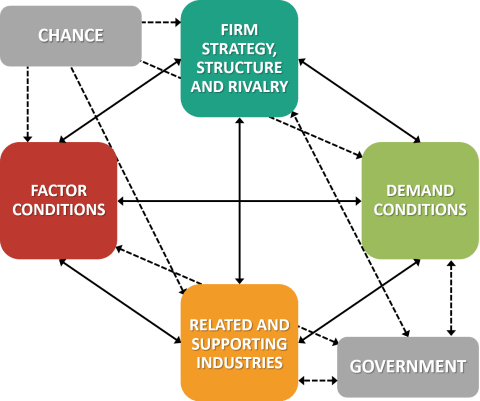

## Table of Contents

## What is the National Diamond Theory?

The National Diamond Theory is a model developed by Michael Porter to explain why certain countries are more competitive in specific industries. It suggests that a nation's success in a particular industry depends on four main factors: factor conditions, demand conditions, related and supporting industries, and firm strategy, structure, and rivalry. These factors together form a 'diamond' that shapes the competitive advantage of a country in the global market.

Factor conditions include the nation's resources like skilled labor, infrastructure, and technology. Demand conditions refer to the nature of home-market demand for the industry's product or service. Related and supporting industries are those that provide inputs or complementary products. Lastly, firm strategy, structure, and rivalry look at how companies are organized and managed, and the level of competition within the country. When these elements are strong, they create an environment where companies can innovate and improve, leading to international competitiveness.

The theory also considers two additional variables: the role of government and the role of chance. The government can influence the diamond through policies that affect education, infrastructure, and regulations. Chance events, like technological breakthroughs or shifts in global markets, can also impact the diamond's dynamics. Together, these elements help explain why some nations excel in certain industries while others do not.

## Who developed the National Diamond Theory?

Michael Porter developed the National Diamond Theory. He is a famous business professor from Harvard. His theory helps explain why some countries do better in certain industries than others.

The theory says there are four main things that make a country competitive. These are: the country's resources, how much people in the country want the product, other industries that help the main industry, and how companies in the country work and compete. When these things are strong, companies can do well and compete around the world.

The government and luck also play a role. The government can help by making good policies. Luck can change things too, like when new technology comes out or the world market changes. These ideas help us understand why some countries are good at certain things.

## What are the four main attributes of the National Diamond Theory?

The National Diamond Theory has four main parts that help explain why some countries are good at certain industries. The first part is [factor](/wiki/factor-investing) conditions, which means the resources a country has, like skilled workers, good roads, and technology. The second part is demand conditions, which is about how much people in the country want the product or service. If people at home want it a lot, companies can get better at making it.

The third part is related and supporting industries. These are other businesses that help the main industry by providing things it needs or working together. The fourth part is firm strategy, structure, and rivalry. This looks at how companies in the country are run and how much they compete with each other. When these four parts are strong, it helps companies in that country do well and compete around the world.

## How does the National Diamond Theory explain a country's competitive advantage?

The National Diamond Theory explains a country's competitive advantage by looking at four main things. These are called factor conditions, demand conditions, related and supporting industries, and firm strategy, structure, and rivalry. Factor conditions are about the resources a country has, like skilled workers, good roads, and technology. Demand conditions are about how much people in the country want the product or service. If people at home want it a lot, companies can get better at making it. Related and supporting industries are other businesses that help the main industry by providing things it needs or working together. Firm strategy, structure, and rivalry looks at how companies in the country are run and how much they compete with each other. When these four things are strong, it helps companies in that country do well and compete around the world.

The theory also says that the government and luck can affect a country's competitive advantage. The government can help by making good policies about education, roads, and rules. Luck can change things too, like when new technology comes out or the world market changes. For example, if a country has a lot of good engineers and people who want to buy cars, and there are other businesses that make car parts, and car companies in the country compete a lot, then that country can be really good at making cars. The government can help by making sure there are good schools for engineers and good roads for cars. If a new technology for making cars comes out, that can help too. All these things together explain why some countries are good at certain things.

## Can you give an example of how the National Diamond Theory applies to a specific industry?

Let's look at how the National Diamond Theory applies to the wine industry in France. France has a lot of things that help it be good at making wine. First, it has good factor conditions like the right kind of soil and weather for growing grapes. It also has many people who know a lot about making wine. Second, there is a big demand for wine in France. People there like to drink wine with their meals, so winemakers can learn what people like and make better wine. 

Third, France has related and supporting industries that help the wine industry. There are lots of businesses that make things like wine bottles and labels, and there are places where people can learn about wine. Fourth, the wine companies in France compete a lot with each other. This makes them try harder to make the best wine. The French government helps too by making rules about how wine should be made and by protecting the names of famous wine areas. All these things together make France really good at making wine.

Sometimes, luck can help too. For example, if a new way of making wine is discovered in France, it can help the wine industry there. So, the National Diamond Theory shows how all these things work together to make France a leader in the wine industry.

## What is the role of factor conditions in the National Diamond Theory?

Factor conditions are one of the four main parts of the National Diamond Theory. They are about the resources a country has that help it be good at certain industries. This includes things like skilled workers, good roads, and technology. For example, if a country has a lot of people who are good at making cars and also has good roads and factories, it can be really good at the car industry.

These factor conditions are important because they help companies in the country do well. If a country has the right resources, it can make things better and cheaper than other countries. This gives the country an advantage when it competes with other countries in the world market. So, factor conditions are a big part of why some countries are good at certain things.

## How do demand conditions influence a country's competitive advantage according to the National Diamond Theory?

Demand conditions are about how much people in a country want a product or service. According to the National Diamond Theory, if people at home want something a lot, it helps companies get better at making it. When there is a big demand, companies can learn what people like and don't like. They can try new things and improve their products to meet the needs of their customers. This makes them better at making things that people want.

This home demand can give a country a competitive advantage. If companies in a country are used to meeting a lot of demand from their own people, they can become very good at making the product. They can then sell it to other countries too. For example, if people in a country love to eat cheese and there are lots of cheese makers who learn to make the best cheese, those companies can then sell their cheese all over the world. So, strong demand at home can help a country be good at something and compete better around the world.

## What is the significance of related and supporting industries in the National Diamond Theory?

Related and supporting industries are very important in the National Diamond Theory. They are other businesses that help the main industry by providing things it needs or working together. For example, if the main industry is making cars, related industries might make car parts like tires or engines. These industries help the car makers by giving them what they need to build cars. When these related industries are strong, they can make things better and cheaper, which helps the main industry do well too.

Having strong related and supporting industries can make a country more competitive. If a country has many businesses that work well together, they can all get better and help each other. This can lead to new ideas and better ways of doing things. For example, if a country has good companies that make car parts and good car makers, they can work together to make the best cars. This teamwork can help the country be a leader in the car industry around the world.

## How does firm strategy, structure, and rivalry contribute to the National Diamond Theory?

Firm strategy, structure, and rivalry is about how companies in a country work and compete with each other. It's an important part of the National Diamond Theory because it helps companies get better. If companies have good ways of doing things and they compete a lot, they can learn and improve. This makes them more competitive. For example, if car companies in a country are always trying to make better cars than each other, they will keep getting better at making cars.

This competition and good ways of working can help a whole country be good at something. When companies in a country compete a lot, they push each other to do better. This can lead to new ideas and ways of doing things. It also means that the companies can be good at working together and managing their business. All of this helps the country be a leader in the world market for that industry.

## What are the limitations or criticisms of the National Diamond Theory?

The National Diamond Theory has some limitations and criticisms. One big problem is that it mainly looks at things inside a country and does not pay much attention to what is happening in other countries. This can be a problem because what happens in the world market can affect a country's industries a lot. Also, the theory can be hard to use for countries that are still growing their industries. These countries might not have strong demand at home or good related industries yet, so the theory might not explain their situation well.

Another criticism is that the theory does not talk much about how companies can work together across different countries. Many big companies today do business all over the world, and they might not fit neatly into the idea of a single country's diamond. Also, some people think the theory is too simple. It tries to explain a lot with just four main parts, but real life can be more complicated. So, while the National Diamond Theory can help us understand why some countries are good at certain things, it does not tell the whole story.

## How has the National Diamond Theory evolved since its inception?

Since Michael Porter first came up with the National Diamond Theory, people have been thinking about how to make it better. One big change is that they started to look more at what happens outside a country, not just inside. This is because the world is more connected now, and what happens in other countries can affect a country's industries a lot. They also started to think about how companies work together across different countries. This is important because many big companies today do business all over the world.

Another way the theory has changed is by looking at how it can help countries that are still growing their industries. The original theory worked well for countries that already had strong industries, but it did not explain as well how countries with new or small industries could get better. So, people started to think about how to use the theory for these countries too. Overall, the National Diamond Theory has become more flexible and tries to explain more about how countries can be competitive in today's world.

## How can policymakers use the National Diamond Theory to enhance their country's competitiveness?

Policymakers can use the National Diamond Theory to make their country better at certain industries by focusing on the four main parts of the theory. They can start by improving factor conditions, which means making sure the country has good resources like skilled workers, good roads, and technology. For example, they can invest in education to train more people in important skills or build better infrastructure to help businesses. They can also work on demand conditions by encouraging people at home to buy more of the products or services the country wants to be good at. This can be done through advertising or by making rules that help the industry grow.

Another way policymakers can use the theory is by helping related and supporting industries. They can support businesses that provide things the main industry needs, like parts or services, by giving them money or making it easier for them to work together. They can also look at firm strategy, structure, and rivalry. Policymakers can make rules that encourage companies to compete more and work better. This can lead to new ideas and better ways of doing things. By focusing on these four areas, policymakers can help their country become a leader in the world market for certain industries.

The government can also think about how luck and their own actions can affect the country's competitiveness. They can make policies that help the country take advantage of new technologies or changes in the world market. By understanding and using the National Diamond Theory, policymakers can make smart choices that help their country do well in the global economy.

## References & Further Reading

[1]: Porter, M. E. (1990). ["The Competitive Advantage of Nations."](https://hbr.org/1990/03/the-competitive-advantage-of-nations) Harvard Business Review.

[2]: [Porter, M. E. (1985). "Competitive Advantage: Creating and Sustaining Superior Performance."](https://www.hbs.edu/faculty/Pages/item.aspx?num=193) Free Press.

[3]: Aldridge, I. (2013). ["High-Frequency Trading: A Practical Guide to Algorithmic Strategies and Trading Systems."](https://www.amazon.com/High-Frequency-Trading-Practical-Algorithmic-Strategies/dp/1118343506) Wiley.

[4]: Chincarini, L. B. (2012). ["Quantitative Equity Portfolio Management: An Active Approach to Portfolio Construction and Management."](https://www.amazon.com/Quantitative-Equity-Portfolio-Management-Second/dp/1264268920) McGraw Hill.

[5]: Stiglitz, J. E. (2002). ["Globalization and Its Discontents."](https://www.researchgate.net/publication/4755241_Joseph_E_Stiglitz_2002_Globalization_and_Its_Discontents) W.W. Norton & Company.