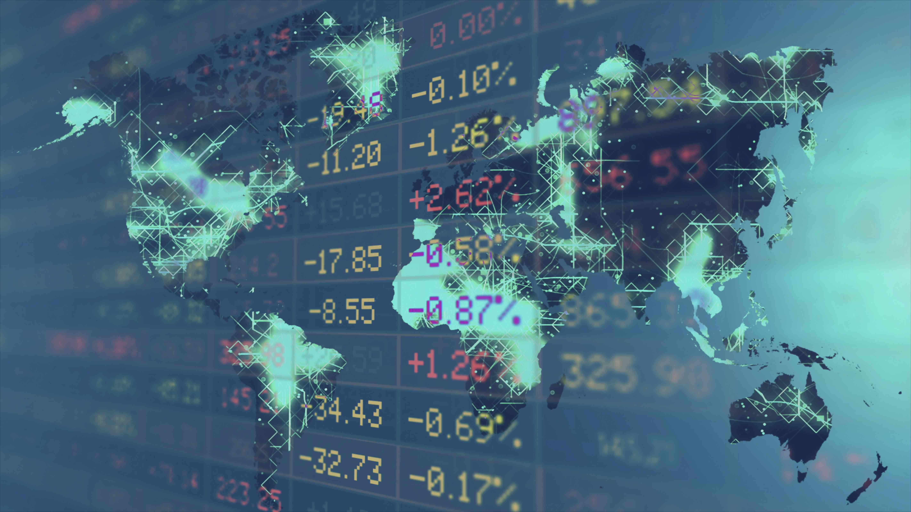

Futures trading is a fundamental element of the financial markets, providing investors with a mechanism to speculate on the future price movements of a variety of commodities and financial instruments. This speculative activity allows for both profit opportunities and hedging strategies against price volatility. Futures contracts, which represent agreements to buy or sell assets at a predetermined future date and price, are widely used to manage risks associated with fluctuating prices of commodities such as oil, gold, and agricultural products.

The National Futures Association (NFA), established in 1982, plays a crucial role as a self-regulatory organization within the United States derivatives industry. Its primary mission is to uphold market integrity, ensure fair trading practices, and protect investors from fraud and malpractice. The NFA works under the authorization of the Commodity Futures Trading Commission (CFTC) to enforce compliance rules, provide member education, and resolve disputes among market participants, thereby maintaining an orderly market environment.

In recent years, algorithmic trading has dramatically transformed the financial landscape. This technology-driven approach facilitates the high-speed execution of trades based on pre-defined, complex algorithms, which can analyze market conditions and execute strategies with minimal human intervention. While algorithmic trading offers increased market liquidity and execution precision, it also introduces new regulatory challenges. These challenges include concerns over market manipulation, technological failures, and the potential for systemic risks, necessitating robust regulatory oversight and risk management strategies.

This article aims to explore the key components of futures trading, dissect the regulatory framework implemented by the NFA, and examine the transformative effects of algorithmic trading within contemporary financial markets. By understanding these interlinked subjects, stakeholders can better navigate the evolving market dynamics and regulatory landscapes.

## Table of Contents

## Understanding Futures Trading

Futures trading represents a fundamental aspect of modern financial markets, offering participants a mechanism to manage risk and speculate on the future price movements of various assets. At its core, futures trading involves contracts wherein parties agree to buy or sell an asset at a predetermined future date and price. These contracts, known as futures contracts, are standardized agreements traded on futures exchanges, facilitating the transfer of risk and potential profitability through market speculation.

The utility of futures trading is most evident in its application for hedging purposes. Market participants, such as producers and consumers of commodities, use futures contracts to protect against adverse price movements. For instance, an agricultural producer might use futures to lock in the price of a crop, thereby mitigating the risk of price fluctuations at harvest time. Similarly, consumers, such as food manufacturers, employ futures contracts to stabilize input costs.

In addition to hedging, futures markets attract a diverse array of participants, including speculators and arbitrageurs. Speculators aim to profit from anticipated price changes by taking positions in futures contracts without the intention of actual delivery or receipt of the underlying asset. Meanwhile, arbitrageurs exploit price discrepancies between related markets or instruments, seeking risk-free profits through simultaneous buying and selling activities.

The significance of futures markets has expanded with technological advancements, notably the onset of electronic trading platforms. These platforms enhance market accessibility and efficiency by allowing market participants to execute trades more swiftly and accurately. Furthermore, the integration of advanced trading algorithms into futures markets facilitates high-frequency trading and complex strategies that can react to market changes in milliseconds, thereby increasing [liquidity](/wiki/liquidity-risk-premium) and narrowing bid-ask spreads.

The continual evolution of futures trading, driven by both market demand and technological innovation, underscores its vital role in global financial systems. Through the combination of hedging strategies, speculative opportunities, and [arbitrage](/wiki/arbitrage) activities, futures markets remain a cornerstone of financial risk management and speculative endeavor.

## Role of the National Futures Association (NFA)

The National Futures Association (NFA), established in 1982, functions as a critical self-regulatory organization for the futures and derivatives markets within the United States. Operating under the oversight of the Commodity Futures Trading Commission (CFTC), the NFA is dedicated to upholding market integrity and safeguarding investor interests. This mission is achieved through a series of core functions integral to the financial ecosystem.

One of the primary roles of the NFA is registration screening, where it ensures that all market participants, such as swap dealers and commodity trading advisors, are qualified and adhere to regulatory standards. This screening process involves rigorous background checks and assessments, allowing only those who meet the predefined criteria to operate within the markets.

In addition to registration, the NFA enforces compliance among its members, requiring adherence to regulations designed to promote fair and transparent transactions. Through compliance enforcement, the NFA regularly audits and monitors its members' activities to ensure they conform to the required legal and ethical standards.

Member education constitutes another vital aspect of the NFA's responsibilities. By providing training programs and educational resources, the NFA equips its members with the knowledge necessary to understand and comply with current regulations and policies. This educational initiative not only prepares members for regulatory adherence but also fosters a culture of ethical trading practices.

Market regulation is another cornerstone of the NFA's operations. The organization develops and implements rules that govern trading activities, addressing issues such as fraud prevention, market manipulation, and insider trading. This regulatory framework is designed to maintain a level playing field, ensuring that all market participants operate under the same set of rules.

Lastly, the NFA offers dispute resolution services to its members and their customers. This function is crucial for addressing conflicts and grievances that arise within the trading community, providing mediation and arbitration services to facilitate fair and impartial resolutions.

Through these comprehensive measures, the NFA plays an indispensable role in maintaining the stability, transparency, and integrity of the U.S. futures and derivatives markets, ensuring that they function efficiently and fairly for all stakeholders involved.

## NFA’s Compliance and Regulatory Framework

The National Futures Association (NFA) maintains a robust compliance and regulatory framework designed to ensure that its members adhere to high standards of conduct in the futures and derivatives markets. Central to this framework are comprehensive rules that cover various aspects of trading and operations which serve to enhance transparency and fairness within the industry.

Among the key components of the NFA's regulatory framework are stringent rules governing sales practices. These rules ensure that all promotional and sales activities are conducted ethically and that potential clients receive accurate and complete information. Risk disclosure is another critical area, with the NFA mandating clear communication of potential risks associated with trading activities, enabling investors to make informed decisions.

Financial reporting forms a significant part of the compliance obligations. NFA members are required to submit regular financial statements, ensuring that they maintain sufficient capital and adhere to financial safeguards. This transparency is crucial for market stability and investor confidence.

Operational risk management is also emphasized within the NFA's framework. Members must implement robust systems and controls to manage and mitigate operational risks, thereby safeguarding market integrity. These measures are designed to prevent systemic failures and enhance market reliability.

Non-compliance with NFA regulations can lead to a range of disciplinary actions. Depending on the severity and nature of the violation, the NFA can issue warnings, impose fines, or even suspend a member's registration. In many cases, the NFA collaborates with other regulatory bodies such as the Commodity Futures Trading Commission (CFTC) to enforce compliance and take necessary actions.

To support its members in meeting these rigorous standards, the NFA provides ongoing education and resources. Training programs and informational materials are regularly updated to ensure that members are well-versed in current regulations and best practices. This proactive educational approach helps members fulfill their regulatory responsibilities and adapt to any changes in the regulatory landscape.

The NFA's compliance and regulatory framework not only safeguards the futures markets but also builds trust among participants by promoting a fair, transparent, and efficient trading environment.

## The Impact of Algorithmic Trading

Algorithmic trading, commonly referred to as algo trading, employs sophisticated algorithms to execute trades at high speeds, thus frequently reducing the likelihood of human error. These algorithms process a multitude of market data inputs and execute decisions based on pre-defined criteria, which can include variables like price, timing, and [volume](/wiki/volume-trading-strategy). The prominence of algo trading has substantially increased market liquidity and operational efficiency, allowing for more streamlined trading processes and reduced transaction costs.

However, despite its advantages in enhancing liquidity and efficiency, [algorithmic trading](/wiki/algorithmic-trading) is not without its risks. One significant concern is the potential for market manipulation. Algorithms can be programmed to create artificial demand or supply, leading to distortions in market prices and trading volumes. Additionally, the rapid pace of algo trading can exacerbate market [volatility](/wiki/volatility-trading-strategies) during periods of financial instability, as evidenced by incidences like the 2010 Flash Crash. System failures also pose a threat; technical glitches or bugs within trading algorithms can lead to unintended consequences, triggering erroneous trades and compounding market disruptions.

Regulatory bodies, such as the Commodity Futures Trading Commission (CFTC) and the Securities and Exchange Commission (SEC), establish rigorous standards for entities involved in algorithmic trading. These standards aim to ensure fairness and market integrity. Compliance with these regulations requires organizations to implement robust risk management strategies. This includes pre-trade controls, which serve to verify that trades comply with regulatory and risk guidelines before execution, and post-trade controls, which ensure that executed trades are thoroughly analyzed for compliance and risk management.

Efficient risk management in algorithmic trading frequently involves stress testing, where trading algorithms are subjected to extreme market conditions to assess their resilience and reliability. This process helps identify potential vulnerabilities and mitigate risks before they impact market operations. Through careful implementation of these strategies, entities can navigate the complexities of algorithmic trading and reinforce market stability, enhancing their competitive advantage while safeguarding investor interests.

## Regulatory Framework for Algorithmic Trading

The regulatory framework governing algorithmic trading is chiefly designed to mitigate risks and uphold market integrity. A seminal regulatory piece is the Commodity Futures Trading Commission’s (CFTC) Regulation Automated Trading (Reg AT), which addresses the inherent risks associated with algorithmic trading. The primary objective of Reg AT is to ensure that those deploying complex automated trading systems adhere to robust risk management controls and register with the CFTC. This registration process provides a structured way to monitor and evaluate the entities involved in algorithmic trading, enhancing market transparency.

In parallel, the Securities and Exchange Commission (SEC) has established the Market Access Rule, laying out mandatory risk controls for broker-dealers. These pre-trade and post-trade controls are essential in preventing potential market disruptions that could arise from algorithmic trading activities. Both the CFTC's and the SEC's regulatory requirements are crucial for maintaining the integrity and accountability of algorithmic trading in financial markets. The ongoing supervision and enhancement of these frameworks are vital as they adapt to technological advancements and changing market dynamics.

## Challenges and Future of Futures and Algo Trading

As the financial markets continue to evolve, both futures and algorithmic trading must contend with ongoing challenges, particularly in the areas of regulatory changes and technological advancements. The rapid pace of innovation has led to the increasing integration of [artificial intelligence](/wiki/ai-artificial-intelligence) (AI) and [machine learning](/wiki/machine-learning) technologies in trading strategies, promising enhanced efficiency and new opportunities for market participants. However, these advancements also pose significant regulatory challenges.

Market participants are required to remain vigilant and adaptable in response to evolving regulatory landscapes. This includes understanding and complying with existing regulations, such as those enforced by the Commodity Futures Trading Commission (CFTC) and the National Futures Association (NFA), while also preparing for new rules that might arise as technologies advance. The necessity for robust compliance frameworks is amplified by the complexity and speed inherent in modern trading environments.

The future of trading is expected to be shaped significantly by AI and machine learning. These technologies have the potential to revolutionize trading strategies through enhanced predictive analytics, risk management, and automated decision-making processes. The benefits of AI-driven trading include improved accuracy in forecasting price movements and the ability to process vast amounts of market data with speed and precision. Despite these advantages, the use of AI introduces risks related to model reliability, data privacy, and potential biases embedded within algorithms.

To ensure the integrity and stability of the financial markets, the role of regulatory bodies such as the NFA remains crucial. The NFA and similar organizations are tasked with creating frameworks that adapt to technological advancements, while safeguarding investor interests and maintaining market fairness. These bodies are expected to focus on establishing guidelines for algorithmic trading, which might include requirements for transparency, accountability, and risk management practices.

In conclusion, the convergence of futures and algorithmic trading with AI and machine learning presents both promising prospects and complex challenges. As technological and regulatory landscapes continue to evolve, traders, firms, and regulatory bodies must work collaboratively to ensure that these advancements contribute positively to market stability and competitiveness. By staying informed and adaptable, market participants can effectively navigate the complexities of future trading environments.

## Conclusion

Futures trading and algorithmic trading are pivotal components of the financial markets, each offering distinct advantages and presenting various challenges. Futures trading provides a platform for speculating and hedging against price volatility. It enables market participants to manage risk and capitalize on price changes across diverse assets. Algorithmic trading, on the other hand, enhances market efficiency by executing trades with precision and speed but carries inherent risks such as system failures and potential market manipulation.

The National Futures Association (NFA) plays an instrumental role by upholding a regulatory framework that ensures market integrity and safeguards investor interests. This framework is crucial as it provides guidelines and standards that maintain the orderly functioning of the markets. It includes compliance measures and risk management protocols that protect participants and promote transparency.

For traders and market participants, staying informed about regulatory updates and embracing technological advancements are essential strategies. As financial markets evolve, regulations adapt to address emerging challenges, necessitating continuous learning and adaptation among those involved in trading. This proactive approach helps market players anticipate changes and maintain their competitive edge.

Compliance with established standards and the implementation of robust risk management strategies are vital for ensuring stability in the markets. Adhering to these practices not only fortifies individual trading operations but also contributes to the overall health and efficiency of financial markets. By aligning with regulatory expectations and employing effective risk controls, traders can enhance their operational resilience and promote a sustainable trading environment.

## References & Further Reading

[1]: ["Futures, Options, and Swaps"](https://online.hbs.edu/blog/post/understanding-financial-derivatives-forwards-futures-options) by Robert W. Kolb and James A. Overdahl

[2]: ["Trading and Exchanges: Market Microstructure for Practitioners"](https://www.amazon.com/Trading-Exchanges-Market-Microstructure-Practitioners/dp/0195144708) by Larry Harris

[3]: ["The National Futures Association and the Commodities Futures Trading Commission: Regulatory Oversight and Market Accountability"](https://www.researchgate.net/publication/341225192_The_National_Futures_Association_and_the_Commodities_Futures_Trading_Commission_Regulatory_Oversight_and_Market_Accountability) by John Goodwin

[4]: Van Vliet, B. (2017). ["High-Frequency Trading: The Complete Guide to Algorithmic Trading and Stock Market Computer Programming"](https://www.researchgate.net/publication/317771025_High-Frequency_Trading_and_Conflict_in_the_Financial_Markets)

[5]: ["Handbook of Financial Data and Risk Information"](https://www.cambridge.org/core/books/handbook-of-financial-data-and-risk-information-i/36C1740A30FB4A608742E4211362508C) edited by Margarita S. Brose

[6]: Securities and Exchange Commission. (2010). ["Concept Release on Equity Market Structure"](https://www.sec.gov/rules-regulations/2010/01/concept-release-equity-market-structure)

[7]: Commodity Futures Trading Commission. ["Regulations & Guidance."](https://www.cftc.gov/LawRegulation/index.htm)