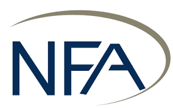

## Table of Contents

## What is the National Futures Association (NFA)?

The National Futures Association (NFA) is a self-regulatory organization for the U.S. futures industry. It was created in 1982 by the Commodity Futures Trading Commission (CFTC) to protect investors and ensure the integrity of the markets. The NFA oversees the activities of its members, which include futures commission merchants, commodity pool operators, commodity trading advisors, and introducing brokers. By setting rules and standards, the NFA helps to prevent fraud and abusive practices in the futures market.

The NFA also provides education and resources to help people understand the futures market. It offers programs and tools to help traders and investors make informed decisions. The organization works to promote transparency and fairness in the industry. By doing so, the NFA helps to build trust and confidence among market participants.

## When was the NFA founded and why?

The National Futures Association (NFA) was founded in 1982. The main reason for creating the NFA was to protect people who invest in the futures market. The futures market can be complicated and risky, so the government wanted to make sure there was an organization to watch over it.

The NFA was set up by the Commodity Futures Trading Commission (CFTC). The NFA's job is to make sure that everyone in the futures industry follows the rules. This helps to stop fraud and bad behavior, making the market safer and fairer for everyone involved.

## What are the main functions of the NFA?

The National Futures Association (NFA) has several important jobs. One main function is to make sure that everyone in the futures industry follows the rules. The NFA checks that futures commission merchants, commodity pool operators, commodity trading advisors, and introducing brokers are doing things the right way. This helps to stop fraud and bad behavior, keeping the market safe for everyone.

Another big job of the NFA is to help people learn about the futures market. The NFA gives out information and tools that help traders and investors make good choices. By teaching people about the market, the NFA helps to make sure that everyone knows what they are doing and can trust the market.

## How does the NFA regulate the futures and derivatives markets?

The National Futures Association (NFA) helps keep the futures and derivatives markets fair and safe by making rules that everyone has to follow. They check that companies like futures commission merchants, commodity pool operators, commodity trading advisors, and introducing brokers are doing things the right way. If someone breaks the rules, the NFA can take action against them. This helps stop fraud and bad behavior, making the market a better place for everyone.

The NFA also helps people learn about the futures and derivatives markets. They give out information and tools that help traders and investors make good choices. By teaching people about the market, the NFA makes sure that everyone knows what they are doing. This builds trust and confidence in the market, which is important for it to work well.

## What types of members does the NFA have?

The National Futures Association (NFA) has different types of members who work in the futures and derivatives markets. These members include futures commission merchants, who are companies that handle customer orders and money. Another type of member is commodity pool operators, which are like investment funds that trade in futures and other commodities. Commodity trading advisors are also members; they give advice on trading futures and other commodities.

Introducing brokers are another type of NFA member. They introduce customers to futures commission merchants and help them start trading. All these members have to follow the NFA's rules to make sure the market is fair and safe for everyone. By keeping an eye on these members, the NFA helps stop fraud and bad behavior in the futures and derivatives markets.

## How can someone or an entity become a member of the NFA?

To become a member of the National Futures Association (NFA), someone or an entity needs to apply. They have to fill out an application form and send it to the NFA. The application asks for information about the person or entity, like their background and what they plan to do in the futures market. They also need to pay a fee when they apply.

Once the NFA gets the application, they check it to make sure everything is okay. They look at the person or entity's background to see if they are honest and follow the rules. If everything is good, the NFA will approve the membership. But if there are problems, like a history of fraud, the NFA might not let them join. After becoming a member, they have to keep following the NFA's rules to stay in good standing.

## What are the compliance requirements for NFA members?

NFA members have to follow many rules to stay in good standing. They need to keep good records of all their business dealings and make sure their financial reports are correct. Members must also have enough money to cover their business risks, which is called meeting capital requirements. They need to treat customers fairly and give them clear information about the risks of trading futures and derivatives. If a member breaks any of these rules, the NFA can take action against them, like fines or even taking away their membership.

Another important rule for NFA members is to avoid fraud and bad behavior. They must not lie to customers or trick them into making bad trades. Members also have to follow rules about how they advertise and promote their services. They need to make sure that any ads or promotions are honest and not misleading. The NFA checks that members are following all these rules through regular audits and reviews. By doing this, the NFA helps keep the futures and derivatives markets fair and safe for everyone.

## How does the NFA protect investors?

The National Futures Association (NFA) works hard to keep investors safe in the futures and derivatives markets. They do this by making sure that everyone in the industry follows the rules. The NFA checks that companies like futures commission merchants, commodity pool operators, commodity trading advisors, and introducing brokers are doing things the right way. If someone breaks the rules, the NFA can take action against them. This helps stop fraud and bad behavior, making the market safer for everyone.

The NFA also helps investors by giving them information and tools to learn about the futures market. They offer programs and resources that help people understand how the market works and how to make smart choices. By teaching people about the risks and rewards of trading futures and derivatives, the NFA helps investors protect themselves. This education builds trust and confidence in the market, which is important for it to work well.

## What role does the NFA play in dispute resolution?

The National Futures Association (NFA) helps solve problems between people in the futures market. If someone has a disagreement with a member of the NFA, like a futures commission merchant or a commodity trading advisor, they can ask the NFA to help. The NFA has a way to settle these disputes fairly, so both sides can explain their side of the story. This helps keep the market fair and makes sure that problems are dealt with quickly.

The NFA's dispute resolution process is important because it gives people a way to solve their issues without going to court. This can save time and money. The NFA makes sure that the process is clear and easy to understand, so everyone knows what to expect. By helping to solve disputes, the NFA keeps the futures market a safe and trusted place for everyone to trade.

## How does the NFA contribute to market integrity?

The National Futures Association (NFA) helps keep the futures market honest and fair. They do this by making rules that everyone in the market has to follow. The NFA checks that companies like futures commission merchants, commodity pool operators, commodity trading advisors, and introducing brokers are doing things the right way. If someone breaks the rules, the NFA can take action against them. This helps stop fraud and bad behavior, making the market safer for everyone.

The NFA also helps people learn about the futures market. They give out information and tools that help traders and investors make good choices. By teaching people about the market, the NFA makes sure that everyone knows what they are doing. This builds trust and confidence in the market, which is important for it to work well. By doing these things, the NFA helps keep the futures market honest and fair for everyone involved.

## What are some recent initiatives or changes implemented by the NFA?

The NFA has been working on a few new things to make the futures market better. One of the big changes they made is about how they check the people who want to work in the market. They started using a new way to do background checks to make sure that everyone who works in the market is honest and follows the rules. This helps keep the market safe for everyone.

Another thing the NFA has been doing is helping people learn more about the futures market. They've made new tools and programs to teach people about trading and how to make smart choices. By doing this, the NFA wants to make sure that everyone who trades in the market knows what they're doing and can trust the market.

## How does the NFA interact with other regulatory bodies both domestically and internationally?

The National Futures Association (NFA) works closely with other regulatory bodies in the United States to make sure the futures market is safe and fair. They often share information and work together with the Commodity Futures Trading Commission (CFTC), which is the main government agency that watches over the futures market. The NFA and CFTC talk to each other a lot to make sure they are both doing their jobs well. They also work with other groups like the Financial Industry Regulatory Authority (FINRA) to keep an eye on the whole financial market.

The NFA also talks to regulatory bodies in other countries to help keep the global futures market honest. They share information and work together with groups like the International Organization of Securities Commissions (IOSCO) to make sure that rules are followed everywhere. By working with other countries, the NFA helps make sure that people trading in the futures market can trust it, no matter where they are.

## References & Further Reading

[1]: ["Futures, Options, and Swaps"](https://online.hbs.edu/blog/post/understanding-financial-derivatives-forwards-futures-options) by Robert W. Kolb and James A. Overdahl

[2]: ["Trading and Exchanges: Market Microstructure for Practitioners"](https://www.amazon.com/Trading-Exchanges-Market-Microstructure-Practitioners/dp/0195144708) by Larry Harris

[3]: ["The National Futures Association and the Commodities Futures Trading Commission: Regulatory Oversight and Market Accountability"](https://www.researchgate.net/publication/341225192_The_National_Futures_Association_and_the_Commodities_Futures_Trading_Commission_Regulatory_Oversight_and_Market_Accountability) by John Goodwin

[4]: Van Vliet, B. (2017). ["High-Frequency Trading: The Complete Guide to Algorithmic Trading and Stock Market Computer Programming"](https://www.researchgate.net/publication/317771025_High-Frequency_Trading_and_Conflict_in_the_Financial_Markets)

[5]: ["Handbook of Financial Data and Risk Information"](https://www.cambridge.org/core/books/handbook-of-financial-data-and-risk-information-i/36C1740A30FB4A608742E4211362508C) edited by Margarita S. Brose

[6]: Securities and Exchange Commission. (2010). ["Concept Release on Equity Market Structure"](https://www.sec.gov/rules-regulations/2010/01/concept-release-equity-market-structure)

[7]: Commodity Futures Trading Commission. ["Regulations & Guidance."](https://www.cftc.gov/LawRegulation/index.htm)
