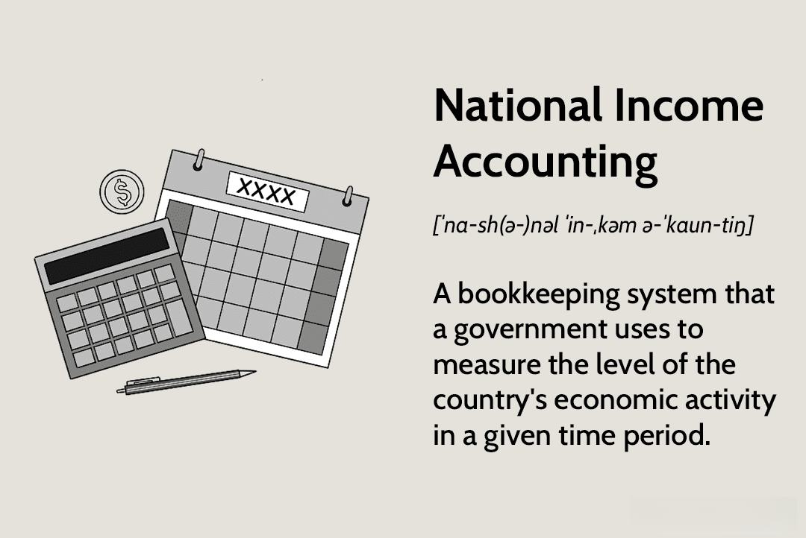

Economic indicators are critical tools for assessing the health of a country's economy. They offer quantitative measures that provide insights into various economic aspects such as growth, employment, and inflation. Among these indicators, national income and income accounting are pivotal. They encompass a range of economic activities and transactions that contribute to understanding the overall economic performance of a nation. These indicators form a framework for evaluating trends and predicting future economic conditions, which is vital for both policymakers and investors.

National income accounting specifically plays a significant role as it provides detailed views of a country's economic productivity. Key metrics like Gross Domestic Product (GDP), Gross National Product (GNP), and Net National Income (NNI) are central to this accounting system. They help in capturing the economic activity within a country, allowing for comparisons over time and between different economies. By understanding these indicators, one can assess the economic well-being of a nation, make informed decisions, and devise policies to bolster economic health.

The rise of algorithmic trading has markedly transformed how these economic indicators are analyzed and interpreted. Algorithmic trading, or algo trading, involves using complex algorithms to execute trades at high speeds. It leverages economic indicators to guide decision-making processes in financial markets. This technological advancement enhances the efficiency of financial transactions and capitalizes on rapid analysis and response to market conditions derived from economic data.

Understanding economic indicators is essential for making sound financial decisions. Investors, businesses, and governments rely on these indicators to gauge economic momentum, adjust fiscal policies, and optimize investment strategies. With the integration of algo trading, the precision and speed of transactions based on these indicators have improved, yet it also necessitates caution due to potential market volatility and risks associated with automated decision-making.

This article explores the relationship between economic indicators, national income accounting, and algorithmic trading. It examines how these components interact, influence each other, and shape modern economic analysis. By comprehending these relationships, stakeholders can better navigate the complexities of global financial markets and economic policy-making.

## Table of Contents

## Understanding Economic Indicators

Economic indicators are statistical figures that provide insights into the economic performance of a country. They serve as critical tools for governments, investors, policymakers, and analysts to assess the current state of an economy and predict future economic activities. These indicators are usually categorized into three main types: leading, lagging, and coincident indicators.

Leading indicators are those that signal future events. They are useful for predicting trends before they occur. Examples include stock market performance, manufacturing activity, and the index of consumer expectations. Since these indicators provide insight into the future economic direction, they are vital for anticipating economic growth or contraction.

Lagging indicators, on the other hand, are metrics that follow an event. They are not useful for prediction but rather for confirming an existing trend or pattern. Common lagging indicators include unemployment rates, corporate profits, and labor cost per unit of output. They provide confirmation of what has already happened in the economy, serving as a retrospective analysis tool.

Coincident indicators occur simultaneously with the economic changes they reflect. These indicators provide information about the current state of the economy. Examples are gross domestic product (GDP), personal income, and industrial production. Coincident indicators are crucial for providing real-time data on economic health.

Among the key economic indicators, GDP is perhaps the most significant, as it measures the total value of all goods and services produced in a country over a specific period. It is a primary indicator of a country's economic performance. Unemployment rates, another essential indicator, reveal the percentage of the labor force that is jobless and actively seeking employment, providing insights into the labor market health. Inflation rates measure the rate at which the general level of prices for goods and services rises, eroding purchasing power. This indicator is crucial for understanding pricing trends and cost of living changes.

Economic indicators impact financial markets and decision-making by providing data that can influence investor behavior, interest rates, and government policies. For instance, if GDP growth is higher than expected, it can boost investor confidence, leading to a rise in stock market prices. Conversely, high unemployment rates may lead to decreased consumer spending, adversely affecting market performance. Inflation rates directly impact monetary policy as central banks may adjust interest rates to manage inflation levels.

Understanding economic indicators provides a foundation for making informed financial decisions and shaping policy frameworks, reflecting their critical role in analyzing and guiding economic activity.

## National Income and Accounting

National income is a crucial measure in understanding a country's economic health, representing the total value of all goods and services produced by a nation. It reflects the economic strength and overall productivity, acting as a key indicator for policy-making, investment decisions, and economic planning. The concept of income accounting is integral to measuring national income, providing a systematic recording of economic transactions within a country. It forms the basis for various macroeconomic analyses and policy formulations by offering insights into the distribution and development of economic resources.

Income accounting involves several components, each offering a different perspective on economic performance. The Gross Domestic Product (GDP) is perhaps the most well-known measure, representing the total market value of all final goods and services produced within a country's borders during a specific period. It serves as a primary indicator of economic activity. Gross National Product (GNP) extends this concept by including the value of goods and services produced by a nation's residents, regardless of their location, thus incorporating international economic activities. The Net National Income (NNI) is another critical component, derived by adjusting the GNP for depreciation and indirect taxes, providing a clearer picture of the net economic output available to a country.

Income accounting facilitates a comprehensive understanding of a country's economic performance by enabling the evaluation of economic growth, productivity, and structural transformations within an economy. It allows for the analysis of trends over time, helping to identify cyclical patterns and assess the effectiveness of economic policies. By comparing national income data across different periods or countries, stakeholders can evaluate relative economic strengths and weaknesses, gaining insights into competitive advantages and areas needing improvement.

Despite its benefits, national income accounting faces several limitations and challenges. One significant challenge is the difficulty in accurately capturing informal economic activities, which can be substantial in developing nations. The reliance on statistical estimates and assumptions can also result in discrepancies and inaccuracies. Additionally, national income does not account for environmental degradation or depletion of natural resources, potentially overstating a country's economic well-being. These limitations highlight the need for a cautious interpretation of income accounting figures and suggest the importance of complementary measures and analyses.

In summary, national income and its accounting are foundational to economic analysis, providing key insights into a nation's economic status and guiding critical economic decisions. While it offers valuable information, the methodology also has inherent limitations that necessitate careful consideration when interpreting the data.

## The Role of Algorithmic Trading

Algorithmic trading (algo trading) refers to the use of computer algorithms to automate trading processes in financial markets. These algorithms execute trades based on pre-defined criteria, such as timing, price, or quantity, often processing large volumes of data at high speeds. The emergence of algo trading has transformed financial markets since its inception in the late 20th century. The proliferation of electronic markets and advancements in computational technology have fueled its growth, leading to a significant portion of market trades being executed algorithmically.

Algo trading leverages economic indicators to enhance decision-making in executing trades. Economic indicators like GDP, inflation rates, and employment figures are integral to these algorithms, providing signals for buy or sell actions based on anticipated market movements. For instance, a sudden rise in unemployment rates might trigger a sell-off in equities as it signals potential economic instability. 

The impact of algo trading on market efficiency and [volatility](/wiki/volatility-trading-strategies) is pronounced. On one hand, algo trading contributes to market efficiency by narrowing bid-ask spreads and ensuring more accurate price discovery. On the other hand, its role in exacerbating market volatility cannot be overlooked, especially during times of market stress. High-frequency trading, a subset of algo trading, can amplify price swings and trigger flash crashes due to rapid buy and sell orders reacting to perceived market opportunities.

Technological advancements have been pivotal in enabling algo trading. The increase in computational power, the advent of big data analytics, and the development of sophisticated algorithms using [machine learning](/wiki/machine-learning) techniques have all propelled algo trading forward. These technological strides allow algorithms to process vast datasets, identify patterns, and execute trades within milliseconds, providing a competitive edge in the financial markets.

However, there are potential risks associated with reliance on algorithms for trading decisions. One significant risk is model overfitting, where an algorithm is excessively tailored to historical data, making it less effective in unforeseen market conditions. The lack of transparency in algorithmic models raises concerns about their ethical implications and accountability. Furthermore, the systemic risk posed by [algorithmic trading](/wiki/algorithmic-trading) cannot be ignored. In a scenario where multiple algorithms respond similarly to a market event, it could lead to a cascading effect, amplifying market dislocations.

In conclusion, while algorithmic trading offers efficiency and speed in modern financial markets, it requires careful management of the associated risks. Understanding its interaction with economic indicators and staying abreast of technological advancements are crucial for risk mitigation and informed decision-making.

## Interconnection Between Economic Indicators, Income Accounting, and Algo Trading

Economic indicators derived from national income accounting play a pivotal role in shaping algorithmic trading strategies. These indicators, including GDP, unemployment rates, and inflation, provide critical data that algo trading models utilize to execute trades based on predictive analytics and market trends. By integrating these indicators into their algorithms, traders can exploit patterns that suggest future market movements.

**Case Studies and Examples**

A notable example showcasing the interaction of these components is the flash crash of May 6, 2010. During this event, algorithmic trading heavily relied on economic data feeds and executed a vast number of trades in milliseconds. This instance demonstrated how high-frequency trading algorithms could respond to economic indicators in rapid succession, leading to market volatility. Another example is quant funds, which use sophisticated algorithms based on macroeconomic indicators to determine stock selection and trading decisions.

**Feedback Loop Influence**

Algorithmic trading can create a feedback loop that influences economic conditions. When significant trades are executed based on economic indicators, they can impact market prices, which in turn affect economic indicators such as stock market indices. This phenomenon can lead to increased market volatility, necessitating a reevaluation of economic conditions.

**Policy-Making and Regulatory Measures**

The interconnection between economic indicators, income accounting, and algorithmic trading has profound implications for policy-making and regulatory measures in the financial sector. Regulators may need to ensure that algorithmic trading activities do not destabilize the markets. Measures such as circuit breakers, which halt trading during extreme volatility, are examples of regulatory responses aiming to mitigate potential risks posed by high-frequency trading driven by economic data.

**Future Perspectives**

The evolution of this interconnection is closely tied to advancements in technology, particularly in data processing and machine learning. The integration of [artificial intelligence](/wiki/ai-artificial-intelligence) techniques can enhance the ability of trading algorithms to process vast datasets drawn from economic indicators, leading to improved trading strategies. As technology continues to evolve, the interplay between economic indicators, national income accounting, and algo trading is likely to become more sophisticated, necessitating continuous adaptation by investors, policymakers, and regulators.

In summary, the analytical power of algorithmic trading, fueled by insights from economic indicators derived from national income accounting, holds significant potential for shaping financial markets. The ongoing technological advancements promise further transformation, pushing the boundaries of traditional economic analysis and challenging existing regulatory frameworks.

## Conclusion

Economic indicators, national income accounting, and algorithmic trading are interconnected facets of modern economic analysis. Economic indicators offer crucial insights into the state of an economy, guiding both private and public sector decision-making. National income accounting provides a detailed measure of a country's economic performance, encompassing the gross domestic product (GDP), gross national product (GNP), and net national income (NNI). These components collectively form the backbone of economic evaluations, on which investors and policymakers rely to strategize and make informed decisions.

Algorithmic trading, a product of technological advancement, utilizes these indicators to enhance trading efficiency and decision-making processes. The speed and precision of algo trading have transformed the landscape of financial markets, necessitating a more integrated approach to economic analysis. Balancing algorithmic efficiency with traditional economic oversight becomes critical in maintaining market stability and preventing technological over-reliance that might overlook broader economic variables.

It is imperative for both investors and policymakers to stay informed about the interplay between these elements. Awareness and understanding of how economic indicators and national income accounting inform algorithmic trading strategies can lead to better risk management and policy formulation. As technology continues to evolve, so does the need for thorough research and education in this interconnected domain. A deeper dive into the interdependencies of these components could unveil more robust strategies for sustainable economic growth and financial stability.

Looking ahead, the fusion of technology with traditional economic analysis presents both opportunities and challenges. While algorithmic methods can enhance the precision of economic interpretations, the risk of disregarding subtler economic factors remains. Therefore, maintaining a balance between data-driven algorithms and human analytical skills is crucial. This interplay will likely define the future of economic analysis, where the potential for innovation must be continually weighed against the foundational principles of economic theory and practice.

## References & Further Reading

[1]: Samuelson, P. A., & Nordhaus, W. D. (2009). "Economics." McGraw-Hill Education. This book provides a comprehensive overview of economic concepts, including national income accounting and economic indicators.

[2]: ["Advances in Financial Machine Learning"](https://www.amazon.com/Advances-Financial-Machine-Learning-Marcos/dp/1119482089) by Marcos Lopez de Prado. This book focuses on applying machine learning techniques to financial markets, which is pertinent to algorithmic trading.

[3]: Dorfman, J. H. (2002). "Introduction to Risk Management and Insurance." Prentice Hall. This resource provides insight into risk management, which is an important aspect of algorithmic trading.

[4]: ["Algorithmic Trading: Winning Strategies and Their Rationale"](https://www.amazon.com/Algorithmic-Trading-Winning-Strategies-Rationale-ebook/dp/B00CY5HC0U) by Ernie Chan. This book provides practical insight into the strategies and logic behind algorithmic trading.

[5]: Greene, W. H. (2017). "Econometric Analysis." Pearson. This book offers methods of econometric analysis that are essential for interpreting economic indicators used in algorithmic trading.

[6]: ["Quantitative Trading: How to Build Your Own Algorithmic Trading Business"](https://www.amazon.com/Quantitative-Trading-Build-Algorithmic-Business/dp/1119800064) by Ernest P. Chan. Discusses building and implementing quantitative strategies in trading.

[7]: Stock, J. H., & Watson, M. W. (2019). "Introduction to Econometrics." Pearson. This publication provides a foundation in econometric techniques which are crucial for analyzing economic indicators.
