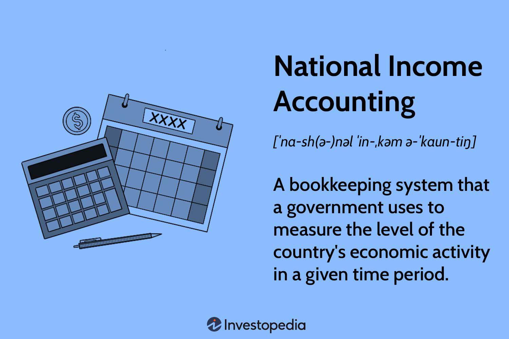

## Table of Contents

## What is national income accounting?

National income accounting is like keeping a financial diary for a whole country. It's a way to measure and track how much money is being made and spent in an economy over a certain period, usually a year. By looking at things like how much people earn, how much businesses produce, and how much the government spends, national income accounting helps us understand if the economy is doing well or if it needs help.

This type of accounting helps governments and economists make important decisions. For example, if the numbers show that people are not earning enough money, the government might decide to create new jobs or help people in other ways. It also helps compare how different countries are doing economically. By using the same methods to measure national income, we can see which countries are growing faster and which ones might need to change their economic plans.

## Why is national income accounting important for an economy?

National income accounting is important for an economy because it helps everyone understand how well the country is doing financially. It's like a report card for the economy, showing how much money is being made from businesses, how much people are earning, and how much the government is spending. By looking at these numbers, leaders can see if the economy is growing or if it's having problems. This information is really helpful for making big decisions, like whether to create new jobs, change taxes, or start new programs to help people.

Also, national income accounting lets us compare different countries' economies. When countries use the same way to measure their income, we can see which ones are doing better and which ones might need to work on their economic plans. This comparison can inspire countries to learn from each other and try new things to make their own economies stronger. In the end, national income accounting helps keep the economy on track and helps everyone live better lives.

## What are the main components of national income?

National income is made up of several important parts that help us understand how much money is moving around in a country's economy. The first big part is called Gross Domestic Product (GDP), which is the total value of all the goods and services produced within a country in a year. GDP shows how much the country is producing, and it's a key way to measure how well the economy is doing. Another part is Gross National Product (GNP), which is similar to GDP but also includes the income that people in the country earn from investments they have in other countries, minus the income that foreigners earn from investments in the country.

Another important part of national income is Net National Product (NNP), which is GNP minus the value of how much the country's capital, like machines and buildings, wears out over time. This wear and tear is called depreciation. NNP gives us a clearer picture of the country's income after accounting for the costs of keeping the economy running. Finally, there's Personal Income, which is the money that people actually get to keep and spend. This includes wages, salaries, and other types of income like interest and dividends, but it doesn't include taxes and other things that are taken out before people get their money.

These components all work together to give a full picture of a country's economic health. By looking at GDP, GNP, NNP, and Personal Income, economists and leaders can see where the money is coming from and going to, and they can make better decisions to help the economy grow and improve people's lives.

## How is Gross Domestic Product (GDP) calculated?

Gross Domestic Product, or GDP, is a way to measure how much a country's economy is producing in a year. It's like adding up the value of all the things people buy and the services they use in that country. To calculate GDP, you can use one of three main methods: the expenditure approach, the income approach, or the production approach. The most common way is the expenditure approach, which adds up all the spending in the economy. This includes what consumers spend on goods and services, what businesses spend on investments, what the government spends, and the difference between what the country exports and imports.

The income approach looks at how much money everyone in the country earns. This includes wages, salaries, profits, and other types of income. When you add up all this income, it should equal the total value of what the country produced, which is the GDP. The production approach, on the other hand, adds up the value of all the goods and services produced by different industries in the country. This method can be more complicated because it needs to avoid counting the same thing twice, but it's another way to get to the same total GDP number. No matter which method you use, they all aim to show how much the economy is producing in a year.

## What is the difference between GDP and Gross National Product (GNP)?

GDP and GNP are two ways to measure a country's economic activity, but they focus on slightly different things. GDP, or Gross Domestic Product, measures the total value of all the goods and services produced within a country's borders in a year. It includes everything made by people and businesses inside the country, no matter if they are citizens or foreigners. For example, if a foreign company has a factory in the country, the value of what that factory produces is included in the country's GDP.

On the other hand, GNP, or Gross National Product, looks at the total value of goods and services produced by the country's citizens and businesses, no matter where they are in the world. This means GNP includes the income that citizens earn from investments and work they do in other countries, but it subtracts the income that foreigners earn from their investments and work within the country. So, if a citizen owns a factory in another country, the value of what that factory produces would be part of the country's GNP, even though it's not part of the GDP.

## Can you explain the concept of Net National Product (NNP)?

Net National Product, or NNP, is like a special way of looking at how much money a country makes in a year. It starts with the Gross National Product (GNP), which is the total value of all the goods and services produced by a country's citizens, no matter where they are in the world. But NNP takes it one step further by subtracting something called depreciation. Depreciation is the wear and tear on things like machines, buildings, and other stuff that businesses use to make things. So, NNP is GNP minus the cost of keeping all that equipment in good shape.

By using NNP, we get a clearer picture of how much money the country really has to spend and invest after taking care of its tools and buildings. It's like figuring out your real income after you've paid to fix your car or replace a broken tool at home. NNP helps economists and leaders understand if the country is getting richer or if it's just keeping up with the costs of staying in business. This way, they can make better plans to help the economy grow and improve people's lives.

## What are the different methods used to measure national income?

There are three main ways to measure national income: the expenditure approach, the income approach, and the production approach. The expenditure approach adds up all the spending in the economy. It includes what people spend on things they buy, what businesses spend on new equipment and buildings, what the government spends on things like roads and schools, and the difference between what the country sells to other countries and what it buys from them. This method looks at where the money goes and adds it all up to find the total national income.

The income approach looks at how much money everyone in the country earns. This includes wages and salaries that people get from their jobs, profits that businesses make, and other types of income like rent and interest. By adding up all this income, you get the same total as the national income. This method is like looking at all the money that comes into people's pockets and businesses' accounts.

The production approach adds up the value of all the goods and services made by different industries in the country. This method can be a bit tricky because it has to make sure not to count the same thing twice. For example, if a car factory buys steel from a steel mill, the production approach only counts the value added by the car factory, not the steel's original value. All three methods should give the same total national income, but they look at it from different angles.

## How do income and expenditure approaches to national income accounting differ?

The income approach to national income accounting looks at all the money that people and businesses in a country earn. This includes wages and salaries that workers get from their jobs, profits that businesses make, and other types of income like rent and interest. By adding up all this income, you can find out the total national income. It's like looking at all the money that comes into people's pockets and businesses' accounts to see how much the economy is making.

The expenditure approach, on the other hand, adds up all the spending in the economy. This includes what people spend on things they buy, what businesses spend on new equipment and buildings, what the government spends on things like roads and schools, and the difference between what the country sells to other countries and what it buys from them. This method looks at where the money goes and adds it all up to find the total national income. Even though the income and expenditure approaches look at different things, they should both give the same total national income, just from different angles.

## What are some common challenges faced in national income accounting?

One of the biggest challenges in national income accounting is getting accurate data. It's hard to keep track of all the money that moves around in a big economy. People and businesses might not report their income or spending correctly, or they might not report it at all. Also, some parts of the economy, like the black market or informal jobs, are really hard to measure because they don't show up in official records. This can make the national income numbers less accurate and can make it tough for leaders to make good decisions.

Another challenge is making sure that the numbers are the same from one year to the next. Things like inflation, which is when prices go up over time, can make it hard to compare numbers from different years. Economists have to adjust the numbers to account for inflation, but this can be tricky and sometimes not perfect. Also, different countries might use different ways to measure their national income, which makes it hard to compare economies around the world. This can lead to confusion and make it difficult to understand how well a country is really doing.

## How does national income accounting help in economic policy making?

National income accounting helps in economic policy making by giving leaders a clear picture of how the economy is doing. It's like a report card that shows how much money people are [earning](/wiki/earning-announcement), how much businesses are producing, and how much the government is spending. By looking at these numbers, leaders can see if the economy is growing or if it's having problems. For example, if the numbers show that people are not earning enough money, the government might decide to create new jobs or help people in other ways. This information is really important for making big decisions that can help the economy get better.

Also, national income accounting helps leaders compare their country's economy with other countries. When countries use the same way to measure their income, it's easier to see which ones are doing better and which ones might need to change their economic plans. This comparison can inspire countries to learn from each other and try new things to make their own economies stronger. In the end, national income accounting helps keep the economy on track and helps everyone live better lives by guiding leaders to make smart economic policies.

## Can you provide examples of how national income data is used in real-world scenarios?

National income data helps governments decide how to spend money to help their people. For example, if the data shows that many people are not earning enough money, the government might start programs to create new jobs or give money to people who need it. This can help make sure that everyone has enough to live on and can improve their lives. In another case, if the data shows that businesses are not investing much, the government might lower taxes or offer special deals to encourage businesses to spend more on new equipment and buildings, which can help the economy grow.

Another way national income data is used is to compare how different countries are doing economically. For instance, if one country's GDP is growing faster than another's, leaders might look at what the first country is doing right and try to copy those ideas. This can help countries learn from each other and find new ways to make their economies stronger. Also, international groups like the World Bank use national income data to decide which countries need help the most. They might give money or advice to countries with lower national income to help them improve their economies and help their people live better lives.

## What are the latest trends and innovations in national income accounting methodologies?

In recent years, national income accounting has seen some new trends and innovations. One big change is the use of more detailed data and better technology. For example, countries are now using big data from things like credit card transactions and online sales to get a more accurate picture of the economy. This helps them see what people are really spending their money on and how the economy is doing in real-time. Another trend is the focus on measuring things that were hard to count before, like the value of free services on the internet or the work people do at home. This makes the national income numbers more complete and gives a better idea of how well the economy is really doing.

Another innovation is the use of satellite data to measure economic activity. Satellites can help track things like how much farmland is being used or how many cars are on the road, which can give clues about the economy. This is especially helpful in places where traditional data collection is hard. Also, there's a growing interest in measuring the impact of the economy on the environment. Countries are starting to include things like the cost of pollution or the value of natural resources in their national income accounts. This helps them see the true cost of economic growth and make better decisions about how to balance the economy and the environment.

## References & Further Reading

[1]: Samuelson, P. A., & Nordhaus, W. D. (2009). "Economics." McGraw-Hill Education. This book provides a comprehensive overview of economic concepts, including national income accounting and economic indicators.

[2]: ["Advances in Financial Machine Learning"](https://www.amazon.com/Advances-Financial-Machine-Learning-Marcos/dp/1119482089) by Marcos Lopez de Prado. This book focuses on applying machine learning techniques to financial markets, which is pertinent to algorithmic trading.

[3]: Dorfman, J. H. (2002). "Introduction to Risk Management and Insurance." Prentice Hall. This resource provides insight into risk management, which is an important aspect of algorithmic trading.

[4]: ["Algorithmic Trading: Winning Strategies and Their Rationale"](https://www.amazon.com/Algorithmic-Trading-Winning-Strategies-Rationale-ebook/dp/B00CY5HC0U) by Ernie Chan. This book provides practical insight into the strategies and logic behind algorithmic trading.

[5]: Greene, W. H. (2017). "Econometric Analysis." Pearson. This book offers methods of econometric analysis that are essential for interpreting economic indicators used in algorithmic trading.

[6]: ["Quantitative Trading: How to Build Your Own Algorithmic Trading Business"](https://www.amazon.com/Quantitative-Trading-Build-Algorithmic-Business/dp/1119800064) by Ernest P. Chan. Discusses building and implementing quantitative strategies in trading.

[7]: Stock, J. H., & Watson, M. W. (2019). "Introduction to Econometrics." Pearson. This publication provides a foundation in econometric techniques which are crucial for analyzing economic indicators.
