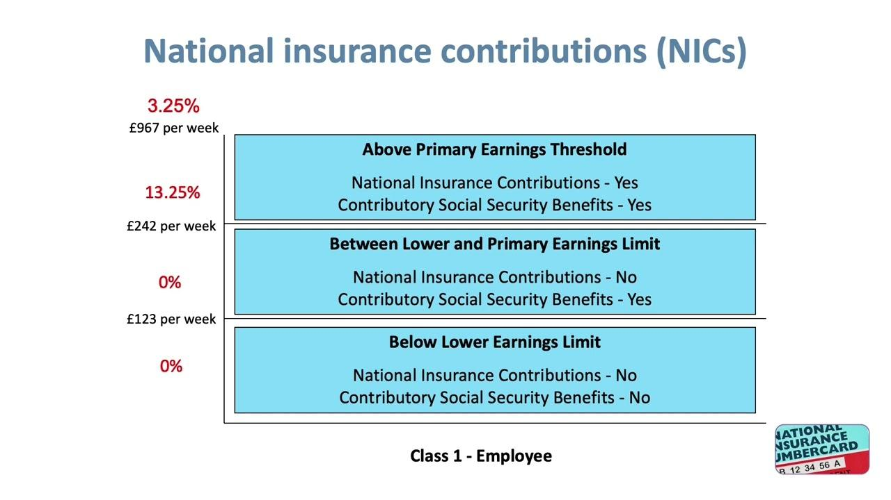

## Table of Contents

## What are National Insurance Contributions (NICs)?

National Insurance Contributions, or NICs, are payments you make to the government based on your earnings. They help fund state benefits like the State Pension, maternity leave, and unemployment benefits. Most people start paying NICs when they reach the age of 16 and are earning above a certain amount. The amount you pay depends on how much you earn and the type of work you do, whether you're employed or self-employed.

There are different classes of NICs, labeled from Class 1 to Class 4, each applying to different types of income and work situations. For example, Class 1 contributions are paid by employees through their wages, while Class 2 and Class 4 are paid by self-employed people. The money collected from NICs goes into the National Insurance Fund, which is used to pay for the mentioned state benefits. It's important to keep up with your NICs because they affect your entitlement to certain benefits, especially your State Pension when you retire.

## Who is required to pay National Insurance Contributions?

People who work and earn money usually need to pay National Insurance Contributions. This includes employees who work for a company and get a salary, as well as people who are self-employed and run their own business. You start paying these contributions when you are 16 years old and earning more than a certain amount of money each week or month. The amount you pay depends on how much you earn and whether you are an employee or self-employed.

There are different types of National Insurance Contributions, called classes. Employees pay Class 1 contributions, which are taken directly from their wages. Self-employed people pay Class 2 and Class 4 contributions. Class 2 is a flat rate paid weekly, and Class 4 is based on the profits of your business. It's important to pay these contributions because they help you qualify for benefits like the State Pension when you retire, and other benefits like maternity leave or unemployment support.

## How are National Insurance Contributions calculated?

National Insurance Contributions, or NICs, are calculated based on how much money you earn and what type of work you do. If you are an employee, you pay Class 1 contributions. These are taken out of your wages automatically. The amount you pay depends on how much you earn. There is a certain amount of money you can earn each week or month before you start paying NICs, called the Primary Threshold. Once your earnings go above this threshold, you pay a percentage of your earnings as NICs until you reach the Upper Earnings Limit, after which you pay a smaller percentage.

If you are self-employed, you pay Class 2 and Class 4 contributions. Class 2 contributions are a flat rate that you pay weekly if your profits are above a certain amount. Class 4 contributions are based on your profits. You pay a percentage of your profits between the Lower Profits Limit and the Upper Profits Limit, and a smaller percentage on any profits above the Upper Profits Limit. The rates and thresholds for NICs can change each year, so it's important to check the latest information from the government to know how much you need to pay.

Keeping up with your National Insurance Contributions is important because they help you qualify for certain benefits, like the State Pension when you retire. If you don't pay enough NICs, you might not get the full amount of these benefits. If you are unsure about how much you should be paying or if you have any gaps in your contributions, you can contact the government's National Insurance helpline for help.

## What are the different classes of National Insurance Contributions?

National Insurance Contributions, or NICs, are divided into different classes based on how you earn your money and what kind of work you do. There are four main classes: Class 1, Class 2, Class 3, and Class 4. Class 1 contributions are for employees who work for a company and get a salary. These contributions are taken out of your wages automatically. You start paying Class 1 NICs when your earnings go above a certain amount each week or month, called the Primary Threshold. You pay a percentage of your earnings until you reach the Upper Earnings Limit, after which you pay a smaller percentage.

Class 2 and Class 4 contributions are for people who are self-employed. Class 2 contributions are a flat rate that you pay weekly if your profits are above a certain amount. Class 4 contributions are based on your profits. You pay a percentage of your profits between the Lower Profits Limit and the Upper Profits Limit, and a smaller percentage on any profits above the Upper Profits Limit. Class 3 contributions are voluntary payments you can make to fill gaps in your National Insurance record, which can help you qualify for certain benefits like the State Pension.

Paying the right amount of NICs is important because it helps you qualify for benefits like the State Pension when you retire. The rates and thresholds for NICs can change each year, so it's a good idea to check the latest information from the government to know how much you need to pay. If you're unsure about your contributions or have any gaps, you can contact the government's National Insurance helpline for help.

## What benefits do National Insurance Contributions entitle you to?

National Insurance Contributions help you get certain benefits from the government. When you pay NICs, you can get money when you retire, which is called the State Pension. This is important because it gives you money to live on when you are older and not working anymore. NICs also help you get money if you can't work because you are sick or if you have a baby and need time off work, which is called maternity leave. If you lose your job, NICs can help you get money while you look for a new job.

Some other benefits you can get from paying NICs include help with funeral costs if someone in your family dies, and money if you need to take care of someone who is sick or disabled. It's important to keep up with your NICs because if you don't pay enough, you might not get all these benefits. The government keeps track of your contributions, and you can check your record to make sure you are on track to get the benefits you need.

## How do National Insurance Contributions affect state pension eligibility?

National Insurance Contributions, or NICs, are important for getting your State Pension when you retire. You need to pay enough NICs to qualify for the full State Pension. If you don't pay enough, you might get less money when you retire. The government looks at how many years you have paid NICs to decide how much State Pension you can get. You usually need about 35 years of contributions to get the full amount, but this can change.

If you find out you haven't paid enough NICs, you can make voluntary payments called Class 3 contributions to fill in the gaps. This can help you get more money when you retire. It's a good idea to check your National Insurance record to see if you are on track to get the full State Pension. You can do this online or by calling the government's National Insurance helpline. Keeping up with your contributions is important for a comfortable retirement.

## Can you get a refund on National Insurance Contributions?

You might be able to get some of your National Insurance Contributions back, but it depends on your situation. If you paid too much because you have more than one job, you can ask for a refund. Also, if you paid contributions but then found out you didn't need to because your income was too low, you can get that money back too. You need to ask for a refund within a certain time, usually six years from the end of the tax year you paid the contributions.

It's a good idea to check if you can get a refund because it can save you money. You can ask for a refund by filling out a form on the government's website or by calling the National Insurance helpline. They will tell you if you can get your money back and how to do it. Remember, not everyone can get a refund, so it's important to check if you qualify.

## What happens if you pay too much or too little in National Insurance Contributions?

If you pay too much in National Insurance Contributions, you might be able to get some money back. This can happen if you have more than one job or if you paid contributions when you didn't need to because your income was too low. You need to ask for a refund within six years from the end of the tax year you paid the contributions. You can do this by filling out a form on the government's website or by calling the National Insurance helpline. They will tell you if you can get your money back and how to do it.

If you pay too little in National Insurance Contributions, it can affect the benefits you get from the government, especially your State Pension when you retire. You need to pay enough NICs to qualify for the full State Pension, which usually means about 35 years of contributions. If you don't pay enough, you might get less money when you retire. You can make voluntary payments called Class 3 contributions to fill in any gaps in your record, but it's important to check your National Insurance record to make sure you are on track to get the full State Pension.

## How do National Insurance Contributions impact self-employed individuals differently?

For self-employed people, National Insurance Contributions work a bit differently than for employees. Self-employed individuals pay two types of contributions: Class 2 and Class 4. Class 2 contributions are a flat rate that you pay weekly if your profits are above a certain amount. This means you pay the same amount each week no matter how much you earn. Class 4 contributions are based on your profits. You pay a percentage of your profits between the Lower Profits Limit and the Upper Profits Limit, and a smaller percentage on any profits above the Upper Profits Limit. This means the more money you make, the more you pay in Class 4 contributions.

These contributions are important for self-employed people because they help qualify for benefits like the State Pension when they retire. Just like employees, self-employed individuals need to pay enough NICs to get the full State Pension, which usually means about 35 years of contributions. If they don't pay enough, they might get less money when they retire. Self-employed people can also make voluntary Class 3 contributions to fill in any gaps in their record. It's important for them to keep track of their contributions and check their National Insurance record to make sure they are on track to get the benefits they need.

## What are the current rates and thresholds for National Insurance Contributions?

For the 2023-2024 tax year, if you are an employee, you pay Class 1 National Insurance Contributions. You start paying these contributions when your weekly earnings go above £242, which is called the Primary Threshold. Between £242 and £967 a week, you pay 12% of your earnings. If your earnings go above £967 a week, you pay 2% on the extra money. These numbers can change each year, so it's good to check the latest information from the government.

If you are self-employed, you pay Class 2 and Class 4 contributions. You pay Class 2 contributions if your profits are more than £6,725 a year. The weekly rate for Class 2 is £3.45. For Class 4, you pay 9% of your profits between £12,570 and £50,270, and 2% on any profits above £50,270. Keeping up with these payments is important because they help you qualify for benefits like the State Pension when you retire.

## How have National Insurance Contributions changed historically, and what future changes are anticipated?

National Insurance Contributions have changed a lot over time. When they started in 1911, they were just for helping people who got sick or lost their jobs. Over the years, they added more benefits like the State Pension, which you get when you retire. The rates and how much you need to earn before you start paying have changed too. For example, in the 1970s, they added different classes for different types of work, like Class 1 for employees and Class 2 and Class 4 for people who work for themselves. The government often changes the rates and rules to make sure they have enough money to pay for these benefits and to keep up with how much things cost.

In the future, National Insurance Contributions might change again. The government might raise the rates or change how much you need to earn before you start paying. They might also change the rules about how many years you need to pay to get the full State Pension. Some people think the government might even combine National Insurance with income tax to make things simpler. It's hard to know exactly what will happen, but keeping an eye on the news and checking the government's website can help you stay updated on any changes that might affect you.

## What are the strategies for minimizing National Insurance Contributions while maximizing benefits?

To minimize National Insurance Contributions while still getting the most out of your benefits, you can start by making sure you know the rules. For example, if you are self-employed, you only need to pay Class 2 contributions if your profits are above a certain amount. If your profits are low, you might not have to pay Class 2 at all. Also, if you have more than one job, you might end up paying too much in contributions. You can ask for a refund if you paid too much, which can save you money.

Another way to make the most of your contributions is to check your National Insurance record regularly. This helps you see if you are on track to get the full State Pension when you retire. If you find gaps in your record, you can make voluntary Class 3 contributions to fill them. This can help you get more money when you retire. It's also a good idea to plan your earnings carefully, especially if you are self-employed, to make sure you are paying just enough to get the benefits you need without paying more than you have to.

## References & Further Reading

[1]: ["National Insurance Contributions: Legislation and Impact on the UK Economy"](https://www.bbc.co.uk/news/articles/c4g7x6p865zo) - UK Government.

[2]: Aldridge, I. (2013). ["High-Frequency Trading: A Practical Guide to Algorithmic Strategies and Trading Systems"](https://www.ahmetbeyefendi.com/wp-content/uploads/2020/07/High-Frequency-Trading-Irene-Aldridge.pdf) - Wiley.

[3]: Snape, M. D. (2016). ["An Empirical Analysis of the Impact of National Insurance Changes on the UK Employment Rates."](https://pmc.ncbi.nlm.nih.gov/articles/PMC8812794/) - Economic Policy.

[4]: Duhigg, C. (2009). ["How the Iceberg Order Took Down Wall Street"](https://www.amazon.com/Power-Habit-What-Life-Business/dp/081298160X) - The New York Times.

[5]: Chan, E. (2017). ["Algorithmic Trading: Winning Strategies and Their Rationale"](https://github.com/ftvision/quant_trading_echan_book) - Wiley.