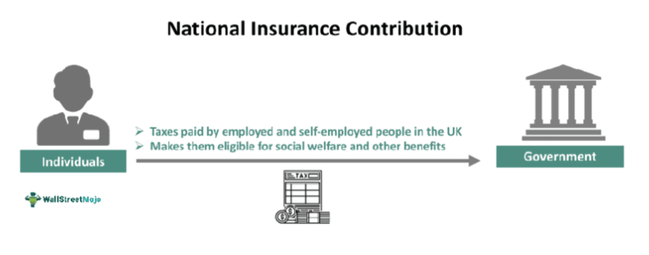

National Insurance Contributions (NICs) are a fundamental part of the United Kingdom's social welfare system, serving as essential funding for public services such as the National Health Service (NHS) and state pensions. Collected from both employers and employees, NICs are a form of taxation on earnings, which supports the financial fabric of the UK by maintaining the welfare state. Their significance extends beyond social security; they influence labor markets and the broader economy by affecting disposable income and employment costs.

Algorithmic trading, also known as algo trading, refers to the use of computer algorithms to automate trading decisions in financial markets. This method has gained prominence due to its ability to process vast datasets and execute trades at high speeds, uncovering patterns and opportunities that might be invisible to human traders. Its increasing relevance is evident as financial institutions seek efficiency, precision, and risk management in market operations.



This article aims to explore the intersection of National Insurance Contributions and algorithmic trading, a topic that holds considerable importance for the future of financial management and economic strategy. By understanding how NICs influence financial markets and how algo trading can adapt to such fiscal inputs, stakeholders can better navigate the complexities of modern finance.

The integration of NIC considerations into algo trading strategies offers both potential benefits and challenges. On the one hand, it could lead to optimized financial processes and enhanced forecasting possibilities for NIC trends, improving decision-making for traders and policymakers. On the other hand, it raises questions about compliance, data accuracy, and the ethical use of algorithms in managing such sensitive financial elements.

Financial analysts, traders, and policymakers are likely to find this exploration particularly informative. The synthesis of fiscal policy variables like NICs with advanced trading methodologies could foster more comprehensive strategies for investment and financial planning, enhancing both market efficiency and economic robustness.

## Table of Contents

## Understanding National Insurance NIC Contributions

National Insurance Contributions (NICs) are a fundamental component of the United Kingdom's taxation system, serving as a primary mechanism for funding public services such as the National Health Service (NHS) and state pensions. NICs are essentially contributions made by employees, employers, and self-employed individuals to qualify for certain social security benefits, including unemployment, sickness, and retirement benefits.

The structure of NICs is categorized into different classes, each specifying who is liable to make these payments:

1. **Class 1 NICs**: These are paid by employed individuals and their employers. Employees contribute a percentage of their earnings above a certain threshold, while employers also pay a percentage based on the employee's salary.

2. **Class 2 NICs**: These are flat-rate contributions paid by self-employed individuals. The amount is fixed and applies to earnings above a specific threshold.

3. **Class 3 NICs**: Voluntary contributions made by individuals to fill gaps in their NIC record and ensure they qualify for benefits such as the state pension.

4. **Class 4 NICs**: These are paid by self-employed persons and are calculated as a percentage of their profits within a specified range.

Recent changes to NIC rates and policies have been subject to governmental budget announcements and economic conditions. For instance, policy adjustments are often influenced by the need to balance public expenditure with economic growth. Such changes can involve modifying the earnings thresholds or the percentage rates applied to different classes of NICs.

The impact of NICs on various sectors of the economy is multifaceted. In the financial industry, for instance, changes in NIC policies can influence the operational costs of businesses, affecting profit margins and corporate strategies. Companies might adjust their employment practices or investment in workforce development based on NIC-related expenses. Additionally, the self-employed sector, which includes many financial consultants and independent traders, might experience shifts in disposable income and business investment due to changes in NIC obligations.

The financing obligations imposed by NICs also play a significant role during economic evaluations and business forecasting, as firms must account for these costs in their financial planning. Consequently, NIC rates and policies are pivotal in shaping the fiscal landscape of the UK, affecting employment patterns, consumer spending, and overall economic health.

Given this intricate relationship, financial analysts, policymakers, and industry professionals often consider NICs a critical variable in economic analysis and strategic decision-making.

## A Primer on Algorithmic Trading

Algorithmic trading refers to the use of computer algorithms to automate trading strategies in financial markets. It emerged in the late 20th century with the growth of electronic trading platforms and has since become integral to modern trading practices. This approach to trading involves creating a set of ruled instructions for placing orders to generate profit at a speed and frequency that would be impossible for a human trader.

At its core, [algorithmic trading](/wiki/algorithmic-trading) distinguishes itself by relying on automation and speed. Algorithms, which are essentially sequences of computational steps, can execute orders at a pace and precision unmatched by human traders. The algorithms scan market data, identify trading opportunities according to specified criteria, and execute trades, often in fractions of a second. This rapid execution minimizes the impact of market changes between the time a trade decision is made and when it is executed, thus optimizing the potential for profit.

The efficiency of algorithmic trading is one of its primary advantages. It reduces transaction costs by executing large volumes of trades without the need for manual intervention, thereby minimizing the risk of human error. Additionally, algorithms can monitor multiple markets and assets simultaneously, providing a scale of analysis that is impractical for human traders. Furthermore, algorithmic trading enhances risk management by adhering strictly to predefined rules and strategies, reducing the likelihood of emotional decision-making impacting trading outcomes.

Despite these benefits, algorithmic trading is not without its challenges and risks. One significant issue is market [volatility](/wiki/volatility-trading-strategies); algorithms can exacerbate price swings if numerous trades are executed simultaneously based on similar triggering criteria. Technical failures also present risks, as glitches in the trading software can lead to unintended trades, resulting in substantial financial losses. Moreover, algorithms require reliable data and robust technological infrastructure to function correctly. Any compromise in data quality or system performance can lead to flawed trading decisions.

Overall, while algorithmic trading offers significant advantages in terms of speed, efficiency, and risk management, it requires careful design and ongoing oversight to mitigate its inherent risks. The continuous evolution of technology ensures that algorithmic trading remains an essential component of the financial markets, necessitating ongoing refinement and adaptation in strategies and infrastructure.

## How National Insurance Contributions Affect Algo Trading

National Insurance Contributions (NICs) play a significant role in the financial ecosystem, and their influence can extend to algorithmic trading, a field characterized by rapid transactions and data-driven strategies. Both direct and indirect effects of NICs can be observed in financial markets, affecting investment strategies and the infrastructure necessary for algorithmic trading.

### Direct and Indirect Effects on Financial Markets

NICs, which are essential for funding public services in the UK such as the National Health Service (NHS) and state pensions, represent a substantial financial obligation for businesses and individuals. In the context of financial markets, NICs can act as a fiscal tool that influences economic conditions, potentially affecting overall market sentiment. Changes in NIC rates can lead to variations in disposable income and corporate profitability, which in turn may impact market indices and the cost of capital.

### Influence on Investment Strategies in Algo Trading

Algorithmic trading relies on predefined strategies to execute trades based on market conditions, economic indicators, and financial events. Changes in NIC rates can influence these strategies by altering the expected cash flows or risk assessments. For instance, an increase in NIC rates may reduce net profit margins for companies, potentially leading to adjustments in valuation models utilized by trading algorithms. Conversely, a reduction in NICs could signal higher disposable income levels for consumers, leading algorithms to allocate more resources to consumer goods sectors.

Algorithmic models may incorporate NIC changes through sentiment analysis. For instance, a sentiment score generated from news articles about NIC policy changes can be incorporated into algorithms to adjust the likelihood of making bullish or bearish trades. 

```python
def apply_sentiment_adjustment(sentiment_score, base_investment_amount):
    # A simple sentiment adjustment formula
    adjustment_factor = 1 + (sentiment_score / 100)
    adjusted_investment = base_investment_amount * adjustment_factor
    return adjusted_investment

base_investment = 100000  # Base investment amount in currency units
nic_sentiment_score = 5  # Hypothetical sentiment score ranging from -100 to 100

adjusted_investment_amount = apply_sentiment_adjustment(nic_sentiment_score, base_investment)
```

### Impact on Algo Trading Infrastructure

Regulatory changes related to NICs can directly impact the infrastructure for algorithmic trading. For example, increased compliance and reporting requirements could necessitate additional data processing and storage capabilities, thereby influencing technology costs and requirements for trading platforms. As trading infrastructures adapt to accommodate these changes, latency and efficiency could be affected, which are critical aspects of successful algo trading.

Moreover, algorithmic traders must integrate robust risk management practices to account for NIC-related fluctuations in financial data, ensuring that algorithms remain optimized and capable of handling regulatory impacts.

### NICs and Trader Sentiment

Trader sentiment, which can influence algorithmic decision-making, is also affected by NIC policies. Changes in NIC policy can lead to uncertainties or optimism in economic forecasts, directly affecting trader sentiment. Algorithms may integrate sentiment analysis data, utilizing [machine learning](/wiki/machine-learning) to refine predictions and decisions based on current NIC news. This incorporation of NIC sentiment ensures that trading strategies remain responsive to policy shifts, enhancing the adaptability of algorithmic models to changing economic conditions.

Overall, the intersection of NIC contributions and algorithmic trading highlights the need for a comprehensive approach that considers fiscal policies as an integral component of trading strategies. By acknowledging NIC influences, traders and analysts can improve predictive accuracy and optimize trading outcomes in a volatile market environment.

## Potential Synergies Between NIC Contributions and Algo Trading

Algorithmic solutions can significantly enhance the management of National Insurance Contributions (NICs) and associated financial processes by improving accuracy, efficiency, and forecasting capabilities. One of the primary applications of algorithmic trading in this context is its ability to process large datasets rapidly, enabling the identification of patterns and trends in NIC-related financial activities. For instance, using machine learning algorithms, financial analysts can predict future NIC rates and contributions based on historical data, economic factors, and policy changes. These predictions can inform financial planning, helping organizations and individuals better prepare for upcoming financial obligations and opportunities.

Innovative tools have been developed to integrate NIC considerations directly into algorithmic trading strategies. These tools often utilize real-time data feeds and advanced analytics to adjust trading models dynamically, ensuring that investment strategies remain aligned with current NIC policies and market conditions. For example, an algorithm could be designed to monitor legislative changes around NIC rates and automatically adjust portfolio allocations to mitigate potential financial impacts. This not only optimizes the management of investments but also enhances compliance with regulatory standards.

Case studies illustrate the benefits of merging NIC data with algorithmic trading. One notable example is a financial firm that developed a proprietary algorithm capable of incorporating anticipated NIC rate changes into its risk assessment framework. By doing so, the firm was able to improve its capital allocation efficiency and reduce exposure to policy-related risks. This integration resulted in cost savings and enhanced returns on investment, demonstrating the tangible advantages of linking NIC considerations with algorithmic processes.

Another example involves a multinational corporation utilizing an algorithmic platform to simulate various NIC policy scenarios. The platform allowed the company to evaluate the potential impacts on cash flow and employee compensation structures, leading to more informed strategic decisions. Such applications underscore the value of algorithmic trading not only in optimizing investment outcomes but also in enhancing broader financial management practices related to NICs.

These synergies highlight the transformative potential of algorithmic trading in the context of NIC management, offering opportunities for improved efficiency and strategic foresight. As algorithms become more sophisticated and data integration more seamless, the capacity to optimize NIC-related financial processes will likely expand, benefiting stakeholders across the financial sector.

## Challenges and Considerations

Combining National Insurance Contributions (NICs) with algorithmic trading presents distinctive regulatory and compliance challenges. The financial sector is heavily regulated, and the introduction of complex technologies such as algorithmic trading complicates compliance efforts. Regulatory frameworks, like those established by the Financial Conduct Authority (FCA) in the UK, require firms to ensure that algorithmic trading systems are designed to prevent market abuse and maintain fair market conditions. This necessitates careful oversight of algorithms that may be influenced by fluctuations in NIC-related data, ensuring they adhere to legal standards and ethical norms.

Technological infrastructure and data accuracy play crucial roles in managing these challenges. Algorithmic trading relies on advanced computing systems capable of processing real-time data with high precision. The accuracy of NIC-related data is vital, as inaccuracies can lead to flawed predictions and erroneous trading decisions. To overcome these hurdles, firms must invest in robust data management systems and ensure seamless integration with existing trading platforms. High-frequency trading environments, for example, demand low-latency networks that can process large volumes of data instantly and reliably.

Ethical implications and transparency issues emerge as significant considerations. Algorithms used to manage NIC-related investments must be transparent and free from biases that could exploit market inefficiencies unfairly. Ensuring algorithmic transparency is challenging but necessary to foster trust among market participants and regulatory bodies. This includes implementing mechanisms to audit and validate algorithmic decision-making processes, thereby safeguarding against unethical practices.

Fluctuations in NIC policies can significantly influence market participants involved in algorithmic trading. Policy changes can alter NIC rates, affecting both corporate and individual financial planning. Traders need to swiftly adapt their strategies to respond to these changes, which can impact algorithmic trading models. The effect of NIC policy modifications may extend to altering tax implications and affecting disposable income levels, thereby influencing consumption patterns and, consequently, market dynamics. As such, staying attuned to governmental fiscal policy announcements and adapting algorithms accordingly is crucial for mitigating potential market volatility.

In summary, successfully integrating NIC considerations within algorithmic trading frameworks requires addressing regulatory compliance, investing in technological infrastructure, ensuring data accuracy, and maintaining ethical transparency. Market participants must remain vigilant to policy changes that could impact algorithmic models, embracing flexible strategies and robust systems to navigate this complex financial intersection.

## Conclusion

The exploration of the intersection between National Insurance Contributions (NIC) and algorithmic trading uncovers several opportunities and challenges for the financial sector. National Insurance Contributions, a key component in the funding of public services such as healthcare and state pensions in the UK, can have significant effects on financial markets and, consequently, on trading strategies. Algorithmic trading, with its emphasis on speed, efficiency, and automation, presents a compelling avenue for integrating NIC considerations into trading strategies. By leveraging data analytics and algorithm-driven insights, traders can optimize their strategies to account for fluctuations in NIC policies and rates.

The integration of NIC considerations with algorithmic trading holds the potential for enhanced decision-making and risk management. For instance, algorithms can be designed to incorporate NIC-related data, potentially leading to more informed investment strategies. This could result in improved efficiency, not only in trading outcomes but also in the broader management of NIC-related financial processes. As the financial landscape continues to evolve, the ability of algorithms to forecast NIC trends and outcomes will be crucial for financial planning and stability.

Looking ahead, both NIC contributions and algorithmic trading are likely to undergo significant transformations. Regulatory and policy changes in NIC will continue to affect financial markets, thereby necessitating adaptive trading strategies. Algorithmic trading will likely become even more sophisticated with advancements in technology and data analytics, offering new tools and approaches for tackling challenges posed by NIC policies. The financial sector must remain agile, ensuring that trading strategies are not only compliant but also optimized to capitalize on available data.

Industry stakeholders, including financial analysts, traders, and policymakers, are encouraged to stay informed and adaptable to changes in both NIC policies and algorithmic trading technologies. By doing so, they can maintain a competitive edge and ensure robust financial strategies that align with evolving regulatory landscapes. Ongoing education, collaboration, and investment in emerging technologies will be vital to successfully navigating the future of National Insurance Contributions and algorithmic trading.

## Call to Action

Engage with this evolving dialogue by sharing the article with colleagues who have an interest in finance and technology. The intersection of National Insurance Contributions (NIC) and algorithmic trading represents a growing area of importance, with potential impacts on investment strategies and financial planning. Financial professionals are encouraged to evaluate how ongoing changes in NIC policies could influence their algorithmic trading strategies. By staying updated with emerging trends and developments in both fields, traders, analysts, and policymakers can better position themselves to leverage opportunities and mitigate risks.

For those seeking to remain at the forefront of these advancements, subscribing to updates or newsletters that focus on NIC and algorithmic trading developments is highly recommended. These resources provide critical insights into the dynamic landscape of national insurance policies and technological innovations in trading, offering valuable guidance for future decision-making and strategic planning.

## References & Further Reading

[1]: ["National Insurance Contributions: Legislation and Impact on the UK Economy"](https://www.bbc.co.uk/news/articles/c4g7x6p865zo) - UK Government.

[2]: Aldridge, I. (2013). ["High-Frequency Trading: A Practical Guide to Algorithmic Strategies and Trading Systems"](https://www.ahmetbeyefendi.com/wp-content/uploads/2020/07/High-Frequency-Trading-Irene-Aldridge.pdf) - Wiley.

[3]: Snape, M. D. (2016). ["An Empirical Analysis of the Impact of National Insurance Changes on the UK Employment Rates."](https://pmc.ncbi.nlm.nih.gov/articles/PMC8812794/) - Economic Policy.

[4]: Duhigg, C. (2009). ["How the Iceberg Order Took Down Wall Street"](https://www.amazon.com/Power-Habit-What-Life-Business/dp/081298160X) - The New York Times.

[5]: Chan, E. (2017). ["Algorithmic Trading: Winning Strategies and Their Rationale"](https://github.com/ftvision/quant_trading_echan_book) - Wiley.