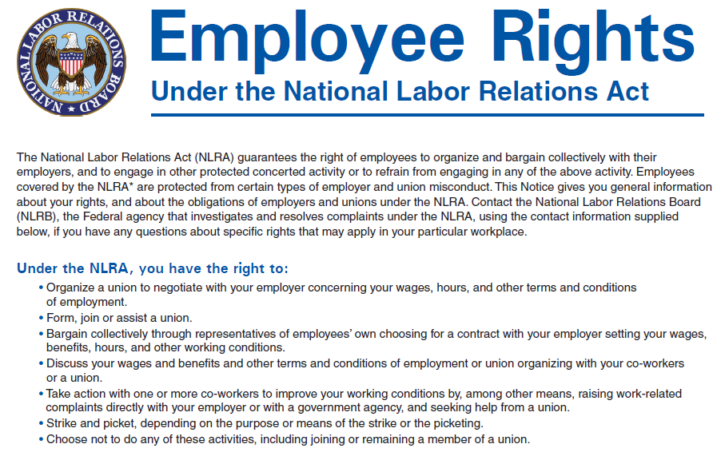

In today's rapidly evolving labor landscape, the role of the National Labor Relations Board (NLRB) is more crucial than ever. As labor dynamics shift with technological advancements like algorithmic trading, understanding the NLRB's role in protecting workers' rights becomes important. The NLRB, established in 1935 as part of the National Labor Relations Act (NLRA), acts as a federal agency focused on safeguarding employees' rights to organize and engage in collective bargaining, whether through a labor union or independently. Its purpose is to maintain a fair labor environment and resolve disputes that arise between employers, employees, and unions.

Algorithmic trading, a technological innovation in the financial sector, uses algorithms to make trading decisions at speeds and complexities beyond human capability. This advancement impacts labor dynamics, as it can lead to job displacement and a demand for different skill sets within the workforce. The intersection of the NLRB's policies and algorithmic trading introduces a distinct set of challenges and opportunities in labor relations. As AI and automation continue to permeate industries, the NLRB's responsibilities expand to ensure that these technologies do not undermine workers' rights and that fair employment practices are upheld.

Examining the NLRB's enforcement powers allows us to better understand its significance in labor relations amidst such technological changes. While algorithmic trading and AI can enhance productivity and efficiency, they also raise critical questions about job security, skill requirements, and the rights of the existing workforce. The goal of this article is to provide insights into how these technologies, particularly algorithmic trading, challenge existing labor frameworks while presenting new opportunities for innovation and growth.

By focusing on how the NLRB interacts with the evolving technologies, stakeholders can work towards a balanced integration of technology in the workplace that respects labor rights. This involves appreciating both the potential enhancements these technologies bring and the necessary regulations to prevent any negative impacts on the workforce. The ongoing and future efforts by the NLRB will be crucial in navigating these developments to foster a fair and just labor ecosystem for all parties involved.

## Table of Contents

## Understanding the National Labor Relations Board (NLRB)

The National Labor Relations Board (NLRB) was established in 1935 as a cornerstone institution for implementing the National Labor Relations Act (NLRA). This Act was designed to protect the rights of employees, granting them the ability to engage in collective bargaining and to organize labor unions. One of the fundamental purposes of the NLRB is to prevent and remedy unfair labor practices by both employers and labor organizations.

Throughout its history, the NLRB has played a significant role in addressing and resolving labor disputes, ensuring that the workplace rights of employees are maintained. The agency serves as a quasi-judicial body in labor relations, adjudicating cases related to workers’ rights and employer-employee interactions. The decisions made by the NLRB can set significant precedents that influence labor practices across various industries.

The scope and authority of the NLRB have expanded through significant legislative amendments to the original NLRA. Key among these amendments are the Taft-Hartley Act of 1947 and the Landrum-Griffin Act of 1959. The Taft-Hartley Act aimed to balance the power between unions and employers by introducing various restrictions on labor unions, including banning unfair labor practices by unions, restricting union political contributions, and allowing states to enact right-to-work laws. On the other hand, the Landrum-Griffin Act enhanced the NLRB’s ability to regulate internal union affairs to protect individual rights within unions, ensuring democratic processes in union elections and financial transparency.

These legislative enhancements have extended the NLRB's jurisdiction across various economic sectors, enabling it to effectively manage the evolving needs of the workforce. As industries continue to grow and shift due to technological progress and globalization, the NLRB's role remains essential in maintaining fair labor standards and adapting regulatory frameworks to contemporary challenges. The board not only acts as an adjudicator in conflicts but also as an enforcer of labor laws, aiming to maintain harmony and equity in employer-employee relationships.

Understanding these elements of the NLRB is crucial for comprehending its foundational role in mediating labor relations within the United States, providing a structured process for addressing grievances and ensuring the protection and empowerment of workers in their respective industries.

## NLRB Responsibilities and Structure

The National Labor Relations Board (NLRB) is responsible for conducting elections to determine labor union representation and investigating allegations of unfair labor practices by employers and unions. These elections allow employees to decide whether they wish to be represented by a union and, if so, which one. The process ensures that workers can exercise their rights to organize and collectively bargain effectively.

In its oversight role, the NLRB encourages settlements between employers and employees to resolve disputes without formal litigation. This approach benefits both parties by saving time and resources while reaching mutually agreeable solutions. However, when settlements are not possible, the NLRB adjudicates cases, functioning in a quasi-judicial capacity to hold hearings, determine facts, and apply the law to specific situations.

To remain effective amidst evolving labor market dynamics, the NLRB continuously works to improve labor laws. This involves adapting existing rules and policies to address new challenges, such as those brought on by technological advancements and shifting workplace conditions.

The agency's structure facilitates its wide-ranging responsibilities. The NLRB operates through a network of regional offices across the United States, ensuring accessibility and responsiveness to labor issues nationwide. Oversight and governance are provided by a five-member board and a general counsel, both of whom are appointed by the President of the United States. The board members play a crucial role in decision-making on significant labor cases, while the general counsel oversees investigations and prosecutions of unfair labor practices.

This organizational structure allows the NLRB to administer labor laws effectively, maintain labor relations stability, and adapt to changes within the workforce efficiently.

## Algorithmic Trading and Labor Relations

Algorithmic trading has revolutionized the landscape of financial markets by employing advanced computer algorithms to execute trades at speeds and frequencies unavailable to human traders. Its growth within these markets has sparked several labor concerns, primarily centered on job displacement and the evolving skill requirements for traders and financial professionals. As [algorithmic trading](/wiki/algorithmic-trading) becomes more widespread, traditional trading jobs may be at risk, prompting the need for employees to acquire new technical skills associated with managing and improving algorithmic systems. This necessitates a workforce transition towards roles focusing on oversight and strategy development for algorithmic systems, rather than direct trade execution.

The National Labor Relations Board (NLRB) plays a pivotal role in this transitional phase, given its mandate to ensure fair labor practices and protect workers' rights. In industries adopting algorithmic trading and [artificial intelligence](/wiki/ai-artificial-intelligence), the NLRB's oversight is essential to maintaining fair labor standards and ensuring workers impacted by these technological shifts continue to receive equitable treatment. The NLRB's responsibilities in these settings include ensuring that employers properly engage with unions and employees when AI-driven systems are introduced, thereby safeguarding against unilateral changes that could adversely affect worker rights and job security.

To address these issues effectively, the NLRB must work in conjunction with other labor and industry stakeholders to develop frameworks that support both technological advancement and workforce adaptability. Employers are encouraged to collaboratively involve unions and employees when implementing AI and algorithmic trading solutions, pre-emptively addressing potential impacts on jobs and ensuring the workforce is adequately prepared and protected. This cooperative approach helps mitigate the risks posed by automation, allowing workers to transition to new roles with the support and training necessary to succeed in a rapidly digitalizing economy.

## Impacts of AI on Labor Relations

AI technologies, particularly those involved in algorithmic trading, have transformed the labor landscape by enhancing efficiency and productivity in various industries. These advancements often result in a reduction of manual tasks, enabling businesses to execute trades and manage portfolios with precision beyond human capabilities. However, this paradigm shift introduces significant challenges, notably job displacement and alterations in work conditions for the human workforce.

Algorithmic trading automates the buying and selling of securities at lightning speed, based on pre-defined criteria without direct human input. While this method maximizes profits and reduces delays, it also necessitates fewer human traders. As a consequence, those formerly engaged in traditional trading roles may face unemployment or the need to acquire new, technology-oriented skills. The transition to such advanced systems not only impacts employment opportunities but also redefines job roles and expectations within organizations.

To address these challenges, the National Labor Relations Board (NLRB) plays a crucial role. The NLRB, responsible for enforcing labor laws, helps ensure workers' rights are protected amidst these technological shifts. Collaborations with unions become essential to safeguard employee interests. Through collective bargaining, unions can negotiate terms that secure fair wages, retraining programs, and favorable working conditions, even as AI technologies permeate workplaces.

Proactively involving unions and employees in the planning and rollout of AI technologies is recommended for employers. By engaging in open dialogue, organizations can better anticipate the repercussions of AI integration and formulate strategies that mitigate adverse effects. This approach not only fosters a more inclusive workplace but also leads to smoother transitions that benefit both employers and employees. 

Employers' considerations should extend to maintaining transparency about the goals and processes of AI implementation. Moreover, commitments to upskilling or reskilling efforts can help displaced workers transition to roles that complement new technological tools. By prioritizing worker involvement and support, businesses can promote an adaptive work environment that thrives alongside AI advancements.

## Case Studies and Examples

The National Labor Relations Board (NLRB) has been pivotal in addressing labor challenges posed by technological advancements, with notable cases involving major corporations such as Amazon and key negotiations within the entertainment industry. These instances underscore the NLRB's capacity to navigate complex issues emerging from the integration of technology into labor practices.

One prominent example involves Amazon, a company known for its use of advanced technologies to streamline operations. The NLRB has been engaged in several disputes with Amazon concerning workers' rights, especially involving warehouse employees and delivery drivers. These disputes often concern allegations of unfair labor practices, including retaliatory actions against workers who attempt to unionize or voice concerns about working conditions. The NLRB's interventions in these cases typically focus on ensuring that Amazon complies with labor laws that protect worker rights to organize and engage in collective bargaining. For instance, the NLRB ruled in favor of Amazon warehouse workers' rights to organize in Bessemer, Alabama, concluding that Amazon had interfered with the election process.

In the entertainment sector, recent negotiations have highlighted the role of AI in reshaping labor dynamics. The rise of artificial intelligence in content creation has generated significant labor concerns, such as job security and the ethical use of AI-generated content. The NLRB has been called to mediate and adjudicate issues where AI's role in content creation impacts bargaining agreements between production companies and media labor unions. These negotiations often aim to secure fair wages and role definitions in a landscape where AI's capabilities are rapidly expanding.

Through these and other cases, the NLRB demonstrates its adaptability to technological advancements, ensuring that labor practices evolve while maintaining fairness and justice. The collaboration between unions, employers, and the NLRB is essential to negotiating new labor norms, providing a framework for equitable agreements in settings transformed by technology.

## The Future of Labor Relations with AI and Automated Trading

As AI and automated trading technologies continue to advance, the role of the National Labor Relations Board (NLRB) becomes increasingly pivotal in maintaining a balance between technological innovation and the protection of employee rights. The emergence of AI-driven tools and algorithms in trading and other industries introduces novel challenges and opportunities, requiring a proactive approach to labor relations. This transformation necessitates an ongoing dialogue among employers, employees, and regulatory entities to effectively adapt labor laws to new technological realities.

The deployment of AI and automated systems in workplaces can lead to significant changes in job dynamics, including job displacement, the creation of new roles, and shifts in required skill sets. The NLRB must ensure that policies are crafted to address these dynamics, securing job security and fair compensation for all workers. This involves reevaluating traditional labor laws in light of automation's impact on the workforce, with an emphasis on equitable labor practices.

For example, automated trading systems, which rely on sophisticated algorithms to execute financial transactions at high speeds, could potentially reshape the roles of human traders. This shift calls for new skill sets, such as data analysis and algorithm management, which workers must develop to stay relevant. The NLRB can play a role in facilitating training programs and advocating for fair labor practices amidst these technological shifts.

Moreover, the evolving nature of AI technologies indicates that regulatory frameworks must be agile and forward-thinking. The NLRB should work closely with all stakeholders to craft policies that ensure transparency and fairness, especially in compensation and work conditions affected by such technological advancements. Employers are encouraged to involve employees and unions in planning and implementing AI strategies, ensuring that concerns, such as data privacy and algorithmic bias, are addressed collaboratively.

In conclusion, the NLRB's role is critical in navigating the future landscape of labor relations influenced by AI and automated trading. By fostering ongoing dialogue and crafting adaptable policies, the NLRB can help ensure that technological progress aligns with the protection of workers' rights, leading to a more equitable labor ecosystem.

## Conclusion

The National Labor Relations Board (NLRB) continues to play an essential role in safeguarding workers' rights as the employment landscape undergoes significant transformation driven by artificial intelligence (AI) and algorithmic trading. The historical mission of the NLRB, centered around protecting the rights of employees to organize and collectively bargain, now extends into ensuring these rights are upheld amidst technological advancements that fundamentally change how industries operate.

As AI and automation present new challenges, understanding the NLRB's role in this evolving technological context becomes crucial for all stakeholders, including employers, employees, unions, and policy makers. The necessity for a labor ecosystem that balances both innovation and equitable labor practices cannot be overstated. Ensuring this balance involves recognizing the dual mandate of fostering technological progress while upholding the principles of fair labor.

In the face of rapid technological advancements, the NLRB is tasked with not only adapting existing policies but also innovating new strategies to address the impacts of AI and algorithmic trading on labor relations. This involves proactive engagement with labor unions and employers to foster dialogue and collaboration, ensuring that technological integration in workplaces is conducted with consideration of potential labor implications.

The partnership between technological innovation and labor rights demands rigorous governance to achieve shared benefits for all parties involved. Continuous dialogue and adaptive policy frameworks are essential to prevent the erosion of labor rights and to promote a fair labor market where technological advancements are leveraged for societal gain without compromising workers' rights. The commitment to this balance is what will ultimately drive the sustainable advancement of industries while safeguarding the cornerstone of fair labor practices.

## References & Further Reading

[1]: Bergstra, J., Bardenet, R., Bengio, Y., & Kégl, B. (2011). ["Algorithms for Hyper-Parameter Optimization."](https://proceedings.neurips.cc/paper/2011/file/86e8f7ab32cfd12577bc2619bc635690-Paper.pdf) Advances in Neural Information Processing Systems 24.

[2]: ["Advances in Financial Machine Learning"](https://www.amazon.com/Advances-Financial-Machine-Learning-Marcos/dp/1119482089) by Marcos Lopez de Prado

[3]: ["Evidence-Based Technical Analysis: Applying the Scientific Method and Statistical Inference to Trading Signals"](https://www.amazon.com/Evidence-Based-Technical-Analysis-Scientific-Statistical/dp/0470008741) by David Aronson

[4]: ["Machine Learning for Algorithmic Trading"](https://github.com/PacktPublishing/Machine-Learning-for-Algorithmic-Trading-Second-Edition) by Stefan Jansen

[5]: ["Quantitative Trading: How to Build Your Own Algorithmic Trading Business"](https://books.google.com/books/about/Quantitative_Trading.html?id=j70yEAAAQBAJ) by Ernest P. Chan