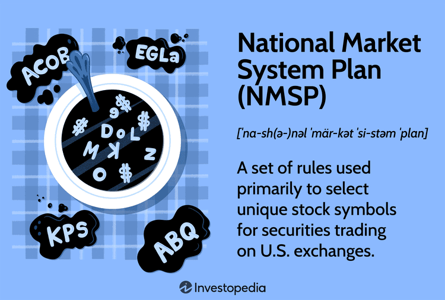

The National Market System (NMS) Plan serves as a cornerstone in the regulation of U.S. equity markets, established to ensure transparency, efficiency, and fairness. Originating from legislative efforts by the U.S. Congress and refined by the Securities and Exchange Commission (SEC), the NMS Plan mandates the integration of various trading venues into a cohesive system. This integration facilitates better price discovery and enhances market competition, vital components in today’s complex financial markets.

A critical element of the NMS Plan is its capacity to support algorithmic trading, a practice where computers execute pre-defined trading strategies at speeds and frequencies beyond human capability. By standardizing trade execution and data dissemination across multiple exchanges, the NMS Plan enhances the operational framework within which algo traders operate. This has significant implications for market liquidity and price efficiency, fostering a trading environment where innovation can thrive while promoting trust among investors.

Furthermore, the NMS Plan plays a pivotal role in shaping the trading landscape. It affects a diverse group of stakeholders, from traditional stock exchanges to new market entrants like alternative trading systems (ATS), often referred to as dark pools. Through its regulatory frameworks, the NMS Plan encourages these players to adopt technology-driven solutions to stay competitive, ultimately benefiting investors by allowing them access to better pricing and more trading options.

In summary, the NMS Plan's impact extends beyond mere regulatory compliance. It actively promotes a trading ecosystem characterized by technological advancement and increased competition, which collectively drive the evolution of financial markets. As we explore its core components and implications, the significance of the NMS Plan becomes evident in its ability to balance the interests of diverse market participants while maintaining market integrity.

## Table of Contents

## Understanding the National Market System (NMS) Plan

The National Market System (NMS) Plan represents a landmark regulatory framework implemented to streamline and standardize the trading of equity securities in the United States. Initiated by the U.S. Congress in 1975 and later implemented by the Securities and Exchange Commission (SEC), the NMS Plan sought to create an integrated national market by addressing the then-existing fragmentation in securities trading across numerous exchanges and trading venues.

The authorization of the NMS Plan aimed to achieve several key objectives: regulating securities trading, unifying stock symbols, and ensuring comprehensive market transparency. By providing a cohesive structure that integrated the various U.S. stock exchanges, the NMS Plan produced a more orderly and efficient market environment intended to support fair trading opportunities for all market participants.

Key components of the NMS Plan include the establishment of rules governing the execution, disclosure, and trading of equity securities. These rules have been pivotal in shaping the order handling and electronic trading systems used today. To address market efficiency and protect investors, the NMS Plan introduced the Consolidated Tape System (CTS) and the Consolidated Quotation System (CQS). These systems were designed to provide real-time price quotations and trade information, thereby enhancing market transparency and access to information for investors and traders.

The Securities and Exchange Commission (SEC) plays a crucial role in administering and evolving the NMS Plan through Regulation NMS. This regulatory framework was introduced in 2005 to modernize and expand upon the original NMS rules, focusing on promoting greater competition, ensuring transparency, and safeguarding best execution practices in the market. Regulation NMS has become integral to adjusting the infrastructure of financial markets to respond to technological advancements, investor needs, and the dynamic landscape of securities trading.

Overall, the NMS Plan fundamentally transformed the U.S. financial markets by setting foundational principles and regulations that continue to evolve with industry developments. Its significance lies in the promotion of a fair, transparent, and competitive trading environment that seeks to balance the interests of various stakeholders while adapting to the complexities of modern financial systems.

## Core Components of the NMS Plan

The National Market System (NMS) Plan plays a crucial role in ensuring transparency and efficiency in the U.S. equity markets by incorporating several core components designed to manage data dissemination and stock market access. 

One important element of the NMS Plan is the Intermarket Symbol Reservation Authority (ISRA). ISRA is responsible for the management of stock symbol selection, ensuring that each security traded on U.S. exchanges has a unique identifier. This system prevents confusion among traders and investors by maintaining consistency and clarity in stock symbol assignment across various trading platforms. By facilitating a streamlined and organized structure for symbol reservation, ISRA aids in the efficient functioning of equity markets.

Another critical component is the Consolidated Tape System (CTS) and the Consolidated Quotation System (CQS). These systems are integral for disseminating real-time market data across multiple equity exchanges. The CTS provides a consolidated feed of trade data, while the CQS offers a consolidated view of quotations, both helping market participants receive comprehensive and synchronized information. This widespread availability of data promotes transparency and enables market participants to make informed trading decisions, thereby enhancing overall market reliability and efficiency.

The NMS Plan also incorporates the role of Over the Counter (OTC) markets and Unlisted Trading Privileges (UTP). OTC markets allow trading of securities that are not listed on formal exchanges, thus expanding market access and providing more opportunities for [liquidity](/wiki/liquidity-risk-premium) and price discovery. UTP enables securities listed on one exchange to be traded on other exchanges, fostering competition and increasing market depth. These provisions ensure a more inclusive and competitive trading environment, allowing for better pricing and execution of trades.

Collectively, these components contribute significantly to a transparent and efficient trading environment. By ensuring clarity in symbol management, comprehensive data dissemination, and expanded market access, the NMS Plan supports a fair and competitive marketplace. These mechanisms are crucial for maintaining investor confidence and ensuring the smooth operation of financial markets.

## Algorithmic Trading under the NMS Plan

Algorithmic trading, commonly referred to as algo trading, involves the use of computer algorithms to automatically execute trades in financial markets. This form of trading has gained prominence with the growth of electronic trading systems and enhanced computational power, offering the capability to execute trades rapidly based on pre-defined criteria. Algorithmic trading has become integral to the modern financial landscape, driven by the pursuit of higher efficiency, speed, and cost-effectiveness.

The National Market System (NMS) Plan plays a crucial role in facilitating [algorithmic trading](/wiki/algorithmic-trading) by providing a framework that enhances data transparency and transmission speed. The NMS introduced a set of regulations aimed at ensuring fairness and equal access to market data, which are vital for the functioning of algorithmic trading. Key among these is the Consolidated Tape System (CTS) and Consolidated Quotation System (CQS), which provide a centralized data feed for all trades and quotes across various exchanges. By delivering real-time and comprehensive market data, these systems enable algorithms to make informed trading decisions, ultimately improving market efficiency.

Algorithmic trading significantly impacts market liquidity and price discovery processes. Algorithms can quickly execute large volumes of trades, increasing the depth and breadth of the market, thus enhancing liquidity. Additionally, these trades contribute to more accurate price discovery as they reflect a continuous assessment of available information, ensuring prices more closely align with the underlying value of securities.

Despite its benefits, algorithmic trading, particularly high-frequency trading ([HFT](/wiki/high-frequency-trading-strategies)), presents challenges and has been subject to regulatory scrutiny. HFT involves executing a large number of orders at rapid speeds, often measured in microseconds. While HFT can improve liquidity and reduce spreads, concerns have emerged regarding its potential to create market [volatility](/wiki/volatility-trading-strategies) and contribute to market disruptions. Regulatory bodies like the U.S. Securities and Exchange Commission (SEC) have implemented measures to oversee HFT practices under the NMS framework, ensuring these strategies do not compromise market integrity. Compliance measures include maintaining audit trails, limiting order-to-trade ratios, and implementing circuit breakers to halt trading in the event of extreme price fluctuations.

In conclusion, algorithmic trading under the NMS Plan exemplifies the synergy of advanced technology and regulatory oversight in shaping modern stock markets. While enhancing speed and transparency, continuous efforts are needed to address the challenges posed by high-frequency trading to maintain a balanced and fair trading environment.

## Impact on Stock Exchanges and Market Participants

The implementation of the National Market System (NMS) Plan has significantly transformed the landscape of U.S. equity markets by fostering increased competition among trading venues. This heightened competition primarily results from regulation that encourages transparency, efficiency, and competition across various market platforms.

Traditional stock exchanges, such as the New York Stock Exchange (NYSE) and NASDAQ, have adapted their operations to compete with Alternative Trading Systems (ATS) and dark pools. Unlike traditional exchanges, ATS and dark pools provide less transparent trading environments that cater to large institutional investors looking to trade sizable orders without impacting market prices significantly. This shift has led traditional exchanges to innovate and optimize their services, such as enhancing technological infrastructure and improving order execution speeds, to retain and attract trading volumes.

Broker-dealers, market makers, and investors benefit from the NMS Plan as it provides a framework that mandates improved market transparency and accessibility. Broker-dealers and market makers find avenues for better price discovery and liquidity, facilitating their roles in matching buy and sell orders efficiently. Investors, in turn, gain from reduced costs and better execution prices due to increased competition among trading venues attempting to offer the most favorable conditions.

Compliance with the NMS framework is critical for all stock market participants, including broker-dealers and exchanges. Key compliance requirements include adhering to best execution obligations, ensuring that customer orders receive the best possible execution terms. This involves evaluating the quality of execution services provided by trading venues in terms of speed, price, and likelihood of execution and settlement. Furthermore, stakeholders must also comply with the Order Protection Rule, which mandates routing orders to the market centers displaying the best prices.

To maintain competitive advantage and compliance with the NMS Plan, stakeholders invest in advanced technologies, such as high-frequency trading systems and analytical tools that assess market data in real time. These investments contribute to a more dynamic and efficient market ecosystem, ultimately promoting the objectives of the NMS Plan by ensuring fair and transparent market practices.

## Transparency and Fairness in Financial Markets

The National Market System (NMS) Plan plays a crucial role in ensuring transparency and fairness in U.S. financial markets. One of its primary objectives is to provide transparent trading environments through consolidated data feeds. These data feeds aggregate real-time quotes and trading information from all participating exchanges, enabling market participants to make informed decisions based on a complete view of market activity. This comprehensive data dissemination helps reduce information asymmetry, where some traders might otherwise have access to more or better information than others, thereby promoting a fairer trading landscape.

Fairness in trading is further enhanced by stringent order handling rules and measures to prevent conflicts of interest. The NMS Plan establishes guidelines that ensure investor orders are executed at the best possible prices available across different exchanges. This is achieved by enforcing the "National Best Bid and Offer" (NBBO) rule, which mandates that brokers execute trades at the most favorable prices for their clients, regardless of the exchange. These measures mitigate the risk of brokers or dealers prioritizing their interests over those of their clients, fostering trust and integrity within the market.

Technology underpins the NMS Plan's objectives by facilitating efficient data processing and execution of trades. High-frequency trading (HFT) and other algorithmic strategies, enabled by advancements in computing technology, rely on the rapid processing and analysis of consolidated market data. This technological capability supports the market’s liquidity and competitiveness by allowing trades to be executed swiftly and accurately, aligning with the NMS Plan's transparency and fairness goals.

In addition to public exchanges, dark pools and Alternative Trading Systems (ATS) are also subject to regulatory oversight to ensure fair trading. These private trading venues must adhere to the same transparency standards as public exchanges, particularly concerning trade reporting. By regulating trades conducted within these platforms, the NMS Plan addresses potential issues of opacity, where market participants might otherwise trade large blocks of securities out of public view. This regulation is crucial for maintaining a level playing field across all trading venues, ensuring that all participants operate under equal standards of transparency and fairness.

In conclusion, the NMS Plan integrates a series of rules and technological advancements that collectively work to achieve transparency and fairness across U.S. financial markets. Through consolidated data feeds, effective order handling rules, and regulatory oversight of both public exchanges and alternative platforms, the framework seeks to foster a trading environment that is equitable and efficient for all participants.

## Technology and Infrastructure Upgrades

Advanced technologies play a crucial role in fulfilling the requirements of the National Market System (NMS) Plan by enhancing market efficiency, transparency, and fairness. Key technological and infrastructure upgrades have been instrumental in meeting these objectives.

### High-Frequency Trading and Risk Management Systems

High-frequency trading (HFT) relies heavily on advanced infrastructure to execute trades within fractions of a second. Investments in network latency reduction, co-location services, and direct market access (DMA) platforms have been pivotal. These components enable trading firms to access multiple markets nearly instantaneously, ensuring they can capitalize on [arbitrage](/wiki/arbitrage) opportunities and respond swiftly to market movements. Risk management systems have also evolved, employing sophisticated algorithms to assess market conditions and execute trades that mitigate potential financial risks.

### Blockchain Technology

Blockchain technology has emerged as a significant innovation with potential to improve settlement times and reduce risks in financial markets. By utilizing decentralized and immutable ledgers, blockchain can facilitate real-time clearing and settlement of trades, thereby eliminating the traditional T+2 settlement cycle that involves counterparty risks. Smart contracts, autonomous programs executing predefined conditions, further enhance transaction reliability and efficiency. Blockchain's ability to provide a transparent and secure record of transactions aligns with NMS objectives, fostering trust among market participants.

### Global Collaboration and Enhanced Market Access

Collaborative efforts across global exchanges aim to harmonize technology standards and expand market access. Cross-border trading systems allow investors to engage with international exchanges seamlessly, often facilitated by partnerships and technology sharing initiatives. This global approach ensures that investors benefit from a wider array of trading opportunities, adhering to the NMS Plan's goals to support competitive and efficient markets. Efforts to standardize protocols, such as the Financial Information eXchange (FIX) protocol, contribute to a more interconnected global trading environment.

These technological and infrastructure advancements not only meet the enduring objectives of the NMS Plan but also contribute to a continually evolving financial market landscape, leveraging innovation to enhance market integrity and participant confidence.

## Regulatory Challenges and Compliance

The National Market System (NMS) Plan, while instrumental in enhancing transparency and competition in U.S. equity markets, presents notable regulatory challenges, particularly concerning market fragmentation. This fragmentation arises when trading volumes are spread across multiple venues, leading to potential inefficiencies and complexities in trade execution. Fragmentation can result in disparate pricing and liquidity conditions across different platforms, complicating the task of investors seeking optimal execution conditions.

Market data pricing is another significant challenge. The dissemination of market data, critical for decision-making, involves substantial costs. These costs are often passed on to various market participants, including broker-dealers and investment firms, raising concerns about the fairness and accessibility of essential market information. Smaller firms might find these costs prohibitive, potentially leading to inequalities in market information access.

Central to the NMS Plan is the obligation of "best execution," which requires brokers to strive for the most favorable terms for their clients' orders. Compliance with this requirement is daunting due to the decentralized nature of trading venues. Brokers must continuously assess multiple factors, such as price, speed, and the likelihood of execution, across various exchanges. The complexity of ensuring best execution is compounded by the rapid pace of technological advancements and evolving trading strategies, such as high-frequency trading.

Regulatory bodies face a balancing act in maintaining market integrity. They must ensure robust oversight to address issues like market manipulation and unfair trading practices, particularly in increasingly complex and fragmented markets. Continuous technological upgrades are necessary for regulators to effectively monitor trading activities and enforce compliance.

Overall, the NMS Plan necessitates ongoing dialogue and cooperation among regulatory agencies, exchanges, and market participants to address these challenges and uphold the principles of transparency, fairness, and efficiency in the financial markets.

## Future Prospects and Implications for Stock Exchanges

The National Market System (NMS) Plan continues to shape the evolution of financial markets through its regulatory framework, promoting transparency, efficiency, and fairness. This ongoing influence is anticipated to lead to several future prospects and implications for stock exchanges.

The potential for increased competition and innovation among stock exchanges stems from the NMS Plan's regulatory environment, which encourages the creation of alternative trading venues and the adoption of advanced trading technologies. As exchanges strive to provide better services and attract more market participants, we can expect to see a rise in innovative trading solutions and platforms. This competitive atmosphere may lead to reduced trading costs and improved market access, benefiting investors and enhancing the overall market landscape.

Technological advancements play a pivotal role in enhancing market efficiency and investor engagement. The NMS Plan’s emphasis on transparency and data dissemination has accelerated the adoption of cutting-edge technologies such as [artificial intelligence](/wiki/ai-artificial-intelligence), [machine learning](/wiki/machine-learning), and blockchain. These advancements enable more sophisticated algorithmic trading, improving liquidity and price discovery. For instance, AI-driven trading algorithms can analyze vast datasets rapidly, optimizing trade executions in real-time. Blockchain technology, on the other hand, has the potential to streamline settlement processes, reducing transaction times and associated risks.

The long-term implications of NMS regulations on the structure and operation of stock exchanges are significant. With a focus on maintaining a fair trading environment, the NMS Plan imposes specific compliance requirements that exchanges must adhere to. These include best execution obligations and ensuring equal access to market data. In the future, stock exchanges may need to invest more in infrastructure and technology to comply with these requirements while fostering innovation. Additionally, as the NMS Plan continues to address market fragmentation and data pricing issues, exchanges might evolve their business models to balance regulatory compliance with profitability.

In conclusion, the NMS Plan is poised to continue driving transformative changes within stock exchanges. The anticipated increase in competition and innovation, coupled with the leveraging of technological advancements, is expected to enhance market efficiency and investor engagement. As exchanges adapt to ongoing regulatory demands, the structure and operation of these financial entities will likely evolve, ultimately contributing to a more robust and dynamic trading ecosystem.

## References & Further Reading

[1]: Securities and Exchange Commission. (2005). ["Regulation NMS."](https://www.sec.gov/rules-regulations/2005/06/regulation-nms) U.S. Securities and Exchange Commission.

[2]: Hendershott, T., Jones, C. M., & Menkveld, A. J. (2011). ["Does Algorithmic Trading Improve Liquidity?"](https://onlinelibrary.wiley.com/doi/full/10.1111/j.1540-6261.2010.01624.x) The Review of Financial Studies, 24(3), 894-937.

[3]: Domowitz, I., & Steil, B. (1999). ["Automation, trading costs, and the structure of the trading services industry."](https://www.nomurafoundation.or.jp/en/wordpress/wp-content/uploads/2014/09/19971011_Ian_Domowitz_-_Benn_Steil.pdf) Brookings-Wharton Papers on Financial Services.

[4]: Madhavan, A. (2012). ["Exchange-Traded Funds, Market Structure, and the Flash Crash."](https://www.tandfonline.com/doi/abs/10.2469/faj.v68.n4.6) Financial Analysts Journal, 68(4), 20-35.

[5]: Angel, J. J., Harris, L. E., & Spatt, C. S. (2015). ["Equity trading in the 21st century."](https://papers.ssrn.com/sol3/papers.cfm?abstract_id=1584026) The Quarterly Journal of Finance, 5(1).