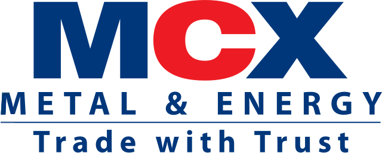

## Table of Contents

## What is the National Multi-Commodity Exchange of India (NMCE)?

The National Multi-Commodity Exchange of India (NMCE) is a place where people can buy and sell different types of goods, like spices, metals, and agricultural products. It started in 2002 and is one of the first exchanges in India that lets people trade many different kinds of goods in one place. The main goal of NMCE is to help farmers and other people who produce goods to get better prices for what they sell.

NMCE works by bringing together people who want to buy goods and those who want to sell them. It uses something called futures contracts, which are agreements to buy or sell a certain amount of a good at a set price in the future. This helps both buyers and sellers plan better because they know what price they will get or pay. The exchange also makes sure that trading is fair and follows the rules, which helps build trust among everyone who uses it.

## When was the NMCE established?

The National Multi-Commodity Exchange of India (NMCE) was established in 2002. It was one of the first exchanges in India that allowed trading of many different types of goods in one place.

NMCE helps farmers and other producers get better prices for their goods. It does this by bringing together people who want to buy and sell different products like spices, metals, and agricultural items. The exchange uses futures contracts, which are agreements to buy or sell goods at a set price in the future, helping both buyers and sellers plan better.

## What types of commodities are traded on the NMCE?

The National Multi-Commodity Exchange of India (NMCE) trades a wide variety of goods. These include spices like cumin, coriander, and turmeric. They also trade metals like gold and silver. Agricultural products are a big part of what they trade too, including things like cotton, castor seed, and rubber.

These commodities are important because they help farmers and other producers get better prices for what they grow or make. When people trade these goods on the NMCE, they use futures contracts. This means they agree to buy or sell the goods at a set price in the future. This helps everyone plan better and know what prices they will get or pay.

## How does trading on the NMCE benefit farmers and traders?

Trading on the National Multi-Commodity Exchange of India (NMCE) helps farmers by giving them a better way to sell their goods. When farmers use the NMCE, they can see what prices people are willing to pay for their crops like cotton or spices. This helps them get a fairer price because they can choose to sell when the price is good. They also use futures contracts, which let them agree to sell their goods at a set price in the future. This means they can plan better and know how much money they will get, even if prices change later.

Traders also benefit from the NMCE because it makes it easier for them to buy and sell different goods in one place. They can trade things like metals and agricultural products without having to go to different markets. The futures contracts help traders too, because they can buy goods at a set price in the future. This helps them plan their business and manage risks better. The NMCE also makes sure that trading is fair and follows the rules, which builds trust and makes trading safer for everyone involved.

## What are the key features of the NMCE's trading platform?

The NMCE's trading platform is designed to be user-friendly and efficient. It allows people to trade many different types of goods like spices, metals, and agricultural products in one place. This makes it easier for farmers and traders to buy and sell without having to go to different markets. The platform uses futures contracts, which are agreements to buy or sell goods at a set price in the future. This helps everyone plan better because they know what price they will get or pay, even if prices change later.

Another key feature of the NMCE's trading platform is its commitment to fairness and transparency. The exchange makes sure that all trading follows strict rules, which helps build trust among users. This means that both buyers and sellers can feel confident that they are getting a fair deal. The platform also provides real-time price information, so people can make informed decisions about when to buy or sell. Overall, these features help create a safe and reliable place for trading commodities.

## How does the NMCE ensure the quality and standardization of commodities?

The National Multi-Commodity Exchange of India (NMCE) makes sure that the goods traded on its platform are of good quality and meet certain standards. They do this by setting rules for how goods should be prepared and checked before they can be traded. For example, if someone wants to sell spices on the NMCE, they have to follow specific guidelines about how the spices should be cleaned, packed, and labeled. This helps make sure that all the spices sold on the exchange are the same quality, so buyers know what they are getting.

The NMCE also works with special groups called assayers who check the goods to make sure they meet the exchange's standards. These assayers look at things like the purity of metals or the moisture content of agricultural products. If the goods pass these checks, they get a certificate that says they are good enough to be traded on the NMCE. This system helps keep the quality high and makes trading fair for everyone, because buyers can trust that the goods they are buying meet the exchange's standards.

## What are the regulatory bodies overseeing the NMCE?

The National Multi-Commodity Exchange of India (NMCE) is watched over by different groups to make sure it follows the rules. The main group is the Securities and Exchange Board of India (SEBI). SEBI makes sure that all trading on the NMCE is fair and safe for everyone. They set rules that the NMCE has to follow, and they check to make sure these rules are being followed.

Another group that helps watch over the NMCE is the Forward Markets Commission (FMC). The FMC used to be the main group in charge of commodity markets in India, but now it is part of SEBI. The FMC still helps make sure that the trading of goods like spices and metals is done the right way. Together, SEBI and the FMC work to keep the NMCE running smoothly and fairly.

## How does the NMCE contribute to the Indian economy?

The National Multi-Commodity Exchange of India (NMCE) helps the Indian economy by giving farmers and other people who make goods a better place to sell what they produce. When farmers can sell their crops like cotton or spices on the NMCE, they can get better prices because they can see what people are willing to pay. This helps them make more money, which they can use to improve their farms or buy things they need. The NMCE also helps farmers plan better because they can use futures contracts to agree on a price for their goods in the future. This means they know how much money they will get, even if prices change later.

The NMCE also helps traders and businesses by making it easier to buy and sell different goods in one place. This saves time and money because they don't have to go to different markets to trade things like metals and agricultural products. The exchange makes sure that trading is fair and follows the rules, which builds trust and makes trading safer for everyone. This helps the economy grow because more people are willing to trade, and businesses can plan better. Overall, the NMCE helps make the Indian economy stronger by helping farmers and traders work together more efficiently.

## What are the major challenges faced by the NMCE?

The National Multi-Commodity Exchange of India (NMCE) faces some big challenges. One of the main problems is keeping up with technology. The world of trading is always changing, and the NMCE needs to keep its trading platform up to date. If it doesn't, people might choose to trade on other exchanges that have better technology. Another challenge is competition. There are other exchanges in India, like the Multi Commodity Exchange (MCX) and the National Commodity and Derivatives Exchange (NCDEX), that also want people to trade on their platforms. The NMCE has to work hard to stay competitive and attract traders and farmers.

Another issue for the NMCE is making sure that trading is fair and follows the rules. They have to keep an eye on everything that happens on the exchange to stop people from cheating or doing things that are not allowed. This can be hard because there are so many trades happening all the time. The NMCE also has to deal with changes in the law. The government sometimes makes new rules about how commodity exchanges should work, and the NMCE has to follow these rules. If they don't, they could get in trouble. All these challenges make it tough for the NMCE to keep running smoothly and helping the Indian economy grow.

## How has the NMCE evolved since its inception?

Since it started in 2002, the National Multi-Commodity Exchange of India (NMCE) has grown a lot. At first, it was one of the first places in India where people could trade many different kinds of goods like spices, metals, and farm products all in one place. Over the years, the NMCE has added more types of goods to trade, making it easier for farmers and traders to find what they need. They have also worked on making their trading platform better, using new technology to help people trade more easily and quickly.

The NMCE has also faced some challenges as it grew. They have had to keep up with new technology and make sure their platform is as good as other exchanges. They also have to follow rules set by groups like the Securities and Exchange Board of India (SEBI) to make sure trading is fair. Despite these challenges, the NMCE has kept working to help farmers get better prices for their goods and help traders buy and sell more easily. This has helped the Indian economy by making trading more efficient and helping more people take part in the market.

## What are the future prospects for the NMCE in the global commodity market?

The National Multi-Commodity Exchange of India (NMCE) has a good chance to grow in the global commodity market. As more countries start trading with each other, the NMCE can help Indian farmers and traders reach people all over the world. By using new technology and making their trading platform better, the NMCE can make it easier for people from different countries to buy and sell goods. This could help Indian goods like spices and cotton become more popular around the world.

However, the NMCE will need to keep up with changes in the global market. They will need to follow international rules and make sure their trading is fair and safe for everyone. Competition from other big exchanges around the world will also be a challenge. If the NMCE can keep improving and working well with other countries, it could become a big player in the global commodity market. This would help the Indian economy grow by making it easier for Indian goods to be sold around the world.

## How does the NMCE compare to other commodity exchanges in India and internationally?

The National Multi-Commodity Exchange of India (NMCE) is one of several commodity exchanges in India, with others like the Multi Commodity Exchange (MCX) and the National Commodity and Derivatives Exchange (NCDEX) being its main competitors. Compared to these exchanges, NMCE is known for its focus on a wide variety of commodities, including spices, metals, and agricultural products. This diversity helps farmers and traders because they can find many different goods in one place. However, NMCE faces stiff competition from MCX, which is bigger and more well-known, especially for trading metals and energy products. NCDEX, on the other hand, is strong in agricultural commodities, which can sometimes pull farmers away from NMCE.

Internationally, NMCE is smaller compared to giants like the Chicago Mercantile Exchange (CME) and the London Metal Exchange (LME). These global exchanges have more traders and offer a wider range of commodities and financial products. They also use advanced technology that makes trading fast and efficient. NMCE needs to keep improving its technology and services to compete on a global level. However, NMCE has the advantage of being focused on Indian commodities, which can help it serve local farmers and traders better. By working on its technology and international partnerships, NMCE could grow its presence in the global market and help more Indian goods reach people around the world.

## References & Further Reading

[1]: Arunachalam, M., & Chakraborti, S. (2012). ["Algorithmic and High-Frequency Trading in Indian Stock Market: An Update."](https://scholar.google.com/citations?user=lVpsnUAAAAAJ&hl=en) National Stock Exchange of India.

[2]: Krishnamurthy, R., & Ali, A. (2019). ["Algorithmic Trading in Commodity Markets in India."](https://www.pramanaresearch.org/VOL-9-ISSUE-6-2019/) ICFAI University Press.

[3]: Lopez de Prado, M. (2018). ["Advances in Financial Machine Learning"](https://www.amazon.com/Advances-Financial-Machine-Learning-Marcos/dp/1119482089) John Wiley & Sons.

[4]: Sebastiao, H., & Godsell, D. (2017). ["The Effects of High-Frequency Trading on Market Volatility."](https://link.springer.com/content/pdf/10.1007/s10258-017-0131-3.pdf) Available at SSRN.

[5]: Narang, R. K. (2009). ["Inside the Black Box: A Simple Guide to Quantitative and High-Frequency Trading"](https://onlinelibrary.wiley.com/doi/book/10.1002/9781118267738) John Wiley & Sons.