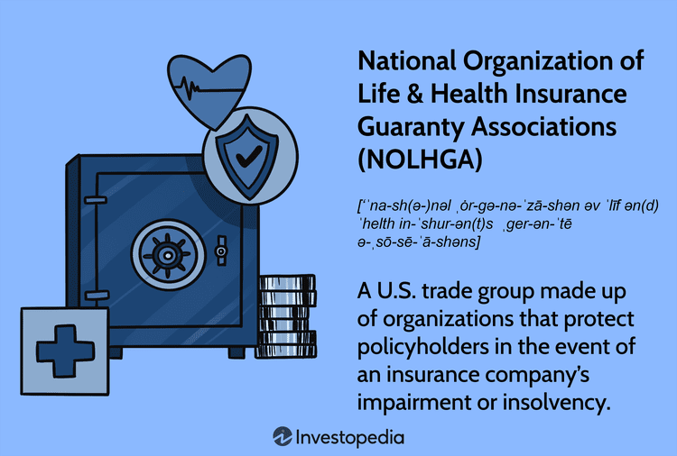

Understanding the nuances of insurance and trading is crucial in today’s financial landscape. The National Organization of Life and Health Insurance Guaranty Associations (NOLHGA), among other facets, exemplifies the vital frameworks established to protect policyholders. NOLHGA functions as a critical safety net, addressing challenges such as insurance insolvency by working to ensure that policyholder claims are met even when insurers become insolvent. Concurrently, the rapid advancement of technology is transforming both the insurance and trading sectors, introducing new efficiencies and complexities.

While health and life insurance continue to serve as foundational pillars for financial security, algorithmic trading is revolutionizing trading markets by automating decision processes and enhancing transaction efficiency. These technological advancements in trading and insurance not only offer new opportunities but also introduce new risks and regulatory challenges that require careful management.

This article examines the interconnectedness of these elements, highlighting their individual significance and their collective impact on fostering a secure financial environment. As we explore these components, we aim to provide a comprehensive understanding of their roles in shaping the future of the financial landscape, emphasizing the balance between innovative potential and the importance of maintaining robust safeguards.

## Table of Contents

## Understanding NOLHGA: A Policyholder’s Safety Net

The National Organization of Life and Health Insurance Guaranty Associations (NOLHGA) serves as an essential support structure for policyholders navigating the complexities of insurance insolvency. Established in 1983, NOLHGA consolidates the efforts of life and health insurance guaranty associations from all 50 states and Washington, D.C., providing a unified response when multistate insurance companies face financial distress or insolvency. 

NOLHGA plays a critical role by collaborating with its member associations to ensure that policyholder claims are honored, even when an insurance company is unable to meet its obligations due to insolvency. This collaboration involves mobilizing resources and expertise from across multiple states, highlighting the organization's capability to provide a centralized solution that addresses the challenges associated with insurance company failures.

Through its coordinated efforts, NOLHGA delivers a reliable operational and financial framework that supports its member associations. By doing so, it safeguards the interests of policyholders by guaranteeing the continuity of coverage and protecting against potential losses. This framework is standardized to ensure efficiency and effectiveness, optimizing the response to insolvency scenarios by leveraging shared knowledge and resources.

NOLHGA's role as a policyholder’s safety net reflects its commitment to maintaining stability within the insurance sector. By providing structured support during instances of insurer insolvency, NOLHGA helps uphold consumer confidence in life and health insurance markets, ensuring that policyholders receive the benefits they are entitled to, despite the financial difficulties their insurers may face.

## Health and Life Insurance: Essential Components

Health and life insurance play a critical role in ensuring financial security and peace of mind. These forms of insurance offer essential protection against life's uncertainties, each serving unique purposes yet collectively underpinning individual and family financial planning.

Life insurance provides a financial safety net for beneficiaries, guaranteeing that, in the unfortunate event of the policyholder's death, dependents are not burdened with financial instability. This type of insurance is designed to replace lost income, cover essential expenses, and secure educational needs for children, among other uses. Policies generally fall into two categories: term life insurance, which offers coverage for a specific period, and permanent life insurance, which encompasses whole and universal life policies with potential investment components. The primary function of life insurance is to provide long-term financial stability, ensuring the economic well-being of loved ones.

Health insurance, on the other hand, is chiefly concerned with mitigating the costs associated with medical care. It acts as a shield against exorbitant healthcare expenses, offering coverage that helps manage the costs of hospital stays, surgeries, doctor visits, and prescription medications. By sharing these financial risks, health insurance reduces the burden on individuals, allowing them to access necessary medical services without debilitating financial strain. Different plans offer varying coverage levels, from basic insurance that covers essential health benefits to comprehensive plans with broader networks and additional services.

Understanding the functioning and benefits of these insurance types enables individuals and families to make informed decisions. This includes choosing the right coverage level, understanding policy terms, costs, and exclusions, and evaluating personal health and financial risk factors. Critical thinking and planning are necessary to tailor insurance solutions that align with individual needs and long-term financial goals.

In periods of financial uncertainty, insurance policies act as a buffer against unforeseen events, providing a sense of security. They not only offer immediate relief in crisis situations but also contribute to long-term financial planning, helping policyholders navigate life’s unpredictable nature with greater confidence. By offering protection and stability, health and life insurance remain indispensable elements of a comprehensive financial strategy.

## Algorithmic Trading: The Future of Financial Markets

Algorithmic trading, also known as algo trading, employs automated and computational models to optimize trading activities in financial markets. By leveraging algorithms, traders can execute orders at speeds and frequencies beyond human capability, enhancing overall trading efficiency. This method significantly reduces human error and ensures quick reactions to dynamic market conditions.

Algorithmic trading has become indispensable for managing the extensive volumes of transactions that characterize the contemporary high-speed financial markets. As markets become more complex and interconnected, the capacity to process large datasets rapidly and execute trades automatically gives market participants a strategic edge. Algorithms can be programmed to follow predefined criteria, such as timing, price, or [volume](/wiki/volume-trading-strategy), enabling sophisticated trading strategies like [market making](/wiki/market-making), [arbitrage](/wiki/arbitrage), and [trend following](/wiki/trend-following).

Technological advancements have propelled the precision and reliability of [algorithmic trading](/wiki/algorithmic-trading), leading to widespread adoption across global markets. Innovations in [machine learning](/wiki/machine-learning) and [artificial intelligence](/wiki/ai-artificial-intelligence) have further refined these algorithms, enabling them to identify patterns and adapt to market conditions in real-time. This automation not only improves accuracy but also enhances market [liquidity](/wiki/liquidity-risk-premium) by ensuring continuous trading activity.

Incorporating algorithmic trading into the financial operations of insurance companies introduces both opportunities and challenges. On the one hand, insurers can adopt these technologies to optimize their investment strategies, enhancing portfolio management and fund allocation. By implementing sophisticated trading algorithms, insurance firms can more effectively manage risks associated with their investments, potentially leading to improved financial performance.

However, this integration also presents challenges, chiefly concerning data security and regulatory compliance. The ethical use of artificial intelligence within trading algorithms necessitates rigorous oversight to prevent market manipulation and ensure fairness. Robust security measures are imperative to protect sensitive financial data from cyber threats and data breaches. Additionally, navigating the evolving regulatory landscape requires insurers and traders to maintain transparency and adhere to compliance standards.

In summary, algorithmic trading embodies a pivotal evolution in financial markets, offering substantial benefits and posing novel challenges. As it reshapes the trading landscape, continued technological innovation and careful risk management are essential for leveraging its full potential in insurance and beyond.

## The Intersection of Insurance and Algorithmic Trading

The insurance industry has seen considerable benefits from the integration of financial innovations, particularly algorithmic trading. These advancements provide insurers with sophisticated tools to enhance their investment strategies, impacting how funds are managed and allocated across portfolios. Algorithmic trading enables insurers to execute trades at speeds and efficiencies unattainable by manual methods, allowing for real-time adjustments in response to market conditions.

By leveraging algorithmic models, insurers optimize asset allocations, ensuring that investment strategies are aligned with risk management objectives. This not only maximizes returns but also ensures liquidity requirements are met, crucial for fulfilling policyholder claims. With algorithms, insurers can employ quantitative models to predict variations in asset values, thereby improving financial performance and stability.

Despite its advantages, the convergence of insurance and algorithmic trading introduces several challenges. One primary concern is data security, as sensitive information is processed and stored electronically. Ensuring robust cybersecurity measures is vital to protect policyholders' data and maintain trust. Moreover, the use of artificial intelligence (AI) and algorithms raises questions about ethical practices and transparency. Insurers must ensure that AI systems are not biased and comply with legal and regulatory standards.

In addition, the implementation of algorithmic trading strategies within the insurance sector offers several solutions for operational efficiencies. Insurers can enhance service delivery by utilizing data analytics to streamline processes and personalize customer experiences. Risk assessment models benefit from increased precision, allowing more accurate projections and pricing. Moreover, cost management is improved as algorithms can identify and mitigate unnecessary expenditures, optimizing operational budgets.

The exploration of synergies between insurance and algorithmic trading is essential for the growth and prosperity of both fields. By embracing these technological innovations, insurers stand to gain a competitive edge in managing investments while also addressing operational risks and regulatory requirements. As a result, the integration supports a dynamic and efficient financial environment where both sectors can flourish through collaborative advancements.

## Conclusion

The National Organization of Life and Health Insurance Guaranty Associations (NOLHGA) provides a critical safety net for policyholders in the event of insurer insolvencies. By pooling resources and expertise across states, this organization ensures that policyholders' claims are honored, thereby maintaining trust in the insurance system. Health and life insurance are fundamental components of personal finance, offering crucial protection against life's uncertainties. These insurance types not only safeguard financial well-being but also provide peace of mind to individuals and their families.

Algorithmic trading has introduced significant technological advancements in financial markets. By utilizing automated, data-driven models, it enhances efficiency, reduces human error, and allows rapid response to market fluctuations. This approach is transformative, setting a new standard in the financial industry by facilitating large-volume transactions with increased precision.

The confluence of insurance stability and algorithmic trading efficiencies contributes substantially to a resilient financial ecosystem. This ecosystem skillfully balances risk with innovation, ensuring robustness in the face of economic challenges. As technological progress continues, continuous evaluation and adaptation are crucial. Harnessing these innovations responsibly will maximize their beneficial impact, fostering sustainable growth and stability across financial sectors.

## References & Further Reading

[1]: Bergstra, J., Bardenet, R., Bengio, Y., & Kégl, B. (2011). ["Algorithms for Hyper-Parameter Optimization."](https://dl.acm.org/doi/10.5555/2986459.2986743) Advances in Neural Information Processing Systems 24.

[2]: ["Advances in Financial Machine Learning"](https://www.amazon.com/Advances-Financial-Machine-Learning-Marcos/dp/1119482089) by Marcos Lopez de Prado

[3]: ["Evidence-Based Technical Analysis: Applying the Scientific Method and Statistical Inference to Trading Signals"](https://www.amazon.com/Evidence-Based-Technical-Analysis-Scientific-Statistical/dp/0470008741) by David Aronson

[4]: ["Machine Learning for Algorithmic Trading"](https://github.com/stefan-jansen/machine-learning-for-trading) by Stefan Jansen

[5]: ["Quantitative Trading: How to Build Your Own Algorithmic Trading Business"](https://github.com/LucindaYa/quant-resources/blob/master/Quantitative%20Trading%20How%20to%20Build%20Your%20Own%20Algorithmic%20Trading%20Business.pdf) by Ernest P. Chan