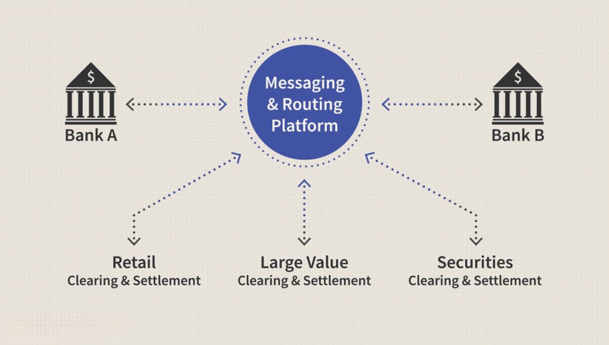

## Table of Contents

## What is a national payment system?

A national payment system is a set of rules, procedures, and infrastructure that allows people and businesses in a country to make and receive payments. It includes things like banks, ATMs, and electronic payment methods like online banking and mobile apps. The goal is to make it easy and safe for everyone to handle their money, whether they are paying for groceries, sending money to family, or getting paid by their employer.

These systems are usually managed by a country's central bank or a special organization set up by the government. They work to make sure that payments are processed quickly and securely. This helps the economy run smoothly because people can trust that their money will be where it needs to be when it needs to be there. Without a good national payment system, it would be harder for people to buy things, businesses to operate, and the economy to grow.

## What is the difference between clearing and settlement in payment systems?

Clearing and settlement are two important steps in payment systems. Clearing is like sorting out all the payments that need to happen between different banks. Imagine you and your friend both have accounts at different banks. If you send money to your friend, your bank needs to tell your friend's bank about it. Clearing is when all these messages are exchanged and checked to make sure everything matches up correctly. It's like making sure everyone agrees on who owes what to whom.

Settlement comes after clearing and is when the actual money moves between banks. Think of it as the final step where the banks actually transfer the money to settle the debts from the clearing process. If your bank owes money to your friend's bank because of your payment, during settlement, your bank will send the money to your friend's bank. This step makes sure that the payment is complete and everyone's accounts are updated correctly.

## How does the clearing process work in national payment systems?

In national payment systems, the clearing process is like sorting out all the payments that need to happen between different banks. Imagine you want to send money to your friend who has an account at a different bank. Your bank needs to tell your friend's bank about this payment. So, your bank sends a message to a central clearing house, which is like a big sorting center for all these payment messages. The clearing house collects all the messages from different banks, checks them to make sure everything is correct, and then sorts them out. This means they figure out which bank owes money to which other bank based on all the payments that day.

Once all the messages are sorted and checked, the clearing house sends back information to each bank about what they owe or are owed. This step is important because it makes sure that all the banks agree on who needs to pay whom. If there are any mistakes or disagreements, they get sorted out during this process. The clearing process helps make sure that all the payments are accounted for correctly before any money actually moves. This way, when it's time for the settlement, everything is ready to go smoothly.

## What are the key steps involved in the settlement process?

The settlement process in national payment systems is when the actual money moves between banks. After the clearing process sorts out all the payments and makes sure everything is correct, it's time for settlement. This step happens at a specific time, often at the end of the day. The banks that owe money to other banks send the money to a central place, like a central bank or a settlement system. This central place makes sure the money gets to the right banks.

Once the money is transferred, the banks update their records. If your bank sent money to your friend's bank, your bank's account at the central bank will show less money, and your friend's bank's account will show more money. This makes sure that the payment you made is complete. The settlement process is important because it finalizes all the payments and makes sure everyone's accounts are correct. Without it, the payments wouldn't be finished, and people wouldn't be able to trust that their money went where it was supposed to go.

## What are the main types of national payment systems?

National payment systems can be divided into two main types: real-time gross settlement (RTGS) systems and deferred net settlement (DNS) systems. RTGS systems process payments one by one in real time, which means the money moves from one bank to another as soon as the payment is made. This type of system is used for big payments that need to be settled quickly and safely. For example, if a company needs to pay a large amount to another company, they might use an RTGS system to make sure the payment goes through right away.

On the other hand, DNS systems collect all the payments throughout the day and then settle them all at once at the end of the day. Instead of moving money for each payment right away, the system figures out the total amount each bank owes or is owed and then makes one big transfer. This type of system is often used for smaller, everyday payments like buying groceries or paying bills. It's less immediate than RTGS but can handle a lot of payments efficiently. Both types of systems are important for making sure money moves smoothly and safely within a country.

## What role do central banks play in national payment systems?

Central banks are really important for national payment systems. They help make sure that money can move safely and quickly between different banks. Central banks often run the big systems that handle big payments, like the real-time gross settlement (RTGS) systems. They also make rules and watch over the whole payment system to make sure it works well and that banks follow the rules. This helps keep the economy running smoothly because people and businesses can trust that their payments will go through.

Sometimes, central banks also help with smaller payments that happen every day. They might run or help with systems that handle these payments, like the deferred net settlement (DNS) systems. Central banks work to make sure these systems are safe and efficient. They also step in if there are problems, like if a bank can't pay what it owes. By doing all these things, central banks help keep the national payment system strong and reliable, which is important for everyone in the country.

## How do real-time gross settlement (RTGS) systems differ from other settlement systems?

Real-time gross settlement (RTGS) systems are different from other settlement systems because they handle payments one at a time, right away. When you make a payment through an RTGS system, the money moves from your bank to the other bank as soon as the payment is made. This means the payment is settled in real time, without waiting. RTGS systems are used for big, important payments that need to be done quickly and safely. For example, if a company needs to pay another company a large amount of money, they might use an RTGS system to make sure the payment goes through right away.

Other settlement systems, like deferred net settlement (DNS) systems, work differently. Instead of moving money for each payment right away, DNS systems collect all the payments throughout the day and then settle them all at once at the end of the day. This means the money doesn't move until the end of the day, and the system figures out the total amount each bank owes or is owed before making one big transfer. DNS systems are often used for smaller, everyday payments like buying groceries or paying bills. They are less immediate than RTGS systems but can handle a lot of payments efficiently.

## What are the risks associated with clearing and settlement in national payment systems?

Clearing and settlement in national payment systems can have some risks. One big risk is that something might go wrong during the clearing process. If the messages about payments get mixed up or if there's a mistake, it can cause problems. Banks might not agree on who owes what, and this can delay the whole process. Another risk is that a bank might not have enough money to pay what it owes during settlement. If a bank can't pay, it can cause a chain reaction where other banks can't get the money they need, which can be a big problem for the whole system.

Another risk is that the systems used for clearing and settlement might be attacked by hackers. If someone breaks into the system, they could steal money or mess up the payments. This is why it's really important for these systems to have strong security. Also, if the systems go down because of a technical problem, it can stop payments from happening. This can be a big deal, especially if people and businesses are waiting for their money. So, it's important for the people running these systems to have good plans to fix problems quickly and keep everything running smoothly.

## How do international standards and regulations impact national payment systems?

International standards and regulations help make sure that national payment systems work well and are safe. These rules are made by groups like the Bank for International Settlements (BIS) and the International Organization for Standardization (ISO). They set guidelines that countries should follow to make their payment systems better. For example, they might say how fast payments should happen or what kind of security should be used. When countries follow these standards, it makes it easier for them to work with other countries. This is important because more and more payments happen across borders, and everyone wants these payments to be safe and quick.

These international rules also help make sure that national payment systems are fair and trustworthy. They might set rules about how banks should treat customers or how they should handle problems. If a country's payment system follows these rules, people and businesses can trust it more. This can help the economy grow because people feel safe using the payment system. But, following these rules can also be hard for some countries. They might need to change their systems or spend money to meet the standards. Even so, the benefits of having a safe and reliable payment system usually make it worth it.

## What technological innovations are currently affecting clearing and settlement processes?

Technology is changing the way clearing and settlement work in payment systems. One big change is the use of blockchain and distributed ledger technology (DLT). These technologies let banks keep records of payments in a way that's very safe and clear. Instead of one big central system, the records are spread out across many computers. This can make clearing and settlement faster and less likely to have mistakes or be attacked by hackers. Some countries are already trying out these technologies to see how they can help make their payment systems better.

Another important change is the use of [artificial intelligence](/wiki/ai-artificial-intelligence) (AI) and [machine learning](/wiki/machine-learning). These technologies can help make the clearing process quicker and more accurate. AI can look at lots of data to find and fix mistakes before they cause problems. It can also help predict when a bank might not have enough money to pay what it owes during settlement. This can help stop problems before they start. As these technologies get better, they could make clearing and settlement even safer and more efficient, helping money move around the world more smoothly.

## How can cybersecurity be ensured in national payment systems?

Keeping national payment systems safe from hackers is really important. One way to do this is by using strong security measures like encryption. Encryption is like putting a secret code on the messages that go between banks during clearing. This makes it hard for hackers to read or change the messages. Another way is to use firewalls and other tools that stop hackers from getting into the system. It's also important to check the system all the time to find and fix any weak spots before hackers can use them.

Another thing that helps is making sure everyone who works with the payment system follows good security rules. This means training people to be careful and not fall for tricks like phishing emails. It also means making sure only the right people can get into the system. If someone tries to get in who shouldn't, the system should stop them and let someone know right away. By doing all these things, national payment systems can stay safe and keep people's money secure.

## What are the future trends and challenges for national payment systems in terms of clearing and settlement?

In the future, national payment systems will see big changes because of new technology. One big trend is the use of blockchain and distributed ledger technology (DLT). These technologies can make clearing and settlement faster and safer. Instead of waiting until the end of the day to move money, payments could happen in real time, all the time. This would make it easier for people and businesses to get their money quickly. Another trend is the use of artificial intelligence (AI). AI can help find mistakes and predict problems before they happen, making the whole process smoother and more reliable.

But there are also challenges that come with these changes. One big challenge is making sure the new technology is safe from hackers. As payment systems get more high-tech, they can also become bigger targets for cyber attacks. It's really important to keep the systems secure so that people can trust them. Another challenge is making sure everyone can use the new systems. Not everyone has access to the latest technology, so payment systems need to work for everyone, not just people with the newest phones or computers. Balancing these challenges with the benefits of new technology will be key for the future of national payment systems.

## References & Further Reading

[1]: Bank for International Settlements. ["Principles for Financial Market Infrastructures."](https://www.bis.org/cpmi/publ/d101a.pdf) (Accessed 2023)

[2]: Hull, J. C. (2018). ["Options, Futures, and Other Derivatives"](https://www.semanticscholar.org/paper/Options%2C-Futures%2C-and-Other-Derivatives-Hull/89bdee500c8623864fc9eb7a471546aa713acc44). Pearson Education.

[3]: Lopez de Prado, M. (2018). ["Advances in Financial Machine Learning"](https://www.amazon.com/Advances-Financial-Machine-Learning-Marcos/dp/1119482089). Wiley.

[4]: Aronson, D. R. (2006). ["Evidence-Based Technical Analysis: Applying the Scientific Method and Statistical Inference to Trading Signals"](https://www.amazon.com/Evidence-Based-Technical-Analysis-Scientific-Statistical/dp/0470008741). Wiley.

[5]: Jansen, S. (2020). ["Machine Learning for Algorithmic Trading"](https://github.com/stefan-jansen/machine-learning-for-trading). Packt Publishing.

[6]: Chan, E. P. (2009). ["Quantitative Trading: How to Build Your Own Algorithmic Trading Business"](https://github.com/ftvision/quant_trading_echan_book). Wiley.

[7]: European Central Bank. ["TARGET2 - the real-time gross settlement system (RTGS) for the euro"](https://www.nbcsandiego.com/news/business/money-report/european-central-bank-set-to-deliver-final-rate-cut-of-the-year-live-updates/3698994/). (Accessed 2023)

[8]: Federal Reserve. ["Fedwire Funds Services - National Settlement Service"](https://www.frbservices.org/financial-services/national-settlement-service/). (Accessed 2023)

[9]: Nakamoto, S. (2008). ["Bitcoin: A Peer-to-Peer Electronic Cash System."](https://nakamotoinstitute.org/library/bitcoin/)

[10]: Casey, M. J., & Vigna, P. (2018). ["The Truth Machine: The Blockchain and the Future of Everything"](https://books.google.com/books/about/The_Truth_Machine.html?id=37QoDwAAQBAJ). St. Martin's Press.