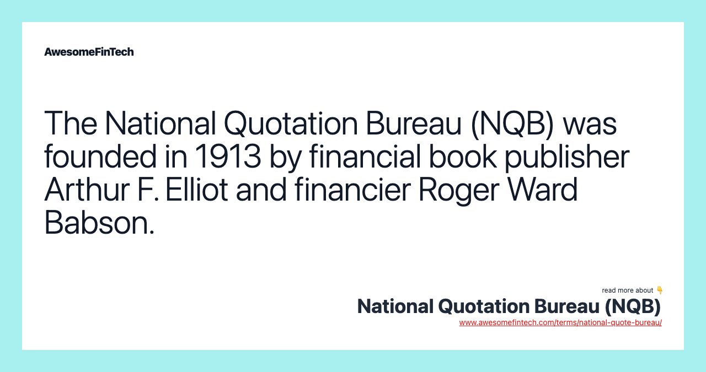

## Table of Contents

## What is the National Quotation Bureau?

The National Quotation Bureau, often called the NQB, was a company that started in the early 1900s. It was created to help people find out the prices of stocks and bonds that were not listed on big stock exchanges. Before computers and the internet, it was hard to get this information quickly. The NQB made it easier by collecting and sharing these prices through a service called the "pink sheets."

The pink sheets were actually pages of paper that were printed in pink color. They listed the prices of stocks and bonds from smaller companies. People in the stock market used these sheets to make decisions about buying and selling. Over time, the NQB grew and eventually became part of a bigger company called the National Association of Securities Dealers (NASD). Today, the pink sheets are still used, but they are electronic and part of a service called OTC Markets Group.

## When was the National Quotation Bureau founded?

The National Quotation Bureau was founded in 1913. It was started to help people find out the prices of stocks and bonds that were not listed on big stock exchanges. Back then, it was hard to get this information quickly because there were no computers or internet.

The NQB made it easier by collecting and sharing these prices through a service called the "pink sheets." These were pages of paper printed in pink color, listing the prices of stocks and bonds from smaller companies. People in the stock market used these sheets to make decisions about buying and selling.

## What is the primary function of the National Quotation Bureau?

The main job of the National Quotation Bureau, or NQB, was to help people find out the prices of stocks and bonds that were not listed on big stock exchanges. This was important because, in the early 1900s, there were no computers or internet to quickly get this information. The NQB made it easier by collecting and sharing these prices through a service called the "pink sheets."

The pink sheets were pages of paper printed in pink color. They listed the prices of stocks and bonds from smaller companies. People in the stock market used these sheets to make decisions about buying and selling. Over time, the NQB grew and eventually became part of a bigger company called the National Association of Securities Dealers (NASD). Today, the pink sheets are electronic and part of a service called OTC Markets Group.

## How does the National Quotation Bureau collect and disseminate stock price information?

The National Quotation Bureau, or NQB, collected stock price information by gathering data from different places where stocks and bonds were traded. They focused on stocks and bonds that were not listed on big stock exchanges. This was important because, back in the early 1900s, there were no computers or internet to quickly get this information. The NQB made it easier for people by putting all this information together in one place.

The NQB shared this information through a service called the "pink sheets." These were pages of paper printed in pink color, listing the prices of stocks and bonds from smaller companies. People in the stock market used these sheets to make decisions about buying and selling. Over time, the way this information was shared changed. The NQB became part of a bigger company called the National Association of Securities Dealers (NASD), and today, the pink sheets are electronic and part of a service called OTC Markets Group.

## What types of securities does the National Quotation Bureau cover?

The National Quotation Bureau, or NQB, covers securities like stocks and bonds that are not listed on big stock exchanges. These are often from smaller companies. Back in the early 1900s, it was hard to find out the prices of these securities because there were no computers or internet. The NQB made it easier by collecting and sharing this information.

The NQB shared the prices through a service called the "pink sheets." These were pages of paper printed in pink color, listing the prices of stocks and bonds from smaller companies. People in the stock market used these sheets to make decisions about buying and selling. Over time, the NQB grew and became part of a bigger company called the National Association of Securities Dealers (NASD). Today, the pink sheets are electronic and part of a service called OTC Markets Group.

## How has the role of the National Quotation Bureau evolved over time?

The National Quotation Bureau, or NQB, started in 1913 to help people find out the prices of stocks and bonds that were not listed on big stock exchanges. Back then, it was hard to get this information quickly because there were no computers or the internet. The NQB made it easier by collecting and sharing these prices through a service called the "pink sheets." These were pages of paper printed in pink color, listing the prices of stocks and bonds from smaller companies. People in the stock market used these sheets to make decisions about buying and selling.

Over time, the role of the NQB changed as technology and the financial markets grew. The NQB became part of a bigger company called the National Association of Securities Dealers (NASD). This helped it to keep up with the growing needs of the market. Today, the pink sheets are no longer printed on paper. They are electronic and part of a service called OTC Markets Group. This means that people can now get the prices of these securities quickly and easily online.

## What is the Pink Sheets and how is it related to the National Quotation Bureau?

The Pink Sheets is a service that lists the prices of stocks and bonds from smaller companies that are not on big stock exchanges. It started as actual pages of paper printed in pink color, which is why it's called the Pink Sheets. People in the stock market used these sheets to find out the prices of these securities and make decisions about buying and selling.

The Pink Sheets is closely related to the National Quotation Bureau, or NQB. The NQB was the company that created the Pink Sheets back in 1913. They did this to help people get information about stocks and bonds that were hard to find because there were no computers or internet back then. Over time, the NQB became part of a bigger company called the National Association of Securities Dealers (NASD), and today, the Pink Sheets are electronic and part of a service called OTC Markets Group.

## How does the National Quotation Bureau ensure the accuracy of the data it provides?

The National Quotation Bureau, or NQB, worked hard to make sure the prices they shared were correct. They did this by collecting information from many different places where stocks and bonds were traded. Since they focused on securities that were not on big stock exchanges, it was important to check the data carefully. The NQB made sure to update the Pink Sheets regularly so that people could trust the prices they saw.

Over time, as the NQB grew and became part of bigger organizations like the National Association of Securities Dealers (NASD) and later the OTC Markets Group, the ways to check the data got better. Now, with computers and the internet, the electronic Pink Sheets can be updated very quickly. This helps to keep the information accurate and up-to-date, so people in the stock market can make good decisions about buying and selling.

## What are the main challenges faced by the National Quotation Bureau in today's market?

The National Quotation Bureau, now part of the OTC Markets Group, faces several challenges in today's market. One big challenge is keeping up with technology. Back when the NQB started, they used paper Pink Sheets to share stock prices. Now, everything is electronic, and the market moves very fast. They need to make sure their systems can handle a lot of information quickly and stay safe from hackers.

Another challenge is making sure the information they provide is correct and trustworthy. With so many stocks and bonds to keep track of, it's hard to check every price all the time. Mistakes can happen, and if people don't trust the information, they might not use the Pink Sheets. Also, the rules about what companies need to share with the public keep changing, so the NQB has to keep up with those rules to stay in line with the law.

## How does the National Quotation Bureau compare to other financial data providers?

The National Quotation Bureau, now part of the OTC Markets Group, is different from other financial data providers because it focuses on stocks and bonds that are not on big stock exchanges. These are often from smaller companies. Other financial data providers, like Bloomberg or Reuters, cover a wider range of securities, including those on big exchanges. The NQB's Pink Sheets are special because they give information about these smaller companies that might be hard to find elsewhere.

Another way the NQB is different is how it started and grew. It began in 1913 with paper Pink Sheets and has changed a lot over time. Now, it uses electronic systems to share information quickly. Other financial data providers might have started with electronic systems from the beginning. Also, the NQB has to work hard to make sure its information is correct and up-to-date, especially since it deals with smaller companies that might not share as much information as bigger ones.

## What technological advancements has the National Quotation Bureau adopted to improve its services?

The National Quotation Bureau, now part of the OTC Markets Group, has made big changes to keep up with technology. It started with paper Pink Sheets back in 1913, but now it uses computers and the internet to share information. This means that instead of waiting for the mail to get the latest stock prices, people can see them online right away. This makes it much easier and faster for people in the stock market to make decisions about buying and selling.

Another important change is how the NQB keeps the information safe and correct. With electronic systems, they can update the Pink Sheets very quickly. They also use special software to check the data and make sure it's right. This helps to stop mistakes and keep the information trustworthy. By using these new technologies, the NQB can serve its customers better and stay important in today's fast-moving financial world.

## What future developments can we expect from the National Quotation Bureau?

The National Quotation Bureau, now part of the OTC Markets Group, is likely to keep using new technology to make its services even better. They might use more advanced computer systems to share information even faster and more accurately. This could mean using [artificial intelligence](/wiki/ai-artificial-intelligence) to check the data and make sure it's right. They might also make their website easier to use so that people can find the information they need more quickly.

Another thing we might see is the NQB working more with other financial data providers. This could help them give people more information about stocks and bonds from smaller companies. They might also start offering new kinds of services, like special reports or tools to help people make better decisions about buying and selling. By doing these things, the NQB can stay important and helpful in the fast-changing world of finance.

## References & Further Reading

[1]: Wolf, J. (1992). ["The OTC Markets: A Review of the Historical and Structural Developments."](https://www.nber.org/system/files/working_papers/w27354/w27354.pdf) Journal of Comparative Business.

[2]: Easley, D., López de Prado, M. M., & O'Hara, M. (2012). ["Flow Toxicity and Liquidity in a High-frequency World."](https://www.semanticscholar.org/paper/Flow-Toxicity-and-Liquidity-in-a-High-Frequency-Easley-Prado/9369430bd005d194f9332ae7cbd5a57ace5e9ab3) Financial Analysts Journal, 68(2), 58-73.

[3]: Harris, L. (2003). ["Trading and Exchanges: Market Microstructure for Practitioners."](https://www.amazon.com/Trading-Exchanges-Market-Microstructure-Practitioners/dp/0195144708) Oxford University Press.

[4]: Aitken, M., & Frino, A. (1996). ["The Effects of Electronic Trading and Algorithmic Trading on Market Dynamics."](https://scholar.google.com/citations?user=XfWHzvEAAAAJ&hl=en) The Journal of Financial Markets, Institutions & Instruments, 5(3), 1-33.

[5]: Girasa, R. J. (2018). ["Regulation of Cryptocurrencies and Blockchain Technologies."](https://lawcat.berkeley.edu/record/664030) Springer International Publishing.