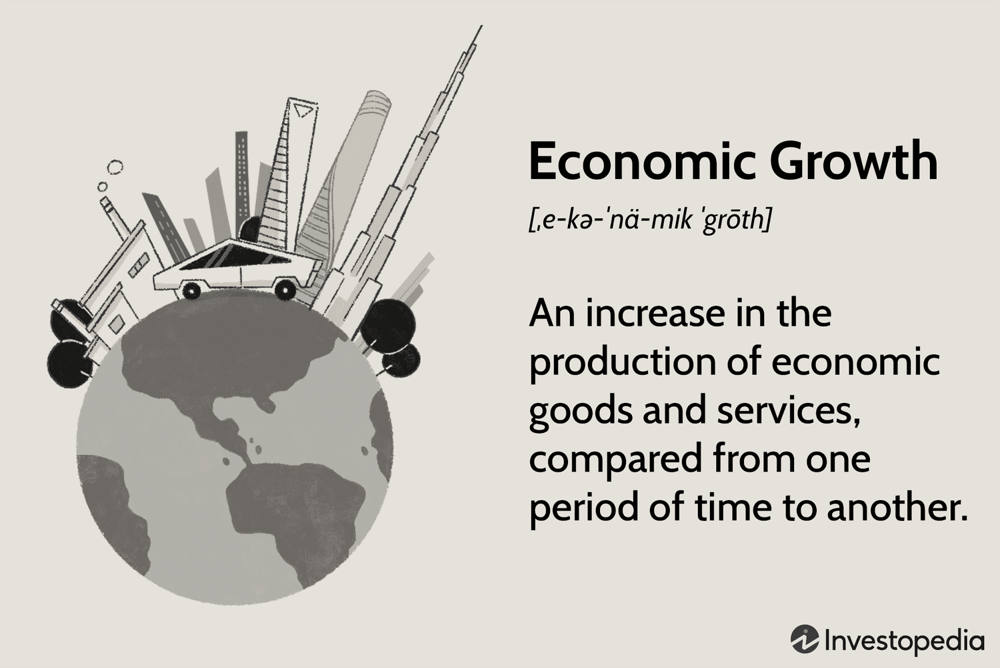

The National Retail Federation (NRF) is a central figure in the global retail industry, serving as a vital consortium for retail partners worldwide. Founded in 1911, it boasts a broad membership across numerous retail sectors, effectively representing the diverse landscape of the industry. As technological integration becomes pivotal in shaping retail operations, NRF's influence in pioneering data-driven solutions and advocating for technological progression is notably relevant. 

This article examines the extensive elements of NRF's membership, its substantial impact on the retail industry, and the emerging role of algorithmic trading in retail functionalities. Algorithmic trading, characterized by the use of sophisticated computational algorithms to make trading decisions, is becoming increasingly important for optimizing strategies within large-scale retail operations. As a result, the NRF’s advocacy for incorporating cutting-edge technology plays a strategic role in preparing the industry for these developments.

We will explore the advantages that NRF membership confers on retailers, industry partners, and educational institutions, equipping them to better navigate the increasingly complicated retail environment. Furthermore, the article will analyze how NRF-led initiatives and the adoption of algorithmic trading collaborate in refining retail strategies, aiming at enhanced efficiency, competitiveness, and adaptability. Through these discussions, the NRF's critical function as a supporter and pioneer in technological advancement within the retail sector will be highlighted.

## Table of Contents

## Understanding the National Retail Federation

The National Retail Federation (NRF) serves as the overarching body and a powerful advocate for retailers across the globe. As the world's largest retail trade association, the NRF provides a collaborative platform where retail professionals can unify their efforts, voice their concerns, and influence the trajectory of the retail industry.

### Global Membership and Influence

With a vast membership network spanning 45 countries, the NRF comprises a diverse array of retail entities, from small businesses to multinational corporations. This extensive base enables the organization to set industry standards and influence policies that affect the retail sector globally. By uniting retailers under one umbrella, the NRF ensures that shared challenges and opportunities within the industry are addressed collectively, promoting a more standardized approach to retail operations worldwide.

### The NRF Big Show

The NRF Big Show is a flagship event in the retail calendar, acting as a major convention that draws participants from around the world. This annual gathering is a significant platform for showcasing the latest retail trends, technologies, and innovations. Beyond product exhibitions, the Big Show is a prime opportunity for networking, allowing retailers to exchange ideas and form strategic partnerships. This convention is a testament to NRF's role in fostering community and collaboration within the industry.

### Advocacy and Policy Influence

A critical aspect of the NRF's mission is its advocacy efforts. The federation actively works to influence policies related to key areas such as labor, healthcare, and commerce. By engaging with policymakers and other stakeholders, the NRF strives to create a favorable business environment for retailers, addressing issues such as workplace regulations, healthcare mandates, and trade policies. These efforts have far-reaching impacts, shaping the legal and economic landscape within which retailers operate.

### Education and Workforce Development

The NRF extends its influence through its foundation, which is dedicated to enhancing education and workforce development within the retail sector. The foundation's initiatives are designed to cultivate a skilled workforce capable of meeting the evolving demands of the industry. By offering educational resources, training programs, and scholarships, the NRF Foundation supports individuals seeking careers in retail, thereby strengthening the sector's human capital. These efforts are vital in ensuring that the retail workforce is equipped with the skills necessary to adapt to technological and market changes.

In summary, the National Retail Federation plays a pivotal role in unifying the retail industry, advocating for policies that benefit retailers, and promoting education and workforce development. Through its comprehensive initiatives and events like the NRF Big Show, the federation remains a cornerstone for progress and innovation in the retail world.

## NRF Membership: A Valuable Asset

The National Retail Federation (NRF) provides a membership model that serves as a significant asset for participants across the retail ecosystem. The NRF categorizes its membership to include retailers, industry partners, universities, and global affiliates, each benefiting from resources tailored to their unique needs.

Membership in the NRF provides an array of exclusive benefits, such as access to premier events, comprehensive research reports, and invaluable networking opportunities. These offerings significantly enhance the industry knowledge of members, ensuring they remain abreast of the latest trends and developments within the retail sector. For example, attending exclusive NRF events allows members to engage with industry leaders and innovators, fostering connections that can lead to potential collaborations and insights into best practices.

University members represent a critical component of the NRF’s membership structure. They gain access to specialized content and scholarship opportunities aimed at cultivating the next generation of retail professionals. This focus on academia facilitates the integration of emerging theories and practices into educational curriculums, thereby preparing students for successful careers in retail.

The NRF serves as a platform for its members to engage in policy advocacy. Through the federation, members can both influence and gain insights into policy developments that may impact their operations. This capability is particularly crucial at times of significant regulatory changes, as it allows members to anticipate and adapt to new legislative landscapes. 

Strategically designed to maximize return on investment (ROI), the NRF's membership structure offers significant value to industry stakeholders. By participating in the NRF, members receive access to tools and resources that can lead to increased efficiency and competitive advantage in their operations. Consequently, NRF membership comprises a calculated investment into industry knowledge, compliance acumen, and strategic positioning in the ever-evolving retail environment.

## The NRF Foundation's Role in Retail Innovation

The NRF Foundation plays a critical role in fostering innovation within the retail industry by providing an array of resources aimed at career development, including training, scholarships, and specialized programs. These resources are structured to build a robust workforce capable of meeting the ever-evolving challenges of the modern retail environment. 

One of the flagship programs offered by the NRF Foundation is RISE UP (Retail Industry Skills & Education), which provides industry-recognized credentials to students and early-career professionals. This program is crucial for those looking to enter the retail industry as it equips them with essential skills and knowledge. The credentials offered through RISE UP are designed to meet current market demands, ensuring that participants are well-prepared to succeed.

Furthermore, the NRF Foundation maintains partnerships with leading retailers to ensure that its programs are aligned with the existing needs and standards of the industry. This collaboration ensures that the education and training provided are not only relevant but also forward-thinking, preparing participants for future industry trends.

By facilitating these educational initiatives, the NRF Foundation supports the development of a skilled workforce. This focus on talent development is key to addressing the complexities of modern retail operations, where technological proficiency and customer service excellence are paramount.

The foundation's commitment to innovation serves as a catalyst for transformative changes within the retail sector. As the industry continues to evolve, the NRF Foundation's initiatives ensure that new generations of retail professionals are equipped with the skills and knowledge necessary to drive progress and maintain competitive advantage. Through its comprehensive educational programs, the NRF Foundation significantly contributes to the continual advancement and sustainability of the retail industry.

## Algorithmic Trading in the Retail Industry

Algorithmic trading involves the use of sophisticated computational algorithms to automate and optimize trading decisions in real-time. Within the retail industry, this approach is increasingly fundamental to large-scale operations due to its capacity to analyze extensive datasets and execute trades at speeds and efficiencies beyond human capabilities. 

Emerging trends in automation and data analysis have enabled retailers to incorporate [algorithmic trading](/wiki/algorithmic-trading) into their operations to enhance decision-making processes. By leveraging historical and real-time data, algorithmic trading systems can optimize inventory management by predicting demand patterns, adjusting inventory levels accordingly, and minimizing holding costs. For instance, [machine learning](/wiki/machine-learning) algorithms can analyze sales data to forecast future demand, helping retailers maintain optimal stock levels.

In addition to inventory management, retailers utilize these algorithms for dynamic pricing strategies. Using live market data, algorithms can adjust prices in real-time to reflect current demand and supply conditions, maximizing revenue and competitiveness. For example, consider an algorithm that adjusts product prices based on competitor pricing data or seasonality trends, thereby improving a retailer's market position.

Customer personalization is another critical area where algorithmic trading can add value. By analyzing customer behavior and purchase history through algorithms, retailers can offer personalized recommendations, enhancing the shopping experience and increasing sales conversions. These tailored approaches rely heavily on data analytics and machine learning techniques to predict customer preferences and respond with relevant product suggestions.

The National Retail Federation (NRF) plays a supportive role in the adoption of such technologies. By advocating for technology adoption and providing educational resources, the NRF prepares retailers to integrate algorithmic trading effectively into their operational strategies. This support is crucial in helping retailers understand and navigate the complexities of implementing these technologies.

The convergence of algorithmic trading and retail signifies a profound shift towards enhanced efficiency and competitiveness. This integration not only streamlines internal processes but also provides retailers with the agility required to adapt to market changes swiftly. As retailers harness the power of algorithms, they position themselves to meet consumer demands more effectively, maintain competitive pricing, and improve overall operational efficiency in the rapidly evolving market landscape.

## Benefits of NRF Membership in the Age of Algo Trading

NRF membership offers significant benefits to retailers, particularly as algorithmic trading becomes increasingly integral to retail strategies. Members gain access to a wealth of insights and tools crucial for efficiently implementing algorithmic trading within their operations. Through numerous conferences and publications facilitated by NRF, members remain well-informed about the latest technological advancements and industry best practices. This continuous flow of information ensures that retailers are equipped with the knowledge necessary to adopt and integrate modern trading algorithms effectively.

NRF provides numerous collaboration opportunities, enabling knowledge transfer among members experienced in algorithmic trading. These collaborations help retailers understand complex algorithmic models, share best practices, and solve common challenges. Such collective expertise is invaluable, ensuring that even those new to algorithmic trading can leverage the community's experience to enhance their own operations.

Furthermore, NRF's resources are essential for navigating the regulatory and ethical considerations associated with adopting new trading technologies. As algorithmic trading involves large-scale data analysis and automation, members can utilize NRF's guidance to comply with relevant regulations, ensuring ethical standards are maintained. This guidance is crucial given the potential complexity of regulatory frameworks governing data usage and trading environments.

The integration of algorithmic trading insights positions NRF members at the forefront of the ever-evolving retail industry. By harnessing these technological advancements, members can efficiently address the rapid changes and dynamic demands prevalent in the market. This proactive adaptation enables NRF members to enhance operational efficiency and competitiveness, solidifying their position as leaders in the retail sector. Through such strategic advantages, NRF membership proves to be a pivotal asset in navigating the complexities of modern retail, particularly as algorithmic trading continues to reshape industry practices.

## Conclusion

The National Retail Federation (NRF) acts as a crucial entity for stakeholders in the retail industry, offering a platform that fosters meaningful connections, valuable insights, and innovative practices. Its extensive membership benefits are tailored to assist community members in the intricate process of adapting to both technological advancements and market shifts, particularly in areas such as algorithmic trading. As the industry increasingly relies on data-driven strategies, the NRF stands as a steadfast advocate for the integration of new technologies, ensuring that its members are equipped to harness these advancements effectively.

Engagement with NRF initiatives allows members to better navigate the changing landscapes of retail. The resources and opportunities provided empower retailers, industry partners, and educational institutions to stay at the forefront of technological and strategic transformations. This empowerment translates into an enhanced capacity to handle the dynamic demands of consumers and market conditions.

In summary, the multifaceted approach of the NRF makes membership not only beneficial but essential for growth and adaptation in the current retail climate. Its commitment to supporting technological innovation and providing a collaborative environment marks it as a strategic asset, enabling members to thrive in an era that values agility and data utilization.

## References & Further Reading

[1]: Bergstra, J., Bardenet, R., Bengio, Y., & Kégl, B. (2011). ["Algorithms for Hyper-Parameter Optimization."](https://proceedings.neurips.cc/paper/2011/file/86e8f7ab32cfd12577bc2619bc635690-Paper.pdf) Advances in Neural Information Processing Systems 24.

[2]: ["Advances in Financial Machine Learning"](https://www.amazon.com/Advances-Financial-Machine-Learning-Marcos/dp/1119482089) by Marcos Lopez de Prado

[3]: ["Evidence-Based Technical Analysis: Applying the Scientific Method and Statistical Inference to Trading Signals"](https://www.amazon.com/Evidence-Based-Technical-Analysis-Scientific-Statistical/dp/0470008741) by David Aronson

[4]: ["Machine Learning for Algorithmic Trading"](https://github.com/stefan-jansen/machine-learning-for-trading) by Stefan Jansen

[5]: ["Quantitative Trading: How to Build Your Own Algorithmic Trading Business"](https://www.amazon.com/Quantitative-Trading-Build-Algorithmic-Business/dp/1119800064) by Ernest P. Chan