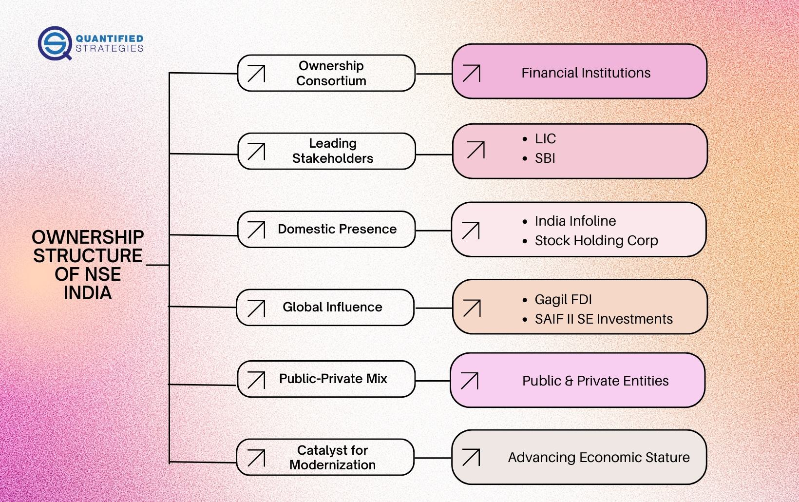

The National Stock Exchange (NSE) of India stands as a pivotal institution in the Indian financial landscape, having revolutionized capital markets in the country since its establishment in 1992. Designed to provide a modern, fully automated screen-based trading system, the NSE introduced technology that increased transparency and efficiency, significantly transforming how trading was conducted in India. As the largest stock exchange in India and one of the largest in the world by market capitalization, the NSE has continuously evolved to meet the demands of a dynamic financial ecosystem.

Algo trading, short for algorithmic trading, refers to the use of computer algorithms to automate trading strategies. These algorithms can autonomously execute trades at speeds and efficiencies far beyond human capability, leveraging high-frequency data and mathematical models to make rapid trading decisions. Unlike traditional trading, which relies heavily on human intuition, algo trading removes emotional bias and enables precise, data-driven decision-making.

India's stock markets have experienced substantial growth in algo trading, driven by technological advancements, increased computational power, and the regulatory environment fostering innovation in financial services. As of recent years, algorithmic trading accounts for a significant portion of total market volumes, reflecting its increasing acceptance and relevance. 

The NSE has played a crucial role in this evolution by offering state-of-the-art infrastructure that supports algorithmic operations. This has cemented NSE's position as a leader not only in adopting technology but also in setting industry standards for fairness and transparency in trading practices. Throughout this article, we will explore the history and impact of algo trading in India, the infrastructure provided by NSE to facilitate such trading, and the regulatory framework governing these practices.

Readers can look forward to gaining insights into how algo trading has grown within Indian markets, the benefits and risks associated with it, and the future trajectory of these technologies. This article will also highlight the importance of staying informed about regulatory changes and technological advancements in the trading world, offering a comprehensive understanding of the opportunities and challenges that lie ahead in the algorithmic trading industry.

## Table of Contents

## Understanding the National Stock Exchange (NSE) of India

The National Stock Exchange (NSE) of India, established in 1992, has played a pivotal role in transforming the landscape of Indian capital markets. Conceived as a public initiative, NSE was created to provide a transparent and efficient platform for stock trading, addressing various deficiencies observed in the earlier market systems. Its establishment marked a significant shift from the floor-based open outcry system to an electronic limit [order book](/wiki/order-book-trading-strategies), furthering transparency and reducing transaction costs.

From its inception, NSE has been instrumental in enhancing the efficiency of Indian capital markets. By leveraging technology, NSE introduced a nationwide trading platform that eliminated geographical barriers and facilitated seamless trading across the country. This technology-driven approach has encouraged more participants to enter the market, thereby increasing [liquidity](/wiki/liquidity-risk-premium) and reducing spreads.

As of recent years, the NSE continues to dominate the Indian equity markets, handling a significant share of the total equity trading [volume](/wiki/volume-trading-strategy). With over 1600 companies listed, NSE's benchmark index, the Nifty 50, is one of the most prominent indices, representing the weighted average of 50 of the largest Indian companies listed on the exchange. Other notable indices include the Nifty Next 50, Nifty Midcap 50, and various sectoral indices, each offering insights into different segments of the Indian economy.

NSE's segments extend beyond equities, providing a comprehensive suite of products including equity derivatives, currency derivatives, fixed income, and debt trading. The introduction of derivatives trading in India, led by NSE, exemplifies its pioneering stance in adopting technology to broaden market engagement and provide risk management tools to market participants.

The NSE has been a forerunner in adopting technological innovation, consistently making improvements to its IT infrastructure to support [algorithmic trading](/wiki/algorithmic-trading), high-frequency trading, and co-location services. These advancements reflect NSE's commitment to maintaining robust, secure, and efficient trading operations.

With these initiatives and developments, NSE has established itself as a leader in modernizing Indian stock markets, significantly contributing to the nation's financial ecosystem by fostering a more inclusive and efficient market environment. The exchange's focus on technology and innovation continues to set the stage for future growth and transformation in India’s securities market.

## What is Algorithmic Trading?

Algorithmic trading, often referred to as algo trading, is a method of executing trades using pre-programmed instructions accounting for variables such as timing, price, and volume. This automated trading leverages high-speed data processing and sophisticated algorithms to identify and capitalize on trading opportunities much faster than a human trader could. The primary objective of algorithmic trading is to generate potential profits by exploiting market inefficiencies or by implementing established trading strategies with precision and discipline.

Unlike traditional trading, which relies heavily on the intuition and discretion of human traders, algo trading is data-driven and rule-based. In traditional settings, traders might manually place orders based on their analysis and personal judgment, often leading to inconsistent results due to human emotions and biases. Conversely, algorithmic trading utilizes mathematical models and historical data to identify potential trades and execute them systematically, ensuring elimination of emotional biases and human error.

The technologies involved in algorithmic trading include advanced computing systems and high-speed internet connections. Trading algorithms can operate on various strategies such as statistical [arbitrage](/wiki/arbitrage), [market making](/wiki/market-making), and [trend following](/wiki/trend-following). For instance, [statistical arbitrage](/wiki/statistical-arbitrage) involves forecasting short-term price movements by analyzing statistical patterns, whereas market making seeks to capture the bid-ask spread through synchronous buying and selling. Other strategies may involve mean reversion or [momentum](/wiki/momentum)-based approaches. Python is a commonly used language in algorithmic trading, thanks to its rich libraries like NumPy, pandas, and scikit-learn which aid in data analysis and [machine learning](/wiki/machine-learning) implementations.

One of the most significant advantages of algorithmic trading is speed. Algorithms are capable of processing vast amounts of market data swiftly, allowing for rapid execution of trades, which is critical in capturing opportunities as prices can change in milliseconds. Accuracy is another key benefit, as algorithms adhere strictly to predefined instructions, reducing the risk of human error observed in manual trading. Efficiency is increased as algorithms can operate 24/7 without breaks, ensuring maximal market exposure and potentially capturing opportunities around the clock.

Despite its advantages, algorithmic trading is subject to several misconceptions. A common misunderstanding is that algo trading guarantees profitability. While these algorithms can execute trades with high efficiency, they are only as effective as the strategies they are based upon. Poorly designed algorithms can lead to substantial losses. Another misconception is that algo trading is solely for large financial institutions. With the democratization of technology, individual traders equipped with programming skills and market knowledge can also engage in this field, although scalability still provides significant advantages to larger players.

In conclusion, algorithmic trading stands as a sophisticated approach to modern trading, distinguishing itself from traditional methods through its reliance on technology, speed, and analytical precision. However, the effectiveness of algorithmic trading is contingent upon the robustness of underlying strategies and the trader's comprehension of market dynamics.

## The Rise of Algo Trading in India

Algorithmic trading, commonly known as algo trading, has seen a significant rise in adoption within the Indian financial markets over the past few decades. This growth can be attributed to several key factors, including advancements in technology, supportive regulatory frameworks, and increased participation from diverse market players.

Algo trading employs computer programs to automate and execute trades based on predetermined strategies. The adoption of algo trading in India began gaining momentum in the early 2000s, spurred by technological advancements that facilitated faster data processing and better connectivity. The introduction of sophisticated trading software and the availability of comprehensive market data have allowed traders to design complex algorithms capable of executing trades with remarkable speed and accuracy.

Regulatory support has been a critical [factor](/wiki/factor-investing) in the proliferation of algo trading in India. The Securities and Exchange Board of India (SEBI) has played an instrumental role in creating a conducive environment by establishing guidelines that ensure transparency, fairness, and integrity in the market. These regulations address concerns related to market manipulation and systemic risks, thus fostering confidence among investors and market participants. For instance, SEBI's directives on risk management systems and order-to-trade ratio limits help in maintaining market stability while enabling the use of algorithms.

The increased participation of diverse market players has also contributed to the rise of algo trading. Institutional investors, hedge funds, and proprietary trading firms, in particular, have embraced algorithmic strategies to capitalize on the efficiencies offered by automated trading. According to recent [statistics](/wiki/bayesian-statistics), algorithmic trading accounts for a substantial percentage of the total trading volume on Indian exchanges. For instance, as of 2022, it is estimated that around 50% of the trading volume on the NSE is generated through algorithmic trading practices, reflecting its significant presence in the market.

Several Indian firms have emerged as successful players in the algo trading space. Companies like Quantiphi Analytics, NeoTrader, and iRage have developed robust algorithmic platforms and strategies that cater to both domestic and international markets. These firms leverage cutting-edge technologies, such as [artificial intelligence](/wiki/ai-artificial-intelligence) and machine learning, to enhance trading strategies and optimize performance.

The National Stock Exchange (NSE) has been pivotal in promoting algo trading practices in India. By offering advanced technological infrastructure, the NSE has enabled traders to execute complex algorithms with low latency and high reliability. The exchange provides comprehensive support services, including colocation facilities, real-time data feeds, and robust application programming interfaces (APIs) that facilitate seamless integration with traders’ systems. These resources have empowered market participants to effectively deploy and manage their algorithmic trading strategies, further driving the growth of algo trading in India.

In summary, the rise of algorithmic trading in India's stock markets is a result of technological advancements, regulatory support, and increased market participation. The NSE, by fostering a conducive environment and providing essential infrastructure, has played a vital role in this growth trajectory, cementing its position as a leading platform for algo trading in India.

## NSE’s Infrastructure for Algo Trading

The National Stock Exchange (NSE) of India has established itself as a global leader in embracing technology to facilitate algorithmic trading. This section explores the state-of-the-art technological infrastructure offered by the NSE that supports algorithmic trading, ensuring high efficiency, fairness, and transparency for market participants.

NSE's infrastructure for algorithmic trading incorporates several key components, including colocation services, robust application programming interfaces (APIs), and high-frequency data feeds. These services enable traders to execute trades with minimal latency—an essential factor in high-frequency trading. 

**Colocation Services**

The NSE offers colocation services where trading firms can place their servers in the same data center as the exchange's trading engines. This proximity dramatically reduces the time it takes for trades to be processed, often by milliseconds, which provides traders with a competitive advantage. The colocation facility is equipped with multiple redundant systems to ensure uninterrupted operations, enhancing the reliability of trading activities.

**APIs and Data Feeds**

Algorithmic traders rely heavily on a constant and rapid influx of market data to make informed decisions. The NSE provides high-speed and low-latency APIs, which allow traders to receive real-time data and execute trades. These APIs facilitate direct market access (DMA), enabling firms to implement advanced trading algorithms and strategies efficiently.

The exchange also offers comprehensive data feeds, including order [books](/wiki/algo-trading-books), trade reports, and market depth. These data streams are crucial for algorithms to adapt quickly to market conditions, perform quantitative analysis, and execute trades with precision.

**Fairness and Transparency**

Ensuring fairness and transparency in trading is a top priority for the NSE. The exchange employs sophisticated surveillance systems to monitor trading activities, detect anomalies, and prevent market manipulation. The regulatory framework established by the Securities and Exchange Board of India (SEBI) complements these efforts, fostering a level playing field for all participants.

**Case Studies and Testimonials**

Several prominent trading firms have benefitted from the NSE's advanced infrastructure. For instance, a leading [quantitative trading](/wiki/quantitative-trading) firm improved its trade execution speed and success rate by leveraging the colocation services and APIs provided by the NSE. These improvements translated into higher returns and reduced trading risks, demonstrating the practical value of the exchange's offerings.

**Updates and Innovations**

The NSE continually updates its infrastructure to incorporate the latest technological advancements. Recent innovations include enhancements in latency reduction techniques and the expansion of data analytics capabilities. By integrating machine learning algorithms for predictive analytics, the NSE aims to provide even more sophisticated tools for traders to optimize their strategies.

Overall, the NSE's infrastructure for algorithmic trading combines cutting-edge technology with a commitment to transparency and fairness, making it a pivotal player in the evolution of India’s financial markets.

## Regulatory Environment for Algo Trading in India

The regulatory environment governing algorithmic trading in India reflects a comprehensive framework designed to ensure market stability, transparency, and equitable access. The Securities and Exchange Board of India (SEBI) plays a pivotal role in regulating algorithmic trading within the country. SEBI's oversight involves crafting policies and guidelines that balance innovation with investor protection in this rapidly evolving sector.

SEBI's regulatory approach includes mandates on the deployment of algorithmic trading systems, accreditation requirements for brokerage firms, and compliance measures to mitigate systemic risks. One key regulation is the compulsory audit of algorithms, necessitating that every algorithmitically traded order is tagged for scrutiny to boost transparency. Furthermore, SEBI imposes stringent checks on the latency levels of these algorithms to ensure they do not disadvantage traditional traders. This is in response to concerns that algorithmic trading might magnify market [volatility](/wiki/volatility-trading-strategies), as illustrated by global incidents of flash crashes.

In terms of guidelines, SEBI requires brokers to submit details of all the algorithms they use for trading, emphasizing accountability and operational reliability. Additionally, firms need to appoint a compliance officer overseeing that each algorithm adheres to the regulatory norms. SEBI's framework extends to the testing of algorithms in a controlled environment before deployment, ensuring minimal market disruptions.

Despite these efforts, challenges and criticisms remain. Critics argue that the rapid pace of technological advancements in algorithmic trading often outstrips regulatory updates, risking regulatory inadequacy. Further, smaller trading firms express concerns about the high costs associated with compliance, which potentially stifles their competitiveness against larger players.

Looking forward, the regulatory landscape for algorithmic trading in India anticipates potential transformations driven by technological progress and market dynamics. SEBI is expected to adapt its frameworks to encompass advancements in artificial intelligence and machine learning, which are increasingly integral to algorithmic trading strategies. There is also an anticipation of the introduction of new regulations aimed at fostering greater market participation while safeguarding against monopolistic practices by a few dominant algorithmic traders.

Efforts to harmonize Indian regulations with global standards are likely, enhancing investor confidence and ensuring India's competitiveness in the global financial markets. As the algorithmic trading environment continues to evolve, SEBI's proactive and adaptive regulatory stance will be crucial in shaping an efficient, fair, and secure trading ecosystem on platforms like the National Stock Exchange.

## Benefits and Risks of Algo Trading on NSE

Algorithmic trading, commonly referred to as algo trading, has become an integral part of the National Stock Exchange (NSE) of India, offering significant advantages while also introducing various risks. Understanding these benefits and risks is crucial for market participants aiming to leverage algorithmic strategies effectively.

### Benefits of Algo Trading on NSE

1. **Cost Efficiency**: Algo trading significantly reduces transaction costs due to automation and streamlined operations. By minimizing the need for manual intervention, the cost of executing trades is lowered as algorithms can execute multiple trades simultaneously at optimal prices.

2. **Reduced Human Error**: By eliminating the emotions and biases that can affect human traders, algorithmic trading ensures more disciplined and consistent trading decisions. Algorithms strictly follow predefined rules, drastically reducing the likelihood of errors that stem from human decision-making processes.

3. **Enhanced Liquidity**: Algo trading contributes to market liquidity by facilitating a higher volume of trades. This increased market activity can make it easier for traders to buy and sell securities without significantly impacting their prices.

### Risks Associated with Algo Trading

1. **Market Volatility**: While algorithms are designed to exploit market inefficiencies, their rapid trading capabilities can sometimes exacerbate volatility. High-frequency trading algorithms can react to market events in milliseconds, amplifying short-term price movements.

2. **Flash Crashes**: The speed of algorithmic trading can lead to sudden market crashes, known as flash crashes. These events occur when automated sell-offs trigger a chain reaction, leading to sharp, rapid declines in market prices.

3. **Technical Failures**: The reliance on complex software and hardware systems makes algo trading vulnerable to technical glitches. System errors, network issues, or software bugs can lead to incorrect trade executions, which may result in substantial financial losses.

### Risk Management Strategies

Algo traders employ several strategies to manage these risks:

- **Diversification**: By spreading investments across various assets and markets, traders can mitigate the impact of adverse price movements on a single security.

- **Robust Testing**: Conducting rigorous backtesting of algorithms using historical data helps identify potential flaws and ensures the effectiveness of trading strategies under different market conditions.

- **Risk Limits**: Implementing controls such as maximum position sizes or stop-loss orders can limit potential losses and protect traders from extreme volatility.

### Balancing Innovation with Risk

The continuous evolution of trading technologies allows for increasingly sophisticated algorithms, making it vital for traders and institutions to balance innovation with risk management. Regular updates, performance monitoring, and adherence to regulatory guidelines are key components in maintaining this balance.

### NSE’s Initiatives to Manage Algorithmic Trading Risks

The NSE has established various measures to ensure the security and fairness of algorithmic trading. These include:

- **Real-time Monitoring**: The NSE employs sophisticated surveillance systems to monitor market activity and detect unusual trading patterns that may pose risks to market stability.

- **Circuit Breakers**: To counter sudden price swings, the NSE uses circuit breakers—mechanisms that temporarily halt trading if a stock's price moves beyond a predefined percentage—to stabilize the market during periods of extreme volatility.

- **Regulatory Compliance**: The NSE works closely with regulatory bodies to ensure that algo trading practices adhere to existing rules and guidelines, thereby reducing systemic risks.

In conclusion, while algo trading presents numerous benefits such as enhanced efficiency and liquidity, it also introduces risks that require careful management. By balancing innovation with prudent risk controls and leveraging the infrastructure provided by the NSE, traders can maximize the potential of algorithmic trading strategies.

## The Future of Algorithmic Trading on NSE

The future of algorithmic trading on the National Stock Exchange (NSE) of India is poised for significant evolution driven by advancements in technology, changing market dynamics, and regulatory developments. Predicted trends indicate increased integration of innovative technologies such as artificial intelligence (AI) and machine learning (ML), which offer the potential to transform trading strategies and operations. These technologies enable the development of complex algorithms that can process vast amounts of data with enhanced speed and accuracy, allowing for more precise trading decisions and the ability to adapt to rapidly changing market conditions. 

Machine learning algorithms excel in identifying patterns and trends within large datasets, which is pivotal in creating predictive models that forecast market movements more accurately than traditional methods. AI’s capability to process natural language and understand sentiment analysis from various news sources and social media platforms further adds to its utility in algorithmic trading. This technological synergy is expected to lead to a more dynamic and responsive trading environment on the NSE.

In terms of potential innovations in NSE’s trading technologies, enhancements in real-time data analytics, the expansion of infrastructure such as colocation services, and the introduction of advanced trading APIs are likely. These developments aim at reducing latency and providing traders with immediate access to market data. The use of blockchain technology and smart contracts may also be explored to increase transparency and security in transactions.

Digital transformation is continuously impacting the NSE and algo trading by automating processes and enabling the integration of cloud computing resources, which provide scalable and flexible solutions for data storage and processing. The increasing utilization of big data analytics allows traders to gain deeper insights into market behavior, offering a competitive edge in strategy formulation.

The conclusion rests on recognizing the evolving landscape of algorithmic trading on NSE. As technology advances, the potential for growth in this sector is immense, offering more sophisticated tools and more efficient market operations. Stakeholders including investors, traders, and regulators must stay informed about these developments to capitalize on opportunities while addressing challenges such as market volatility and the complexity of regulatory compliance. Continued engagement with technological advancements will be crucial for navigating the future of algorithmic trading on the NSE.

## Conclusion

In conclusion, the article has discussed the integral role that the National Stock Exchange (NSE) of India plays in the development and expansion of algorithmic trading. As one of the pioneers in adopting cutting-edge technology, the NSE has consistently enabled speed and efficiency in trade execution, thereby making significant contributions to improving the Indian capital market's infrastructure. The rapid integration and evolution of algorithmic trading underscore the need for market participants to remain agile and informed about technological advancements. This necessity accentuates the importance of staying updated with innovations such as AI and machine learning that are increasingly shaping the trading landscape.

While algorithmic trading presents numerous benefits, including cost efficiency and reduced human error, it also comes with challenges such as market volatility and technical failures. Successfully navigating these opportunities and challenges requires a balanced approach that combines robust risk management strategies with continuous innovation. Stakeholders are encouraged to actively engage with ongoing developments and regulatory updates to fully leverage the potential of algorithmic trading on the NSE.

Finally, readers are invited to explore further resources about algo trading and the NSE to deepen their understanding and effectively participate in this evolving market. Embracing these changes will enable traders and firms to harness the transformative power of algorithmic trading, driving growth and efficiency in the Indian financial markets.

## References & Further Reading

[1]: Kumar, S. S. S. (2013). ["Algorithmic Trading."](https://www.cambridge.org/core/journals/journal-of-financial-and-quantitative-analysis/article/abs/algorithmic-trading-and-the-market-for-liquidity/C1A34D3767436529EA4F23DB1780273C) In Investment Management (pp. 591-606). Springer.

[2]: ["Advances in Financial Machine Learning"](https://www.amazon.com/Advances-Financial-Machine-Learning-Marcos/dp/1119482089) by Marcos Lopez de Prado

[3]: Chakrabarti, R., & De, S. (2010). ["Information Technology and Financial Markets: Evidence from the National Stock Exchange of India."](https://scholar.google.com/citations?user=C4yHT_sAAAAJ&hl=en) Emerging Markets Review, 11(3), 253-267.

[4]: SEBI Guidelines on Algorithmic Trading: Securities and Exchange Board of India. ["Framework for Algorithmic Trading."](https://www.sebi.gov.in/legal/circulars/mar-2012/broad-guidelines-on-algorithmic-trading_22471.html)

[5]: Narang, R. (2009). ["Inside the Black Box: A Simple Guide to Quantitative and High Frequency Trading."](https://onlinelibrary.wiley.com/doi/book/10.1002/9781118267738) Wiley.

[6]: Joshi, M. (2010). Algorithmic Trading & DMA: An Introduction to Direct Access Trading Strategies. 4Myeloma Press.

[7]: ["Quantitative Trading: How to Build Your Own Algorithmic Trading Business"](https://www.amazon.com/Quantitative-Trading-Build-Algorithmic-Business/dp/1119800064) by Ernest P. Chan

[8]: Aldridge, I. (2013). ["High-Frequency Trading: A Practical Guide to Algorithmic Strategies and Trading Systems."](https://onlinelibrary.wiley.com/doi/pdf/10.1002/9781119203803.fmatter) Wiley.

[9]: Patel, S. A., & Shukla, M. (2014). ["Algorithmic Trading in Indian Stock Market: An Empirical Investigation."](https://horizonepublishing.com/journals/index.php/PST/article/view/5229) The IUP Journal of Financial Risk Management, XI(3).