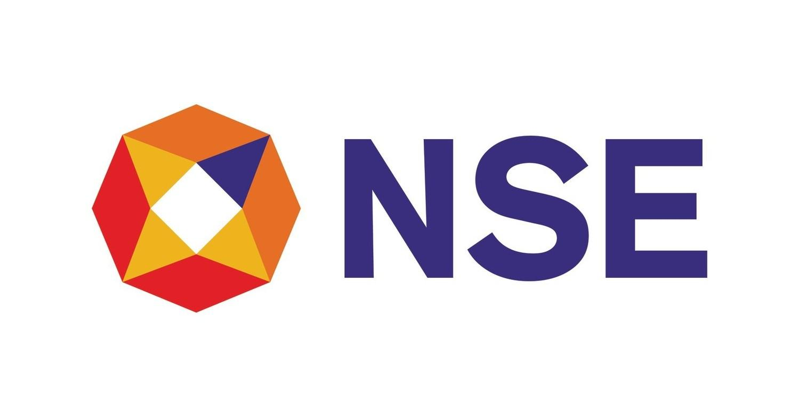

## Table of Contents

## What is the National Stock Exchange of India Limited (NSE)?

The National Stock Exchange of India Limited (NSE) is a leading stock exchange in India. It was set up in 1992 and started working in 1994. The NSE is located in Mumbai and is one of the biggest stock exchanges in the world by the number of trades. It helps people buy and sell shares of companies, bonds, and other financial products.

The NSE uses a fully electronic trading system, which makes trading fast and easy. This system is called the National Exchange for Automated Trading (NEAT). It helps to make sure that trading is fair and open for everyone. The NSE also has many indexes, like the Nifty 50, which show how well the market is doing. These indexes help investors understand the market and make smart choices about buying and selling.

## When was the NSE established?

The National Stock Exchange of India Limited, or NSE, was set up in 1992. It started working in 1994. This was an important time because it helped make trading in India more modern and easier for people.

The NSE is based in Mumbai and is one of the biggest stock exchanges in the world. It uses a computer system called NEAT, which stands for National Exchange for Automated Trading. This system helps people buy and sell stocks quickly and fairly.

## What is the significance of the NSE in the Indian economy?

The National Stock Exchange of India, or NSE, plays a big role in the Indian economy. It helps companies get money they need to grow by letting them sell shares to the public. When companies do well, they can create more jobs and help the economy grow. The NSE also makes it easier for people to invest their money in different companies, which can help them save for the future and make their money grow.

The NSE is important because it uses a computer system called NEAT, which makes trading fast and fair. This system helps make sure that everyone has the same chance to buy and sell stocks. The NSE also has indexes like the Nifty 50, which show how the market is doing. These indexes help investors understand the market and make smart choices about where to put their money. This all helps the Indian economy by making it easier for money to move around and for businesses to grow.

## How does the NSE differ from the Bombay Stock Exchange (BSE)?

The National Stock Exchange (NSE) and the Bombay Stock Exchange (BSE) are both important stock exchanges in India, but they have some differences. The NSE was set up in 1992 and started working in 1994, while the BSE is much older, starting in 1875. The NSE uses a fully electronic trading system called NEAT, which stands for National Exchange for Automated Trading. This system helps make trading fast and fair for everyone. On the other hand, the BSE used to have a trading floor where people would meet to buy and sell stocks, but it has moved to an electronic system too.

Another difference is the number of companies listed on each exchange. The BSE has more companies listed, with over 5,000, while the NSE has around 2,000. However, the NSE is known for having higher trading volumes, which means more shares are bought and sold there every day. The NSE is also famous for its Nifty 50 index, which tracks the performance of 50 big companies. The BSE has its own index called the Sensex, which tracks 30 big companies. Both indexes help investors understand how the market is doing, but they focus on different sets of companies.

## What are the main indices of the NSE and what do they represent?

The main index of the NSE is the Nifty 50. This index represents the performance of the 50 largest and most liquid companies listed on the NSE. These companies come from different industries like banking, IT, and energy. The Nifty 50 is important because it gives a good picture of how the Indian stock market is doing overall. When the Nifty 50 goes up, it usually means that the market is doing well, and when it goes down, it can mean that the market is not doing so well.

Another important index at the NSE is the Nifty Bank. This index tracks the performance of the 12 biggest banking stocks in India. It helps investors understand how the banking sector is doing. The Nifty Bank is useful for people who want to invest in banks or who want to know how the financial part of the economy is performing. Both the Nifty 50 and the Nifty Bank are used by investors to make decisions about where to put their money.

## How can someone start trading on the NSE?

To start trading on the National Stock Exchange (NSE), the first thing someone needs to do is open a trading account with a broker. A broker is a company that helps people buy and sell stocks. There are many brokers to choose from, and they offer different services and fees. Once you pick a broker, you'll need to fill out some forms and give them some personal information, like your ID and address. After your account is set up, you'll also need to link it to a bank account so you can put money in and take money out.

Once your trading account is ready, you can start buying and selling stocks on the NSE. You can do this through the broker's website or app. It's a good idea to learn about the companies you want to invest in and understand how the market works. The NSE uses a system called NEAT, which makes trading quick and fair. You can place orders to buy or sell stocks, and the system will match you with someone who wants to do the opposite trade. It's important to keep an eye on your investments and make smart decisions based on what's happening in the market.

## What are the trading hours of the NSE?

The National Stock Exchange (NSE) has regular trading hours from 9:15 AM to 3:30 PM, Monday through Friday. These are the times when most people buy and sell stocks. It's important to know these hours because you can only trade during this time.

There are also pre-open and post-market sessions. The pre-open session is from 9:00 AM to 9:15 AM. This is a time when people can place orders before the regular trading starts. The post-market session, also called the block deal window, is from 3:40 PM to 4:00 PM. This is when big trades can happen after the regular trading hours are over. Knowing these extra times can help you plan your trading better.

## What types of financial instruments are traded on the NSE?

The National Stock Exchange (NSE) is a place where people can buy and sell many different types of financial instruments. The most common ones are stocks, which are shares in companies. When you buy a stock, you own a small part of that company. The NSE also has bonds, which are like loans that people give to companies or the government. These bonds pay back the money with interest over time. Another type of instrument is mutual funds, which are a way for people to invest in a mix of stocks and bonds managed by professionals.

In addition to these, the NSE also trades derivatives, which are more complex financial products. Derivatives include futures and options, which are agreements to buy or sell something at a future date for a set price. These can be used to guess how the market will move or to protect against risks. The NSE also has exchange-traded funds (ETFs), which are like mutual funds but can be bought and sold like stocks during the trading day. All these instruments help people invest their money in different ways and manage their financial goals.

## What are the regulatory bodies overseeing the NSE?

The National Stock Exchange (NSE) is watched over by a few important groups to make sure it follows the rules. The main group is the Securities and Exchange Board of India (SEBI). SEBI is like a big boss that looks after all the stock markets in India. They make sure that the NSE is fair and open for everyone who wants to trade. SEBI checks that the NSE follows all the rules and doesn't let anyone cheat or do anything wrong.

Another group that helps keep an eye on the NSE is the Reserve Bank of India (RBI). The RBI is in charge of all the money in India and makes sure that the financial markets, including the NSE, are stable. They work together with SEBI to make sure that the NSE is doing everything right. Both SEBI and the RBI help to keep the NSE a safe and trustworthy place for people to trade.

## How does the NSE ensure the integrity and transparency of its trading?

The National Stock Exchange (NSE) works hard to make sure that trading is fair and open for everyone. They use a computer system called NEAT, which stands for National Exchange for Automated Trading. This system helps to make trading quick and fair because it matches buy and sell orders automatically. No one can see the orders before they are matched, which stops people from cheating. The NSE also keeps a close eye on all trades to make sure no one is doing anything wrong. If they find something suspicious, they can stop it right away.

Another way the NSE makes sure trading is honest is by following the rules set by the Securities and Exchange Board of India (SEBI). SEBI is like a big boss that watches over all the stock markets in India. They make sure the NSE follows all the rules and doesn't let anyone cheat. The NSE also shares a lot of information with the public, like how the market is doing and what rules they follow. This helps everyone see what's going on and trust that the NSE is doing things the right way.

## What technological advancements has the NSE implemented to improve trading?

The National Stock Exchange (NSE) has made big steps to improve trading by using new technology. One big change was moving to a fully electronic trading system called NEAT, which stands for National Exchange for Automated Trading. This system makes trading faster and fairer because it matches buy and sell orders automatically. It also helps stop cheating because no one can see the orders before they are matched. Another important technology the NSE uses is high-frequency trading, which lets computers make trades very quickly. This helps the market work better and makes it easier for people to buy and sell stocks.

The NSE also uses technology to make sure the market is safe and reliable. They have strong computer systems that can handle a lot of trades at the same time without slowing down. This is important because it keeps the market running smoothly even when a lot of people are trading. The NSE also uses technology to watch for anything strange or wrong in trading. If they see something that doesn't look right, they can stop it quickly to keep the market fair for everyone. All these technological advancements help the NSE stay one of the best stock exchanges in the world.

## What are the future growth prospects and strategic initiatives of the NSE?

The National Stock Exchange (NSE) has big plans for the future to keep growing and staying ahead in the world of trading. They want to use new technology to make trading even faster and easier. One way they're doing this is by working on new systems that can handle even more trades at once. They're also looking into using things like [artificial intelligence](/wiki/ai-artificial-intelligence) and blockchain to make trading safer and more reliable. These technologies could help stop cheating and make sure everyone can trust the market. Another big focus for the NSE is reaching more people, especially in smaller cities and towns in India. They want to make it easier for more people to start trading, which can help the economy grow.

The NSE is also thinking about new products and services to offer. They're looking at adding more types of financial instruments like new kinds of derivatives and ETFs. This can give people more ways to invest their money and manage their risks. The NSE is also working on making their rules and systems better to keep up with the changing world. They're talking with regulators like SEBI to make sure they're following all the rules and keeping the market fair. By doing all these things, the NSE hopes to keep growing and help more people in India take part in the stock market.

## References & Further Reading

[1]: World Federation of Exchanges. (2022). ["Statistics and Market Data."](https://www.world-exchanges.org/our-work/statistics)

[2]: Lopez de Prado, M. (2018). ["Advances in Financial Machine Learning."](https://www.amazon.com/Advances-Financial-Machine-Learning-Marcos/dp/1119482089) Wiley.

[3]: SEBI. (2008). ["Framework for Algorithmic Trading."](https://www.sebi.gov.in/sebi_data/attachdocs/1470393485587.pdf)

[4]: Chan, E. P. (2008). ["Quantitative Trading: How to Build Your Own Algorithmic Trading Business."](https://github.com/ftvision/quant_trading_echan_book) Wiley.

[5]: Jansen, S. (2018). ["Machine Learning for Algorithmic Trading."](https://searchworks.stanford.edu/view/13246850) Packt Publishing.

[6]: Aronson, D. R. (2007). ["Evidence-Based Technical Analysis: Applying the Scientific Method and Statistical Inference to Trading Signals."](https://onlinelibrary.wiley.com/doi/book/10.1002/9781118268315) Wiley.