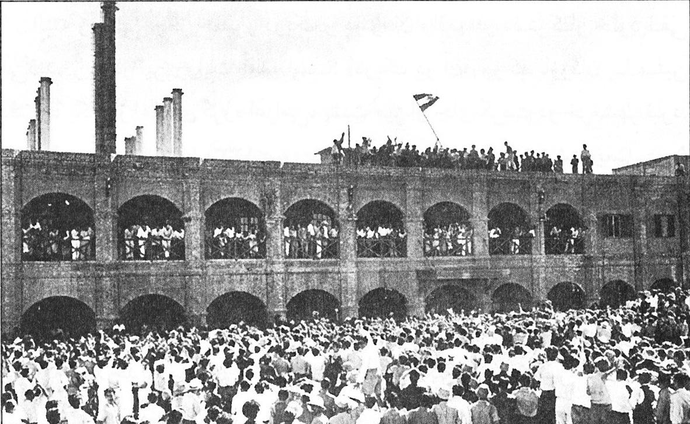

Nationalization, the oil industry, and algorithmic trading are interconnected through a web of economic strategies, market dynamics, and technological advancements. Nationalization refers to a government's move to take control of private assets to influence or manage economic resources critical to national interests. Historically, this has been used as a means to exert control over key sectors, particularly in times of political or economic upheaval. For example, during the mid-20th century, several countries nationalized industries perceived as pivotal to their economic sovereignty. This practice often involves political and strategic considerations, impacting stakeholders from local communities to global investors.

The oil industry represents a prime target for nationalization due to the critical role it plays in global economies. Oil is not only a major energy source but also one of the most traded commodities worldwide. Control over oil resources allows governments to exert significant influence over both domestic economic development and international economic relations. Countries like Venezuela, Mexico, and Iran provide historical examples where the oil sector was nationalized, with varying degrees of economic success and resilience. Nationalization of oil often leads to state-owned enterprises (SOEs) overseeing extraction, production, and distribution, thus centralizing economic power within the government.



Algorithmic trading introduces another layer of complexity to the economic landscape shaped by nationalized resources. It involves using automated systems to execute orders based on pre-defined criteria, typically much faster and more efficiently than human traders. In financial markets influenced by nationalized industries, algorithmic trading systems must adapt to the unique market dynamics driven by state policies and geopolitical developments. Nationalization can result in market conditions that deviate from typical supply-demand paradigms due to policy-driven production and pricing strategies. As such, algorithmic traders must incorporate variables related to geopolitical risk, government regulation, and production changes into their models to navigate the complexities of these markets effectively.

The interplay between nationalization, the oil industry, and algorithmic trading demonstrates the multifaceted impact of government policies on global economics. The control exercised by governments over oil resources significantly alters market dynamics, influencing the strategies employed by traders and investors around the world. As technology continues to advance, the ability of algorithmic trading to manage and mitigate the uncertainties of nationalized markets is likely to grow, presenting both challenges and opportunities for economic actors globally.

## Table of Contents

## Understanding Nationalization

Nationalization refers to the process where a government takes ownership and control of private enterprises, transferring the assets and operations from private to public hands. This shift often affects industries deemed crucial to national interests, such as the oil sector. Nationalization aims to centralize control over these resources, ensuring that they serve broader public or national objectives rather than purely commercial interests.

The implications of nationalization for private enterprises are significant. For businesses, it often means the loss of ownership, potential revenue sources, and investment opportunities. Existing contracts and operations can be significantly altered or terminated. The impact extends beyond individual companies, influencing investor sentiment, foreign direct investment (FDI), and the overall business environment. 

The motivations behind nationalization are multifaceted and can be grouped into economic, strategic, and social objectives:

1. **Economic Objectives:** Nationalization can be driven by a desire to enhance economic stability and control over critical resources. By nationalizing industries, governments can ensure that profits from natural resources, such as oil, are retained within the country and reinvested into domestic development projects. Moreover, nationalization can be used to address market failures or monopolistic practices, allowing for more equitable resource distribution.

2. **Strategic Objectives:** Governments often nationalize sectors vital to national security and sovereignty. Control over the oil industry can reduce dependency on foreign entities, ensuring a stable energy supply and safeguarding against geopolitical manipulation. Additionally, nationalized industries provide governments with significant leverage in international negotiations and trade.

3. **Social Objectives:** Nationalization can also be driven by the need to address social inequalities and ensure resource benefits are distributed more equitably among the population. This approach aligns with the goal of promoting social welfare and enhancing the standard of living.

The oil industry has historically been a focal point for nationalization efforts, given its economic and strategic significance. One of the earliest examples is the nationalization of the oil industry in Mexico in 1938 under President Lázaro Cárdenas. This event marked a shift toward state control, reclaiming oil resources from foreign companies to promote national development and sovereignty.

In more recent history, Venezuela's nationalization in the early 21st century exemplifies contemporary nationalization in the oil sector. In 2007, Hugo Chávez's government nationalized operations previously managed by international oil companies, consolidating state control through the national oil company, PDVSA. While nationalization was aimed at harnessing oil revenues to fund social programs, it also led to challenges such as decreased foreign investment and operational inefficiencies.

Nationalization presents a complex landscape where economic theories, strategic imperatives, and socio-political considerations intersect. Its practice in the oil industry continues to evoke diverse outcomes, from economic stabilization and social equity to risks of inefficiency and investor hesitation.

## Economic Impacts of Nationalization in the Oil Industry

Nationalization of the oil industry has profound economic implications for countries rich in oil reserves. By assuming control over the oil sector, governments aim to gain a greater share of revenue, ensure steady employment, and exercise greater autonomy over their national resources. However, nationalization can also lead to financial inefficiencies, resource misallocation, and reduced incentives for innovation.

### Economic Stability and Development

Nationalization often seeks to achieve economic stability by regularizing income from oil exports and reinvesting in local economies. This can translate into increased public spending on infrastructure, education, and healthcare services, contributing to long-term socio-economic development. Furthermore, nationalization can buffer countries from external economic shocks by allowing governments to moderate the supply and pricing of oil, thus stabilizing domestic economies.

### Case Study: Mexico

Mexico's nationalization of its oil industry in 1938 serves as a significant example. The expropriation was driven by nationalistic sentiments and dissatisfaction with foreign oil companies. Post-nationalization, Petróleos Mexicanos (PEMEX) was established, leading to increased state revenue and investments in public goods. However, over time, PEMEX faced financial inefficiencies, including rising debt and corruption, stemming from political interference and lack of competitive pressures. These issues eventually necessitated reforms and partial market liberalizations to introduce new efficiencies and investments.

### Case Study: Iran

Iran's nationalization of its oil industry in 1951 was a pivotal moment in its modern history. The move to nationalize was motivated by a desire to reclaim sovereignty over oil resources and improve national revenue. Initially, the nationalization led to economic sanctions and an international boycott, culminating in an economic downturn. However, in the long term, it allowed Iran to retain a significant portion of oil revenue, promoting independence and public welfare projects. Nevertheless, similar to Mexico, the sector has faced challenges such as inefficiencies and underinvestment.

### Economic Resilience vs. Financial Inefficiencies

While nationalization can engender economic resilience by securing state control over natural resources, it can also lead to financial inefficiencies. State-run enterprises may become vulnerable to bureaucratic inertia and lack the competitive drive of private firms, which can result in reduced productivity and innovation. Moreover, dependency on oil revenue can make nationalized industries susceptible to [volatility](/wiki/volatility-trading-strategies) in global oil markets.

The balance between national control and economic efficiency remains a key challenge. Addressing this requires adopting managerial reforms and technological advancements to bolster productivity within nationalized frameworks. Nations must carefully consider both the potential benefits and drawbacks of nationalization, weighing the immediate gains against possible long-term inefficiencies.

## The Role of Algorithmic Trading in the Nationalized Oil Sector

Algorithmic trading has become a cornerstone of modern financial markets, leveraging computational power to make quick and efficient trades. This trading method utilizes complex algorithms to execute orders based on various market parameters such as price, [volume](/wiki/volume-trading-strategy), and timing. With significant growth, [algorithmic trading](/wiki/algorithmic-trading) now accounts for a substantial percentage of total trading activity in major markets. Its efficiency and precision offer substantial advantages over traditional trading methods, particularly in high-volume and fast-moving sectors like the oil industry.

When examining the influence of algorithmic trading in the context of nationalized oil sectors, one must consider the implications of national policies on trading algorithms and overall market dynamics. Nationalization often leads to changes in market operations, such as shifts in production quotas, export restrictions, and taxation policies. These changes can create substantial variability in oil market conditions, which algorithmic trading systems must adapt to in real-time.

For instance, if a government decides to alter production levels to meet domestic needs, this decision can impact global oil supply and demand dynamics. Algorithmic trading systems, which rely on both historical data and real-time information, are programmed to identify these changes and adjust trading strategies accordingly. This adaptability is crucial for maintaining profitability in changing market conditions. For example, an algorithm might detect a decrease in supply due to national policy changes and adjust its trading strategy to capitalize on anticipated price increases.

Algorithmic trading systems can integrate various data sources and indicators, including political news and economic forecasts, to evaluate the potential impact of nationalized oil policies. Consider the Python code snippet below, which simulates a simple decision-making model in response to updated national policy on oil production levels:

```python
def trading_decision(current_supply, policy_change):
    """Decide buy/sell based on policy changes in oil production."""
    threshold = 500  # Arbitrary threshold for deciding trade action
    reaction = "Hold"

    if policy_change == "Increase" and current_supply < threshold:
        reaction = "Buy"  # Anticipate price drop due to increased supply
    elif policy_change == "Decrease" and current_supply > threshold:
        reaction = "Sell"  # Anticipate price rise due to lower supply

    return reaction

# Example use-case
current_supply = 480
policy_change = "Decrease"
print(trading_decision(current_supply, policy_change))  # Output: Sell
```

The volatility introduced by nationalization can stimulate trading volumes, but it also heightens risks. For example, in 2012, Venezuela's nationalization of foreign oil assets led to a ripple effect in global oil markets. Traders had to quickly adjust their models to account for reduced foreign investments and uncertainties associated with Venezuela's oil supply, which would affect global oil prices.

Overall, the interplay between national oil policies and algorithmic trading systems underscores a significant challenge: the need for robust, adaptable algorithms that can swiftly respond to policy-driven market changes. This adaptability is critical in maintaining market stability and ensuring consistent trading performance amid the potential volatilities caused by nationalization. The future likely holds increased integration of [artificial intelligence](/wiki/ai-artificial-intelligence) and [machine learning](/wiki/machine-learning) in algorithmic systems to better anticipate and respond to these dynamic shifts in the global oil sector.

## Challenges and Criticism of Nationalization in the Oil Industry

Nationalization of the oil industry, while often pursued with the intention of securing national control over critical resources, faces significant challenges and criticism. One of the primary concerns associated with nationalized industries is inefficiency. Unlike private enterprises, nationalized industries may lack the competitive pressure that drives innovation and cost-efficiency. The absence of market competition can lead to bureaucratic inertia and productivity losses, exacerbating inefficiencies. Furthermore, there is a potential for corruption within nationalized sectors. The centralization of resource control under government purview can sometimes result in a lack of transparency and accountability, creating opportunities for corrupt practices.

The financial burden of operating nationalized oil enterprises can be substantial for governments. Nationalization often requires considerable capital investment to maintain and enhance infrastructure, manage operations, and ensure technological advancement. These expenditures can strain national budgets, particularly in countries where revenue diversification is limited. The situation can be further complicated when fluctuating global oil prices impact government revenues derived from oil exports, leading to fiscal instability.

Private sector entities and international investors frequently voice critiques regarding nationalization policies. From the perspective of private companies, nationalization represents a significant threat to their operations and investment security. Expropriation of foreign oil assets, a common consequence of nationalization, can deter new investments and diminish investor confidence. This apprehension may result in reduced foreign direct investment (FDI) and hinder international partnerships, potentially stalling economic growth and technological advancement within the nationalized sector.

Moreover, international investors often express concerns about the political motivations driving nationalization. Nationalization strategies may be implemented for reasons aligned more with political interests than economic prudence, leading to suboptimal management and poor returns on investment. Investors seek predictable and stable market environments, and nationalization policies may introduce a level of unpredictability that is deemed untenable.

Overall, while nationalization of the oil industry aims to bolster national interests and control over strategic resources, it presents multiple challenges. These include inefficiencies and potential corruption risks, substantial financial burdens on governments, and strained relations with private and international stakeholders. Balancing these challenges with the intended benefits remains a complex task for nations considering or maintaining nationalization strategies in the oil industry.

## Future Trends: Nationalization and Technology in the Oil Industry

The role of technology in nationalized oil sectors is increasingly pivotal as countries strive to enhance efficiency and competitiveness in the global market. In the nationalized oil industry, technology adoption can streamline operations, reduce costs, and maximize resource utilization. Advanced analytics and artificial intelligence (AI) are at the forefront of this technological shift, offering tools that can transform how nationalized businesses operate.

Advanced analytics enables the processing and interpretation of vast data sets generated by oil extraction and production activities. By utilizing data analytics, nationalized oil companies can optimize drilling operations, predict equipment failures, and efficiently manage supply chains. This predictive capability allows for more informed decision-making, enhancing operational efficiency and reducing downtime.

AI offers further potential by automating routine tasks and improving decision accuracy. Machine learning algorithms can analyze complex geological data to identify potential drilling sites, minimizing exploration risks. Additionally, AI-driven maintenance systems can predict equipment failures before they occur, significantly reducing repair costs and production delays.

Looking into the future, policy shifts in the global oil trade are likely influenced by technological advancements. As countries recognize the benefits of integrating technology into their nationalized oil sectors, there may be increased investment in research and development focusing on digital solutions. This could lead to more sustainable extraction methods, improved energy efficiency, and reduced environmental impact.

Moreover, advancements in blockchain technology may introduce new forms of smart contracts and transparent supply chain management, further revolutionizing the oil trade. These systems can provide secure, verifiable transactions and real-time tracking of oil shipments, enhancing trust and efficiency in international trade.

In summary, the integration of technology in nationalized oil sectors is poised to reshape the industry landscape. By leveraging advanced analytics, AI, and blockchain technologies, nationalized oil enterprises can achieve greater efficiency and remain competitive amidst the evolving global energy market. This transformation is not only essential for economic sustainability but may also drive future strategic policy decisions in the oil industry.

## Conclusion

The intersection of nationalization, the oil industry, and algorithmic trading presents a multifaceted landscape in which each element influences the others with profound implications. Nationalization, as a strategy, offers governments the ability to assert control over essential resources like oil, aiming to secure economic sovereignty and maximize national benefits. However, this approach often involves a delicate balance between public control and the efficiencies typically championed by private enterprises.

The oil industry, subject to frequent nationalization due to its strategic importance, becomes a pivotal [factor](/wiki/factor-investing) in the economic stability and development of countries possessing these resources. Nationalization can bolster economic resilience by ensuring stable supply and revenues for governmental budgets. However, this centralization may also lead to inefficiencies and bureaucratic inertia, which private enterprises traditionally mitigate through competitive practices and innovation.

Algorithmic trading, increasingly prevalent in financial markets, introduces another dimension to this dynamic. It responds swiftly to policy changes and market conditions, often exacerbating market volatility when nationalized oil sector policies shift. For instance, a sudden change in production quotas or pricing strategies can lead to immediate price fluctuations, which are swiftly capitalized upon by trading algorithms designed to identify and exploit such opportunities.

The long-term economic implications of nationalizing strategic industries like oil include potential pitfalls such as decreased foreign investment, reduced technological advancement, and challenges in maintaining operational efficiencies without the competitive pressures of a privatized market. Conversely, successful nationalization could lead to enhanced national income and foster economic stability, albeit at the risk of stifling innovation and incurring significant operational costs.

In the future, finding a balance will be crucial; leveraging technology to improve efficiencies in nationalized sectors could potentially bridge the gap between public control and private efficiency. Incorporating advanced analytics and AI may allow nationalized industries to achieve levels of performance that align with those of their private counterparts, thus potentially mitigating some of the traditional drawbacks of nationalization. As the global landscape evolves, the oil sector's relationship with nationalization and technology will continue to shape economic realities and strategic policies worldwide.

## References

1. Yergin, D. (1991). *The Prize: The Epic Quest for Oil, Money & Power*. Simon & Schuster. This book provides a comprehensive history of the global oil industry, including insights into nationalization.

2. Cockett, R. (1994). *Oil, Power and Politics: Conflict Between Iran, Iraq and the U.S.*. Routledge. This work examines the political and economic aspects of oil nationalization in the Middle East.

3. Shaxson, N. (2007). *Poisoned Wells: The Dirty Politics of African Oil*. Palgrave Macmillan. The book discusses nationalization in the context of African oil-producing countries.

4. Hoberg, G. (2001). *Oil and Ideology: The Political Economy of the World Oil Industry*. University of California Press. This source explores the intersection of politics and the oil industry, including nationalization efforts.

5. Hull, J. C. (2018). *Options, Futures, and Other Derivatives*. Pearson. This book is a foundational resource on financial markets, explaining algorithmic trading and its significance.

6. Aldridge, I. (2013). *High-Frequency Trading: A Practical Guide to Algorithmic Strategies and Trading Systems*. Wiley. Provides an in-depth look at the algorithms used in trading and their impact on markets.

7. Robinson, J. (2015). "Nationalization and its Impact on Oil Markets: The Case of PDVSA in Venezuela," *Energy Policy*, 86, pp. 123-133. An academic paper that examines the effects of nationalization in Venezuela's oil sector.

8. Fattouh, B., and El-Katiri, L. (2012). "Energy and Development in the Middle East and North Africa," *Energy Policy*, 50, pp. 1-31. The article discusses nationalization in the MENA region and its economic impacts.

9. Reuters (2020). "Algorithmic Trading Dominates Oil Markets," available at [Reuters website](https://www.reuters.com). An informative article on the growing influence of algorithmic trading in oil markets.

10. Geman, H. (2005). *Commodities and Commodity Derivatives: Modeling and Pricing for Agriculturals, Metals, and Energy*. Wiley. This book includes mathematical models relevant to trading in nationalized oil markets.

These references provide comprehensive insights into the historical context, economic impacts, and technical aspects of nationalization in the oil industry, as well as the role of algorithmic trading in modern financial markets.

## References & Further Reading

[1]: Yergin, D. (1991). ["The Prize: The Epic Quest for Oil, Money & Power."](https://www.amazon.com/Prize-Epic-Quest-Money-Power/dp/1439110123) Simon & Schuster.

[2]: Cockett, R. (1994). ["Oil, Power and Politics: Conflict Between Iran, Iraq and the U.S."](https://www.jstor.org/stable/44148009?read-now=1) Routledge.

[3]: Shaxson, N. (2007). ["Poisoned Wells: The Dirty Politics of African Oil."](https://archive.org/details/poisonedwellsdir0000shax) Palgrave Macmillan.

[4]: Hoberg, G. (2001). ["Oil and Ideology: The Political Economy of the World Oil Industry."](https://oilprice.com/Energy/Oil-Prices/The-Oil-Industry-And-Its-Effect-On-Global-Politics.html) University of California Press.

[5]: Hull, J. C. (2018). ["Options, Futures, and Other Derivatives."](https://www.semanticscholar.org/paper/Options%2C-Futures%2C-and-Other-Derivatives-Hull/89bdee500c8623864fc9eb7a471546aa713acc44) Pearson.

[6]: Aldridge, I. (2013). ["High-Frequency Trading: A Practical Guide to Algorithmic Strategies and Trading Systems."](https://books.google.com/books/about/High_Frequency_Trading.html?id=8QpIsVUMhmEC) Wiley.

[7]: Robinson, J. (2015). ["Nationalization and its Impact on Oil Markets: The Case of PDVSA in Venezuela,"](https://academic.oup.com/jleo/article-abstract/27/2/301/2194061) *Energy Policy*, 86, pp. 123-133.

[8]: Fattouh, B., & El-Katiri, L. (2012). ["Energy and Development in the Middle East and North Africa,"](https://www.sciencedirect.com/science/article/pii/S2211467X12000399) *Energy Policy*, 50, pp. 1-31.

[9]: Geman, H. (2005). ["Commodities and Commodity Derivatives: Modeling and Pricing for Agriculturals, Metals, and Energy."](https://download.e-bookshelf.de/download/0000/5675/90/L-G-0000567590-0015270354.pdf) Wiley.

[10]: Reuters. (2020). ["Algorithmic Trading Dominates Oil Markets,"](https://www.researchgate.net/publication/378548435_Algorithmic_Trading_and_AI_A_Review_of_Strategies_and_Market_Impact) available at [Reuters website](https://www.researchgate.net/publication/378548435_Algorithmic_Trading_and_AI_A_Review_of_Strategies_and_Market_Impact).