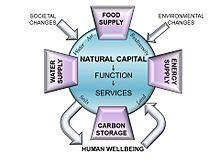

## Table of Contents

## What is natural capital?

Natural capital refers to the world's natural resources and the services they provide, which are essential for human survival and well-being. This includes things like forests, rivers, minerals, and the air we breathe. These resources are not just there for us to use; they also support life on Earth by providing clean water, fertile soil, and a stable climate. When we talk about natural capital, we are thinking about these resources as assets that need to be managed wisely to ensure they can continue to support us and future generations.

However, the way we use natural capital can have big impacts. If we use too much or damage these resources, it can lead to problems like pollution, loss of biodiversity, and climate change. For example, cutting down too many trees can lead to soil erosion and loss of habitats for animals. It's important for us to understand the value of natural capital and to use it in a way that is sustainable. This means using resources in a way that meets our needs today without compromising the ability of future generations to meet their own needs.

## How does natural capital differ from other types of capital?

Natural capital is different from other types of capital, like human capital or financial capital, because it comes from nature. It includes things like forests, rivers, and clean air. These are resources that we don't make; they are part of the Earth. Human capital, on the other hand, is about people's skills and knowledge. Financial capital is money and investments. So, natural capital is unique because it's the base that supports life and all other forms of capital.

Another way natural capital differs is that it can't be easily replaced or made more of like other capitals. If you lose money, you can earn more. If you need more skills, you can learn them. But if you cut down a forest, it takes a long time to grow back, and it might never be the same. Natural capital also provides services that we often take for granted, like clean water and a stable climate. These services are hard to put a price on, but they are essential for our survival and well-being.

## What are some examples of natural capital?

Natural capital includes things like forests, which are home to many animals and plants. Forests help clean the air by taking in carbon dioxide and giving out oxygen. They also keep the soil in place and help control water flow, which prevents floods. Another example is rivers and lakes. They give us water to drink and use, and they are important for fish and other water animals. Wetlands, which are areas where water covers the soil, are also natural capital. They clean water by filtering out pollutants and provide homes for many species.

Another type of natural capital is the air we breathe. Clean air is essential for our health and the health of all living things. The soil is also natural capital. It's where we grow our food, and it's full of life that helps plants grow. Minerals like coal, oil, and metals are part of natural capital too. We use them to make energy and build things, but they are limited and can't be replaced quickly. Finally, the climate is natural capital. It affects everything from where we can live to what we can grow. Keeping the climate stable is important for our future.

## Why is natural capital important for human well-being?

Natural capital is really important for our well-being because it gives us the things we need to live. Things like clean water from rivers and lakes, food from the soil, and clean air from forests are all part of natural capital. Without these, we wouldn't have the basics we need to survive. For example, if we didn't have clean water, we couldn't drink, cook, or stay healthy. If we didn't have good soil, we couldn't grow food, and we would go hungry.

Natural capital also helps us in ways we might not think about every day. It helps keep the climate stable, which means we can live in places that are not too hot or too cold. It also gives us places to enjoy nature, like parks and beaches, which can make us feel happy and relaxed. If we don't take care of natural capital, we could lose these benefits. For instance, if we cut down too many trees, the climate might change in ways that make it hard for us to live comfortably. So, looking after natural capital is important for our health and happiness now and in the future.

## How can natural capital be measured and valued?

Measuring and valuing natural capital can be tricky because it includes things like forests, rivers, and clean air, which are not as easy to put a price on as money or goods. One way to measure natural capital is by looking at how much of it we have and how healthy it is. For example, scientists can count the number of trees in a forest or test the water quality in a river. They can also study how well these natural resources are doing their jobs, like cleaning the air or preventing floods.

Putting a value on natural capital means trying to figure out how much it's worth to us. This can be done in different ways. One way is to think about how much it would cost to replace what nature gives us for free. For example, how much would it cost to build a machine that cleans the air as well as a forest does? Another way is to look at how much money people are willing to pay to use or protect natural resources. For instance, people might pay to visit a national park, which shows how much they value that natural space. By using these methods, we can start to understand the true worth of natural capital and make better decisions about how to use and protect it.

## What are the main functions of natural capital in ecosystems?

Natural capital has many important jobs in ecosystems. It helps keep everything in balance. For example, forests act like big sponges that soak up rain and slowly release it into rivers. This helps prevent floods and keeps the water clean. Soil is another part of natural capital that's full of tiny creatures that break down dead plants and animals, turning them into nutrients that new plants can use to grow. Without these functions, ecosystems would not be able to support life the way they do.

Another big job of natural capital is to support a wide variety of life, or biodiversity. Wetlands, for example, are home to many different kinds of plants and animals. They help clean water by filtering out pollutants and provide places for fish to lay their eggs. The air we breathe is also natural capital, and it's cleaned by plants that take in carbon dioxide and give out oxygen. All these functions work together to make sure ecosystems stay healthy and can keep supporting life, including humans.

## How does the degradation of natural capital impact economies?

When natural capital like forests, rivers, and soil gets damaged or used up too quickly, it can hurt economies. For example, if a country cuts down too many trees, it might make money from selling the wood at first. But later, it could lose money because the land can't be used for farming anymore, and there are fewer trees to help clean the air and water. Also, if the soil gets worn out, it's harder to grow food, which can make food prices go up and hurt people who depend on farming for their living.

The damage to natural capital can also lead to big costs for fixing problems like pollution and floods. If rivers get dirty, it costs a lot of money to clean them up so people can use the water safely. And if there are no wetlands to soak up heavy rain, floods can happen more often, which can destroy homes and businesses. All these problems can slow down the economy because money that could be used for other things has to be spent on fixing the damage to natural capital.

## What are the key policies for managing and conserving natural capital?

One important policy for managing and conserving natural capital is setting up protected areas like national parks and wildlife reserves. These places help keep forests, rivers, and other natural resources safe from being used up too quickly. Governments can make rules about what people can and can't do in these areas, like not allowing hunting or cutting down trees. This helps make sure that natural capital stays healthy and can keep doing its important jobs, like cleaning the air and water.

Another key policy is using laws and taxes to make sure companies and people use natural resources in a way that doesn't harm them too much. For example, there can be rules about how much water a factory can use or how much pollution it can make. There can also be taxes on things like cutting down trees or using a lot of energy. These policies encourage people to be more careful with natural resources and think about the long-term effects of what they do.

Finally, education and awareness programs are important for managing natural capital. When people understand how important natural resources are for their lives and the economy, they are more likely to help protect them. Governments and organizations can teach people about things like recycling, saving water, and planting trees. By working together, everyone can help make sure that natural capital stays strong and can keep supporting us for a long time.

## How do businesses incorporate natural capital into their operations?

Businesses can include natural capital in their work by thinking about how they use things like water, energy, and raw materials. They can try to use less of these resources and find ways to use them more wisely. For example, a company might use less water in its factories or use energy from the sun or wind instead of oil or coal. By doing this, they not only help protect the environment but can also save money and make their business more sustainable.

Another way businesses can incorporate natural capital is by looking at the bigger picture of their impact on nature. They can do things like planting trees, cleaning up pollution, or supporting projects that help protect wildlife. Some companies even try to put a price on the natural resources they use, so they can see the true cost of their operations. By considering natural capital in this way, businesses can make better decisions that are good for both the planet and their profits.

## What are the global initiatives aimed at preserving natural capital?

There are many global efforts to protect natural capital. One big one is the United Nations' Sustainable Development Goals (SDGs). These goals help countries work together to use natural resources in a way that doesn't harm the planet. For example, one goal is about making sure everyone has clean water and another is about protecting life on land and in the water. Countries around the world are trying to meet these goals by making new laws and working together on projects that help nature.

Another important initiative is the Convention on Biological Diversity (CBD). This is an agreement between many countries to protect the variety of life on Earth. They set targets like protecting a certain amount of land and sea and making sure that the use of natural resources is sustainable. The CBD helps countries share information and work together to stop the loss of natural capital. By doing this, they hope to keep ecosystems healthy and able to support life for a long time.

The Natural Capital Protocol is also a helpful tool. It gives businesses a way to measure and value the natural resources they use. This helps companies see how their actions affect nature and make better choices. By using the protocol, businesses can find ways to use less of the Earth's resources and help protect them. This is important because businesses play a big role in how natural capital is used around the world.

## How does climate change affect natural capital?

Climate change can really harm natural capital. When the weather gets hotter or changes a lot, it can hurt forests, rivers, and other natural resources. For example, if it gets too warm, some trees might not be able to grow anymore, and forests could start to die. This is bad because forests help clean the air and keep the soil in place. Also, if there are more big storms because of climate change, they can wash away soil and make it hard to grow food. This shows how climate change can mess up the important jobs that natural capital does.

Another way climate change affects natural capital is by making sea levels rise. When the ice at the North and South Poles melts, it makes the ocean bigger. This can harm wetlands and beaches, which are important for cleaning water and giving homes to animals. If these places get flooded, it's bad for the plants and animals that live there. Also, if it gets too hot, it can make it hard for fish and other sea creatures to live. So, climate change can change how well natural capital works and make it harder for it to support life on Earth.

## What are the future research directions in the field of natural capital?

One important direction for future research in natural capital is figuring out better ways to measure and value it. Scientists want to find out how much natural resources like forests and rivers are really worth to us. They are working on new methods to put a price on things like clean air and water, which can be hard to do. By understanding the true value of natural capital, we can make better decisions about how to use and protect it. This research can help governments and businesses see the long-term benefits of keeping nature healthy.

Another area of research is looking at how climate change affects natural capital. Scientists are studying how warmer temperatures and changing weather patterns can harm forests, rivers, and other natural resources. They want to know how these changes might make it harder for natural capital to do its important jobs, like cleaning the air and water. By learning more about these effects, we can find ways to protect natural capital from climate change and make sure it can keep supporting life on Earth.

A third direction for future research is finding new ways for businesses to use natural capital in a sustainable way. Researchers are looking at how companies can use less water, energy, and raw materials, and how they can help protect nature. They are also studying how businesses can work with local communities to take care of natural resources. By doing this research, we can help businesses be more responsible and make sure that natural capital stays strong for future generations.

## References & Further Reading

[1]: Costanza, R., de Groot, R., Sutton, P., van der Ploeg, S., Anderson, S. J., Kubiszewski, I., ... & Turner, R. K. (2014). ["Changes in the global value of ecosystem services."](https://www.sciencedirect.com/science/article/abs/pii/S0959378014000685) Global Environmental Change, 26, 152-158.

[2]: Daly, H. E., & Farley, J. (2011). ["Ecological Economics: Principles and Applications"](https://library.uniteddiversity.coop/Measuring_Progress_and_Eco_Footprinting/Ecological_Economics-Principles_and_Applications.pdf). Island Press.

[3]: Pearce, D. W., & Turner, R. K. (1990). ["Economics of Natural Resources and the Environment."](https://archive.org/details/economicsofnatur0000pear) Johns Hopkins University Press.

[4]: Pindyck, R. S. (2007). ["Uncertainty in environmental economics."](https://web.mit.edu/rpindyck/www/Papers/UncertEnvironEconPrinted_version.pdf) Review of Environmental Economics and Policy, 1(1), 45-65.

[5]: McAfee, A. (2019). ["The impact of climate change on the U.S. economy."](https://www.mcafee.com/blogs/other-blogs/executive-perspectives/the-hidden-costs-of-cybercrime-on-government/) The Brookings Institution.

[6]: Hartwick, J. M. (1977). ["Intergenerational equity and the investing of rents from exhaustible resources."](https://www.jstor.org/stable/1828079) The American Economic Review, 67(5), 972-974. 

[7]: Calvino, C. (2020). ["Algorithmic Trading and Environmental Markets."](https://www.aeaweb.org/articles?id=10.1257/aer.20190623) Journal of Sustainable Finance & Investment.