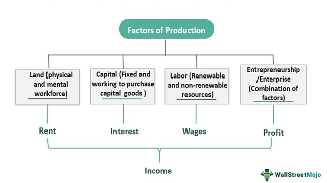

The increasing focus on sustainability and environmental protection has made concepts like natural capital crucial in economic and financial discussions. Natural capital encompasses the stock of natural resources, including water, oil, and other commodities, that entities such as companies or governments possess. These resources are fundamental in sustaining economic activities and are becoming a priority in economic planning due to their finite nature and essential role in maintaining environmental health.

Advancements in technology, particularly in algorithmic trading, have further intertwined these concepts with environmental concerns. Algorithmic trading employs computer algorithms to make and execute trading decisions efficiently, often with minimal human input. This technological progression allows for more precise integration and valuation of natural capital within financial markets, addressing both economic and environmental objectives.



This article investigates how natural capital, environmental economics, and algorithmic trading contribute to ecosystem services. Ecosystem services, the various benefits derived from ecosystems, include clean water provision, air purification, and pollination, all of which are crucial for the planet's health and human wellbeing. Understanding the interplay between these elements is vital for developing sustainable practices that ensure economic growth while preserving essential natural resources.

## Table of Contents

## Understanding Natural Capital

Natural capital represents the planet's stockpile of natural resources, which encompass elements such as geology, soil, air, water, and all living organisms. These resources form the foundation of ecosystems that deliver essential services, including carbon sequestration, water purification, and soil fertility—all critical to maintaining ecological and environmental balance. The significance of natural capital lies in its direct impact on economic activities; for instance, forests, fisheries, and minerals are direct inputs in many industries, providing raw materials that drive production processes and economic growth.

Natural capital is central to sustaining ecosystem services that contribute to human well-being and economic prosperity. Ecosystem services are often categorized into provisioning services (like food and water), regulating services (such as climate regulation), cultural services (including recreation), and supporting services (for instance, nutrient cycling). As demand for these resources intensifies, understanding and managing natural capital becomes increasingly important to avoid degradation and ensure long-term availability.

Companies utilizing natural resources are recognizing the importance of treating these resources as assets. This approach means incorporating them into their financial accounting and reporting practices, enabling better management and sustainability. The valuation of natural capital often involves assessing the cost and benefits of using these resources, which can include methods like cost-benefit analysis, contingent valuation, and ecological footprint calculations.

Accountability for natural capital can lead to innovative practices aimed at conservation and sustainable resource use. By recognizing natural resources as capital assets, companies can make informed decisions about their extraction and consumption, ensuring that these actions align with both economic goals and environmental sustainability.

## The Role of Environmental Economics

Environmental economics is a pivotal branch of economic study that addresses environmental issues through the development of theoretical frameworks and empirical methods. This discipline is particularly focused on understanding the economic implications of environmental policies and the valuation of natural resources.

One of the core functions of environmental economics is to furnish tools and methodologies to analyze the economic consequences of various environmental policies. Economists in this field develop models to estimate the costs and benefits of policy actions, such as carbon pricing, subsidies for renewable energy, and regulations for pollution control. By doing so, they enable policymakers to compare the economic outcomes of different policy options and choose those that optimize societal welfare.

Moreover, environmental economics plays a vital role in the valuation of natural resources, highlighting their importance within economic systems. Traditional economic models often overlook the value of resources that do not have explicit market prices, such as clean air, water, and biodiversity. Environmental economists address this gap by employing techniques like contingent valuation, hedonic pricing, and cost-benefit analysis to assign economic values to these non-market goods. These valuations are crucial for integrating the concept of natural capital into economic systems.

Incorporating natural capital into economic models has significant implications for sustainable development. By recognizing natural resources as capital assets that yield ecosystem services, such integration encourages their sustainable use and management. This approach reflects the principles of the "triple bottom line," which emphasizes economic, social, and environmental dimensions of development.

Models that incorporate natural capital advocate for the optimal use of resources by considering both current exploitation and future availability. For example, the Hartwick's Rule, a concept in environmental economics, suggests that if the rents from non-renewable resources are invested in reproducible capital, then the consumption possibilities for future generations can remain constant. 

In conclusion, environmental economics provides a critical framework for understanding and managing the relationship between economic systems and the environment. By developing robust methodologies for policy evaluation and natural resource valuation, it supports the integration of sustainability into economic decision-making processes, promoting a balance between economic growth and environmental conservation.

## Ecosystem Services and Their Importance

Ecosystem services are the multitude of benefits that humans derive from natural, functioning ecosystems. These services are categorized into four main types: provisioning, regulating, cultural, and supporting services.

**Provisioning services** include the tangible materials obtained from ecosystems, such as food, water, timber, and fiber. These resources are essential for human survival and underpin many economic activities.

**Regulating services** are the benefits obtained from the regulation of ecosystem processes. This category includes climate regulation, flood control, water purification, and pest regulation. For example, forests and oceans play a critical role in stabilizing the global climate by sequestering carbon dioxide.

**Cultural services** encompass the non-material benefits people gain from ecosystems through spiritual enrichment, cognitive development, reflection, recreation, and aesthetic experiences. These services are often deeply connected to cultural identities and social relations.

**Supporting services** form the basis for all other ecosystem services and include services like nutrient cycling, soil formation, and primary production. These foundational processes are vital for the maintenance of life on Earth, ensuring the sustainability of agriculture and biodiversity.

The economic valuation of ecosystem services is essential for promoting their integration into the market economy. By assigning monetary value to these services, societies can better appreciate their contribution to human well-being and the economy. This valuation helps to internalize the external costs and benefits associated with environmental degradation and conservation, fostering informed decision-making among policymakers, businesses, and individuals.

For example, the valuation of pollination services provided by bees can influence agricultural practices, encouraging the adoption of bee-friendly initiatives and reducing pesticide use. Similarly, understanding the value of wetlands in flood control can guide urban planning and infrastructure investments.

Further, recognizing the economic value of ecosystem services can play a crucial role in conservation. By demonstrating the financial benefits of preserving natural habitats, stakeholders, including governments and non-profit organizations, can allocate resources more effectively to protect these vital ecosystems.

In summary, ecosystem services are indispensable to human prosperity and ecological sustainability. Accurately valuing and integrating these services into economic frameworks is critical to ensuring their preservation and optimizing resource management strategies. By doing so, we foster a balanced approach that aligns economic growth with environmental sustainability.

## Algorithmic Trading in the Context of Natural Resources

Algorithmic trading is a method of executing orders using automated pre-programmed trading instructions, which accounting for variables such as timing, price, and [volume](/wiki/volume-trading-strategy). In the context of natural resources, particularly in the commodity markets, [algorithmic trading](/wiki/algorithmic-trading) offers significant advantages in pricing and trading efficiency. This sophisticated trading method relies on computational power and advanced algorithms to analyze vast quantities of data, extracting patterns that can lead to better decision-making.

Commodity markets, which include resources like oil, gas, and precious metals, are highly volatile and influenced by numerous external factors, ranging from geopolitical events to weather conditions. Algorithmic trading can efficiently handle this complexity by processing real-time data and executing transactions with minimal human intervention. This allows for quicker reactions to market changes, ensuring that natural capital resources are bought and sold at optimal prices.

The integration of algorithms in trading natural capital necessitates the availability of high-quality, comprehensive data. This includes ecological data, resource stock levels, extraction rates, and environmental impact assessments. Access to such data ensures that algorithmic strategies can balance profitability with sustainability. For example, algorithms can be designed to account for sustainable extraction limits, ensuring that the trading of natural resources does not exceed their natural regeneration rates.

Furthermore, the use of predictive analytics in algorithmic trading can forecast market movements based on historical data and current trends. Machine learning models can be employed to continuously improve trading strategies, adapting to new information and shifting market dynamics. The pseudocode below illustrates a simple [machine learning](/wiki/machine-learning) approach using Python for predicting commodity prices:

```python
import numpy as np
import pandas as pd
from sklearn.model_selection import train_test_split
from sklearn.ensemble import RandomForestRegressor
from sklearn.metrics import mean_squared_error

# Load data
data = pd.read_csv('commodity_data.csv')

# Feature selection
features = data[['historical_price', 'supply_levels', 'demand_forecast']]
target = data['future_price']

# Split data
X_train, X_test, y_train, y_test = train_test_split(features, target, test_size=0.2, random_state=42)

# Initialize and train model
model = RandomForestRegressor(n_estimators=100, random_state=42)
model.fit(X_train, y_train)

# Predict and evaluate
predictions = model.predict(X_test)
error = mean_squared_error(y_test, predictions)
print(f'Mean Squared Error: {error}')
```

This script demonstrates how historical commodity prices, supply levels, and demand forecasts can be used to predict future prices, informing trading algorithms. The challenge and opportunity lie in refining these models to incorporate environmental considerations, thus ensuring that economic incentives align with the sustainable management of natural capital.

## Challenges and Opportunities

Balancing the exploitation of natural capital with the maintenance of ecosystem services presents a complex challenge in the pursuit of sustainable development. The depletion of natural resources without adequate replenishment or management threatens biodiversity, climate stability, and the overall health of the environment. Therefore, it's essential to develop strategies that allow for the sustainable use of natural capital while preserving ecosystem services.

Environmental economics offers valuable insights into this balancing act. By integrating natural capital into economic analyses, policymakers can better understand the trade-offs associated with resource utilization and conservation. This field provides tools such as cost-benefit analysis and natural resource accounting, which help quantify the economic value of ecosystem services, thereby facilitating informed decision-making.

Algorithmic trading introduces both opportunities and challenges in this context. On the one hand, it can aid in the efficient pricing and trading of resources, leveraging large datasets to predict market trends and resource availability. Advanced algorithms can analyze patterns that humans might miss, allowing for more accurate forecasting and better resource management.

However, the reliance on algorithmic trading also requires robust and accurate data on natural capital. Incomplete or inaccurate data can lead to suboptimal trading decisions that might exacerbate resource depletion. Thus, innovation in data analytics and technology is crucial. Developments such as machine learning and AI can enhance the acquisition, management, and interpretation of data related to natural resources. For example, remote sensing technology can monitor deforestation rates, while AI-driven models can predict future resource availability.

The use of such technology aligns economic objectives with environmental stewardship by ensuring that trading strategies account for the long-term availability and health of natural resources. Moreover, enhanced data insights could promote transparency in commodity markets, encouraging sustainable investment by showcasing the financial benefits of maintaining ecosystem services.

In summary, while the challenges of balancing resource exploitation with ecosystem maintenance are significant, the integration of environmental economics and algorithmic trading holds considerable promise. By fostering innovation in data analytics and technology, stakeholders can develop strategies that align environmental goals with economic growth, ensuring the sustainable management of natural capital.

## Conclusion

As society grapples with escalating environmental concerns, the necessity of weaving natural capital into economic frameworks becomes ever more pressing. Recognizing natural resources—such as forests, water bodies, and minerals—as crucial economic assets can drive a transformative shift towards sustainability. This approach not only ensures the preservation of these vital resources but also aligns economic practices with environmental health.

The advent of algorithmic trading has introduced a compelling avenue for sustainable resource management. When integrated with environmental economics, algorithmic trading can optimize the pricing and trading processes for natural resources, ensuring these processes reflect the true value of ecosystem services. By incorporating comprehensive environmental data into trading algorithms, markets can more accurately represent the scarcity and ecological significance of natural resources. For instance, advanced algorithms can be designed to price resources not just based on market demand but also factoring in the ecological cost of resource depletion.

Furthermore, collaboration and innovation among stakeholders—ranging from governments and corporations to local communities and environmental NGOs—are pivotal. Through the joint effort and leverage of data analytics, stakeholders can develop more precise valuation mechanisms and resource management strategies. Technologies such as remote sensing, blockchain for supply chain transparency, and AI-driven predictive models can enhance the monitoring and management of natural capital, thereby aligning economic growth objectives with environmental stewardship.

In conclusion, the intersection of natural capital, environmental economics, and algorithmic trading offers a promising path toward achieving sustainability. By fostering collaboration and leveraging technological advancements, stakeholders can ensure the long-term viability of ecosystems while simultaneously pursuing economic prosperity. This integrated approach not only addresses current environmental challenges but also paves the way for a more resilient and balanced future.

## References & Further Reading

[1]: Costanza, R., de Groot, R., Sutton, P., van der Ploeg, S., Anderson, S. J., Kubiszewski, I., ... & Turner, R. K. (2014). ["Changes in the global value of ecosystem services."](https://www.sciencedirect.com/science/article/abs/pii/S0959378014000685) Global Environmental Change, 26, 152-158.

[2]: Daly, H. E., & Farley, J. (2011). ["Ecological Economics: Principles and Applications"](https://library.uniteddiversity.coop/Measuring_Progress_and_Eco_Footprinting/Ecological_Economics-Principles_and_Applications.pdf). Island Press.

[3]: Pearce, D. W., & Turner, R. K. (1990). ["Economics of Natural Resources and the Environment."](https://archive.org/details/economicsofnatur0000pear) Johns Hopkins University Press.

[4]: Pindyck, R. S. (2007). ["Uncertainty in environmental economics."](https://web.mit.edu/rpindyck/www/Papers/UncertEnvironEconPrinted_version.pdf) Review of Environmental Economics and Policy, 1(1), 45-65.

[5]: McAfee, A. (2019). ["The impact of climate change on the U.S. economy."](https://www.mcafee.com/blogs/other-blogs/executive-perspectives/the-hidden-costs-of-cybercrime-on-government/) The Brookings Institution.

[6]: Hartwick, J. M. (1977). ["Intergenerational equity and the investing of rents from exhaustible resources."](https://www.jstor.org/stable/1828079) The American Economic Review, 67(5), 972-974. 

[7]: Calvino, C. (2020). ["Algorithmic Trading and Environmental Markets."](https://www.aeaweb.org/articles?id=10.1257/aer.20190623) Journal of Sustainable Finance & Investment.