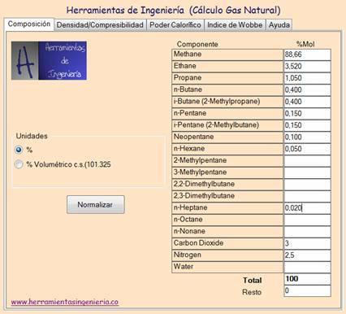

## Table of Contents

## What is the concept of Natural Gas Equivalent?

Natural Gas Equivalent, often shortened to NGE, is a way to compare different types of energy to the energy content in natural gas. It helps us understand how much energy other fuels, like oil or coal, would have if they were in the form of natural gas. This is useful for people who need to switch between different energy sources or want to compare the energy content of different fuels easily.

For example, if you know that a certain amount of oil has the same energy as a certain amount of natural gas, you can use NGE to figure out how much natural gas you would need to replace that oil. This concept is important in industries like energy production and transportation, where different fuels are often used and compared. By using NGE, people can make better decisions about which fuels to use based on their energy needs and available resources.

## Why is Natural Gas Equivalent important in the energy sector?

Natural Gas Equivalent is important in the energy sector because it helps people compare different types of energy easily. Imagine you have oil, coal, and natural gas, but you want to know how much energy they have in a way that's easy to understand. By using Natural Gas Equivalent, you can see how much natural gas you would need to get the same amount of energy as the other fuels. This makes it simpler for energy companies to plan and switch between different energy sources depending on what's available and what they need.

This concept is also useful for making decisions about energy use and policy. For example, if a country wants to reduce its use of coal and switch to natural gas, they can use Natural Gas Equivalent to figure out how much natural gas they need to replace the coal. This helps in setting goals for energy production and in understanding the impact of switching fuels on the environment and the economy. By having a common way to measure energy, everyone in the energy sector can communicate and plan better.

## How is Natural Gas Equivalent calculated?

Natural Gas Equivalent is calculated by comparing the energy content of different fuels to the energy content of natural gas. To do this, you need to know how much energy each fuel has. For example, if you have a gallon of oil, you can find out how many British Thermal Units (BTUs) it has. Then, you compare that to how many BTUs are in a cubic foot of natural gas. If one gallon of oil has the same energy as 6,000 cubic feet of natural gas, then that gallon of oil is equivalent to 6,000 cubic feet of natural gas.

This calculation helps people in the energy industry figure out how much of one fuel they need to replace another. It's like comparing apples to oranges by turning both into a common unit, like applesauce. By using Natural Gas Equivalent, energy companies can plan better and make decisions about which fuels to use based on what's available and what they need. This makes it easier to switch between different energy sources and understand how much energy they will get from each one.

## What units are used to measure Natural Gas Equivalent?

Natural Gas Equivalent is usually measured in units of energy like British Thermal Units (BTUs) or joules. These units help us compare the energy in different fuels to the energy in natural gas. For example, if you know that one gallon of oil has a certain number of BTUs, you can figure out how many cubic feet of natural gas have the same amount of BTUs.

This way, you can say that one gallon of oil is equivalent to a certain number of cubic feet of natural gas. It's like turning different fruits into a common unit, like applesauce, so you can compare them easily. By using these units, people in the energy industry can plan better and make decisions about which fuels to use based on what's available and what they need.

## Can you explain the conversion factors used in Natural Gas Equivalent calculations?

Conversion factors in Natural Gas Equivalent calculations help us compare different fuels to natural gas. For example, one common conversion [factor](/wiki/factor-investing) is how many British Thermal Units (BTUs) are in a gallon of oil compared to a cubic foot of natural gas. If one gallon of oil has about 138,000 BTUs and one cubic foot of natural gas has about 1,030 BTUs, you can figure out that one gallon of oil is equivalent to about 134 cubic feet of natural gas.

These conversion factors are important because they let us turn different energy sources into a common unit, making it easier to compare them. For instance, if you want to know how much natural gas you need to replace a certain amount of coal, you can use the BTUs in coal and the BTUs in natural gas to find the answer. By using these conversion factors, people in the energy industry can plan better and make decisions about which fuels to use based on what's available and what they need.

## What are the common applications of Natural Gas Equivalent in industry?

Natural Gas Equivalent is used a lot in the energy industry to help people compare different types of energy easily. Imagine you have oil, coal, and natural gas, but you want to know how much energy they have in a way that's easy to understand. By using Natural Gas Equivalent, you can see how much natural gas you would need to get the same amount of energy as the other fuels. This helps energy companies plan better and switch between different energy sources depending on what's available and what they need.

This concept is also important for making decisions about energy use and policy. For example, if a country wants to reduce its use of coal and switch to natural gas, they can use Natural Gas Equivalent to figure out how much natural gas they need to replace the coal. This helps in setting goals for energy production and in understanding the impact of switching fuels on the environment and the economy. By having a common way to measure energy, everyone in the energy sector can communicate and plan better.

## How does Natural Gas Equivalent help in energy policy and planning?

Natural Gas Equivalent helps in energy policy and planning by making it easier to compare different types of energy. When a country or a company wants to change from using one type of fuel to another, like from coal to natural gas, they need to know how much of the new fuel they need. Natural Gas Equivalent lets them see how much natural gas they would need to get the same amount of energy as the coal they are replacing. This helps them plan better and make smart choices about which fuels to use based on what's available and what they need.

This concept is also useful for setting energy goals and understanding the effects of changing fuels. For example, if a government wants to reduce pollution by using less coal, they can use Natural Gas Equivalent to figure out how much natural gas they need to replace the coal. This helps them see how switching fuels will affect the environment and the economy. By having a common way to measure energy, everyone in the energy sector can communicate and plan better, making it easier to reach their energy goals.

## What are the challenges in accurately determining Natural Gas Equivalent?

Determining Natural Gas Equivalent accurately can be tricky because different fuels have different energy contents that can change based on where they come from and how they are made. For example, the energy in a gallon of oil can be different depending on the type of oil. This means that the conversion factors used to compare oil to natural gas might not always be exact. Also, the way we measure the energy in fuels can vary, which can make it hard to get the same results every time.

Another challenge is that the quality of natural gas can change, which affects how much energy it has. If the natural gas has more impurities, it might have less energy than pure natural gas. This makes it harder to compare it to other fuels accurately. Plus, the technology and methods used to measure energy can be different in different places, which can lead to different results. All these things make it tough to get a perfect Natural Gas Equivalent, but people in the energy industry work hard to make their measurements as accurate as possible.

## How do different energy sources compare when converted to Natural Gas Equivalent?

When we convert different energy sources to Natural Gas Equivalent, we can see how much natural gas we would need to get the same amount of energy as other fuels. For example, one gallon of oil is about the same as 134 cubic feet of natural gas. This means if you have a gallon of oil, you need 134 cubic feet of natural gas to get the same energy. Coal is different because it can have different energy amounts depending on its type, but usually, one ton of coal is about the same as 20,000 cubic feet of natural gas. By using Natural Gas Equivalent, it's easier to see how much natural gas you need to replace other fuels.

Another way to look at it is with renewable energy sources like wind or solar power. These sources don't have a direct Natural Gas Equivalent because they produce electricity, not a fuel like oil or coal. But if you want to compare them, you can look at how much electricity they produce and then see how much natural gas you would need to make the same amount of electricity. For example, if a wind turbine makes enough electricity to power a home, you can figure out how much natural gas a power plant would need to make the same amount of electricity. This helps people in the energy industry plan better and make choices about which energy sources to use.

## What role does Natural Gas Equivalent play in environmental impact assessments?

Natural Gas Equivalent helps in environmental impact assessments by letting people compare how much pollution different energy sources make. If a company wants to switch from coal to natural gas, they can use Natural Gas Equivalent to see how much natural gas they need to replace the coal. Then, they can figure out if using natural gas will make less pollution than using coal. This helps them decide if switching fuels is good for the environment.

This concept is also useful for governments and environmental groups who want to set goals for reducing pollution. By knowing how much natural gas is needed to replace other fuels, they can plan better and make rules about which fuels to use. This helps them understand how switching fuels will affect the air, water, and land, and make choices that are better for the environment.

## How have advancements in technology affected the calculation and use of Natural Gas Equivalent?

Advancements in technology have made it easier to calculate Natural Gas Equivalent more accurately. New tools and methods help measure the energy in different fuels better. For example, better lab equipment can now tell us exactly how many BTUs are in a gallon of oil or a cubic foot of natural gas. This means the conversion factors we use to compare fuels are more exact. Also, computers and software can now do these calculations quickly and easily, helping energy companies plan and make decisions faster.

These technological improvements also help in using Natural Gas Equivalent in new ways. For example, smart grids and energy management systems can use Natural Gas Equivalent to balance the use of different energy sources in real-time. This helps make the energy system more efficient and less wasteful. Plus, with better technology, we can track and report how much pollution different fuels make more accurately, which is important for environmental impact assessments and planning for a cleaner future.

## What future trends might influence the use and importance of Natural Gas Equivalent?

In the future, the use of Natural Gas Equivalent might grow because more countries want to use less polluting fuels like natural gas instead of coal. As we try to fight climate change, knowing how much natural gas we need to replace other fuels will be very important. Also, new technology might make it easier to use different kinds of energy together, like wind, solar, and natural gas. Natural Gas Equivalent will help us figure out how to balance these energy sources to make our energy systems cleaner and more efficient.

Another trend that might affect Natural Gas Equivalent is the rise of renewable energy. As we use more wind and solar power, we'll need to compare these with traditional fuels like natural gas. Even though wind and solar don't have a direct Natural Gas Equivalent, we can still use it to see how much natural gas we would need to make the same amount of electricity. This will help us plan our energy use better and move towards a future with less pollution and more clean energy.

## What is the understanding of Natural Gas Equivalent and Energy Conversion?

The concept of Natural Gas Equivalent (NGE) is integral to energy trading, providing a standardized method for comparing natural gas with other energy sources like [crude oil](/wiki/crude-oil). This concept revolves around equating the energy content of natural gas to an equivalent amount of crude oil, thereby enabling traders and analysts to make straightforward comparisons and informed decisions.

A commonly accepted benchmark in the industry is that 6,000 cubic feet of natural gas equate to one barrel of oil. This conversion rate originates from comparing the British Thermal Units (BTU) present in each energy source. Typically, one cubic foot of natural gas contains approximately 1,037 BTUs, while one barrel of crude oil holds about 5.8 million BTUs. The formula to calculate the natural gas equivalent is as follows:

$$
\text{NGE} = \frac{\text{BTUs per barrel of oil}}{\text{BTUs per cubic foot of natural gas}} \approx \frac{5,800,000}{1,037} \approx 6,000 \text{ cubic feet}
$$

Understanding and utilizing NGE plays a critical role in simplifying energy price evaluations and formulating trading strategies. By standardizing the measurement across different energy types, NGE offers a common ground for comparison in trading scenarios. This standardization aids in efficiently assessing the value and cost-effectiveness of energy commodities. Proficiency in conversions not only enhances the precision of price evaluations but also provides traders with a robust framework to strategize trading positions across varied energy markets.

Moreover, these conversions are crucial for designing hedging strategies, as they allow traders to align their portfolios with market movements and manage price risks effectively. As such, the ability to manipulate and understand these conversions holds significant importance for anyone involved in the energy trading sector, ensuring well-informed decisions and strategic planning.

## References & Further Reading

[1]: Bergstra, J., Bardenet, R., Bengio, Y., & Kégl, B. (2011). ["Algorithms for Hyper-Parameter Optimization."](https://dl.acm.org/doi/10.5555/2986459.2986743) Advances in Neural Information Processing Systems 24.

[2]: ["Advances in Financial Machine Learning"](https://www.amazon.com/Advances-Financial-Machine-Learning-Marcos/dp/1119482089) by Marcos Lopez de Prado

[3]: ["Evidence-Based Technical Analysis: Applying the Scientific Method and Statistical Inference to Trading Signals"](https://www.amazon.com/Evidence-Based-Technical-Analysis-Scientific-Statistical/dp/0470008741) by David Aronson

[4]: ["Machine Learning for Algorithmic Trading"](https://github.com/stefan-jansen/machine-learning-for-trading) by Stefan Jansen

[5]: ["Quantitative Trading: How to Build Your Own Algorithmic Trading Business"](https://www.amazon.com/Quantitative-Trading-Build-Algorithmic-Business/dp/1119800064) by Ernest P. Chan

[6]: Hull, J. C. (2018). ["Risk Management and Financial Institutions"](https://www.amazon.com/Management-Financial-Institutions-Wiley-Finance/dp/1119932483) Wiley Finance Series.

[7]: ["Natural Gas Trading: From Natural Gas to Electricity"](https://energyforprogress.org/article/one-question-on-energy-how-does-natural-gas-become-electricity/) by Kevin Bowman