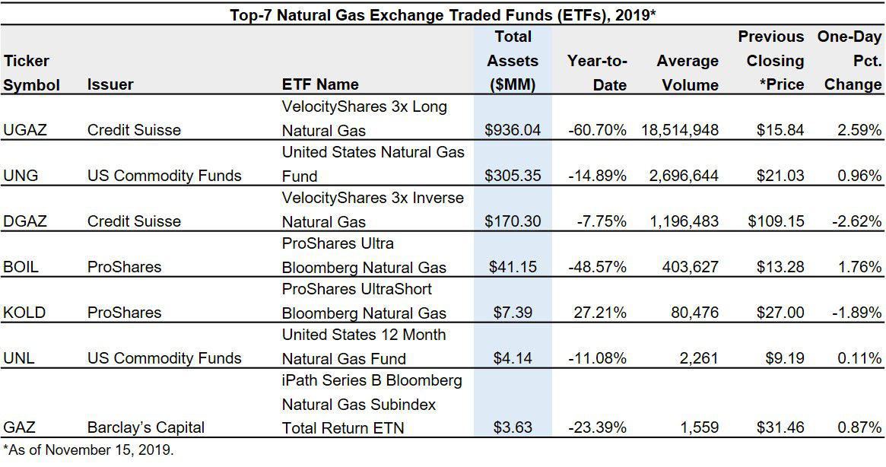

Energy investing has become increasingly significant in today's economy due to the crucial role that energy resources play in supporting industrial activities, technological advancements, and overall economic growth. As nations aim to balance energy security with environmental concerns, the focus has shifted toward optimizing investments in various energy sectors to ensure a sustainable and efficient energy supply.

Natural gas stands out as a vital component of the energy sector due to its relatively low environmental impact compared to other fossil fuels, such as coal and oil. It is widely used for electricity generation, heating, and as a feedstock in industries such as chemicals and fertilizers. The demand for natural gas is influenced by several factors, including global energy consumption patterns, geopolitical dynamics, and technological improvements in extraction and distribution methods. As a pivotal part of the global energy mix, natural gas continues to attract significant investment interest.



Exchange-Traded Funds (ETFs) play a crucial role in investment portfolios by offering a diversified and cost-effective means to gain exposure to specific asset classes or sectors, including energy commodities. A natural gas ETF, for example, allows investors to participate in the market dynamics of natural gas without the need to directly purchase futures or manage physical assets. This approach simplifies the investment process and helps mitigate the risks associated with direct commodity trading.

Algorithmic trading, or algo trading, has revolutionized the way investments are managed by utilizing computer algorithms to execute trades based on pre-defined criteria. In the context of energy investments, algorithmic trading enhances the decision-making process by providing greater speed, accuracy, and efficiency. These advanced tools analyze vast amounts of market data in real time, allowing investors to capitalize on even minor price movements and optimize their portfolio strategies.

This article aims to explore the intersection of natural gas ETFs and algorithmic trading, highlighting how the integration of these investment tools can maximize returns while managing risk. By examining market dynamics, investment strategies, and technological advancements, the discussion focuses on the innovative approaches that are shaping the future of energy investing.

## Table of Contents

## Understanding Natural Gas and its Market Dynamics

Natural gas is a naturally occurring hydrocarbon gas mixture primarily composed of methane, along with small amounts of other hydrocarbons such as ethane, propane, butane, and impurities like carbon dioxide and nitrogen. It is a versatile energy source utilized across various industries. In the residential and commercial sectors, natural gas is used for heating, cooking, and hot water systems. Industrially, it serves as a key feedstock in the production of chemicals, fertilizers, and hydrogen, as well as in processes that require high-temperature heating. Moreover, natural gas plays a crucial role in electricity generation, providing a cleaner and more efficient alternative to coal-fired power plants. 

The price dynamics of natural gas are influenced by a complex interplay of factors. Supply-side dynamics include the availability of natural gas reserves, production levels, and storage capacities. Technological advancements in extraction methods, such as hydraulic fracturing and horizontal drilling, have notably increased supply, particularly in the United States. Demand for natural gas is influenced by seasonal weather patterns, economic growth, and energy consumption trends. For instance, colder winters typically lead to increased demand for heating, thereby impacting prices. Geopolitical issues also play a significant role; for example, political instability in major gas-producing regions can disrupt supply chains, leading to price [volatility](/wiki/volatility-trading-strategies).

Natural gas holds considerable importance in the global energy mix due to its relatively low carbon emissions compared to coal and oil. As countries endeavor to meet climate change targets and transition to cleaner energy sources, natural gas serves as an important bridge fuel in reducing greenhouse gas emissions while supporting grid stability and energy security. 

Recent trends in the natural gas market include a shift towards liquefied natural gas (LNG) to facilitate trade across regions lacking pipeline infrastructure. The LNG market is growing rapidly, allowing countries without local gas resources to import natural gas, thus diversifying their energy supply. Additionally, there is a concerted global effort to harness renewable gases, such as biogas and hydrogen, alongside natural gas, to create a more sustainable energy system.

Looking forward, the future outlook for natural gas markets showcases both challenges and opportunities. The ongoing energy transition and decarbonization efforts pose challenges to natural gas demand in the long term. However, the adaptability of natural gas infrastructure to integrate hydrogen and renewable gases offers new growth areas, positioning natural gas as a pivotal component in future energy strategies, particularly as a backup for renewable energy sources. The market's evolution will heavily depend on regulatory policies, technological innovations, and global climate commitments.

## The Role of ETFs in Energy Investing

Exchange-Traded Funds (ETFs) are investment funds traded on stock exchanges, much like stocks. They are designed to track an index, commodity, bonds, or a basket of assets like an index fund. Unlike mutual funds, ETFs trade like a common stock on a stock exchange and experience price changes throughout the day as they are bought and sold. Most ETFs track an index, such as the S&P 500, but they can also be structured to track specific sectors, commodities, or other instruments. The structure of an [ETF](/wiki/etf-trading-strategies) typically involves a sponsor, often an asset management company, creating the fund by buying or contracting the purchase of a particular set of asset-related securities or futures contracts. These assets are held in a trust, and investors in the ETF effectively own a fraction of this trust proportionate to their investment.

Investing in energy ETFs, particularly those that focus on natural gas, offers several advantages. One significant benefit is diversification. By investing in a basket of energy-related assets, these ETFs spread risk across multiple companies or commodities. This means that poor performance of a single asset has a lesser impact on the overall investment, reducing portfolio volatility. Furthermore, energy ETFs provide an efficient way for investors to gain exposure to the energy sector, which is often subject to macroeconomic factors like global demand and geopolitical tensions.

Some of the popular natural gas ETFs on the market include the United States Natural Gas Fund (UNG), which tracks the price movements of natural gas by investing in futures contracts, and the First Trust Natural Gas ETF (FCG), which focuses on equities of natural gas exploration and production companies. These funds allow investors to position themselves according to their expectations of future natural gas price movements or industry growth, without needing to directly invest in the futures market or individual company stocks.

ETFs serve an essential role in offering diversification and sector exposure. They allow investors to participate in a broad array of assets without the need to purchase each security individually, which would be cost-prohibitive and complex. For energy investing, ETFs cover various subsectors such as exploration, production, distribution, and refining, enabling investors to tailor their portfolios to specific areas within the energy industry. For instance, an energy ETF might include stocks of oil and gas companies, shares of renewable energy firms, or futures contracts linked to energy commodities, thus providing comprehensive exposure to the energy market dynamics. This diversified approach reduces the risk associated with investing in highly volatile individual energy stocks or commodities, offering a more stable return on investment.

 to Algorithmic Trading

Algorithmic trading, often referred to as algo trading, involves using computer programs to execute trades at high speeds and with maximum efficiency. These programs follow a defined set of rules or algorithms, which can range from simple conditions to complex mathematical models, to decide when to buy or sell securities in financial markets.

Central to the function of [algorithmic trading](/wiki/algorithmic-trading) is the elimination of human error and emotion from trading decisions. By utilizing pre-set algorithms, trades can be executed based on real-time market data, ensuring that the trader can act swiftly to capture profitable opportunities. These trades can occur in fractions of a second, a speed unattainable by humans, thus granting a significant advantage in today’s high-paced financial markets.

The benefits of algorithmic trading are manifold. One of the primary advantages is speed. Computer algorithms can evaluate multiple market conditions simultaneously and execute trades much faster than a human trader. This speed is crucial in exploiting fleeting market inefficiencies that arise due to variations in supply and demand or other market anomalies.

Another significant benefit is accuracy. Algorithms can process large amounts of historical and real-time data to discern patterns and trends that may not be immediately evident to human traders. This capacity for detailed analysis helps in making informed trading decisions, which in turn enhances the accuracy of trades executed under algorithmic models.

Efficiency is enhanced through automation, as the mechanical execution of trades eliminates the risk of human error, such as miscalculating trade sizes or reacting irrationally to market swings. With predefined parameters, trades are executed automatically once the set conditions are met, ensuring consistent execution of the trading strategy.

Algorithmic trading plays a transformative role in enhancing investment strategies by providing a systematic approach to trading. It allows for back-testing of trading strategies using historical data, enabling traders to evaluate the potential success of their models before deploying them in live markets. This back-testing is a critical component of developing and refining trading strategies, ensuring they are robust enough to handle real-world market conditions.

Additionally, algorithmic trading can seamlessly integrate data from multiple sources, such as financial news, technical indicators, and economic reports, to inform trading decisions. This integration ensures that strategies are comprehensive and adaptive to a wide array of inputs, optimizing the decision-making process.

For instance, consider a simple moving average crossover strategy, a commonly used algorithmic trading model. The strategy involves two moving averages—a short-term and a long-term one. A typical Python implementation might look like this:

```python
import pandas as pd

# Load historical data
data = pd.read_csv('market_data.csv')
data['Short_MA'] = data['Close'].rolling(window=50).mean()
data['Long_MA'] = data['Close'].rolling(window=200).mean()

# Define buy and sell signals
data['Signal'] = 0
data.loc[data['Short_MA'] > data['Long_MA'], 'Signal'] = 1  # Buy signal
data.loc[data['Short_MA'] < data['Long_MA'], 'Signal'] = -1  # Sell signal

# Execute trades
for i in range(1, len(data)):
    if data['Signal'][i] == 1 and data['Signal'][i - 1] != 1:
        print(f"Buy on day {i}")
    elif data['Signal'][i] == -1 and data['Signal'][i - 1] != -1:
        print(f"Sell on day {i}")
```

This code calculates two moving averages and generates buy/sell signals based on their crossover. Such a strategy typifies how algorithmic trading systems can be implemented to automate the trading process, ensuring decisions are consistent with the defined strategy.

## Integrating Algo Trading with Natural Gas ETFs

Algorithmic trading has revolutionized the way financial markets operate, offering enhanced precision, speed, and efficiency compared to traditional trading methods. In the context of natural gas ETFs, algorithmic trading can significantly improve investment strategies through the use of sophisticated models and automated processes.

### How Algorithmic Trading Enhances Natural Gas ETF Investments

Algorithmic trading enhances natural gas ETF investments by automating the execution of trades based on predetermined strategies. This reduces the potential for human error and allows for rapid response to market fluctuations. Algorithms can process vast amounts of data in real time, analyzing patterns and trends that might not be immediately visible to human traders. This enables investors to make informed decisions quickly, optimizing entry and [exit](/wiki/exit-strategy) points for natural gas ETF positions.

Algorithms, such as mean reversion, [trend following](/wiki/trend-following), and [arbitrage](/wiki/arbitrage) strategies, can be tailored specifically to the characteristics of the natural gas markets. For instance, mean reversion algorithms capitalize on the notion that prices tend to revert to their average over time, which is particularly relevant in the cyclical nature of the energy markets. Trend following strategies, on the other hand, aim to identify and capitalize on the [momentum](/wiki/momentum) of price movement, whether bullish or bearish.

Python code snippets for a simple mean reversion algorithm might look like this:

```python
import numpy as np
import pandas as pd
from statsmodels.tsa.stattools import adfuller

# Load historical price data for a natural gas ETF
data = pd.read_csv('natural_gas_etf_prices.csv')
prices = data['Close']

# Calculate the rolling mean
rolling_mean = prices.rolling(window=20).mean()

# Check for mean reversion using the Augmented Dickey-Fuller test
result = adfuller(prices)
is_mean_reverting = result[1] < 0.05  # 5% significance level

# Generate trading signals based on mean reversion
signals = np.where(prices < rolling_mean, 1, -1)  # Buy when price is below rolling mean, sell otherwise
```

### Examples of Algorithms Used in Trading Energy Commodities

Energy markets, including natural gas, frequently employ algorithms such as pairs trading and [statistical arbitrage](/wiki/statistical-arbitrage). Pairs trading involves the simultaneous buying and selling of two correlated securities to exploit pricing inefficiencies. For natural gas ETFs, this could involve trading against a related energy commodity or another ETF.

Statistical arbitrage exploits short-term price discrepancies between securities. In the energy sector, these algorithms analyze historical correlations between assets and execute trades when these relationships diverge beyond defined thresholds.

### Case Studies of Algo Trading in Natural Gas Markets

Numerous success stories highlight the effectiveness of algorithmic trading in the natural gas markets. For instance, algo trading firms have utilized high-frequency trading ([HFT](/wiki/high-frequency-trading-strategies)) strategies to capitalize on minute price discrepancies in natural gas futures. These strategies involve placing large numbers of orders at extremely high speeds, allowing traders to profit from rapid changes in the market.

In another case, a [quantitative trading](/wiki/quantitative-trading) firm leveraged [machine learning](/wiki/machine-learning) algorithms to predict future price movements of natural gas ETFs based on historical data and exogenous variables such as weather patterns and geopolitical events. This approach enabled them to optimize their trading portfolio, improving overall returns.

Overall, integrating algorithmic trading with natural gas ETFs provides investors with the tools to efficiently navigate the complexities of the natural gas markets. Through advanced data processing, predictive analytics, and automated trade execution, algorithmic trading unlocks new opportunities for enhancing investment performance and managing risk in the ever-evolving energy landscape.

## Risks and Challenges

Trading natural gas Exchange-Traded Funds (ETFs) using algorithms presents numerous risks and challenges that investors must navigate to make informed decisions. One prominent risk is market volatility, which can significantly impact the price of natural gas and, consequently, the value of corresponding ETFs. Natural gas markets are often influenced by unpredictable factors such as geopolitical tensions, weather events, and shifts in supply and demand dynamics, leading to sharp price fluctuations. These fluctuations can cause algorithmic trading strategies to malfunction or produce unintended results if they are not designed to adapt quickly to market changes.

Algorithmic trading introduces additional layers of complexity, primarily due to its reliance on complex mathematical models and computational power. Investors face challenges in ensuring that the algorithms they deploy are accurate and efficient. A minor error in the coding or logic of an algorithm can lead to substantial financial losses. Moreover, high-frequency trading strategies, which are a subset of algorithmic trading, require significant investments in infrastructure to ensure low latency and rapid execution speeds, posing a barrier for smaller investors or firms with limited resources.

Regulatory considerations further compound the challenges of trading natural gas ETFs algorithmically. Financial markets are subject to various regulations that aim to ensure fairness and transparency. However, these regulations can limit the flexibility of algorithmic strategies. For instance, rules concerning market manipulation and the requirement for order transparency can restrict how algorithms operate. Compliance with such regulations requires ongoing monitoring and adjustments to trading strategies, which can be resource-intensive.

Furthermore, [liquidity](/wiki/liquidity-risk-premium) in the natural gas market poses a risk to algorithmic trading. Although natural gas is a widely traded commodity, the liquidity of specific natural gas ETFs can vary, especially during periods of market stress or low trading volumes. This lack of liquidity can lead to slippage, where the execution price of trades deviates from expected prices, thereby affecting the profitability of algorithmic strategies.

Investors also face the challenge of ensuring data integrity and access to high-quality, real-time market data. Algorithmic trading strategies rely on vast amounts of data to make decisions, and any discrepancies or lags in data can lead to incorrect trading signals. As such, maintaining robust data management practices and investing in reliable data sources is crucial.

Lastly, the rapid evolution of technology and trading algorithms necessitates continuous learning and adaptation. Investors must keep abreast of technological advancements, emerging trading techniques, and evolving market conditions to remain competitive and mitigate risks effectively. This need for constant innovation and adaptation adds a layer of complexity and demands a significant investment of time and resources.

In summary, while algorithmic trading of natural gas ETFs offers potential benefits, it is fraught with risks and challenges. Traders must account for market volatility, data accuracy, regulatory compliance, and the necessity for technological infrastructure to optimize their strategies and achieve favorable outcomes.

## Future Trends and Opportunities

Emerging trends in energy investing and algorithmic trading signal significant transformations in the financial and energy sectors. The convergence of technology and finance has enabled more sophisticated analysis and execution of trades in energy markets. This evolution is partly driven by advancements in machine learning, [artificial intelligence](/wiki/ai-artificial-intelligence), and big data analytics, which facilitate the development of complex trading algorithms capable of processing vast amounts of market data in real-time. Such algorithms can identify patterns and trends that are not visible to human traders, thereby optimizing investment decisions and enhancing profitability.

Technological advancements in trading have created opportunities that were previously inaccessible to traditional investing methods. Algorithmic trading systems can execute trades at speeds that outpace human capability, allowing investors to capitalize on fleeting market opportunities and arbitrage situations. Furthermore, the use of predictive analytics enables these systems to anticipate market movements, providing a strategic advantage to traders.

Natural gas ETFs stand to benefit significantly from these technological advancements. As the natural gas market is influenced by numerous variables, including geopolitical events, weather patterns, and macroeconomic indicators, algorithmic trading can be leveraged to manage these complexities effectively. Algorithms can be programmed to adapt to changing market conditions, ensuring that ETF portfolios are optimized for both risk and return.

Moreover, the growth areas for natural gas ETF investments are expanding due to the increasing global demand for cleaner energy sources. Natural gas is often seen as a bridge fuel, facilitating the transition from fossil fuels to renewable energy. This perception has garnered interest in natural gas as a relatively cleaner energy component within diversified energy portfolios. The shift towards sustainable investing also presents a unique opportunity for natural gas ETFs, as investors seek to align their portfolios with environmentally responsible investment practices.

In conclusion, the future of energy investing, particularly in natural gas ETFs, is poised for innovation through the strategic integration of algorithmic trading. By leveraging the speed, accuracy, and efficiency of technology-driven methodologies, investors can navigate the complexities of the energy markets more adeptly. As technology continues to advance, the potential for enhanced trading strategies and investment opportunities in natural gas ETFs will likely grow, offering significant prospects for investors engaged in the energy sector.

## Conclusion

The integration of algorithmic trading with natural gas Exchange-Traded Funds (ETFs) represents a significant advancement in energy investing. Algorithmic trading offers speed, accuracy, and efficiency that can enhance the management and execution of trades involving natural gas ETFs. This integration not only improves investment strategies but also provides investors with an opportunity to navigate the complexities of natural gas markets more effectively.

Throughout this article, we explored the dynamic nature of natural gas as a vital energy resource, noting its susceptibility to various market influences such as supply and demand fluctuations and geopolitical tensions. We highlighted the role of ETFs in offering diversification and exposure to this volatile sector, specifically focusing on natural gas ETFs as a viable investment vehicle. Moreover, the article outlined how algorithmic trading contributes to financial markets by optimizing trading processes, thereby enhancing the performance and reliability of investment portfolios.

The synergy between algo trading and natural gas ETFs opens up innovative strategies for investors. With the ability to rapidly process large datasets, algo trading systems can identify arbitrage opportunities, detect patterns, and execute trades at a pace unattainable for human traders. This integration presents a robust approach to managing risks and capitalizing on market movements in the natural gas sector.

Looking ahead, the future of energy investing is poised to benefit from continuous technological advancements. As computational power increases and data analytics become more sophisticated, the potential for enhanced algo trading strategies is vast. Investors can expect new opportunities in energy markets, driven by the growing demand for efficient, data-driven investment solutions.

In conclusion, the amalgamation of algorithmic trading with natural gas ETFs is instrumental in modernizing energy investment strategies. By leveraging cutting-edge technologies, investors can achieve greater efficiency and insight, positioning themselves advantageously in the evolving landscape of energy finance.

## References & Further Reading

[1]: Bergstra, J., Bardenet, R., Bengio, Y., & Kégl, B. (2011). ["Algorithms for Hyper-Parameter Optimization."](https://dl.acm.org/doi/10.5555/2986459.2986743) Advances in Neural Information Processing Systems 24.

[2]: ["Advances in Financial Machine Learning"](https://www.amazon.com/Advances-Financial-Machine-Learning-Marcos/dp/1119482089) by Marcos Lopez de Prado

[3]: ["Evidence-Based Technical Analysis: Applying the Scientific Method and Statistical Inference to Trading Signals"](https://www.amazon.com/Evidence-Based-Technical-Analysis-Scientific-Statistical/dp/0470008741) by David Aronson

[4]: ["Machine Learning for Algorithmic Trading"](https://github.com/stefan-jansen/machine-learning-for-trading) by Stefan Jansen

[5]: ["Quantitative Trading: How to Build Your Own Algorithmic Trading Business"](https://www.amazon.com/Quantitative-Trading-Build-Algorithmic-Business/dp/1119800064) by Ernest P. Chan