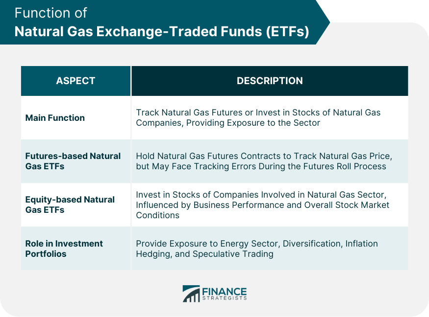

## Table of Contents

## What is a natural gas ETF?

A natural gas ETF, or Exchange Traded Fund, is a type of investment that focuses on natural gas. It's like a basket that holds different investments related to natural gas, such as stocks of companies that produce or transport it, or futures contracts that bet on the future price of natural gas. When you buy shares of a natural gas ETF, you're essentially investing in the overall performance of the natural gas market without having to buy individual stocks or commodities.

These ETFs can be a good way for investors to gain exposure to the natural gas industry without needing to understand all the details of the market. They are traded on stock exchanges, just like individual stocks, so you can buy and sell them easily through a brokerage account. However, like any investment, natural gas ETFs come with risks, as the price of natural gas can be volatile and affected by many factors, such as weather, production levels, and global demand.

## How do natural gas ETFs work?

Natural gas ETFs work by pooling money from many investors to buy a collection of assets related to natural gas. These assets can include stocks of companies that explore, produce, or transport natural gas, as well as futures contracts that predict the future price of natural gas. When you buy shares of a natural gas ETF, you're essentially buying a small piece of this larger collection. The value of your shares goes up or down based on how well the natural gas market is doing overall.

These ETFs are traded on stock exchanges, just like regular stocks. This means you can buy and sell them easily through a brokerage account during trading hours. The price of the [ETF](/wiki/etf-trading-strategies) changes throughout the day, reflecting the current value of its holdings. However, investing in natural gas ETFs can be risky because the price of natural gas can be very unpredictable. It can be affected by things like weather, how much natural gas is being produced, and how much people around the world want to use it.

## What are the benefits of investing in natural gas ETFs?

Investing in natural gas ETFs can be a good way to spread out your risk. Instead of putting all your money into one company, you're investing in a whole bunch of different things related to natural gas. This can help protect you if one company doesn't do well. Plus, it's easy to buy and sell these ETFs because they trade on stock exchanges just like regular stocks. You don't need to know a lot about the natural gas industry to get started.

Another benefit is that natural gas ETFs can give you a chance to make money if the price of natural gas goes up. Since these ETFs often include futures contracts, you can benefit from rising prices without having to buy the actual gas. This can be a good way to take advantage of trends in the energy market. However, remember that the price of natural gas can go down too, so there's always some risk involved.

## What are the risks associated with natural gas ETFs?

Investing in natural gas ETFs can be risky because the price of natural gas can change a lot. Things like the weather, how much natural gas is being made, and how much people around the world want to use it can all make the price go up or down. If you're not ready for these big changes, you could lose money.

Another risk is that natural gas ETFs often use futures contracts. These are bets on what the price of natural gas will be in the future. If the price doesn't go the way the ETF managers thought it would, the value of the ETF can drop. This makes it harder to predict how well your investment will do.

Also, natural gas ETFs can be affected by what's happening in the whole energy market. If there are big changes in oil prices or new laws about energy, it can impact natural gas too. This means you need to keep an eye on a lot of different things to understand how your investment might do.

## How can one start investing in natural gas ETFs?

To start investing in natural gas ETFs, you first need to open a brokerage account. This is like a special bank account where you can buy and sell stocks and ETFs. You can open a brokerage account online with companies like E*TRADE, Charles Schwab, or Robinhood. Once your account is set up, you'll need to add money to it so you can start buying ETFs. Make sure to look at different natural gas ETFs to see which one fits what you want. Some ETFs focus more on the companies that produce natural gas, while others might focus more on the price of natural gas itself.

After you've picked the natural gas ETF you want to invest in, you can place an order through your brokerage account. You'll need to decide how many shares you want to buy and what type of order you want to use. A market order will buy the shares at the current price, while a limit order lets you set a specific price you're willing to pay. Once your order is filled, you'll own shares of the ETF, and their value will go up or down based on how the natural gas market is doing. Remember, investing in ETFs can be risky, so it's a good idea to do your research and maybe talk to a financial advisor before you start.

## What factors influence the performance of natural gas ETFs?

The performance of natural gas ETFs is influenced by many things. One big [factor](/wiki/factor-investing) is the price of natural gas itself. If the price goes up, the value of the ETF usually goes up too. Things like the weather can affect this. For example, if it's really cold, people might use more natural gas to heat their homes, which can make the price go up. Also, how much natural gas is being produced and how much people around the world want to use it can change the price. If there's a lot of natural gas but not many people want it, the price might go down.

Another thing that can affect natural gas ETFs is what's happening in the energy market overall. If oil prices go up or down a lot, it can impact natural gas prices too because they are often used for similar things. New laws about energy or changes in how countries use energy can also make a difference. For example, if a country decides to use more renewable energy, it might use less natural gas, which could lower the price. Also, the ETFs often use futures contracts, which are bets on what the price of natural gas will be in the future. If these bets don't go the way the ETF managers thought, it can hurt the ETF's performance.

## Can you list some popular natural gas ETFs?

Some popular natural gas ETFs include the United States Natural Gas Fund (UNG), which tries to match the price of natural gas by using futures contracts. Another one is the iShares U.S. Natural Gas ETF (UNG), which also focuses on the price of natural gas. The Alerian MLP ETF (AMLP) is different because it invests in companies that transport and store natural gas, not just the price of the gas itself.

The First Trust Natural Gas ETF (FCG) is another option that invests in a mix of companies involved in natural gas, from exploration to production. The SPDR S&P Oil & Gas Exploration & Production ETF (XOP) includes some natural gas companies but also focuses on oil, so it's a bit broader. Each of these ETFs has its own way of trying to make money from natural gas, so it's good to look at what each one does before you decide to invest.

## How do natural gas ETFs compare to other energy ETFs?

Natural gas ETFs focus on the natural gas part of the energy market. They might invest in the price of natural gas itself or in companies that work with natural gas, like those that explore, produce, or transport it. Other energy ETFs can be broader, covering different kinds of energy like oil, coal, or even renewable energy sources like solar and wind. For example, an oil and gas ETF might include companies that work with both oil and natural gas, while a renewable energy ETF would focus on companies that make or use clean energy.

The performance of natural gas ETFs can be different from other energy ETFs because they are more tied to the price of natural gas. If the price of natural gas goes up or down a lot, it can affect these ETFs more than others that are spread out over different types of energy. On the other hand, ETFs that cover a wider range of energy sources might be less risky because they aren't as dependent on just one thing. But they might also not grow as fast if one type of energy, like natural gas, does really well. So, when choosing between natural gas ETFs and other energy ETFs, it's important to think about how much risk you want to take and what parts of the energy market you want to invest in.

## What are the tax implications of investing in natural gas ETFs?

Investing in natural gas ETFs can have different tax effects depending on what the ETF holds and how long you keep it. If the ETF mostly holds stocks of companies, you might have to pay capital gains tax when you sell your shares. The tax rate can be different if you held the ETF for less than a year (short-term capital gains) or more than a year (long-term capital gains). Short-term gains are usually taxed at your regular income tax rate, which can be higher, while long-term gains often have a lower tax rate.

If the ETF uses futures contracts to track the price of natural gas, it might be treated differently for taxes. These ETFs might be considered "commodity ETFs," and they can generate something called "unrelated business taxable income" (UBTI). This can affect how much tax you owe, especially if you hold the ETF in a retirement account like an IRA. It's a good idea to talk to a tax advisor to understand how these rules might apply to your situation and to make sure you're ready for any tax bills that might come up.

## How do geopolitical events affect natural gas ETFs?

Geopolitical events can really shake up natural gas ETFs because they can change how much natural gas is available and how much people want to use it. If there's a conflict in a country that produces a lot of natural gas, like Russia, it might make it harder to get that gas to other places. This can make the price of natural gas go up, which can be good for the ETFs that bet on higher prices. But if the conflict makes people worried about using natural gas from that area, it might make the price go down instead.

Also, new laws or agreements between countries can change things for natural gas ETFs. For example, if countries decide to work together to use less natural gas and more renewable energy, it might make the demand for natural gas go down. This can hurt the value of natural gas ETFs. On the other hand, if countries agree to buy more natural gas from certain places, it might make the price go up, which can be good for these ETFs. So, keeping an eye on what's happening around the world is important if you're investing in natural gas ETFs.

## What advanced strategies can be used when trading natural gas ETFs?

One advanced strategy for trading natural gas ETFs is using technical analysis. This means looking at charts and patterns to try and guess where the price of the ETF might go next. Traders might use things like moving averages, which show the average price over a certain time, to see if the ETF is going up or down. They might also look at support and resistance levels, which are prices where the ETF tends to stop going down or up. By understanding these patterns, traders can decide when to buy or sell the ETF to make a profit. This strategy takes a lot of practice and watching the market closely, but it can help traders make better decisions.

Another strategy is called hedging. This is when traders use other investments to protect themselves from losing money if the natural gas ETF goes down. For example, they might buy an ETF that goes up when natural gas prices go down. This way, if the natural gas ETF loses value, the other ETF might gain value, and the losses might not be as bad. Hedging can be a bit complicated and might need more money to do, but it can help traders feel safer when they're investing in something as unpredictable as natural gas.

A third strategy is using options. Options give traders the right, but not the obligation, to buy or sell the ETF at a certain price before a certain date. Traders can use options to bet on where they think the price of the ETF will go. For example, if they think the price will go up, they might buy a call option, which lets them buy the ETF at a lower price later. If they think the price will go down, they might buy a put option, which lets them sell the ETF at a higher price later. Using options can be risky and needs a good understanding of how they work, but they can also offer big rewards if used right.

## How do futures and options play a role in the management of natural gas ETFs?

Futures and options are important tools that managers of natural gas ETFs use to try to match the price of natural gas. Futures are like bets on what the price of natural gas will be in the future. Managers of ETFs like the United States Natural Gas Fund (UNG) use these futures to try to make the ETF's value go up and down with the price of natural gas. This can be tricky because the price of futures can be different from the actual price of natural gas, and if the managers guess wrong, it can hurt the ETF's performance.

Options give managers another way to manage the ETF. Options are like a special kind of bet that lets managers buy or sell the ETF at a certain price before a certain date. They can use options to protect the ETF from big drops in the price of natural gas or to try to make more money if the price goes up. Using options can be complicated and risky, but when done right, it can help the ETF do better.

## References & Further Reading

[1]: Bergstra, J., Bardenet, R., Bengio, Y., & Kégl, B. (2011). ["Algorithms for Hyper-Parameter Optimization."](https://dl.acm.org/doi/10.5555/2986459.2986743) Advances in Neural Information Processing Systems 24.

[2]: ["Advances in Financial Machine Learning"](https://www.amazon.com/Advances-Financial-Machine-Learning-Marcos/dp/1119482089) by Marcos Lopez de Prado

[3]: ["Evidence-Based Technical Analysis: Applying the Scientific Method and Statistical Inference to Trading Signals"](https://www.amazon.com/Evidence-Based-Technical-Analysis-Scientific-Statistical/dp/0470008741) by David Aronson

[4]: ["Machine Learning for Algorithmic Trading"](https://github.com/stefan-jansen/machine-learning-for-trading) by Stefan Jansen

[5]: ["Quantitative Trading: How to Build Your Own Algorithmic Trading Business"](https://www.amazon.com/Quantitative-Trading-Build-Algorithmic-Business/dp/1119800064) by Ernest P. Chan